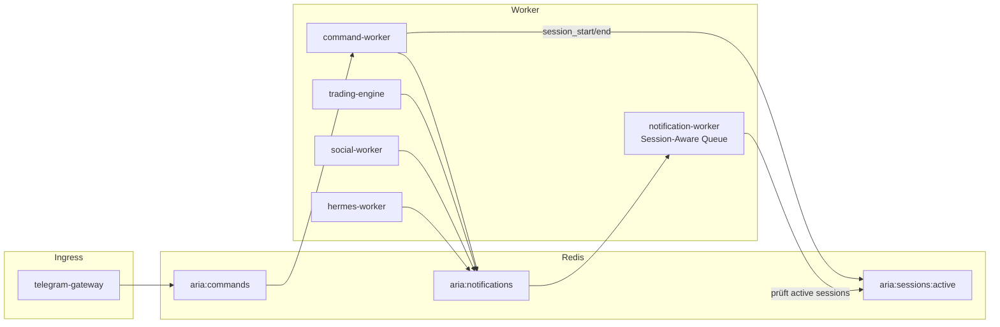
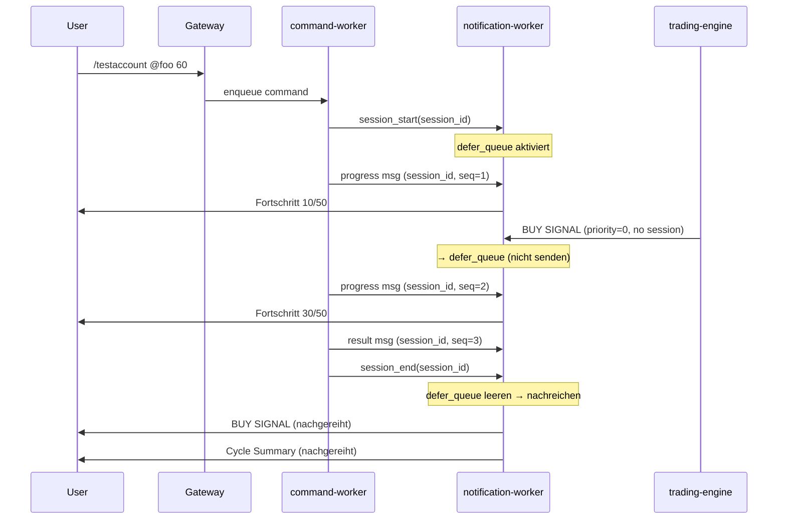
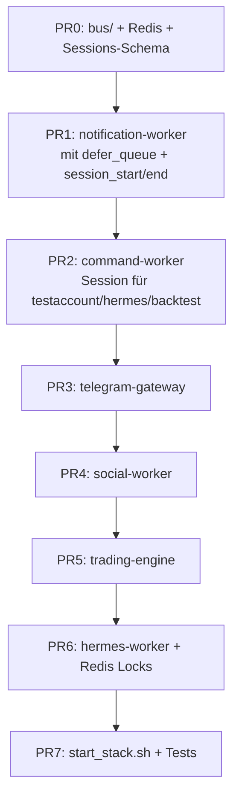

# Trading Bot: Prozess-Architektur mit Redis

Stand: 14. Juni 2026

## Ziel

Vollständiger Umbau des Trading Bots von einem threading-basierten Monolithen zu eigenständigen Prozessen mit Redis als Message-Bus — kompatibel mit lokalem Mac-Betrieb, bestehenden JSON-Dateien und Demo-Modus. Inklusive Command-Session-Isolation, damit lange Befehlsausgaben (z.B. X-Backtest) nicht von Trading-Nachrichten unterbrochen werden.

---

## Ist-Zustand — Diagnose

Der Bot ist heute ein **einziger Python-Prozess** (`aria_bot.py`) mit drei konkurrierenden Threads und einem synchronen Telegram-Layer.

### Konkrete Engpässe

| Problem | Ort | Wirkung |
|---------|-----|---------|
| **Synchroner Telegram-Versand** | `telegram_notifier.py` | Jeder Thread blockiert auf `requests.post` |
| **price_loop blockiert auf Notifications** | `aria_bot.py` L240-253 | Digests/Signale verzögern Trading |
| **Webhook blockiert bei schweren Commands** | `hermes_commands.py` | `/hermes_run` blockiert Flask |
| **Command-Ausgaben werden unterbrochen** | `x_commands.py` L53-78 | X-Backtest sendet Progress-Nachrichten; Trading-Cycle-Nachrichten flattern dazwischen |
| **JSON-State ohne Lock** | `data_manager.py` | Race bei parallelen Orders |
| **Kein Rate-Limiting** | `telegram_notifier.py` | 429-Fehler, verworfene Nachrichten |

**Beispiel des UX-Problems heute** (`/testaccount`):

```
Du:     /testaccount @cryptoguru 60
Bot:    🔄 Backtest gestartet...
Bot:    📊 Fortschritt: 10/50 Posts...        ← deine Session
Bot:    🟢 BUY SIGNAL BTC/USDT ...             ← Trading-Cycle flattert rein!
Bot:    📊 Fortschritt: 30/50 Posts...        ← deine Session (unterbrochen)
Bot:    📋 Cycle Summary: 3 Signale...       ← noch mehr Rauschen
Bot:    ✅ Backtest-Ergebnis @cryptoguru       ← dein Ergebnis
```

---

## Soll-Zustand — 6 Prozesse + Redis



### Prozess-Rollen

| Prozess | Ersetzt | Verantwortung |
|---------|---------|---------------|
| **telegram-gateway** | Flask-Teil von `aria_bot.py` | Webhook, sofort `200 OK`, enqueue in Redis |
| **notification-worker** | `send_telegram_message` direkt | Einziger Telegram-Sender; Session-Aware Queue; Rate-Limit |
| **command-worker** | `telegram_commands/*` | Commands aus Redis; öffnet/schließt Sessions bei langen Befehlen |
| **trading-engine** | `price_loop` | Coin-Analyse, Risk, Execution |
| **social-worker** | `SocialPipeline` in `price_loop` | X/Grok, CMC, Accuracy; publiziert Signale |
| **hermes-worker** | `hermes_loop` | Walk-Forward, Promotion (nur ein Prozess) |

---

## Command-Session-Isolation

**Empfehlung: Hintergrund-Nachrichten puffern und nach der Session nachreichen.**

### Konzept: Command Session

Wenn ein langer Befehl startet, öffnet der `command-worker` eine **Session**:

```python
# bus/schemas.py
class CommandSession:
    session_id: str          # uuid
    command: str             # "/testaccount @foo 60"
    user_message_id: int     # Telegram message_id des Users (für reply_to)
    started_at: float
```

**Lifecycle:**



### Regeln im notification-worker

| Nachrichtentyp | Während aktiver Session | Nach session_end |
|----------------|------------------------|------------------|
| Session-Nachrichten (`session_id` gesetzt) | Sofort senden, in `seq`-Reihenfolge | — |
| Command-Reply ohne Session (kurze Commands) | Sofort (priority 1) | — |
| Trade-Signale (priority 0) | **Defer** → `defer_queue` | Nachreichen |
| Digests, Cycle-Summary (priority 2) | **Defer** | Nachreichen |
| Hermes-Status (priority 2) | **Defer** | Nachreichen |

**Mehrere Sessions:** `defer_queue` bleibt aktiv solange **irgendeine** Session offen ist.

### Zusätzliche UX-Verbesserungen

1. **Reply-Threading:** Alle Session-Nachrichten mit `reply_to_message_id = user_message_id`
2. **Progress als Edit statt Spam:** Erste Progress-Nachricht senden, danach `edit_telegram_message`
3. **Session-Timeout:** Nach 10 Minuten ohne `session_end` → auto-close + defer_queue flushen

### Betroffene Commands (Session-pflichtig)

| Command | Dauer | Session? |
|---------|-------|----------|
| `/testaccount @handle` | 1–5 Min | Ja |
| `/hermes_run` | 5–30 Min | Ja |
| `/backtest SYMBOL` | 1–10 Min | Ja |
| `/positions`, `/portfolio` | 2–10s | Optional |
| `/buy`, `/sell` | < 5s | Nein |

### API für Worker

```python
# bus/publisher.py
class NotificationPublisher:
    def session_start(self, session_id, user_message_id, command: str): ...
    def session_end(self, session_id): ...

    def enqueue(self, text, *, session_id=None, seq=None,
                priority=2, reply_to=None, source="trading"): ...
```

---

## Lokaler Mac-Betrieb und Demo-Modus

**Ja — funktioniert weiterhin lokal auf dem Mac.** Redis ergänzt nur Prozess-Kommunikation; JSON-Dateien und Demo-Modus bleiben.

| Komponente | Status |
|------------|--------|
| JSON-Dateien (`watchlist.json`, `orders.*.json`, …) | Bleiben, editierbar |
| `get_data_file()` → `*.demo.json` | Unverändert |
| `DEMO_MODE=1 bash scripts/start_stack.sh --demo` | Ersetzt `start_demo_with_ngrok.sh` |
| Redis lokal | `docker compose up -d redis` oder `brew services start redis` |

**Demo-Key-Prefix:** `aria:demo:*` statt `aria:*` — Production und Demo parallel möglich.

**Fallback:** `NOTIFICATION_MODE=direct` + File-Lock wenn Redis down.

---

## Redis-Schema

Neues Paket `bus/`:

### Streams (durable queues)

- `aria:{scope}:commands` — Telegram-Updates (Consumer Group: `command-workers`)
- `aria:{scope}:notifications` — Outbound mit `priority`, `session_id`, `seq`, `reply_to`

### Session-State

- `aria:{scope}:sessions:active` — Set aktiver Session-IDs (TTL pro Session: 600s)

### Pub/Sub

- `aria:{scope}:signals:x` / `aria:{scope}:signals:cmc`
- `aria:{scope}:events` — `trade.executed`, `cycle.completed`, `config.changed`

### Distributed Locks

- `aria:{scope}:lock:orders:{ledger_scope}`
- `aria:{scope}:lock:positions:{ledger_scope}`
- `aria:{scope}:lock:config`
- `aria:{scope}:lock:hermes`

`{scope}` = leer (production) oder `demo`.

---

## Dateistruktur (neu)

```
bus/
  redis_client.py, schemas.py, publisher.py, consumer.py, locks.py, sessions.py
workers/
  telegram_gateway.py, notification_worker.py, command_worker.py
  trading_engine.py, social_worker.py, hermes_worker.py
scripts/
  start_stack.sh, stop_stack.sh, docker-compose.yml
```

Bestehende Module (`services/`, `strategies/`, `notifications/`) bleiben als shared library.

---

## Migrations-Roadmap



### PR0 — Redis-Infrastruktur

- `redis>=5.0` in `requirements.txt`
- `bus/` Paket, `REDIS_URL`, Demo-Key-Prefix
- `docker-compose.yml` mit `redis:7-alpine`

### PR1 — Notification-Worker

- `defer_queue` + `active_sessions` State Machine
- Priority + Session-Regeln, 429-Retry, 1 msg/s Pacing
- Feature-Flag `NOTIFICATION_MODE=redis|direct`

### PR2 — Command-Worker + Session-Integration

- `/testaccount`, `/hermes_run`, `/backtest`: Session-Pattern
- Optional: Progress via `edit_telegram_message`

### PR3 — Telegram-Gateway

- Flask nach `workers/telegram_gateway.py`
- `user_message_id` an command-worker durchreichen

### PR4 — Social-Worker

- `social_pipeline.py` extrahieren
- `social.cycle_interval_sec` in `config.json` (default 300s)

### PR5 — Trading-Engine

- `price_loop` → `workers/trading_engine.py`
- Quick-Win: `get_prices_batch()` statt N× `get_prices()`

### PR6 — Hermes + Locks

- Hermes-Thread aus `aria_bot.py` entfernen
- Redis-Locks für JSON-Writes + File-Lock-Fallback

### PR7 — Ops

- `start_stack.sh --demo` / `stop_stack.sh`
- Integration-Tests für Session-Defer
- `aria_bot.py` deprecaten

---

## Erwartetes UX nach Umbau

```
Du:     /testaccount @cryptoguru 60
Bot:    🔄 Backtest gestartet...
Bot:    📊 Fortschritt: 10/50 Posts...
Bot:    📊 Fortschritt: 30/50 Posts...
Bot:    ✅ Backtest-Ergebnis @cryptoguru
Bot:    🟢 BUY SIGNAL BTC/USDT ...            ← nachgereiht
Bot:    📋 Cycle Summary: 3 Signale...       ← nachgereiht
```

---

## Erwartete Performance-Verbesserungen

| Metrik | Vorher | Nachher |
|--------|--------|---------|
| Webhook-Response | Sekunden–Minuten | < 50ms |
| Telegram-Reihenfolge | Chaotisch, burst-blockierend | Priorisiert, Sessions geschützt |
| Trading-Zyklus | Wartet auf Social + Telegram | Nur Trading-Logik |
| Social-Fetch | Blockiert Trading 30–120s | Parallel |
| State-Races | Möglich | Redis-Lock |

---

## Risiken und Mitigationen

- **Lange Session blockiert Defer:** 10-Min-Timeout
- **Verpasste Trade-Signale:** Verzögert, nicht verloren; später optional `force_immediate=True`
- **Redis-Ausfall:** `NOTIFICATION_MODE=direct` + File-Lock-Fallback
- **Signal-Staleness:** Cache TTL 15min
- **Komplexität:** `start_stack.sh` startet alles; Logs in `logs/{worker}.log`