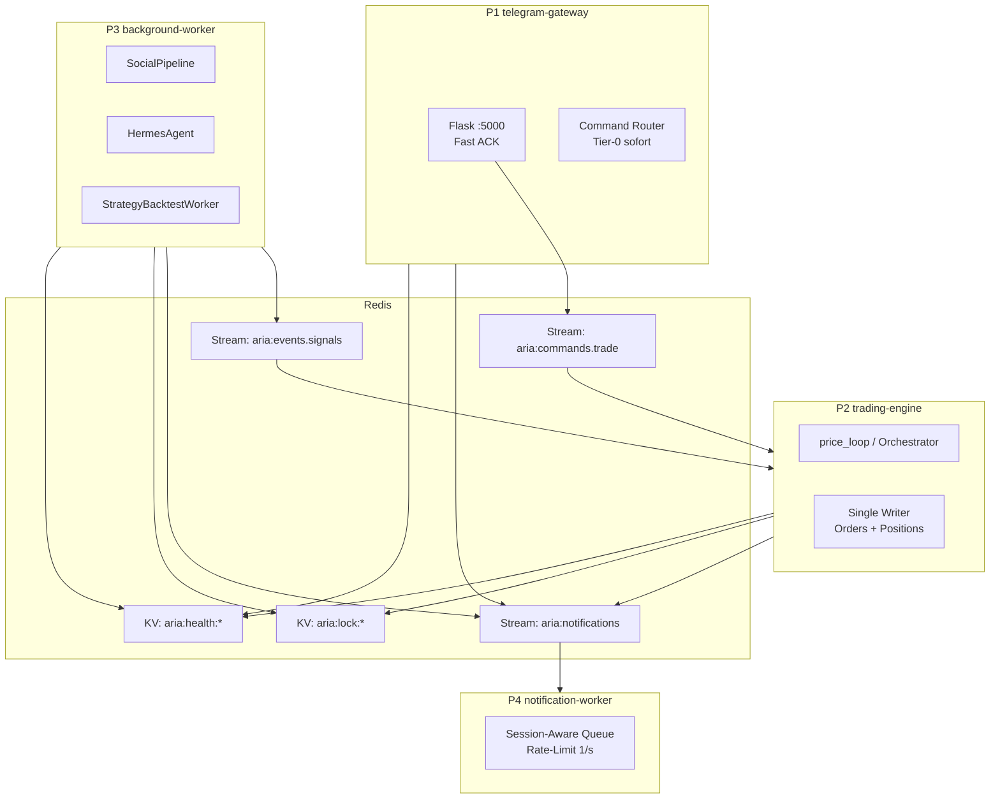
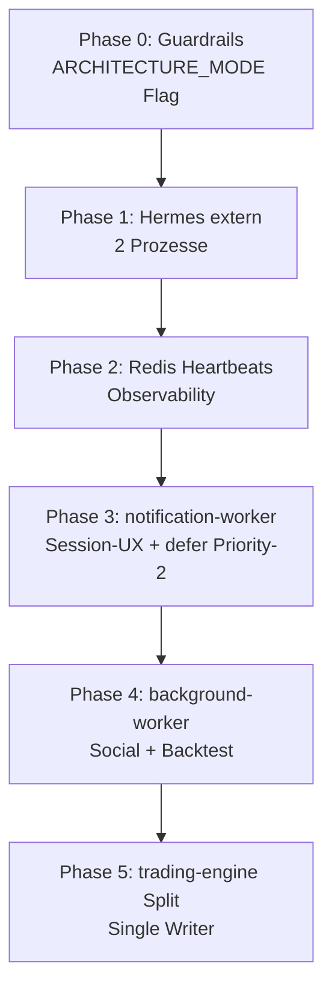
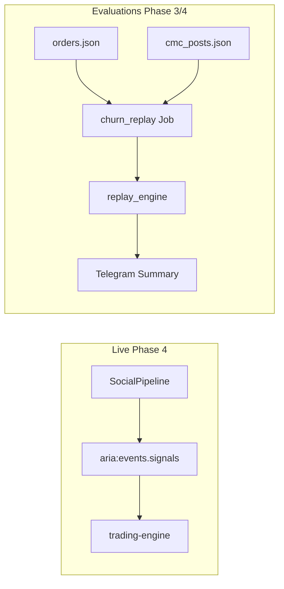

# Trading Bot: Prozess-Architektur mit Redis

Stand: 15. Juni 2026 (Arena-Review überarbeitet)

## Ziel

Den Trading Bot von einem threading-basierten Monolithen zu **entkoppelten Prozessen mit Redis** umbauen — ohne JSON-Dateien, Demo-Modus oder lokalen Mac-Betrieb zu opfern. Telegram-UX: lange Befehlsausgaben (X-Backtest, Hermes, Backtest) sollen nicht von Trading-Nachrichten unterbrochen werden.

Zusätzlich: **einheitliche Evaluations-Pipeline** für Config-Änderungen (CMC-Churn, Guard-Vergleiche) — als Background-Jobs mit Session-UX, nicht inline im Webhook. Inspiriert von [ai-hedge-fund `BacktestEngine.run_signals()`](https://github.com/virattt/ai-hedge-fund/blob/main/v2/backtesting/engine.py); nur crypto-relevante Teile, kein Monolith-CLI vorab.

**Wichtig:** Nach Arena-Review (3 unabhängige Architektur-Kritiker) wurde der Plan von **6 Prozessen am Tag 1** auf eine **phasierte 3+1-Architektur** revidiert.

---

## Arena-Review — Kernerkenntnisse

| Kandidat | Fokus | Haupturteil |
|----------|-------|-------------|
| **Architektur** | Korrektheit, Redis, Ledger | 6 Prozesse over-engineered; **3 Prozesse + Streams** für Geld-Pfade; Single-Writer für Orders/Positions |
| **Ops** | Solo-Mac, Rollback | **Phase 0→1 (Hermes-Split)** zuerst; Monolith bleibt Default; kein docker-compose auf Mac |
| **Telegram-UX** | Session-Isolation | `defer_queue` für alle Nachrichten ist zu grob; **Tier-0-Bypass**, Progress via `editMessage`, kein FIFO-Replay von Commands |

### Was sich über Nacht auf `main` bereits verbessert hat (Commit `c20f54c`)

- Flask läuft jetzt **threaded** — Webhook blockiert weniger
- `/hermes_run` läuft in **Background-Thread** (wie `/testaccount`)
- Telegram-Sendefehler werden geloggt

**Verbleibendes Problem:** Trading-Cycle-Nachrichten und Command-Progress laufen weiterhin **parallel** über `send_telegram_message` ohne Koordination — das UX-Problem bei `/testaccount` ist **nicht** gelöst.

---

## Ist-Zustand — Diagnose

| Problem | Ort | Status nach `c20f54c` |
|---------|-----|----------------------|
| Command-Ausgaben werden unterbrochen | `x_commands.py` | **Offen** |
| Synchroner Telegram-Versand | `telegram_notifier.py` | **Offen** |
| `/backtest SYMBOL` blockiert Webhook | `backtest_commands.py` | **Offen** (inline, nicht threaded) |
| JSON-State ohne Cross-Process-Lock | `data_manager.py` | **Offen** (relevant erst bei Split) |
| Kein Rate-Limiting / 429-Retry | `telegram_notifier.py` | **Offen** |
| price_loop blockiert auf Notifications | `aria_bot.py` | **Offen** |

---

## Soll-Zustand — Revidierte Architektur (3+1 Prozesse)

Statt 6 gleichberechtigter Prozesse: **3 Kern-Prozesse + 1 Notification-Worker** (optional als 4. Prozess oder zunächst im Gateway eingebettet).



### Prozess-Rollen (Zielbild Phase 4)

| Prozess | Verantwortung | Schreibt JSON? |
|---------|---------------|----------------|
| **telegram-gateway** | Webhook, Tier-0-Commands sofort, schwere Jobs enqueuen | Nein (außer read-only) |
| **trading-engine** | Trading-Cycle, **einziger** Order/Position-Writer | Ja — `orders.*`, `positions.*` |
| **background-worker** | Social, Hermes, Strategy-Backtest | Nur `hermes/memory/*`, `strategy_backtest.json` (mit Lock) |
| **notification-worker** | Einziger Telegram-Sender, Session-UX | Nein |

### Redis: Streams vs Pub/Sub

| Pfad | Mechanismus | Grund |
|------|-------------|-------|
| Trade-Intents, Manual-Orders | **Redis Stream** + Consumer Group | At-least-once, kein Verlust |
| Outbound Telegram | **Redis Stream** | Restart-sicher |
| Signal-Snapshots (X/CMC) | **Redis Stream** `events.signals` | Versionierte Snapshots für Trading |
| Config-Invalidierung | Pub/Sub oder Key-TTL | Ephemeral OK |
| Health-Heartbeats | Redis KV mit TTL | Einfach, ausreichend |

**Niemals Pub/Sub für Geld-Pfade.**

---

## Command-Session-Isolation (überarbeitet)

### Problem mit v1-Plan (globaler `defer_queue`)

Ein globaler Defer aller Trading-Nachrichten während jeder Session ist **zu grob**:

- Manual-Orders (`manual_ok:`) dürfen **nie** warten (10-Min-TTL)
- `/backtest SYMBOL` läuft noch **synchron** im Webhook — Session-Design allein hilft nicht
- FIFO-Replay von `/buy`-Flows nach Session-Ende **zerstört** interaktive State-Machines
- Auto-Trades global pausieren = verpasste Stops/Signale

### Neues Modell: Tier-System + Notification-Priorität

| Tier | Commands | Verhalten während HEAVY-Job |
|------|----------|------------------------------|
| **Tier 0** | `manual_*`, `/mode`, `/gate`, `/live_*`, `/buy`, `/sell`, `/positions`, `/orders` | **Sofort** — nie defer |
| **Tier 1** | `/hermes`, `/hermes_status`, `/xsignals`, `/backtest_results` (read-only) | **Sofort** — kein neuer HEAVY-Job |
| **Tier 2 (HEAVY)** | `/testaccount`, `/hermes_run`, `/backtest SYMBOL` | Max **1 global**; zweiter wird abgelehnt, nicht still defer |

### Notification-Priorität (notification-worker)

| Priority | Typ | Während HEAVY-Session |
|----------|-----|---------------------|
| 0 | Tier-0 (Trade-Confirm, Blocked-Trade) | Sofort |
| 1 | Session-Progress (edit) + Command-Reply | Sofort |
| 2 | Trade-Signale, Cycle-Digests | **Defer** → nach `session_end` nachreichen |
| 3 | Hermes-Status, Debug | Defer oder coalesce |

### Session-State (Redis)

```python
command_session:{chat_id} = {
    session_id, kind, job_id, started_at, ttl,
    progress_message_id,  # für editMessage
    owner: "user" | "scheduler"
}
```

**UX während HEAVY-Job — eine Progress-Karte (editiert, nicht gespammt):**

```
⏳ X-Backtest @handle (60d)
▓▓▓▓▓░░░░░ 12/47 Signale
Läuft seit 03:12 · /session_cancel
```

### Callback-Sicherheit (MUST-FIX)

`testaccount_add:{handle}` braucht **token-basierte** Callbacks (wie `manual_order_flow`), gebunden an `session_id` — sonst stale Buttons nach Session-Ende.

`callback_data` max 64 Bytes — lange Handles über Token indirekt adressieren.

### Session-Ende

1. Session + Callback-Tokens invalidieren
2. **Eine** Summary-Nachricht
3. Gepufferte Priority-2-Nachrichten **nachreichen** (nicht Commands replayen)
4. Kein FIFO-Replay von `/buy`-Flows — verworfene Jobs: Hinweis „bitte erneut senden“

---

## Lokaler Mac-Betrieb und Demo-Modus

| Komponente | Unverändert |
|------------|-------------|
| JSON-Dateien im Projektordner | Ja |
| `get_data_file()` → `*.demo.json` | Ja |
| `.env` + ngrok | Ja |

**Redis lokal:** `brew services start redis` (kein docker-compose für Solo-Mac-Dev)

**Demo-Isolation:**
- Redis-Key-Prefix: `aria:demo:*`
- Production und Demo **nicht parallel** auf `:5000` (wie heute) — oder `DEMO_PORT=5001` in Phase 0 dokumentieren

**Rollback:**
```bash
ARCHITECTURE_MODE=monolith  # Default — kein Redis nötig
bash scripts/start_with_ngrok.sh  # funktioniert immer
```

---

## Phased Rollout (revidiert nach Arena)



### Phase 0 — Guardrails (1–2 Tage)

- `config.json` → `architecture: { mode: monolith|distributed, redis_url }`
- `stop_bot.sh` / pidfiles vorbereiten
- Demo-Port-Strategie dokumentieren
- **Exit:** Monolith unverändert lauffähig

### Phase 1 — Hermes-Extraktion (≈1 Woche) — **MVP**

| Prozess | Rolle |
|---------|-------|
| `aria_bot.py` | Webhook + price_loop (wie heute) |
| `hermes_agent.py` | Extern, wenn `hermes_external: true` |

- In-Process-Hermes-Thread deaktivieren wenn extern läuft
- **Rollback:** Flag zurück, Thread reaktivieren
- **Exit:** `/hermes_last` ohne Webhook-Neustart

### Phase 2 — Redis Heartbeats (≈3–5 Tage)

- `brew services redis`; Worker-Heartbeats `aria:health:{worker}`
- Stale TTL → eine Telegram-Warnung
- **Exit:** Redis down → Monolith läuft weiter (nur Observability fehlt)

### Phase 3 — Notification-Worker + Session-UX (≈1–2 Wochen)

**Höchster UX-Gewinn, noch Monolith als Backend:**

- `notification-worker` als erster Redis-Consumer
- `telegram_notifier.py` → `NotificationPublisher.enqueue()`
- Tier-System + Progress-Edit für `/testaccount`
- `/backtest SYMBOL` → Background-Job (wie `/hermes_run` nach `c20f54c`)
- **Neu:** `/churn_replay` und `/counterfactual` als Tier-2 HEAVY-Jobs (Enqueue only, Ausführung Phase 4)
- Feature-Flag: `NOTIFICATION_MODE=redis|direct`

### Phase 4 — Background-Worker (≈2 Wochen)

- Social + Backtest aus `price_loop` extrahieren
- `events.signals` Stream mit `version` + `watchlist_hash`
- Trading konsumiert Snapshot statt synchronem Social-Fetch
- Social-Dedup (`post_id`) → Redis `SET NX` statt in-memory
- **Evaluations-Pipeline:** `hermes/replay_engine.py` (`ReplaySignal` + `run_signals()`), `churn_replay` + `counterfactual` Job-Handler
- **Metriken:** `hermes/metrics.py` vereinheitlichen (annualized return, konsistenter Sharpe, max DD) — ein Report-Format für alle Job-Typen

### Phase 5 — Trading-Engine Split (nur wenn Phase 4 stabil)

- Gateway enqueued Trade-Intents; trading-engine ist **Single Writer**
- Redis-Lock `aria:lock:ledger:{scope}` + `idempotency_key` pro Order
- 48h Dry-Run + Rollback-Drill

### Bewusst zurückgestellt

- 6 gleichberechtigte Prozesse
- docker-compose auf Mac
- Redis als Source-of-Truth für Positions (JSON bleibt SoT bis Phase 5 bewiesen)
- `churn_replay`-CLI auf Monolith (nur Worker-Jobs ab Phase 3/4)
- Strategy-Tuner (`intelligence/strategy_backtest.py`) auf Pipeline-Backtest umstellen (nach Phase 4)
- ai-hedge-fund-Muster: US-Handelskalender, `holding_days`-Exit, Shorts, equal-dollar ohne Slippage

---

## Evaluations-Pipeline (ai-hedge-fund — nur Relevantes)

Kernmuster: **Signal-Generierung ≠ Ausführung** (`run_signals`-Pattern), crypto-angepasst mit Slippage, Partial Sells, Cooldowns.

### Bausteine

| Baustein | Beschreibung | Wo |
|----------|--------------|-----|
| `ReplaySignal` | `symbol`, `action`, `ts`, `source`, `metadata` — aus Orders, CMC-Posts, Decision-Audit | Job-Payload |
| `replay_engine.py` | Füllt Signale gegen OHLCV; optional `realistic_fill` (next-bar, default off) | P4 background-worker |
| `churn_replay` | Historische Orders → alte vs. neue Guard-Config → PnL/Trade-Delta | P3 enqueue, P4 execute |
| `counterfactual` | Bestehendes `hermes/counterfactual.py` als Worker-Job | P3 enqueue, P4 execute |
| Unified metrics | Erweitertes `hermes/metrics.py` | Job-Result → Telegram-Summary |

### Live vs. Replay



- **`aria:events.signals`** = Live-Snapshots für Trading (unverändert)
- **Replay-Jobs** = historische Validierung (CMC-Churn, Guard-Vergleiche), kein Cycle-Consumer

### Tier-2 Commands (Phase 3)

| Job | Command | Summary |
|-----|---------|---------|
| `churn_replay` | `/churn_replay SYMBOL --since ...` | Sells alt/neu, PnL-Delta |
| `counterfactual` | `/counterfactual SYMBOL --window ...` | Config-Varianten-Vergleich |

Reuse: `hermes/pipeline_backtest.py`, `hermes/counterfactual.py`, `hermes/cmc_replay.py`.

**CMC-Synergie:** `post_id`-Dedup (Phase 4) + Guards auf `feature/cmc-churn-fixes` — Replay validiert Config-Wechsel vor Deploy.

---

## Stream-Verträge (Minimum)

```json
// aria:commands.trade
{ "idempotency_key", "source": "auto|manual|x", "order": {}, "scope", "enqueued_at" }

// aria:events.signals
{ "version", "x_signals", "cmc_signals", "watchlist_hash", "created_at" }

// aria:notifications
{ "priority", "session_id", "seq", "reply_to", "kind", "payload", "source" }

// aria:jobs.heavy (Phase 3)
{ "job_id", "kind": "backtest|churn_replay|counterfactual|hermes_run|testaccount", "chat_id", "session_id", "params", "enqueued_at" }

// aria:job:result:{job_id} (KV, TTL 24h)
{ "metrics": { "total_return_pct", "sharpe", "max_drawdown_pct", "n_trades", "pnl_delta" }, "trades_summary": { "baseline_sells", "variant_sells" }, "artifact_path" }
```

---

## Dateistruktur (inkrementell)

```
bus/                          # ab Phase 2
  redis_client.py, schemas.py, publisher.py, consumer.py, locks.py, sessions.py
workers/                      # ab Phase 3+
  notification_worker.py
  telegram_gateway.py         # ab Phase 5
  trading_engine.py
  background_worker.py
scripts/
  start_stack.sh              # ab Phase 3, ersetzt start_with_ngrok.sh schrittweise
  stop_stack.sh
```

hermes/                       # Evaluations (Phase 4)
  replay_engine.py            # ReplaySignal + run_signals()
  churn_replay.py             # Job-Handler, liest orders.json
notifications/telegram_commands/
  replay_commands.py          # /churn_replay, /counterfactual (Phase 3)

Bestehende Module (`services/`, `strategies/`, `notifications/`) bleiben shared library.

---

## Erwartetes UX nach Phase 3

```
Du:     /testaccount @cryptoguru 60
Bot:    ⏳ X-Backtest @cryptoguru (60d)     ← eine Karte, wird editiert
        ▓▓▓▓▓░░░░░ 30/50 Signale
Bot:    ✅ Backtest-Ergebnis @cryptoguru   ← Session end
Bot:    🟢 BUY SIGNAL BTC/USDT ...         ← nachgereiht (Priority 2)
Bot:    📋 Cycle Summary ...               ← nachgereiht
```

Tier-0 (`/sell`, manual confirm) jederzeit sofort.

---

## Risiken und Mitigationen

| Risiko | Mitigation |
|--------|------------|
| JSON-Corruption bei Multi-Writer | Single Writer in trading-engine; Locks ab Phase 5 |
| Redis-Ausfall | `NOTIFICATION_MODE=direct`; `ARCHITECTURE_MODE=monolith` |
| Stale `testaccount_*` Buttons | Token-basierte Callbacks + Session-Bindung |
| Verpasste Trade-Signale während Session | Nur Priority-2 defer (Sekunden–Minuten), nicht verloren |
| Config-Race Hermes vs Cycle | `config_write`-Lock für Promotion/Apply |
| Scope-Verwechslung demo/live | Redis-Prefix + `get_data_file()` in jedem Worker |
| Replay ohne Monolith-CLI | Guards weiterhin via `tests/unit/test_cmc_churn.py`; Replay erst ab Phase 4 |
| `orders.json` Race während Cycle | Phase 3: Jobs zwischen Cycles; Phase 5: Ledger-Lock |
| next-bar fill verzerrt Vergleich | `realistic_fill` default `false`, in Summary kennzeichnen |

---

## Arena-Fazit

**WINNER: Hybrid aus allen 3 Kandidaten**

- Richtung (Redis + Entkopplung): **behalten**
- 6-Prozess-Big-Bang: **verworfen** → 3+1 phasenweise
- Globaler defer_queue: **ersetzt** durch Tier-System + Notification-Priorität
- Erster shippable Schritt: **Phase 1 (Hermes extern)** + **Phase 3 (Notification-UX)** für maximalen Nutzen bei minimalem Risiko

---

## Nächster Schritt

**Status: Plan gespeichert — noch nicht implementiert.**

```bash
git checkout plan/redis-process-architecture
# Bei Freigabe: Implementierung beginnt mit Phase 0 + Phase 1
```

Bei Freigabe: `ARCHITECTURE_MODE=monolith` bleibt Default bis Phase 3 produktiv getestet. Evaluations-Pipeline (`churn_replay`, `replay_engine`) erst ab Phase 3/4 — kein Vorab-CLI auf Monolith.