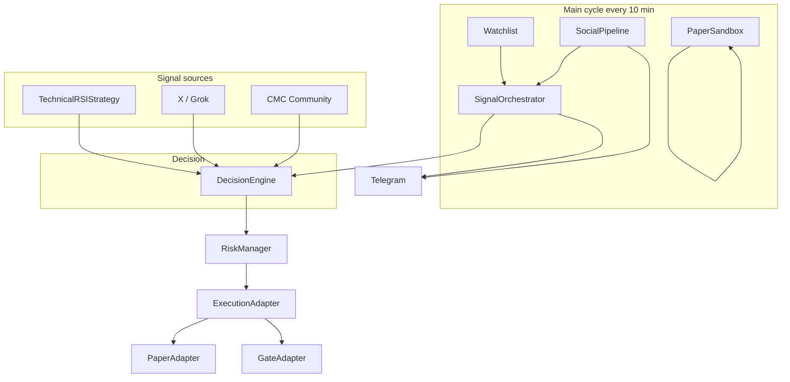
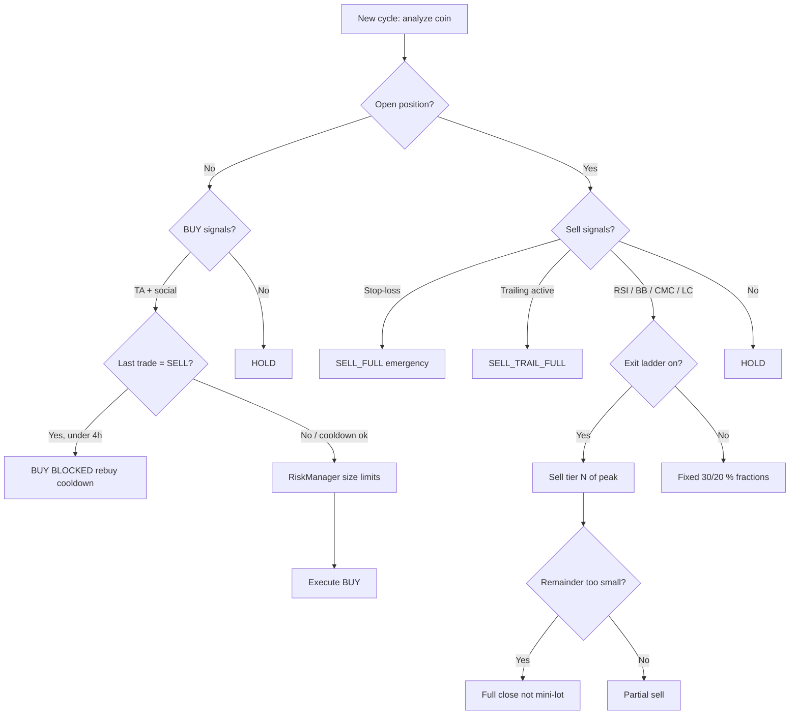

# X-Agent Trading Bot — Full Documentation

**Language:** [Deutsch](DOCUMENTATION.md) · English

As of: June 23, 2026 · Version 2.0

This document is the central overview: architecture, intervals, strategies, **Volatile Altcoin profile** (including **Exit Ladder**, **ATR trailing stop**, **1h timeframe**), **runtime architecture** (async notifications, ledger lock, rebuy cooldown), **Hermes memory fallback**, Telegram commands (including **`/ask`**), **transparency for beginners**, demo mode, X/Twitter, Hermes, and sandbox.

---

## 1. What does the bot do?

The X-Agent Trading Bot is a **hybrid crypto trading agent**:

1. Monitors coins on the **watchlist** (technical analysis: RSI, Bollinger Bands, volume)
2. Reads **X/Twitter posts** and **CMC sentiment**
3. Combines signals in the **DecisionEngine**
4. Executes trades (paper or live on Gate.io)
5. Reports everything via **Telegram** — including **"Why?" explanations** in plain language (even without prior trading knowledge)

**Core principle:** No blind following of tweets — technical signals and social signals are merged with weights. Risk limits and cooldowns prevent overtrading.

**For beginners:** You don't need to know RSI or Sharpe. Every important Telegram message has a **"Why:"** block in everyday language. Technical details appear below in small text (`TA→SELL_30`). Review anytime with `/decisions` or `/why SYMBOL`.

---

## 2. Architecture (overview)



### Key modules

| Module | File | Task |
|-------|-------|---------|
| Main loop | `aria_bot.py` | Flask webhook + price/signal cycle |
| Decision | `strategies/decision_engine.py` | TA + X + CMC → BUY/SELL/HOLD |
| Technical | `strategies/technical_rsi_bb.py` | RSI, BB, volume, TP, SL |
| Execution | `services/trading_service.py` | Mode, risk, order |
| Gate.io live | `execution/gate_adapter.py` | ccxt spot market orders (mainnet) |
| Order ledger | `services/order_service.py` | Order history (`/orders`, scope-isolated) |
| Gate balances | `services/gate_balance.py` | USDT/spot (live) or sim cash (enhanced dry run) |
| Enhanced dry run | `services/dry_run_watchlist.py`, `data/cmc_trending_provider.py` | Sim wallet, CMC trending overlay |
| Strategy backtest | `intelligence/strategy_backtest.py`, `services/strategy_*` | Auto backtest + parameter tuning per coin |
| Social | `services/social_pipeline.py` | X posts, CMC, accuracy |
| Sandbox | `strategies/paper_sandbox.py` | Isolated strategy tests |
| Telegram | `notifications/telegram_commands/` | All `/` commands |
| Telegram menu (DE/EN) | `notifications/telegram_commands/menu_i18n.py`, `locales/telegram_menu.json` | Menu, `/help`, hints in user language |
| Explanations (DE) | `notifications/user_explain.py` | Plain-language texts for trades, risk, Hermes, CMC/X |
| Decision log | `services/audit_trail.py` → `logs/decisions.jsonl` | Log of all bot decisions |
| Exit Ladder | `strategies/exit_ladder.py` | Staged partial sells (30/30/20/20 % of peak) |
| Trailing Stop | `strategies/trailing_stop.py` | ATR-scaled profit protection from +10 % gain |
| Strategy registry | `strategies/registry.py` | Profile resolution, 1h timeframe, volatile overlay |
| Ask bridge | `services/telegram_ask_bridge.py` | `/ask` → Cursor/Grok queue (decoupled from webhook) |
| Notification bus | `services/notification_bus.py` | Async Telegram with rate limit (Phase 3) |
| Background runtime | `services/background_runtime.py` | Social/backtest parallel to trading cycle |

### Internal Runtime (Architecture Phases 0–5, Monolith)

The bot still runs as **one process** (`aria_bot.py`), but is internally decoupled for stability and performance:

| Feature | Config (`architecture.*`) | Effect |
|---------|---------------------------|--------|
| Async notifications | `notification_mode: async` | Cycle digests block webhook/commands less |
| Background social | `background_social_enabled: true` | X/CMC/LC fetch in parallel; trading uses snapshot |
| Ledger lock | `ledger_lock_enabled: true` | No race conditions on position/order updates |
| Rebuy cooldown | `min_hours_after_sell_before_rebuy: 4` | No re-entry shortly after sell (anti-churn) |
| Ask bridge | `observability.ask_bridge` | `/ask` in its own queue, poller every 3 s |

**Production start:** `bash scripts/start_stack.sh` — stops old processes, starts bot + ngrok + webhook. Rollback notes: [ARCHITECTURE_PLAN.md](ARCHITECTURE_PLAN.md).

---

## 3. When does what run? — All intervals

| What | Interval | Config / source | Description |
|-----|-----------|-----------------|--------------|
| **Main cycle** | **600 s (10 min)** | `update_interval` | Watchlist, X, CMC, sandbox, trades, Telegram cycle summary |
| X search cache | 900 s (15 min) | `x_performance.x_search_cache_ttl_sec` | Grok search per account cached |
| X live search | 2 days back | `x_performance.live_search_days` | Time window for tweet search |
| Trade cooldown (global) | 1 h | `trade_cooldown_hours` | Minimum gap between same trade type |
| Cooldown per coin (buy) | 4–6 h | `strategies[].min_hours_between_buys` | Per coin in `config.json` |
| Cooldown per coin (sell) | 3–4 h | `strategies[].min_hours_between_sells` | Excluded: stop-loss / full sell |
| **Rebuy after sell** | **4 h** | `architecture.min_hours_after_sell_before_rebuy` | Prevents sell→buy churn (e.g. H/USDT) |
| Daily trade limit | 8 / 24 h | `max_daily_trades` | Global across all modes |
| RSI timeframe | 4 h (default) | `watchlist` + `strategies[]` | OHLCV candles for indicators |
| **Volatile timeframe** | **1 h** | `volatile_altcoin.timeframe` | New volatile coins; legacy positions keep their TF |
| Sandbox minimum duration | 7 days | `sandbox.min_test_days` | Before promotion |
| Sandbox max runtime | 30 days | `sandbox.max_test_days` | Then `expired` |
| X backtest default | 60 days | `x_backtest.default_days` | `/testaccount` |
| Accuracy tracking | 24 h hold time | `x_backtest.min_signal_age_hours` | Evaluation of older signals |
| Price cache | Internal TTL | `price_fetcher` | Fewer Gate/Binance calls |

### Flow of one cycle (step by step)

```
1. Reload config.json
2. SocialPipeline: fetch new X posts + parse (Grok)
3. CMC posts / sentiment
4. Accuracy update (trust scores of X accounts)
5. Test sandbox hypotheses (parallel, isolated)
6. For each active watchlist coin:
   a. Price from Gate.io (fallback: Binance, KuCoin, Bybit)
   b. Indicators (RSI, BB, volume, ATR)
   c. DecisionEngine → action
   d. RiskManager → size / block
   e. Execution → paper or Gate
   f. Telegram on signal / trade / block — with **Why** + sources (technical, X, CMC)
7. CMC and X cycle digest to Telegram (when new signals, `telegram_explanations` active)
8. Strategy backtest tick (adaptive, staggered, when `strategy_backtest.auto_run: true`)
9. Cycle summary to Telegram (decisions + social top, when `notify_on_cycle: true`)
10. Background runtime: social snapshot / backtest tick (parallel, non-blocking)
11. Hermes background thread (every ~30 min.) — tests parameters; live bot uses `hermes/memory/baseline.json` as fallback
12. Async notification bus flushes pending Telegram messages (rate limit 1 s)
13. Ask bridge poller processes `/ask` queue (every 3 s)
14. Wait update_interval seconds → back to 1
```

---

## 4. Trading modes

| Mode | Command | What happens | Real money? |
|-------|--------|--------------|--------------|
| **Paper** | `/mode paper` | Local ledger (`trade_history.json`, `positions.json`) | No |
| **Live** | `/mode live` + `/live_confirm` | Gate.io mainnet | **Yes** (when `dry_run: false`) |
| **Off** | `/mode off` | Analysis only, no orders | No |

There is **no Gate.io testnet** in the bot (not usable in Germany). For practice: **Paper**. For real orders: **Live** on Gate.io mainnet.

Old `config.json` with `"trading_mode": "gate_testnet"` are automatically treated as **Paper**.

### Live activation (2 steps)

```
/mode live          → trading_mode=live, live_confirmed=false (still locked)
/live_confirm       → live_confirmed=true (orders allowed)
/gate               → check API keys, balance, dry_run status
```

On **bot restart**, `/gate` and `/mode` also show **version** and **Git branch** from `core/build_info.py` (e.g. `main @ e66bab7`).

**Safety:** `live.dry_run: true` (default) logs orders only locally — nothing goes to Gate.io until you set `dry_run` to `false`.

`/live_confirm` checks: no demo session, API keys set; warns when `dry_run` is active.

### Enhanced dry run (`live.dry_run_enhanced: true`)

In addition to normal dry run — for realistic practice in live mode without real orders:

| Aspect | Behavior |
|--------|-----------|
| Activation | `trading_mode: live` + `live.dry_run: true` + `live.dry_run_enhanced: true` |
| Sim cash | `live.simulated_balance_usdt` (default 5000) — derived from `live_trade_history.json` |
| Watchlist | Core coins + CMC trending overlay (`watchlist.dry_run_overlay.json`, gitignored) |
| Risk limits | `dry_run_defaults` (higher daily limit, shorter cooldowns) |
| `/positions` | **Cash (Sim)** + bot positions — no Gate spot holdings in portfolio |
| `/gate` | Shows sim USDT **and** Gate API balance (info only) |
| `/dryrun` | Status: sim balance, trending coins, last CMC sync |

**Sim cash calculation:** Starting capital minus buys plus sell proceeds — recalculated on load from trade history (no drift).  
**Portfolio value:** Sim cash + market value of open positions ≈ starting capital + realized + unrealized PnL.

### Live mode: ledger & portfolio

| Data source | Paper | Live (dry_run) | Live (enhanced dry_run) | Live (real) |
|-------------|-------|----------------|-------------------------|-------------|
| Cash / USDT | `trade_history.json` | `live_trade_history.json` (virtual) | Sim cash in `live_trade_history.json` | Gate API |
| Trades | `trade_history.json` | `live_trade_history.json` | `live_trade_history.json` | `live_trade_history.json` |
| Orders | `orders.paper.json` | `orders.live.json` | `orders.live.json` | `orders.live.json` |
| Positions | `positions.paper.json` | `positions.live.json` | `positions.live.json` | `positions.live.json` |
| `/positions` | Virtual portfolio | Like paper, live ledger | **Cash (Sim)** + positions | Gate USDT + spot |
| Order source | `auto` / `manual` | `Auto` / `Manuell` in `/orders` | same | same |

Helper scripts:

- `python3 scripts/gate_live_smoke_test.py` — keys, balance, ccxt connection
- `python3 scripts/reconcile_gate_positions.py` — `positions.live.json` vs. Gate holdings
- `bash scripts/start_with_ngrok.sh` — production start (without `--demo`)

### Telegram mode badges in signals

| Badge | Meaning |
|-------|-----------|
| 📋 PAPER | Local virtual trading |
| 🔶 LIVE DRY | Live confirmed, but dry_run |
| 🧪 LIVE DRY+ | Enhanced dry run (sim wallet + trending) |
| 🔴 LIVE | Real mainnet orders |

---

## 5. Demo mode (`--demo`)

### Start

```bash
bash scripts/start_demo_with_ngrok.sh   # recommended: bot + ngrok + webhook
# or manually:
python3 aria_bot.py --demo
```

### What is different?

| Aspect | Normal | Demo (`--demo`) |
|--------|--------|-----------------|
| Data files | `watchlist.json`, `positions.json`, … | `*.demo.json` (isolated) |
| Telegram prefix | — | `🧪 [DEMO]` before every message |
| Real portfolio | Untouched | Separate demo files |

**Important:** Demo uses the same `config.json` — trading mode and strategies are identical; only the **data** is separate.

### Start / stop

```bash
bash scripts/start_demo_with_ngrok.sh   # stops old processes, restarts ngrok, registers webhook
bash scripts/stop_bot.sh                # stop bot + ngrok
```

The start script:
1. Stops old bot/ngrok processes (ports 5000, 4040)
2. Starts bot, waits for `/health`
3. Starts a **fresh** ngrok tunnel
4. Tests tunnel (HTTP 200)
5. Registers Telegram webhook
6. Sends confirmation to Telegram

---

## 6. Strategies — How they work

### 6.1 Technical basis (`TechnicalRSIStrategy`)

Each watchlist coin has parameters in `config.json` → `strategies[]` (per symbol + timeframe).

#### BUY (only without open position)

All conditions must be met at the same time:

- Price ≤ lower Bollinger Band × 1.01
- RSI between `rsi_buy_low` and `rsi_buy_high`
- Volume ≥ `volume_multiplier` × average

**Example ARIA (4h):** RSI 28–45, vol ≥ 1.4×, price at lower BB → **BUY**

#### SELL (only with open position)

Priority (highest wins):

| Priority | Trigger | Action |
|-----------|---------|--------|
| 1 | X stop-loss price reached | Sell 100 % |
| 2 | Loss > `stop_loss_pct` | 100 % (`SELL_STOP_FULL`) |
| 3 | Loss > 67 % of stop_loss | 50 % (`SELL_STOP_PARTIAL`) |
| 4 | Profit ≥ `take_profit_pct` | 30 % (`SELL_TP`) — one-time |
| 5 | RSI crosses `rsi_sell_30` from below | 30 % — one-time per tier |
| 6 | **ATR trailing stop** (volatile, from +10 % gain) | 100 % (`SELL_TRAIL_FULL`) |
| 7 | RSI crosses `rsi_sell_20` from below | 20 % — one-time per tier |
| 8 | X `price_target` reached | 30 % |
| 9 | X/CMC/LC SELL signal | 20–30 % depending on confidence |
| — | **Exit Ladder** (volatile) | Replaces fixed 30/20 % fractions with peak-based tiers |

**Volatile coins with Exit Ladder:** Partial sells follow `[30 %, 30 %, 20 %, 20 %]` of the position **peak** — not fixed RSI fractions. Details: section 6.7.

**Anti-churn (new):**
- **RSI cross:** Sell only when RSI **crosses** the threshold from below, not when it stays above
- **Tier flags:** 30 % sell happens only once until RSI falls back below threshold − 5
- **Cooldown:** No second buy/sell of the same type within `min_hours_between_*`

### 6.2 DecisionEngine — social + technical

**Without position → buy merge:**
- Technical BUY + X-BUY + CMC-BUY → `BUY_STRONG`
- Technical BUY + (X or CMC) → `BUY`
- X + CMC only (no TA) → `BUY` with social confidence

**With position → sell merge:**
- Strongest sell signal wins (full > 50 % > 30 % > 20 %)

**X-BUY threshold:** dynamic by trust score (higher trust → lower confidence needed)

### 6.3 Fixed strategies in `config.strategies[]` (25 USDT/trade)

These coins have an **explicit entry** in `config.json` — that has **highest priority** (before Hermes memory and volatile profile):

| Coin | Tier | SL | TP | RSI Buy | RSI Sell 30/20 | Buy cooldown | Sell cooldown |
|------|------|----|----|---------|----------------|--------------|---------------|
| ARIA | Meme | 50 % | 12 % | 28–45 | 72/84 | 4 h | 3 h |
| RAVE | Meme | 50 % | 12 % | 28–45 | 72/84 | 4 h | 3 h |
| HIGH | Mid | 50 % | 10 % | 30–46 | 70/80 | 4 h | 3 h |
| SOL | Large | 50 % | 6 % | 32–48 | 68/78 | 6 h | 4 h |
| BTC | Large | 50 % | 6 % | 32–48 | 68/78 | 6 h | 4 h |

ARIA 1h strategy exists only for sandbox (`live_enabled: false`).

**Coins without an entry** (e.g. **H/USDT**, **WLD/USDT**, trending altcoins) use the chain in section 6.5 instead — typically **Hermes memory** plus optionally **volatile overlay**.

### 6.5 Strategy selection — Who gets which rules?

Imagine the bot has **three drawers** of settings. It always takes the **top one** that fits the coin:

```
1. config.strategies[]     ← you added the coin explicitly (e.g. ARIA)
2. Hermes Memory           ← bot learned better values in backtest (e.g. H)
3. Volatile profile        ← only with open position + hectic coin
4. Altcoin social          ← trending coins from CMC without own strategy
5. Standard defaults       ← everything else
```

**Hermes memory** (`hermes/memory/baseline.json`) applies **immediately in the live bot** — not only after promotion to `config.strategies[]`. Promotion is just the way to write values **permanently into the config file**.

**Volatile overlay** (`volatile_altcoin` in `config.json`) layers **on top of** Hermes or standard parameters when:
- you have an **open position**, and
- the coin is considered **volatile** (high ATR, meme coin, or micro-cap).

Then the profile is called `hermes_baseline+volatile`. Hermes values like `rsi_sell_30: 70` stay; added rules include sell at **upper Bollinger Band** or on **volume exhaustion**.

| Mode `volatile_altcoin.mode` | Meaning for beginners |
|-------------------------------|--------------------------|
| `shadow` | Bot shows in Telegram **what it would sell** (`shadow->SELL_30`), but **does not execute** — for observation without risk. |
| `live` (current) | Volatile sell rules **including Exit Ladder and trailing stop** are executed. |

**Tier freeze:** On first buy, the coin is frozen as `stable` or `volatile` (`freeze_tier_on_entry`) — so the strategy does not flip mid-position.

**1h timeframe:** New volatile coins (meme, micro-cap, CMC trending with high ATR) are analyzed on **1h candles** (`volatile_altcoin.timeframe: "1h"`). Open positions that were opened with 4h **keep 4h** until closed.

**Structure sells (live):** Upper Bollinger Band, volume exhaustion, volume dump — in addition to Hermes RSI thresholds.

Relevant files: `strategies/registry.py` (`resolve_strategy_params`, `resolve_effective_timeframe`), `intelligence/volatility_classifier.py`, `strategies/market_structure.py`, `strategies/exit_ladder.py`, `strategies/trailing_stop.py`.

### 6.6 Practical examples — H, ARIA, WLD (~30 days, May–June 2026)

The following examples come from real bot runs (enhanced dry run). Numbers are rounded; the point is: **how the drawers work together in practice**.

#### Example H/USDT (Humanity) — Hermes + volatile, no `strategies[]` entry

**Starting point:** H is a very volatile altcoin (ATR often > 40 %). It is **not** in `config.strategies[]`, but Hermes learned in `baseline.json`: `rsi_sell_30: 70`, `stop_loss_pct: 50`. CMC often showed BUY sentiment on the watchlist (33× on June 14).

| Date | What happened | Simply explained |
|-------|---------------|-----------------|
| June 13 | Manual buy ~250 USDT @ ~$0.28 | You (or the bot manually) enter. Hermes parameters apply immediately. |
| June 13 | Partial sell @ ~$0.29 (+~$2) | First profit taking — still small, price rises slowly. |
| June 14 07:12 | Auto sell @ ~$0.48 (+~$43) | Strong pump: RSI high, bot sells a large part — **realized profit**. |
| June 14 | Rebuy @ ~$0.24 (dip) | Position rebuilt. **Hermes memory stays active** — you don't lose optimized values. |
| June 14 evening | Two CMC partial sells @ ~$0.43–$0.42 (+~$168) | Community sentiment + high price → staged profit taking. |
| June 15 | Sell @ ~$0.62 (+~$186) | Price even higher — further exit. Then rebuy @ ~$0.35. |
| June 22 12:55 | `SELL_STOP_FULL` (~63 USDT remainder, 88 % sold) | Emergency stop on strong drawdown — almost fully out. |
| June 22 13:02 | `BUY` 100 USDT (7 min later) | **Churn:** Rebuy right after stop — at the time, no 4h rebuy cooldown yet. |

**What a beginner should take away:**
- The bot **rarely sells everything at once** — it takes profits in stages (Exit Ladder: 30/30/20/20 % of peak).
- After **sell + rebuy**, the **same Hermes parameters** still apply — no "reset" to defaults.
- **Since 2.0:** `min_hours_after_sell_before_rebuy: 4` blocks buys shortly after a sell — the 13:02 rebuy would be blocked today.
- **Exit Ladder** prevents mini leftovers: if a partial sell would leave too small a remainder → full sell.
- **Trailing stop** protects gains from +10 % — if price drops X % from the high (ATR-based), everything is sold.

**Telegram message (simplified, Exit Ladder):**
```
🔴 SELL 30% EXECUTED — H/USDT
Why: Profit taking — Exit Ladder stage 2 (30 % of peak).
Technical: TA→SELL_30 | exit_ladder_step: 2 | Profile: hermes_baseline+volatile
```

**Telegram message (simplified, trailing stop):**
```
🔴 SELL FULL EXECUTED — SIREN/USDT
Why: Price fell 12 % from local high — ATR trailing stop triggered.
Technical: Trail->ATR stop (drop 12.1% from high, trail 10.5%) | trailing_stop
```

#### Example ARIA/USDT — Explicit config beats Hermes

ARIA has a **fixed** entry in `config.strategies[]` (`rsi_sell_30: 72`). Even if Hermes had different values in memory, **config always wins**.

| Situation | Behavior |
|-----------|-----------|
| Buy @ lower BB, RSI 38 | Technical BUY → possibly BUY_STRONG with X signal |
| Profit +12 % | Take profit 30 % (`take_profit_pct: 12`) — **one-time** |
| RSI crosses 72 from below | Second sell tier 30 % |

**Rule of thumb:** ARIA = "you wrote the rules into config yourself." Hermes may test suggestions; live uses config until you **deliberately** accept a promotion.

#### Example WLD/USDT — Hermes memory only (no `strategies[]` yet)

WLD, like H, has **no** config entry but a profile in `baseline.json` (as of June 2026). On buy, Hermes values apply; with high volatility, volatile overlay is added.

| Phase | Profile | Typical rule |
|-------|--------|----------------|
| No position | `hermes_baseline` | Buy only when RSI/BB/volume per Hermes |
| Position + volatile | `hermes_baseline+volatile` | Hermes sell thresholds + BB/volume structure |

#### Comparison at a glance

| Coin | In `strategies[]`? | Hermes memory? | Volatile overlay? | After rebuy |
|------|-------------------|----------------|-------------------|------------|
| ARIA | ✅ Yes | optional, ignored | only if volatile | Config rules |
| H | ❌ No | ✅ Yes | ✅ with position | Hermes stays |
| WLD | ❌ No | ✅ Yes | ✅ with position | Hermes stays |
| New trending coin | ❌ No | ❌ only after learning | ✅ with position | Volatile or `altcoin_social` |

### 6.7 Exit Ladder — Staged partial sells (volatile)

**Goal:** No zombie leftovers (e.g. 63 USDT with 88 % already sold), while still taking profits in stages.

**Active for:** `strategy_profile` = `volatile_altcoin` or `hermes_baseline+volatile`, when `exit_ladder.enabled: true`.

| Stage | Share of **peak** | Cumulative |
|-------|-------------------|------------|
| 1 | 30 % | 30 % |
| 2 | 30 % | 60 % |
| 3 | 20 % | 80 % |
| 4 (terminal) | 20 % remainder | 100 % |

**Min remainder threshold (relative):** If the remainder after a partial sell falls below `max(10 USDT, 5 % of position)` → **full sell** instead of a mini lot.

**Example 1 — Normal stage 1:**
```
Peak: 1000 coins @ 1 USDT = 1000 USDT
exit_ladder_step: 0
Signal: SELL_30 (RSI or BB)
→ Sell: 300 coins (30 % of peak)
→ exit_ladder_step becomes 1
→ Remainder: 700 coins
```

**Example 2 — Mini remainder avoided:**
```
35 coins left @ 1 USDT (position 35 USDT)
Stage 2 would sell 30 coins, remainder 5 USDT
5 USDT < max(10, 35×5 % = 1.75) → floor 10 USDT
→ Instead: full sell of all 35 coins
```

**Example 3 — Stop-loss bypasses ladder:**
```
Signal: SELL_STOP_FULL (emergency exit)
→ Always 100 % remainder, regardless of exit_ladder_step
→ exit_ladder_step = 4 (done)
```

**Position field:** `exit_ladder_step` in `positions.*.json` — for older positions, the step is estimated from `sold_percent`.

**Config:**
```json
"exit_ladder": {
  "enabled": true,
  "tiers": [0.30, 0.30, 0.20, 0.20],
  "min_remainder_pct": 0.05,
  "min_remainder_usdt_floor": 10
}
```

### 6.8 ATR Trailing Stop — Profit protection (volatile)

**Goal:** Don't give back entire winners when price drops from the high.

| Parameter | Default | Meaning |
|-----------|---------|---------|
| `activation_gain_pct` | 10 | Only active from +10 % gain since entry |
| `atr_multiplier` | 2.0 | Trail width = ATR × multiplier |
| `min_trail_pct` / `max_trail_pct` | 8 / 25 | Clamp — tighter on calm, wider on hectic coins |
| `mode` | `live` | `shadow` = display only, no execution |

**Example — Trailing triggers:**
```
Entry: 0.50 USDT, recent_high: 0.65 USDT (+30 % gain)
ATR: 6 % → trail_pct = clamp(6×2, 8, 25) = 12 %
Current price: 0.57 USDT → drop from high: (1 - 0.57/0.65) = 12.3 %
12.3 % ≥ 12 % → SELL_TRAIL_FULL (100 %)
```

**Example — Not active yet:**
```
Entry: 0.50 USDT, price: 0.54 USDT (+8 % gain)
activation_gain_pct: 10 → trailing not active yet; other sell rules apply
```

**Priority:** 6 in the sell merge — after RSI-30 tier, before RSI-20. Stop-loss (priority 2) stays higher.

### 6.9 Volatile 1h Timeframe

Volatile altcoins react faster than 4h candles capture. The bot therefore switches **new** volatile coins to 1h:

```
Watchlist entry: H/USDT, timeframe: 4h
Coin class: meme / volatile (ATR > 5 %)
No open legacy position
→ resolve_effective_timeframe() → 1h
```

**Legacy positions:** If H was bought with 4h, analysis stays on **4h** until the position is closed — no mid-trade timeframe switch.

**Example in `decisions.jsonl`:**
```json
{"symbol": "VELVET/USDT", "timeframe": "1h", "strategy_profile": "hermes_baseline+volatile", "action": "HOLD"}
```

### 6.4 General strategy examples (paper logic)

**Example 1 — Conservative entry (ARIA):**
```
RSI: 38, price at lower BB, volume 1.5×
→ Technical: BUY
X account also says BUY (Conf 80 %, Trust 85)
→ DecisionEngine: BUY_STRONG
→ RiskManager: 25 USDT (possibly adjusted dynamically)
→ Telegram: 🟢 BUY EXECUTED
  Why: Technical analysis sees a buy opportunity. X account recommends buy.
  Technical: TA→BUY | X→BUY@CryptoCapo_(80%)
```

**Example 2 — Take profit (HIGH):**
```
Entry: $0.10, current price: $0.11 (+10 %)
take_profit_pct: 10 → SELL_TP (30 % of position)
→ One-time, tier flag set
→ Next cycle: HOLD (no repeat TP)
```

**Example 3 — Cooldown blocks:**
```
2 h ago: BUY ARIA executed
New BUY signal today
→ RiskManager: BLOCKED — "Trade cooldown: 2.0h (min 4.0h)"
→ Telegram: 🟢 BUY BLOCKED
  Reason: Recently traded — short pause against too much back and forth.
  Technical: TA→BUY | RSI=38.0
```

**Example 4 — Stop-loss bypasses cooldown:**
```
Position −16 % (stop_loss_pct: 15)
→ SELL_STOP_FULL immediately, cooldown ignored
```

**Example 5 — Rebuy after sell blocked (since 2.0):**
```
12:55 SELL_STOP_FULL H/USDT
13:02 New BUY signal
→ RiskManager: BLOCKED — "Rebuy cooldown: 0.1h since last SELL (min 4.0h after sell)"
→ Telegram: 🟢 BUY BLOCKED + Why in plain language
```

**Example 6 — Exit Ladder stage 3 on large position:**
```
SIREN/USDT: peak 800 USDT, 320 USDT still open, exit_ladder_step: 2
Stage 3 = 20 % of peak = 160 USDT
Remainder after sell: 160 USDT (> 5 % threshold)
→ Partial sell 160 USDT, step → 3
```

---

## 7. Telegram — All commands with examples

Send `/help` for the full list. For incomplete commands (e.g. just `/buy`) the bot replies with an example — in your Telegram profile language (DE or EN).

### Command menu (button next to the input field)

Telegram shows a labeled **menu button** left of the input field (default: "Menü" / "Menu" depending on `default_language`).

### All commands in 7 sections

Telegram does not allow **real headings** in the menu button — so two complementary paths:

| Path | Description |
|-----|----------------|
| **Menu button (☰)** | All **36 commands**, sorted by section; description e.g. `Handel · Coin kaufen` (DE) or `Trading · Buy coin` (EN) |
| **Section keyboard** | Below input: pick section → all commands in that section as buttons (`/buy`, …) → **◀ Bereiche** / **◀ Sections** back |
| **`/menu`** | Inline overview with the same 7 sections (alternative to keyboard) |

**Sections:** Watchlist · Trading · Mode & Gate · Transparency · X/Twitter · Sandbox & Backtest · Help

Config: `observability.telegram_command_menu`:

| Key | Default | Meaning |
|-----------|----------|-----------|
| `enabled` | `true` | Menu button + `setMyCommands` on bot start |
| `reply_keyboard` | `true` | Section keyboard below input |
| `default_language` | `de` | Fallback (`de` or `en`) when Telegram provides no `language_code` |
| `button_text` | *(empty)* | Optional: fixed button title for all users (overrides language label) |

### Multilingual (DE / EN)

All **visible menu texts** come from `locales/telegram_menu.json`:

| What | DE / EN |
|-----|---------|
| Menu descriptions in ☰ button | `setMyCommands` for `de` and `en` |
| Section keyboard + `/menu` | Titles, intro, back button |
| `/help` | Full command list with examples |
| Error hints | e.g. for `/buy` without parameters or unknown command |

**Language detection:** On every incoming message or callback the bot reads `language_code` from the Telegram user profile (`de-DE` → German, `en-US` → English, otherwise English). This matches the **Telegram app language** (usually follows device language). If `language_code` is missing, `default_language` from config applies.

**Technical limit:** The **label text** of the ☰ button (`Menü` / `Menu`) is **global per bot** at Telegram — not per user. The **command descriptions** in the list below are correct per user language.

**Code:** `notifications/telegram_commands/menu_i18n.py` (language logic), `command_menu.py` (registration), `menu_commands.py` (keyboard/inline), `usage_hints.py` (hints).

| Behavior | Details |
|-----------|---------|
| **Menu button** | Full list, grouped by section prefix in description |
| **Keyboard below** | Tap section → only commands in that section |
| **Parameters** | `/buy`, `/why` etc. without args → bot shows list/hint (DE/EN) |
| **`/help`** | Full text list with examples (DE/EN) |

### 7.0 For beginners — What you see in Telegram

The bot **explains itself**. You don't need to read charts — messages are built in two layers:

| Layer | Example | For whom |
|-------|----------|---------|
| **Why** | "RSI overbought — we sell 30 %, the rest stays invested." | All users |
| **Technical** | `TA→SELL_30 | RSI=74.2` | Optional, for lookup |

#### Short glossary (terms in messages)

| Term | Simply explained |
|---------|-----------------|
| **RSI** | Thermometer for "overbought" (high) vs. "oversold" (low). High RSI → bot often sells **only part**, not everything. |
| **Traffic light** | Sentiment indicator: green = more upward pressure, red = more downward pressure. |
| **Confidence** | How sure an X or CMC signal is (0–100 %). |
| **Trust score** | How reliable an X account was in the past. |
| **Partial sell 20 % / 30 %** | Staged exit: don't sell everything at once, take profits step by step. |
| **BLOCKED** | Signal was there, but risk manager rejected (e.g. too many positions, cooldown). |
| **HOLD / No trade** | Bot watches but does not trade — often because technical and social don't agree. |
| **Hermes** | Background assistant that tests strategy settings in backtest (every ~30 min.) and stores learned values in `hermes/memory/baseline.json`. |
| **Hermes memory** | Learned parameters per coin — apply in live bot, even after sell and rebuy, until you promote them to `config.strategies[]`. |
| **Volatile profile** | Extra sell rules for hectic altcoins (Bollinger top, volume exhaustion, volume dump) — layers on Hermes or standard parameters. |
| **Shadow mode** | Bot **calculates** volatile sells but **does not execute** — you see `shadow->SELL_30` in Telegram without a real trade. |
| **Exit ladder** | Four staged sell tiers (30/30/20/20 % of peak) — replaces fixed partial sells for volatile coins. |
| **exit_ladder_step** | Current tier (0–4) on the position — visible in `/decisions` and `positions.*.json`. |
| **Trailing stop** | Gain protection: from +10 % gain, full close if price drops sharply from the recent high (ATR-based). |
| **Rebuy cooldown** | 4 h pause after a sell before the bot may **auto-buy** again — prevents sell→buy churn. |
| **`/ask`** | Ask the bot a question; answer arrives asynchronously with reference ID `#…` (Cursor/Grok bridge). |
| **ATR** | Measure of price swings. High ATR (e.g. > 5 %) → coin counts as "volatile." |
| **Counterfactual** | "What would have happened if…?" — comparison of simulated vs. actual sells. |

#### Typical questions

| Question | Where to look |
|-------|----------------|
| Why did the bot just sell? | Trade message → **Why:** or `/why H` |
| Why was there **no** buy despite CMC/X? | "No trade" message or cycle summary |
| What did Hermes test last? | `/hermes_last` or `/hermes` |
| What happened today overall? | Cycle summary (every 10 min.) + `auswertungen/YYYY-MM-DD_tag.md` |
| All decisions chronologically? | `/decisions` |

### 📋 Watchlist

| Command | Example | Result |
|--------|----------|----------|
| `/list` | `/list` | All coins with status (active/inactive) |
| `/add SYMBOL` | `/add RAVE` | Adds `RAVE/USDT` to watchlist |
| `/remove NUMMER` | `/remove 2` | Removes coin no. 2 from `/list` |

### 💰 Trading

| Command | Example | Result |
|--------|----------|----------|
| `/buy SYMBOL USDT` | `/buy ARIA 25` | Buys ARIA for 25 USDT |
| `/buy NUMMER USDT` | `/buy 1 25` | Buys coin no. 1 from `/list` |
| `/sell` | `/sell` | Shows open positions with entry, PnL |
| `/sell NUMMER PROZENT` | `/sell 1 30` | Sells 30 % of position 1 |
| `/positions` | `/positions` | Portfolio overview, prices, recent trades |
| `/orders` | `/orders` | Order ledger (24h stats, paginated) |
| `/orders NUMMER` | `/orders 3` | Detail for order no. 3 (buy/sell date) |
| `/orders page N` | `/orders page 2` | Page 2 of history |
| `/risk` | `/risk` | Limits, drawdown, trade size |
| `/dryrun` | `/dryrun` | Enhanced dry run: sim cash, trending overlay |

Manual `/buy` and `/sell` appear in `/orders` and recent trades as **Manual**; bot trades as **Auto**.

### ⚙️ Mode & Gate.io

| Command | Example | Result |
|--------|----------|----------|
| `/mode` | `/mode` | Current mode (paper / live / off) |
| `/mode paper` | `/mode paper` | Back to virtual trading |
| `/mode live` | `/mode live` | Prepare live (not active yet) |
| `/live_confirm` | `/live_confirm` | Enable live (keys + no demo; warns on dry_run) |
| `/live_cancel` | `/live_cancel` | Cancel live → paper |
| `/gate` | `/gate` | API keys, USDT (Gate + sim), spot holdings, dry_run |

### 🐦 X / Twitter

| Command | Example | Result |
|--------|----------|----------|
| `/addx ACCOUNT` | `/addx CryptoCapo_` | Monitor account |
| `/removex ACCOUNT` | `/removex CryptoCapo_` | Remove account |
| `/listx` | `/listx` | All accounts + trust score |
| `/xsignals` | `/xsignals` | Current strong BUY/SELL signals |
| `/xposts` | `/xposts` | Last 10 analyzed posts |
| `/xaccuracy` | `/xaccuracy` | Leaderboard (hit rate) |
| `/testaccount ACCOUNT [TAGE]` | `/testaccount CryptoCapo_ 30` | Backtest of recommendations |
| `/tracktest` | `/tracktest` | Instant test with sample tweet |

### 📊 Strategy backtest (auto-tuning)

| Command | Example | Result |
|--------|----------|----------|
| `/backtest` | `/backtest` | Status all coins: next review, churn, sim PnL |
| `/backtest SYMBOL` | `/backtest ARIA 30` | Immediate backtest (30 days), 6h cooldown |
| `/backtest_results SYMBOL` | `/backtest_results ARIA` | Latest metrics + applied parameters |
| `/backtest_lock SYMBOL` | `/backtest_lock BTC` | Exclude coin from auto-apply |

Runs automatically in main cycle (`strategy_backtest.auto_run`), staggered (`stagger_minutes`), with guardrails (`min_signals_for_valid`, `min_improvement_pct`). Results in `strategy_backtest.json` (gitignored).

### 🔍 Transparency — What the bot does and why

| Command | Example | Result |
|--------|----------|----------|
| `/decisions` | `/decisions` | Last 8 bot decisions with **Why** (from `logs/decisions.jsonl`) |
| `/decisions SYMBOL` | `/decisions H` | Like `/why H` — filtered to one coin |
| `/why SYMBOL` | `/why ARIA` | Last decision + Hermes experiment ID (if set) |
| `/hermes` | `/hermes` | Technical status + **plain text** for last cycle |
| `/hermes_last` | `/hermes_last` | Only last Hermes cycle in everyday language |
| `/hermes_run` | `/hermes_run` | Start one learning cycle manually |
| `/cmc` | `/cmc` | CMC community sentiment (votes, confidence) |
| `/lc` | `/lc` | LunarCrush sentiment (Galaxy Score, AltRank) |
| `/ask` | `/ask Why did H sell yesterday?` | Question to Cursor/Grok bridge — answer asynchronously in Telegram |

**`/ask` example flow:**
```
You:  /ask What does exit_ladder_step 2 mean for H?
Bot: ✅ Question #a3f2… queued (Cursor mode)
     (Poller every 3 s, timeout 10 min.)
Bot: 💬 Answer to #a3f2…
     exit_ladder_step 2 = second stage of the Exit Ladder …
```

Config: `observability.ask_bridge` (`response_mode: cursor_only`, `headless_dispatch_enabled: true`). Start watcher: `bash scripts/start_ask_cursor_watcher.sh`.

Details on Hermes: [HERMES_DOCUMENTATION.md](HERMES_DOCUMENTATION.md)

### 🧪 Sandbox

| Command | Example | Result |
|--------|----------|----------|
| `/sandbox` | `/sandbox` | Running strategy experiments |
| `/sandbox_results ID` | `/sandbox_results hyp_abc` | Win rate, Sharpe, drawdown |
| `/sandbox_promote ID` | `/sandbox_promote hyp_abc` | Strategy → `config.strategies[]` |

### Automatic Telegram messages

| Trigger | Content (beginner-friendly) |
|----------|------------------------|
| **Cycle summary** (every 10 min) | Balance, **decisions with Why**, social top (X/CMC), executed trades |
| **BUY/SELL SIGNAL** | Signal + **Why**, sources, optional technical line |
| **BUY/SELL EXECUTED** | As above + amount, PnL, mode badge |
| **BUY/SELL BLOCKED** | **Reason** in plain language (cooldown, max positions, …) + technical |
| **No trade despite social** | "X/CMC says BUY, technical not ready yet" |
| **X recommendation** | Tweet, recommendation, trust, **Why**, TP/SL |
| **CMC cycle digest** | Community sentiment per coin (votes, confidence) |
| **X cycle digest** | Strong signals from monitored accounts (no duplicate of X recommendation) |
| **Hermes learning cycle** | Every cycle (~30 min.): tested, rejected, or adopted — in plain language |
| **Hermes promotion** | Strategy parameters adopted live + metrics |
| **Hermes live veto** | Backtest ok, but real trades disagree — protection active |
| **Strategy auto-tune** | Backtest improved parameters — which values, when next check |
| **`/ask` answer** | Asynchronous plain-language answer to user question (reference ID `#…`) |
| **After each trade** | Position snapshot |
| **Bot restart** | Webhook URL, mode, version + Git branch |

#### Example trade message (simplified)

```
🔴 SELL 30% EXECUTED — H/USDT
Mode: 🔶 LIVE DRY

Why: RSI overbought (tier 2) — 30 % of position sold.
Sources: Technical analysis
RSI: 74.5 | Entry: $0.5200 | PnL: +$2.30
TA→SELL_30 | RSI=74.5
```

#### Coin links and mini charts

Every coin ticker in Telegram is **clickable** (CMC coin page). Additionally:

| Element | Content |
|---------|--------|
| **Links line** | `CMC · Gate · Chart` (TradingView with Gate price) |
| **Inline buttons** | Under trade/signal messages and manual orders |
| **Chart image** | 4h history as photo on **EXECUTED** BUY/SELL |

Config: `observability.coin_links` in `config.json`. Slug cache: `data/cmc_slug_cache.json` (optional `cmc_slug` per coin in `watchlist.json`).

#### Showcase (test all message types)

```bash
python3 scripts/telegram_transparency_showcase.py
```

Sends all categories to the Telegram channel — **without real trades**. Useful after updates or restart.

---

## 8. X / Twitter — Pipeline in detail

### Data flow

```
1. X accounts in x_accounts.json (via /addx)
2. Per cycle: Grok X search (last 2 days, cache 15 min)
3. Grok parses tweet → BUY/SELL/HOLD + coin + confidence + price_target + stop_loss
4. DecisionEngine compares with technical strategy
5. Recommendation stored in x_posts.json
6. On recommended: Telegram X recommendation
7. AccuracyTracker evaluates after 24 h → trust score update
```

### Trust score & accuracy

- Each X account starts with trust **70**
- After each signal: after 24 h checks whether price moved in expected direction
- `buy_success_pct: 3 %` / `sell_success_pct: -2 %` as success thresholds
- Trust updated via EMA (`trust_ema_alpha: 0.3`)
- Lower trust → higher confidence needed for live trades

### X backtest (`/testaccount`)

- Searches historical posts of an account (Grok)
- Simulates BUY/SELL with `price_target` and `stop_loss`
- Shows hit rate, average returns
- Optional: add account to watchlist directly (button)

### Strategy discovery (automatic)

Tweets with RSI/volume/breakout keywords create **sandbox hypotheses** — tested separately from main portfolio.

---

## 9. Sandbox mode

### Purpose

Isolated testing of strategy ideas **without** affecting the real/virtual main portfolio.

### How hypotheses are created

1. X post contains strategy keywords (RSI, breakout, volume, …)
2. `StrategyDiscovery` extracts parameters (Grok)
3. Hypothesis with status `testing` in `paper_strategies.json`
4. Each main cycle: sandbox runs TA on watchlist coins
5. Separate portfolio per hypothesis (`paper_sandbox_history.json`)

### Sandbox config

| Parameter | Value | Meaning |
|-----------|------|-----------|
| `initial_capital_usdt` | 1000 | Starting capital per hypothesis |
| `usdt_per_trade` | 50 | Trade size in sandbox |
| `min_test_days` | 7 | Minimum runtime before promotion |
| `max_test_days` | 30 | Then `expired` |

### Promotion criteria (`/sandbox_promote`)

| Metric | Minimum |
|--------|---------|
| Win rate | 55 % |
| Sharpe | 0.5 |
| Max drawdown | ≤ 15 % |
| Trades | ≥ 3 |

On success: entry in `config.strategies[]` — then active in main bot.

---

## 9b. Strategy backtest & auto-tuning

Automatic walk-forward backtest per coin in `config.strategies[]` — does not replace manual X backtest (`/testaccount`), but optimizes RSI/TP/SL parameters.

### Flow

```
1. Scheduler picks due coin (next_review_at, staggered every 15 min)
2. StrategyBacktester compares variants (30 days OHLCV)
3. Metrics: signal_churn, pnl_sim, win_rate, ATR, US session volume
4. On improvement ≥ min_improvement_pct AND churn ≥ min_signals_for_valid:
   → auto_apply writes parameters to config.strategies[] (guardrails)
5. next_review_at adaptive (coin class, volatility, US market close)
```

### Config (`strategy_backtest`)

| Parameter | Default | Meaning |
|-----------|----------|-----------|
| `auto_run` | true | Tick in main cycle |
| `auto_apply` | true | Apply parameters automatically |
| `stagger_minutes` | 15 | Gap between coin reviews |
| `min_signals_for_valid` | 3 | Minimum signals for auto-apply |
| `min_improvement_pct` | 10 | Minimum improvement vs. baseline |
| `base_review_hours` | meme 24h, large 72h | Base review interval |

### Example workflow

```
1. CryptoCapo_ tweets: "Buy RSI 30 on dips, sell 70, 4h"
2. Bot creates hyp_abc123 (status: testing)
3. /sandbox → hyp_abc123, WR: 62 %, 5 trades
4. /sandbox_results hyp_abc123 → promotion: ✅ Ready
5. /sandbox_promote hyp_abc123 → strategy in config.json
```

---

## 10. CMC (CoinMarketCap)

- **Community posts** (when API plan available) or **quotes fallback** (`quotes/latest`)
- Signals: BUY / SELL / HOLD with confidence and vote ratio (bullish/bearish votes)
- Weighted in DecisionEngine like X signals (`onchain_weight: 0.2`)
- `/cmc` shows current sentiment signals on demand
- **Automatic:** CMC cycle digest in Telegram when signals change (threshold: `cmc_digest_min_confidence`, default 60 %)

### CMC churn protection (since 1.8.1, `main`)

Goal: fewer pointless partial sells on trending altcoins (e.g. STG/SIREN), without turning off social signals entirely.

| Mechanism | Config / location | Effect |
|-------------|--------------|---------|
| Stable quote `post_id` | `data/cmc_community_provider.py` | One post per coin/day (`bull`/`bear`/`neutral`), no churn on ±0.1 % price |
| CMC signal TTL | `cmc.signal_ttl_hours`, `hermes/cmc_replay.py` | Only active posts in cycle; replay uses same logic |
| Separate sell threshold | `cmc.sell_min_confidence` / `dry_run_defaults.cmc_sell_min_confidence` | Sell higher than buy (e.g. 65–70 vs. 55–60) |
| TA required for CMC sells | `cmc.sell_requires_ta`, `cmc_sell_requires_ta` | Pure quote/CMC sells without bearish TA → HOLD |
| Quote fallback bonus | `quotes_fallback_sell_threshold_bonus` (+10) | Weaker quote source needs higher confidence |
| `quotes_fallback_as_signal` | `cmc.quotes_fallback_as_signal` | `true` = quotes may trade (with guards); `false` = display/watchlist only |
| Social sell guards | `risk_manager.py` | Min. position $50, min. notional $5, max. 80 % already sold |
| CMC sell cooldown | `cmc_min_hours_between_sells` (6 h) | Per position, separate from general trade cooldown |
| Altcoin profile | `altcoin_social` in `config.json` | Trending coins inherit stricter social parameters |

**Typical flow after guards:** CMC shows SELL in digest → DecisionEngine stays at `TA→HOLD` → no trade until technical is also bearish or manual `/sell`.

Details and replay validation: [plans/cmc-churn-fixes.md](plans/cmc-churn-fixes.md)

**For beginners:** CMC shows what the **community** on CoinMarketCap tends to expect — not necessarily what the bot executes. The bot combines CMC with technical analysis and risk limits. Trade messages may say e.g. "CMC community tends toward buy (sentiment 78 %)."

---

## 11. Risk management

| Limit | Default | Where |
|-------|----------|-----|
| Max per trade | 25 USDT | `max_usdt_per_trade` / `live.max_usdt_per_trade` |
| Max open positions | 5 | `max_open_positions` |
| Max coin share | 30 % portfolio | `max_position_percent` |
| Daily trades | 8 / 24 h | `max_daily_trades` |
| Drawdown throttle | −10 % → half size | `risk.drawdown_throttle_pct` |
| Min trade | 5 USDT | `risk.min_trade_usdt` |
| Slippage (paper) | 1.5 % | `slippage_percent` |
| **Rebuy after sell** | **4 h** | `architecture.min_hours_after_sell_before_rebuy` |
| Partial sell cap | max 75 % sold | `risk.block_partial_sell_if_sold_percent_above` |
| Dust sweep | remainder < 10 USDT → full | `risk.dust_sweep_min_remainder_usdt` |

Dynamic size: trust × confidence × ATR factor × drawdown multiplier (max ×2.0).

**Exit Ladder vs. partial cap:** When Exit Ladder is active, `block_partial_sell_if_sold_percent_above` does **not** apply — the ladder controls stages itself. Dust sweep in RiskManager remains as a second safety net.

**Example — Rebuy blocked:**
```
/risk shows: min_hours_after_sell_before_rebuy: 4.0
Last trade: SELL H/USDT 1.2 h ago
New BUY signal → BLOCKED (except manual /ask)
```

`/risk` shows all values live.

---

## 12. Configuration (`config.json`) — quick reference

```json
{
  "trading_mode": "paper",
  "update_interval": 600,
  "max_usdt_per_trade": 25,
  "trade_cooldown_hours": 1.0,
  "max_daily_trades": 8,
  "live": {
    "dry_run": true,
    "dry_run_enhanced": false,
    "simulated_balance_usdt": 5000,
    "trending_watchlist": { "enabled": true, "max_coins": 15 }
  },
  "dry_run_defaults": { "max_daily_trades": 30 },
  "strategy_backtest": { "auto_run": true, "auto_apply": true },
  "observability": {
    "notify_on_cycle": true,
    "terminal_dashboard": true,
    "decisions_audit": true,
    "telegram_explanations": {
      "enabled": true,
      "verbosity": "verbose",
      "language": "de",
      "show_technical_codes": true,
      "notify_hermes_every_cycle": true,
      "notify_cmc_digest": true,
      "notify_x_digest": true,
      "notify_social_hold_explanations": true,
      "notify_blocked_trades": true,
      "cmc_digest_min_confidence": 60,
      "x_digest_min_effective_confidence": 70
    },
    "telegram_command_menu": {
      "enabled": true,
      "reply_keyboard": true,
      "default_language": "de"
    }
  },
  "architecture": {
    "mode": "monolith",
    "notification_mode": "async",
    "min_hours_after_sell_before_rebuy": 4.0,
    "ledger_lock_enabled": true,
    "background_social_enabled": true
  },
  "strategies": [ /* per coin, see section 6.3 */ ],
  "volatile_altcoin": {
    "enabled": true,
    "mode": "live",
    "timeframe": "1h",
    "atr_volatile_enter_pct": 5.0,
    "freeze_tier_on_entry": true,
    "exit_ladder": {
      "enabled": true,
      "tiers": [0.30, 0.30, 0.20, 0.20],
      "min_remainder_pct": 0.05,
      "min_remainder_usdt_floor": 10
    },
    "trailing_stop": {
      "enabled": true,
      "mode": "live",
      "atr_multiplier": 2.0,
      "activation_gain_pct": 10,
      "min_trail_pct": 8,
      "max_trail_pct": 25
    }
  },
  "observability": {
    "ask_bridge": { "enabled": true, "response_mode": "cursor_only" }
  }
}
```

`volatile_altcoin` — sections 6.5–6.9. `architecture` — section 2. `ask_bridge` — section 7. `telegram_command_menu` — see section 7 (menu button, section keyboard, DE/EN). Optional: `"button_text": "Menü"` for a fixed button title.

### `.env` (do not commit)

```
TELEGRAM_BOT_TOKEN=...
TELEGRAM_CHAT_ID=...
GATE_API_KEY=...          # Gate.io live (mainnet)
GATE_API_SECRET=...
CMC_API_KEY=...
XAI_API_KEY=...            # Grok
```

---

## 13. Data files

| File | Content |
|-------|--------|
| `watchlist.json` | Watched coins |
| `config.json` | Strategies, limits, modes |
| `positions.paper.json` | Positions paper mode |
| `positions.live.json` | Positions live mode (incl. dry run) |
| `positions.json` | Legacy / demo |
| `trade_history.json` | Trades, balance, PnL (paper) |
| `live_trade_history.json` | Live trades + sim cash (enhanced dry run) |
| `orders.live.json` | Order ledger for live (scope `live`) |
| `orders.paper.json` | Order ledger for local paper |
| `orders.demo.json` | Order ledger in demo mode |
| `watchlist.dry_run_overlay.json` | CMC trending coins (enhanced dry run, gitignored) |
| `strategy_backtest.json` | Backtest results per coin (gitignored) |
| `x_accounts.json` | Monitored X accounts |
| `x_posts.json` | Analyzed posts + recommendations |
| `paper_strategies.json` | Sandbox hypotheses |
| `paper_sandbox_history.json` | Sandbox portfolios |
| `logs/decisions.jsonl` | Decision log (every coin analysis, `/decisions`) — incl. `exit_ladder_step`, `timeframe: 1h` |
| `data/telegram_ask_queue.json` | `/ask` queue (gitignored) |
| `data/telegram_ask_notify.jsonl` | `/ask` answer log |
| `run/aria_bot.pid` | PID of running bot (`scripts/start_stack.sh`) |
| `hermes/memory/experiments.json` | Hermes experiment history |
| `hermes/memory/baseline.json` | Current Hermes best parameters |
| `data/cmc_slug_cache.json` | CMC slug cache (filled by bot, gitignored) |
| `locales/telegram_menu.json` | Telegram menu, `/help`, hints (DE/EN) |
| `*.demo.json` | Demo mode copies |

---

## 14. Tests

```bash
pytest tests/unit/ -v                    # 466+ tests
pytest tests/unit/test_exit_ladder.py -v   # Exit Ladder (stages, min remainder, terminal)
pytest tests/unit/test_trailing_stop.py -v  # ATR trailing (activation, clamp, shadow)
pytest tests/unit/test_dry_run_portfolio.py -v   # Sim cash + portfolio invariants
pytest tests/unit/test_dry_run_wallet.py -v
pytest tests/unit/test_strategy_backtest.py -v
pytest tests/unit/test_trade_cooldown.py -v      # Cooldown + rebuy + RSI churn
pytest tests/unit/test_live_gate_readiness.py -v
pytest tests/unit/test_command_menu.py tests/unit/test_menu_commands.py tests/unit/test_menu_i18n.py -v

# Start/stop stack
bash scripts/start_stack.sh
bash scripts/stop_stack.sh

# Gate readiness (keys in .env required)
python3 scripts/gate_live_smoke_test.py
python3 scripts/reconcile_gate_positions.py
```

---

## 15. Go-live checklist

1. Start bot **without** `--demo` (demo isolates `*.demo.json` / `orders.demo.json`)
2. `bash scripts/start_stack.sh` (production) or `bash scripts/start_demo_with_ngrok.sh` — test Telegram
3. Optional: `python3 scripts/telegram_transparency_showcase.py` — check all message types
4. Run paper, check `/positions` + `/orders` + `/decisions` + cycle summaries
5. `python3 scripts/gate_live_smoke_test.py` — check keys + balance
6. `/mode live` + `live.dry_run: true` — dry-run cycle, ledger in `orders.live.json`
6b. Optional: `live.dry_run_enhanced: true` — sim wallet ($5000), `/dryrun`, trending watchlist test
7. `live.dry_run: false` in `config.json`, restart bot, then `/live_confirm`
8. Manual `/buy` with small amount — compare Gate spot order history + `/orders`
9. `python3 scripts/reconcile_gate_positions.py` — local positions vs. Gate holdings
10. `/gate` — USDT, spot holdings, dry-run status
11. Check Grok credits (`use_grok_x_search`) — otherwise no X auto-trades in live mode

**Note:** No testnet — use paper or **enhanced dry run** for practice. In real live mode (`dry_run: false`) risk manager and `/positions` use **Gate USDT balance**. With enhanced dry run: sim cash from `live_trade_history.json`, positions in `positions.live.json`. Before real trading: run `reconcile_gate_positions.py`.

---

## 16. Transparency & traceability (technical)

| Component | File | Task |
|------------|-------|---------|
| Explanation engine | `notifications/user_explain.py` | DE texts for rationale, risk, Hermes, CMC/X |
| Trade notify | `telegram_notifier.py` | `send_signal_message`, digests, hold explanations |
| Orchestrator | `services/signal_orchestrator.py` | Builds social context, calls `explain_trade()` |
| Audit | `services/audit_trail.py` | Writes every decision to `logs/decisions.jsonl` |
| Hermes notify | `hermes/agent.py` | Cycle digest, promotion, live veto in German |

### `verbosity` levels (`telegram_explanations.verbosity`)

| Level | Behavior |
|-------|-----------|
| `minimal` | Only trades + strategy changes (planned, current default: `verbose`) |
| `normal` | + cycle summary with Why, blocked trades |
| `verbose` | + Hermes every cycle, CMC/X digests, hold explanations on strong social |

Spam protection: CMC digest only on **changed** signals; X digest skips posts already sent as X recommendation.

---

## 17. Feature branch: develop, test, merge

Switching branches changes **code and tracked config** — not automatically the bot's runtime JSON files.

### Two kinds of JSON files

| Type | Examples | Behavior on branch switch / merge |
|-----|-----------|--------------------------------------|
| **Runtime** (gitignored) | `positions.json`, `orders.live.json`, `live_trade_history.json`, `hermes/memory/*.json`, `data/cmc_slug_cache.json` | Stay on disk — **same files** for all branches. Bot always writes to the same paths. |
| **Config** (in Git) | `config.json`, `watchlist.json`, `watchlist.dry_run_expansion.json`, `x_accounts.json` | `git checkout` / merge loads version from respective branch. |

**Rule of thumb:** Feature branch = new code. Bot runtime data = shared folder, independent of branch.

### Checklist

1. **Create branch** (from clean `main`):
   ```bash
   git checkout main && git pull
   git checkout -b feature/mein-feature
   ```
2. **Commit only code + deliberate config** — no runtime JSONs (check `git status`).
3. **Restart bot for testing** (runs with code of current branch):
   ```bash
   bash scripts/stop_bot.sh
   bash scripts/stop_stack.sh
   bash scripts/start_stack.sh
   ```
4. **Tests** before merge:
   ```bash
   pytest tests/unit/ -q
   ```
5. **Merge to `main`**, delete feature branch:
   ```bash
   git checkout main
   git merge feature/mein-feature
   git push origin main
   git branch -d feature/mein-feature
   ```
6. **Restart bot again** — then merged code runs on `main`.

### Tips

| Situation | Recommendation |
|-----------|------------|
| Test feature without mixing prod data | `--demo` or separate bot directory |
| Changed `config.json` in feature | Commit deliberately — after merge it applies on `main` |
| Protect Hermes/position data | Before risky tests: `cp positions.json positions.json.bak` |
| Clean `main` | `git status` must be clean; never commit runtime JSONs |

---

---

## 18. Changelog & decision guide (version 2.0)

### What's new since 1.9?

| Feature | Short | Docs |
|---------|-------|------|
| Exit ladder | Staged sells 30/30/20/20 % of peak | §6.7 |
| ATR trailing stop | Gain protection from +10 % | §6.8 |
| Volatile 1h | Faster candles for new volatile coins | §6.9 |
| 4 h rebuy cooldown | No auto-buy shortly after sell | §11 |
| Runtime architecture | Async Telegram, background social, ledger lock | §2 |
| `/ask` | Plain-language questions | §7 |
| Volatile `mode: live` | Structure sells are executed | §6.5 |

### Decision tree — what the bot does when



### “I don't understand what the bot is doing” — 5 steps

1. **`/why SYMBOL`** — last decision for the coin (e.g. `/why H`)
2. **`/decisions SYMBOL`** — last 8 entries from `logs/decisions.jsonl`
3. **`/positions`** — `sold_percent`, `exit_ladder_step`, remainder, PnL
4. **`/ask …`** — plain question, e.g. `/ask Why was H sold at 12:55?`
5. **Logs:** `tail -20 logs/decisions.jsonl` — raw `action`, `sources`, `strategy_profile`, `timeframe`

### Common confusion — quick answers

| You see … | Usually means … | Read |
|-----------|-----------------|------|
| `BUY BLOCKED` + rebuy cooldown | Sell was < 4 h ago — intentional | §11, H example June 22 |
| `exit_ladder_step: 3` | Third ladder tier executed / next | §6.7 |
| `Trail->ATR stop` | Trailing stop triggered full close | §6.8 |
| `shadow->SELL_30` | Display only — `volatile_altcoin.mode: shadow` | §6.5 |
| `hermes_baseline+volatile` | Hermes params + volatile overlay | [HERMES_DOCUMENTATION.md §1b](HERMES_DOCUMENTATION.md#1b-hermes-vs-live-bot-vs-volatile-profile--three-roles) |
| `timeframe: 1h` | Coin analyzed on 1h candles | §6.9 |
| `TA→HOLD` despite CMC SELL | CMC churn guard — TA not bearish enough | §10 |
| Hermes `rejected` | Backtest did **not** adopt params — memory unchanged | [HERMES_DOCUMENTATION.md §10](HERMES_DOCUMENTATION.md#10-concrete-examples-30-days-practice-h-aria-wld) |

---

**More help:** `/help` in Telegram · [HERMES_DOCUMENTATION.md](HERMES_DOCUMENTATION.md) · [ARCHITECTURE_PLAN.md](ARCHITECTURE_PLAN.md) · GitHub issues in the repo