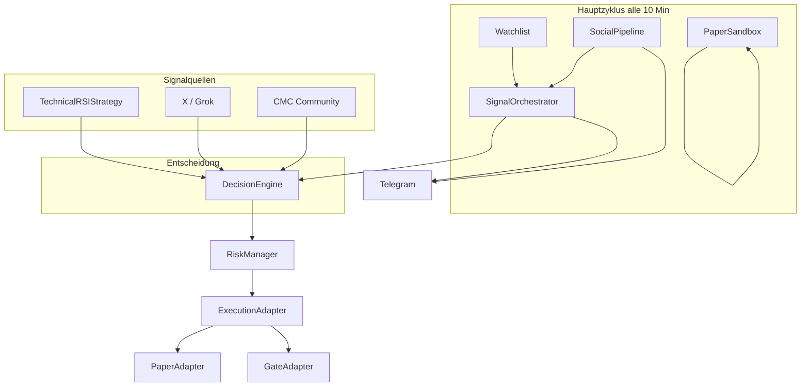

# X-Agent Trading Bot — Vollständige Dokumentation

Stand: 14. Juni 2026 · Version 1.8

Dieses Dokument ist die zentrale Übersicht: Architektur, Intervalle, Strategien, Telegram-Befehle, **Transparenz für Einsteiger**, Demo-Modus, X/Twitter, Hermes und Sandbox.

---

## 1. Was macht der Bot?

Der X-Agent Trading Bot ist ein **hybrider Krypto-Trading-Agent**:

1. Beobachtet Coins auf der **Watchlist** (technische Analyse: RSI, Bollinger Bands, Volumen)
2. Liest **X/Twitter-Posts** und **CMC-Sentiment** ein
3. Führt Signale in der **DecisionEngine** zusammen
4. Führt Trades aus (Paper oder Live auf Gate.io)
5. Meldet alles per **Telegram** — inklusive **„Warum?“-Erklärungen** auf Deutsch (auch ohne Trading-Vorkenntnisse)

**Kernprinzip:** Kein blindes Folgen von Tweets — technische Signale und Social-Signale werden gewichtet zusammengeführt. Risiko-Limits und Cooldowns verhindern Übertrading.

**Für Einsteiger:** Du musst RSI oder Sharpe nicht kennen. Jede wichtige Telegram-Nachricht hat einen Block **„Warum:“** in Alltagssprache. Technische Details stehen darunter in kleiner Schrift (`TA→SELL_30`). Nachlesen jederzeit mit `/decisions` oder `/why SYMBOL`.

---

## 2. Architektur (Überblick)



### Wichtige Module

| Modul | Datei | Aufgabe |
|-------|-------|---------|
| Hauptschleife | `aria_bot.py` | Flask-Webhook + Preis-/Signal-Zyklus |
| Entscheidung | `strategies/decision_engine.py` | TA + X + CMC → BUY/SELL/HOLD |
| Technik | `strategies/technical_rsi_bb.py` | RSI, BB, Volumen, TP, SL |
| Ausführung | `services/trading_service.py` | Modus, Risiko, Order |
| Gate.io Live | `execution/gate_adapter.py` | ccxt Spot-Market-Orders (Mainnet) |
| Order-Ledger | `services/order_service.py` | Auftragshistorie (`/orders`, scope-isoliert) |
| Gate-Balances | `services/gate_balance.py` | USDT/Spot (Live) oder Sim-Cash (Enhanced Dry Run) |
| Enhanced Dry Run | `services/dry_run_watchlist.py`, `data/cmc_trending_provider.py` | Sim-Wallet, CMC-Trending-Overlay |
| Strategy Backtest | `intelligence/strategy_backtest.py`, `services/strategy_*` | Auto-Backtest + Parameter-Tuning pro Coin |
| Social | `services/social_pipeline.py` | X-Posts, CMC, Accuracy |
| Sandbox | `strategies/paper_sandbox.py` | Isolierte Strategie-Tests |
| Telegram | `notifications/telegram_commands/` | Alle `/`-Befehle |
| Erklärungen (DE) | `notifications/user_explain.py` | Laien-Texte für Trades, Risiko, Hermes, CMC/X |
| Entscheidungs-Log | `services/audit_trail.py` → `logs/decisions.jsonl` | Protokoll aller Bot-Entscheidungen |

---

## 3. Wann läuft was? — Alle Intervalle

| Was | Intervall | Config / Quelle | Beschreibung |
|-----|-----------|-----------------|--------------|
| **Hauptzyklus** | **600 s (10 Min)** | `update_interval` | Watchlist, X, CMC, Sandbox, Trades, Telegram Cycle-Summary |
| X-Search Cache | 900 s (15 Min) | `x_performance.x_search_cache_ttl_sec` | Grok-Suche pro Account gecacht |
| X Live-Suche | 2 Tage zurück | `x_performance.live_search_days` | Zeitraum für Tweet-Suche |
| Trade-Cooldown (global) | 1 h | `trade_cooldown_hours` | Mindestabstand gleicher Trade-Typ |
| Cooldown pro Coin (Buy) | 4–6 h | `strategies[].min_hours_between_buys` | Pro Coin in `config.json` |
| Cooldown pro Coin (Sell) | 3–4 h | `strategies[].min_hours_between_sells` | Ausgenommen: Stop-Loss / Vollverkauf |
| Tages-Trade-Limit | 8 / 24 h | `max_daily_trades` | Global über alle Modi |
| RSI-Timeframe | 4 h (Standard) | `watchlist` + `strategies[]` | OHLCV-Kerzen für Indikatoren |
| Sandbox Mindestdauer | 7 Tage | `sandbox.min_test_days` | Vor Promotion |
| Sandbox Max-Laufzeit | 30 Tage | `sandbox.max_test_days` | Danach `expired` |
| X-Backtest Standard | 60 Tage | `x_backtest.default_days` | `/testaccount` |
| Accuracy-Tracking | 24 h Haltezeit | `x_backtest.min_signal_age_hours` | Bewertung alter Signale |
| Preis-Cache | TTL intern | `price_fetcher` | Weniger Gate/Binance-Calls |

### Ablauf eines Zyklus (Schritt für Schritt)

```
1. config.json neu laden
2. SocialPipeline: neue X-Posts holen + parsen (Grok)
3. CMC-Posts / Sentiment
4. Accuracy-Update (Trust-Scores der X-Accounts)
5. Sandbox-Hypothesen testen (parallel, isoliert)
6. Für jeden aktiven Watchlist-Coin:
   a. Preis von Gate.io (Fallback: Binance, KuCoin, Bybit)
   b. Indikatoren (RSI, BB, Volumen, ATR)
   c. DecisionEngine → Aktion
   d. RiskManager → Größe / Block
   e. Execution → Paper oder Gate
   f. Telegram bei Signal / Trade / Block — mit **Warum** + Quellen (Technik, X, CMC)
7. CMC- und X-Zyklus-Digest an Telegram (wenn neue Signale, `telegram_explanations` aktiv)
8. Strategy-Backtest-Tick (adaptiv, gestaffelt, wenn `strategy_backtest.auto_run: true`)
9. Cycle-Summary an Telegram (Entscheidungen + Social-Top, wenn `notify_on_cycle: true`)
10. Hermes-Hintergrundthread (alle ~30 Min., eigene Telegram-Meldungen bei jedem Lern-Zyklus)
11. Warten update_interval Sekunden → zurück zu 1
```

---

## 4. Handelsmodi

| Modus | Befehl | Was passiert | Echtes Geld? |
|-------|--------|--------------|--------------|
| **Paper** | `/mode paper` | Lokales Ledger (`trade_history.json`, `positions.json`) | Nein |
| **Live** | `/mode live` + `/live_confirm` | Gate.io Mainnet | **Ja** (wenn `dry_run: false`) |
| **Off** | `/mode off` | Nur Analyse, keine Orders | Nein |

Es gibt **kein Gate.io Testnet** im Bot (in Deutschland nicht nutzbar). Zum Üben: **Paper**. Für echte Orders: **Live** auf Gate.io Mainnet.

Alte `config.json` mit `"trading_mode": "gate_testnet"` werden automatisch als **Paper** behandelt.

### Live-Aktivierung (2 Stufen)

```
/mode live          → trading_mode=live, live_confirmed=false (noch gesperrt)
/live_confirm       → live_confirmed=true (Orders erlaubt)
/gate               → API-Keys, Balance, dry_run-Status prüfen
```

**Sicherheit:** `live.dry_run: true` (Standard) loggt Orders nur lokal — nichts geht an Gate.io, bis du `dry_run` auf `false` setzt.

`/live_confirm` prüft: keine Demo-Session, API-Keys gesetzt; warnt bei aktivem `dry_run`.

### Enhanced Dry Run (`live.dry_run_enhanced: true`)

Zusätzlich zu normalem Dry Run — für realistisches Üben im Live-Modus ohne echte Orders:

| Aspekt | Verhalten |
|--------|-----------|
| Aktivierung | `trading_mode: live` + `live.dry_run: true` + `live.dry_run_enhanced: true` |
| Sim-Cash | `live.simulated_balance_usdt` (Standard 5000) — wird aus `live_trade_history.json` abgeleitet |
| Watchlist | Core-Coins + CMC-Trending-Overlay (`watchlist.dry_run_overlay.json`, gitignored) |
| Risk-Limits | `dry_run_defaults` (höheres Tageslimit, kürzere Cooldowns) |
| `/positions` | **Cash (Sim)** + Bot-Positionen — keine Gate-Spot-Bestände im Portfolio |
| `/gate` | Zeigt Sim-USDT **und** Gate-API-Balance (nur Info) |
| `/dryrun` | Status: Sim-Balance, Trending-Coins, letzte CMC-Sync |

**Sim-Cash-Berechnung:** Startkapital minus Käufe plus Verkaufserlöse — wird beim Laden aus der Trade-Historie neu berechnet (kein Drift).  
**Portfolio-Wert:** Sim-Cash + Marktwert offener Positionen ≈ Startkapital + realisierte + unrealisierte PnL.

### Live-Modus: Ledger & Portfolio

| Datenquelle | Paper | Live (dry_run) | Live (enhanced dry_run) | Live (echt) |
|-------------|-------|----------------|-------------------------|-------------|
| Cash / USDT | `trade_history.json` | `live_trade_history.json` (virtuell) | Sim-Cash in `live_trade_history.json` | Gate API |
| Trades | `trade_history.json` | `live_trade_history.json` | `live_trade_history.json` | `live_trade_history.json` |
| Orders | `orders.paper.json` | `orders.live.json` | `orders.live.json` | `orders.live.json` |
| Positionen | `positions.paper.json` | `positions.live.json` | `positions.live.json` | `positions.live.json` |
| `/positions` | Virtuelles Portfolio | Wie Paper, Live-Ledger | **Cash (Sim)** + Positionen | Gate USDT + Spot |
| Order-Quelle | `auto` / `manual` | `Auto` / `Manuell` in `/orders` | gleich | gleich |

Hilfsskripte:

- `python3 scripts/gate_live_smoke_test.py` — Keys, Balance, ccxt-Verbindung
- `python3 scripts/reconcile_gate_positions.py` — `positions.live.json` vs. Gate-Bestand
- `bash scripts/start_with_ngrok.sh` — Produktiv-Start (ohne `--demo`)

### Telegram-Modus-Badges in Signalen

| Badge | Bedeutung |
|-------|-----------|
| 📋 PAPER | Lokales virtuelles Trading |
| 🔶 LIVE DRY | Live bestätigt, aber dry_run |
| 🧪 LIVE DRY+ | Enhanced Dry Run (Sim-Wallet + Trending) |
| 🔴 LIVE | Echte Mainnet-Orders |

---

## 5. Demo-Modus (`--demo`)

### Start

```bash
bash scripts/start_demo_with_ngrok.sh   # empfohlen: Bot + ngrok + Webhook
# oder manuell:
python3 aria_bot.py --demo
```

### Was ist anders?

| Aspekt | Normal | Demo (`--demo`) |
|--------|--------|-----------------|
| Daten-Dateien | `watchlist.json`, `positions.json`, … | `*.demo.json` (isoliert) |
| Telegram-Prefix | — | `🧪 [DEMO]` vor jeder Nachricht |
| Echtes Portfolio | Unberührt | Separate Demo-Dateien |

**Wichtig:** Demo nutzt dieselbe `config.json` — Handelsmodus und Strategien sind identisch, nur die **Daten** sind getrennt.

### Start / Stop

```bash
bash scripts/start_demo_with_ngrok.sh   # Stoppt alte Prozesse, startet ngrok neu, registriert Webhook
bash scripts/stop_bot.sh                # Bot + ngrok beenden
```

Das Start-Skript:
1. Beendet alte Bot-/ngrok-Prozesse (Ports 5000, 4040)
2. Startet Bot, wartet auf `/health`
3. Startet **frischen** ngrok-Tunnel
4. Testet Tunnel (HTTP 200)
5. Registriert Telegram-Webhook
6. Sendet Bestätigung an Telegram

---

## 6. Strategien — Wie sie funktionieren

### 6.1 Technische Basis (`TechnicalRSIStrategy`)

Jeder Watchlist-Coin hat Parameter in `config.json` → `strategies[]` (pro Symbol + Timeframe).

#### BUY (nur ohne offene Position)

Alle Bedingungen müssen gleichzeitig erfüllt sein:

- Preis ≤ Lower Bollinger Band × 1.01
- RSI zwischen `rsi_buy_low` und `rsi_buy_high`
- Volumen ≥ `volume_multiplier` × Durchschnitt

**Beispiel ARIA (4h):** RSI 28–45, Vol ≥ 1.4×, Preis am unteren BB → **BUY**

#### SELL (nur mit offener Position)

Priorität (höchste gewinnt):

| Priorität | Trigger | Aktion |
|-----------|---------|--------|
| 1 | X-Stop-Loss Preis erreicht | 100 % verkaufen |
| 2 | Verlust > `stop_loss_pct` | 100 % (`SELL_STOP_FULL`) |
| 3 | Verlust > 67 % von stop_loss | 50 % (`SELL_STOP_PARTIAL`) |
| 4 | Gewinn ≥ `take_profit_pct` | 30 % (`SELL_TP`) — einmalig |
| 5 | RSI kreuzt `rsi_sell_30` von unten | 30 % — einmalig pro Tier |
| 6 | RSI kreuzt `rsi_sell_20` von unten | 20 % — einmalig pro Tier |
| 7 | X `price_target` erreicht | 30 % |
| 8 | X/CMC SELL-Signal | 20–30 % je nach Confidence |

**Anti-Churn (neu):**
- **RSI-Cross:** Sell nur wenn RSI die Schwelle **von unten kreuzt**, nicht wenn er dauerhaft darüber bleibt
- **Tier-Flags:** 30 %-Verkauf passiert nur einmal, bis RSI wieder unter Schwelle − 5 fällt
- **Cooldown:** Kein zweiter Buy/Sell desselben Typs innerhalb von `min_hours_between_*`

### 6.2 DecisionEngine — Social + Technik

**Ohne Position → Buy-Merge:**
- Technisches BUY + X-BUY + CMC-BUY → `BUY_STRONG`
- Technisches BUY + (X oder CMC) → `BUY`
- Nur X + CMC (ohne TA) → `BUY` mit Social-Confidence

**Mit Position → Sell-Merge:**
- Stärkstes Sell-Signal gewinnt (Full > 50 % > 30 % > 20 %)

**X-BUY-Schwelle:** dynamisch nach Trust-Score (höherer Trust → niedrigere Confidence nötig)

### 6.3 Aktuelle Coin-Strategien (25 USDT/Trade)

| Coin | Tier | SL | TP | RSI Buy | RSI Sell 30/20 | Buy-Cooldown | Sell-Cooldown |
|------|------|----|----|---------|----------------|--------------|---------------|
| ARIA | Meme | 15 % | 12 % | 28–45 | 72/84 | 4 h | 3 h |
| RAVE | Meme | 15 % | 12 % | 28–45 | 72/84 | 4 h | 3 h |
| HIGH | Mid | 12 % | 10 % | 30–46 | 70/80 | 4 h | 3 h |
| SOL | Large | 8 % | 6 % | 32–48 | 68/78 | 6 h | 4 h |
| BTC | Large | 8 % | 6 % | 32–48 | 68/78 | 6 h | 4 h |

ARIA 1h-Strategie existiert nur für Sandbox (`live_enabled: false`).

### 6.4 Strategie-Beispiele

**Beispiel 1 — Konservativer Einstieg (ARIA):**
```
RSI: 38, Preis am unteren BB, Volumen 1.5×
→ Technisch: BUY
X-Account sagt auch BUY (Conf 80 %, Trust 85)
→ DecisionEngine: BUY_STRONG
→ RiskManager: 25 USDT (ggf. dynamisch angepasst)
→ Telegram: 🟢 BUY EXECUTED
  Warum: Technische Analyse sieht Kaufchance. X-Account empfiehlt Kauf.
  Technik: TA→BUY | X→BUY@CryptoCapo_(80%)
```

**Beispiel 2 — Take-Profit (HIGH):**
```
Entry: $0.10, aktueller Preis: $0.11 (+10 %)
take_profit_pct: 10 → SELL_TP (30 % der Position)
→ Einmalig, Tier-Flag gesetzt
→ Nächster Zyklus: HOLD (kein erneuter TP)
```

**Beispiel 3 — Cooldown blockiert:**
```
Vor 2 h: BUY ARIA ausgeführt
Neues BUY-Signal heute
→ RiskManager: BLOCKED — „Trade cooldown: 2.0h (min 4.0h)“
→ Telegram: 🟢 BUY BLOCKED
  Grund: Kürzlich schon gehandelt — kurze Pause gegen zu häufiges Hin und Her.
  Technik: TA→BUY | RSI=38.0
```

**Beispiel 4 — Stop-Loss bypassed Cooldown:**
```
Position −16 % (stop_loss_pct: 15)
→ SELL_STOP_FULL sofort, Cooldown wird ignoriert
```

---

## 7. Telegram — Alle Befehle mit Beispielen

Sende `/help` für die komplette Liste. Bei unvollständigen Befehlen (z.B. nur `/buy`) antwortet der Bot mit einem Beispiel.

### 7.0 Für Einsteiger — Was du in Telegram siehst

Der Bot erklärt sich **selbst**. Du musst keine Charts lesen — die Nachrichten sind in zwei Ebenen aufgebaut:

| Ebene | Beispiel | Für wen |
|-------|----------|---------|
| **Warum** | „RSI überkauft — wir verkaufen 30 %, der Rest bleibt investiert.“ | Alle Nutzer |
| **Technik** | `TA→SELL_30 \| RSI=74.2` | Optional, zum Nachschlagen |

#### Kurz-Glossar (Begriffe in Nachrichten)

| Begriff | Einfach erklärt |
|---------|-----------------|
| **RSI** | Thermometer für „überkauft“ (hoch) vs. „überverkauft“ (niedrig). Hoher RSI → Bot verkauft oft **nur einen Teil**, nicht alles. |
| **Ampel** | Stimmungsanzeige: grün = eher Aufwärtsdruck, rot = eher Abwärtsdruck. |
| **Confidence** | Wie sicher ein X- oder CMC-Signal ist (0–100 %). |
| **Trust-Score** | Wie zuverlässig ein X-Account in der Vergangenheit war. |
| **Teilverkauf 20 % / 30 %** | Gestaffelter Exit: nicht alles auf einmal verkaufen, Gewinne schrittweise mitnehmen. |
| **BLOCKED** | Signal war da, aber Risiko-Manager hat abgelehnt (z. B. zu viele Positionen, Cooldown). |
| **HOLD / Kein Trade** | Bot beobachtet, handelt aber nicht — oft weil Technik und Social nicht übereinstimmen. |
| **Hermes** | Hintergrund-Assistent, der Strategie-Einstellungen im Backtest testet (alle ~30 Min.). |
| **Counterfactual** | „Was wäre passiert, wenn…?“ — Vergleich simulierter vs. echter Verkäufe. |

#### Typische Fragen

| Frage | Wo nachschauen |
|-------|----------------|
| Warum hat der Bot gerade verkauft? | Trade-Nachricht → **Warum:** oder `/why H` |
| Warum wurde **nicht** gekauft trotz CMC/X? | Nachricht „Kein Trade“ oder Cycle-Summary |
| Was hat Hermes zuletzt getestet? | `/hermes_last` oder `/hermes` |
| Was passierte heute insgesamt? | Cycle-Summary (alle 10 Min.) + `auswertungen/YYYY-MM-DD_tag.md` |
| Alle Entscheidungen chronologisch? | `/decisions` |

### 📋 Watchlist

| Befehl | Beispiel | Ergebnis |
|--------|----------|----------|
| `/list` | `/list` | Alle Coins mit Status (aktiv/inaktiv) |
| `/add SYMBOL` | `/add RAVE` | Fügt `RAVE/USDT` zur Watchlist hinzu |
| `/remove NUMMER` | `/remove 2` | Entfernt Coin Nr. 2 aus `/list` |

### 💰 Handel

| Befehl | Beispiel | Ergebnis |
|--------|----------|----------|
| `/buy SYMBOL USDT` | `/buy ARIA 25` | Kauft ARIA für 25 USDT |
| `/buy NUMMER USDT` | `/buy 1 25` | Kauft Coin Nr. 1 aus `/list` |
| `/sell` | `/sell` | Zeigt offene Positionen mit Entry, PnL |
| `/sell NUMMER PROZENT` | `/sell 1 30` | Verkauft 30 % von Position 1 |
| `/positions` | `/positions` | Portfolio-Übersicht, Kurse, letzte Trades |
| `/orders` | `/orders` | Order-Ledger (24h-Stats, paginiert) |
| `/orders NUMMER` | `/orders 3` | Detail zu Order Nr. 3 (Kauf-/Verkaufsdatum) |
| `/orders page N` | `/orders page 2` | Seite 2 der Historie |
| `/risk` | `/risk` | Limits, Drawdown, Trade-Größe |
| `/dryrun` | `/dryrun` | Enhanced Dry Run: Sim-Cash, Trending-Overlay |

Manuelle `/buy` und `/sell` erscheinen in `/orders` und letzten Trades als **Manuell**; Bot-Trades als **Auto**.

### ⚙️ Modus & Gate.io

| Befehl | Beispiel | Ergebnis |
|--------|----------|----------|
| `/mode` | `/mode` | Aktueller Modus (paper / live / off) |
| `/mode paper` | `/mode paper` | Zurück zu virtuellem Trading |
| `/mode live` | `/mode live` | Live vorbereiten (noch nicht aktiv) |
| `/live_confirm` | `/live_confirm` | Live freischalten (Keys + kein Demo; warnt bei dry_run) |
| `/live_cancel` | `/live_cancel` | Live abbrechen → Paper |
| `/gate` | `/gate` | API-Keys, USDT (Gate + Sim), Spot-Bestände, dry_run |

### 🐦 X / Twitter

| Befehl | Beispiel | Ergebnis |
|--------|----------|----------|
| `/addx ACCOUNT` | `/addx CryptoCapo_` | Account überwachen |
| `/removex ACCOUNT` | `/removex CryptoCapo_` | Account entfernen |
| `/listx` | `/listx` | Alle Accounts + Trust-Score |
| `/xsignals` | `/xsignals` | Aktuelle starke BUY/SELL-Signale |
| `/xposts` | `/xposts` | Letzte 10 analysierte Posts |
| `/xaccuracy` | `/xaccuracy` | Leaderboard (Trefferquote) |
| `/testaccount ACCOUNT [TAGE]` | `/testaccount CryptoCapo_ 30` | Backtest der Empfehlungen |
| `/tracktest` | `/tracktest` | Sofort-Test mit Beispiel-Tweet |

### 📊 Strategy Backtest (Auto-Tuning)

| Befehl | Beispiel | Ergebnis |
|--------|----------|----------|
| `/backtest` | `/backtest` | Status aller Coins: nächster Review, Churn, PnL sim |
| `/backtest SYMBOL` | `/backtest ARIA 30` | Sofort-Backtest (30 Tage), 6h Cooldown |
| `/backtest_results SYMBOL` | `/backtest_results ARIA` | Letzte Metriken + angewandte Parameter |
| `/backtest_lock SYMBOL` | `/backtest_lock BTC` | Coin von Auto-Apply ausschließen |

Läuft automatisch im Hauptzyklus (`strategy_backtest.auto_run`), gestaffelt (`stagger_minutes`), mit Guardrails (`min_signals_for_valid`, `min_improvement_pct`). Ergebnisse in `strategy_backtest.json` (gitignored).

### 🔍 Transparenz — Was der Bot warum tut

| Befehl | Beispiel | Ergebnis |
|--------|----------|----------|
| `/decisions` | `/decisions` | Letzte 8 Bot-Entscheidungen mit **Warum** (aus `logs/decisions.jsonl`) |
| `/decisions SYMBOL` | `/decisions H` | Wie `/why H` — gefiltert auf einen Coin |
| `/why SYMBOL` | `/why ARIA` | Letzte Entscheidung + Hermes-Experiment-ID (falls gesetzt) |
| `/hermes` | `/hermes` | Technischer Status + **Klartext** zum letzten Zyklus |
| `/hermes_last` | `/hermes_last` | Nur der letzte Hermes-Zyklus in Alltagssprache |
| `/hermes_run` | `/hermes_run` | Einen Lern-Zyklus manuell starten |
| `/cmc` | `/cmc` | CMC Community-Sentiment (Votes, Confidence) |

Details zu Hermes: [HERMES_DOKUMENTATION.md](HERMES_DOKUMENTATION.md)

### 🧪 Sandbox

| Befehl | Beispiel | Ergebnis |
|--------|----------|----------|
| `/sandbox` | `/sandbox` | Laufende Strategie-Experimente |
| `/sandbox_results ID` | `/sandbox_results hyp_abc` | Win Rate, Sharpe, Drawdown |
| `/sandbox_promote ID` | `/sandbox_promote hyp_abc` | Strategie → `config.strategies[]` |

### Automatische Telegram-Nachrichten

| Auslöser | Inhalt (laientauglich) |
|----------|------------------------|
| **Zyklus-Zusammenfassung** (alle 10 Min) | Balance, **Entscheidungen mit Warum**, Social-Top (X/CMC), ausgeführte Trades |
| **BUY/SELL SIGNAL** | Signal + **Warum**, Quellen, optional Technik-Zeile |
| **BUY/SELL EXECUTED** | Wie oben + Amount, PnL, Mode-Badge |
| **BUY/SELL BLOCKED** | **Grund** auf Deutsch (Cooldown, Max-Positionen, …) + Technik |
| **Kein Trade trotz Social** | „X/CMC sagt BUY, Technik noch nicht bereit“ |
| **X-Empfehlung** | Tweet, Empfehlung, Trust, **Warum**, TP/SL |
| **CMC-Zyklus-Digest** | Community-Stimmung pro Coin (Votes, Confidence) |
| **X-Zyklus-Digest** | Starke Signale der überwachten Accounts (ohne Duplikat zur X-Empfehlung) |
| **Hermes Lern-Zyklus** | Jeder Zyklus (~30 Min.): getestet, abgelehnt oder übernommen — auf Deutsch |
| **Hermes Promotion** | Strategie-Parameter live übernommen + Kennzahlen |
| **Hermes Live-Veto** | Backtest ok, aber echte Trades sprechen dagegen — Schutz aktiv |
| **Strategie Auto-Tune** | Backtest hat Parameter verbessert — welche Werte, wann nächster Check |
| **Nach jedem Trade** | Positions-Snapshot |
| **Bot-Neustart** | Webhook-URL, Modus |

#### Beispiel einer Trade-Nachricht (vereinfacht)

```
🔴 SELL 30% EXECUTED — H/USDT
Mode: 🔶 LIVE DRY

Warum: RSI überkauft (Stufe 2) — 30 % der Position werden verkauft.
Quellen: Technische Analyse
RSI: 74.5 | Entry: $0.5200 | PnL: +$2.30
TA→SELL_30 | RSI=74.5
```

#### Showcase (alle Nachrichtentypen testen)

```bash
python3 scripts/telegram_transparency_showcase.py
```

Sendet alle Kategorien an den Telegram-Channel — **ohne echte Trades**. Nützlich nach Updates oder Neustart.

---

## 8. X / Twitter — Pipeline im Detail

### Datenfluss

```
1. X-Accounts in x_accounts.json (via /addx)
2. Pro Zyklus: Grok X-Search (letzte 2 Tage, Cache 15 Min)
3. Grok parst Tweet → BUY/SELL/HOLD + coin + confidence + price_target + stop_loss
4. DecisionEngine vergleicht mit technischer Strategie
5. Empfehlung in x_posts.json gespeichert
6. Bei recommended: Telegram X-Recommendation
7. AccuracyTracker bewertet nach 24 h → Trust-Score Update
```

### Trust-Score & Accuracy

- Jeder X-Account startet mit Trust **70**
- Nach jedem Signal: nach 24 h wird geprüft, ob Kurs in erwartete Richtung lief
- `buy_success_pct: 3 %` / `sell_success_pct: -2 %` als Erfolgs-Schwellen
- Trust wird per EMA aktualisiert (`trust_ema_alpha: 0.3`)
- Niedriger Trust → höhere Confidence nötig für Live-Trades

### X-Backtest (`/testaccount`)

- Sucht historische Posts eines Accounts (Grok)
- Simuliert BUY/SELL mit `price_target` und `stop_loss`
- Zeigt Hit-Rate, durchschnittliche Returns
- Optional: Account direkt zur Watchlist hinzufügen (Button)

### Strategy Discovery (automatisch)

Tweets mit RSI/Volumen/Breakout-Keywords erzeugen **Sandbox-Hypothesen** — getrennt vom Haupt-Portfolio getestet.

---

## 9. Sandbox-Modus

### Zweck

Isoliertes Testen von Strategie-Ideen **ohne** das echte/virtuelle Haupt-Portfolio zu beeinflussen.

### Wie Hypothesen entstehen

1. X-Post enthält Strategie-Keywords (RSI, breakout, volume, …)
2. `StrategyDiscovery` extrahiert Parameter (Grok)
3. Hypothese mit Status `testing` in `paper_strategies.json`
4. Jeder Hauptzyklus: Sandbox führt TA auf Watchlist-Coins aus
5. Separates Portfolio pro Hypothese (`paper_sandbox_history.json`)

### Sandbox-Config

| Parameter | Wert | Bedeutung |
|-----------|------|-----------|
| `initial_capital_usdt` | 1000 | Startkapital pro Hypothese |
| `usdt_per_trade` | 50 | Trade-Größe in Sandbox |
| `min_test_days` | 7 | Mindestlaufzeit vor Promotion |
| `max_test_days` | 30 | Danach `expired` |

### Promotion-Kriterien (`/sandbox_promote`)

| Metrik | Minimum |
|--------|---------|
| Win Rate | 55 % |
| Sharpe | 0.5 |
| Max Drawdown | ≤ 15 % |
| Trades | ≥ 3 |

Bei Erfolg: Eintrag in `config.strategies[]` — ab dann im Haupt-Bot aktiv.

---

## 9b. Strategy Backtest & Auto-Tuning

Automatischer Walk-Forward-Backtest pro Coin in `config.strategies[]` — ersetzt nicht den manuellen X-Backtest (`/testaccount`), optimiert aber RSI/TP/SL-Parameter.

### Ablauf

```
1. Scheduler wählt fälligen Coin (next_review_at, gestaffelt alle 15 Min)
2. StrategyBacktester vergleicht Varianten (30 Tage OHLCV)
3. Metriken: signal_churn, pnl_sim, win_rate, ATR, US-Session-Volumen
4. Bei Verbesserung ≥ min_improvement_pct UND churn ≥ min_signals_for_valid:
   → auto_apply schreibt Parameter in config.strategies[] (Guardrails)
5. next_review_at adaptiv (Coin-Klasse, Volatilität, US-Markt-Schluss)
```

### Config (`strategy_backtest`)

| Parameter | Standard | Bedeutung |
|-----------|----------|-----------|
| `auto_run` | true | Tick im Hauptzyklus |
| `auto_apply` | true | Parameter automatisch übernehmen |
| `stagger_minutes` | 15 | Abstand zwischen Coin-Reviews |
| `min_signals_for_valid` | 3 | Mindest-Signale für Auto-Apply |
| `min_improvement_pct` | 10 | Mindest-Verbesserung vs. Baseline |
| `base_review_hours` | meme 24h, large 72h | Basis-Review-Intervall |

### Beispiel-Workflow

```
1. CryptoCapo_ tweetet: „Buy RSI 30 on dips, sell 70, 4h“
2. Bot erstellt hyp_abc123 (Status: testing)
3. /sandbox → hyp_abc123, WR: 62 %, 5 Trades
4. /sandbox_results hyp_abc123 → Promotion: ✅ Ready
5. /sandbox_promote hyp_abc123 → Strategie in config.json
```

---

## 10. CMC (CoinMarketCap)

- **Community-Posts** (wenn API-Plan verfügbar) oder **Quotes-Fallback**
- Signale: BUY / SELL / HOLD mit Confidence und Vote-Ratio (bullish/bearish Stimmen)
- In DecisionEngine wie X-Signale gewichtet (`onchain_weight: 0.2`)
- `/cmc` zeigt aktuelle Sentiment-Signale on-demand
- **Automatisch:** CMC-Zyklus-Digest in Telegram, wenn sich Signale ändern (Schwelle: `cmc_digest_min_confidence`, Standard 60 %)

**Für Einsteiger:** CMC zeigt, was die **Community** auf CoinMarketCap tendenziell erwartet — nicht unbedingt, was der Bot ausführt. Der Bot kombiniert CMC mit Technik und Risiko-Limits. In Trade-Nachrichten steht dann z. B. „CMC-Community tendiert zu Kauf (Stimmung 78 %)“.

---

## 11. Risiko-Management

| Limit | Standard | Wo |
|-------|----------|-----|
| Max pro Trade | 25 USDT | `max_usdt_per_trade` / `live.max_usdt_per_trade` |
| Max offene Positionen | 5 | `max_open_positions` |
| Max Coin-Anteil | 30 % Portfolio | `max_position_percent` |
| Tages-Trades | 8 / 24 h | `max_daily_trades` |
| Drawdown-Drossel | −10 % → halbe Größe | `risk.drawdown_throttle_pct` |
| Min Trade | 5 USDT | `risk.min_trade_usdt` |
| Slippage (Paper) | 1.5 % | `slippage_percent` |

Dynamische Größe: Trust × Confidence × ATR-Faktor × Drawdown-Multiplikator (max ×2.0).

`/risk` zeigt alle Werte live.

---

## 12. Konfiguration (`config.json`) — Schnellreferenz

```json
{
  "trading_mode": "paper",
  "update_interval": 600,
  "max_usdt_per_trade": 25,
  "trade_cooldown_hours": 1.0,
  "max_daily_trades": 8,
  "live": {
    "dry_run": true,
    "dry_run_enhanced": false,
    "simulated_balance_usdt": 5000,
    "trending_watchlist": { "enabled": true, "max_coins": 15 }
  },
  "dry_run_defaults": { "max_daily_trades": 30 },
  "strategy_backtest": { "auto_run": true, "auto_apply": true },
  "observability": {
    "notify_on_cycle": true,
    "terminal_dashboard": true,
    "decisions_audit": true,
    "telegram_explanations": {
      "enabled": true,
      "verbosity": "verbose",
      "language": "de",
      "show_technical_codes": true,
      "notify_hermes_every_cycle": true,
      "notify_cmc_digest": true,
      "notify_x_digest": true,
      "notify_social_hold_explanations": true,
      "notify_blocked_trades": true,
      "cmc_digest_min_confidence": 60,
      "x_digest_min_effective_confidence": 70
    }
  },
  "strategies": [ /* pro Coin, siehe Abschnitt 6.3 */ ]
}
```

### `.env` (nicht committen)

```
TELEGRAM_BOT_TOKEN=...
TELEGRAM_CHAT_ID=...
GATE_API_KEY=...          # Gate.io Live (Mainnet)
GATE_API_SECRET=...
CMC_API_KEY=...
XAI_API_KEY=...            # Grok
```

---

## 13. Daten-Dateien

| Datei | Inhalt |
|-------|--------|
| `watchlist.json` | Beobachtete Coins |
| `config.json` | Strategien, Limits, Modi |
| `positions.paper.json` | Positionen Paper-Modus |
| `positions.live.json` | Positionen Live-Modus (inkl. Dry Run) |
| `positions.json` | Legacy / Demo |
| `trade_history.json` | Trades, Balance, PnL (Paper) |
| `live_trade_history.json` | Live-Trades + Sim-Cash (Enhanced Dry Run) |
| `orders.live.json` | Order-Ledger für Live (scope `live`) |
| `orders.paper.json` | Order-Ledger für lokales Paper |
| `orders.demo.json` | Order-Ledger im Demo-Modus |
| `watchlist.dry_run_overlay.json` | CMC-Trending-Coins (Enhanced Dry Run, gitignored) |
| `strategy_backtest.json` | Backtest-Ergebnisse pro Coin (gitignored) |
| `x_accounts.json` | Überwachte X-Accounts |
| `x_posts.json` | Analysierte Posts + Empfehlungen |
| `paper_strategies.json` | Sandbox-Hypothesen |
| `paper_sandbox_history.json` | Sandbox-Portfolios |
| `logs/decisions.jsonl` | Entscheidungs-Protokoll (jede Coin-Analyse, `/decisions`) |
| `hermes/memory/experiments.json` | Hermes-Experiment-Historie |
| `hermes/memory/baseline.json` | Aktuelle Hermes-Best-Parameter |
| `*.demo.json` | Demo-Modus-Kopien |

---

## 14. Tests

```bash
pytest tests/unit/ -v                    # 237+ Tests
pytest tests/unit/test_dry_run_portfolio.py -v   # Sim-Cash + Portfolio-Invarianten
pytest tests/unit/test_dry_run_wallet.py -v
pytest tests/unit/test_strategy_backtest.py -v
pytest tests/unit/test_trade_cooldown.py -v      # Cooldown + RSI-Churn
pytest tests/unit/test_live_gate_readiness.py -v

# Gate readiness (keys in .env required)
python3 scripts/gate_live_smoke_test.py
python3 scripts/reconcile_gate_positions.py
```

---

## 15. Go-Live Checkliste

1. Bot **ohne** `--demo` starten (Demo isoliert `*.demo.json` / `orders.demo.json`)
2. `bash scripts/start_demo_with_ngrok.sh` oder Produktiv-Start — Telegram testen
3. Optional: `python3 scripts/telegram_transparency_showcase.py` — alle Nachrichtentypen prüfen
4. Paper laufen lassen, `/positions` + `/orders` + `/decisions` + Cycle-Summaries prüfen
5. `python3 scripts/gate_live_smoke_test.py` — Keys + Balance prüfen
6. `/mode live` + `live.dry_run: true` — Dry-Run-Zyklus, Ledger in `orders.live.json`
6b. Optional: `live.dry_run_enhanced: true` — Sim-Wallet ($5000), `/dryrun`, Trending-Watchlist testen
7. `live.dry_run: false` in `config.json`, Bot neu starten, dann `/live_confirm`
8. Manueller `/buy` mit kleinem Betrag — Gate Spot Order History + `/orders` vergleichen
9. `python3 scripts/reconcile_gate_positions.py` — lokale Positionen vs. Gate-Bestand
10. `/gate` — USDT, Spot-Bestände, Dry-Run-Status prüfen
11. Grok-Credits prüfen (`use_grok_x_search`) — sonst keine X-Auto-Trades im Live-Modus

**Hinweis:** Kein Testnet — Paper oder **Enhanced Dry Run** zum Üben. Im echten Live-Modus (`dry_run: false`) nutzen Risk Manager und `/positions` die **Gate-USDT-Balance**. Bei Enhanced Dry Run: Sim-Cash aus `live_trade_history.json`, Positionen in `positions.live.json`. Vor echtem Trading: `reconcile_gate_positions.py` ausführen.

---

## 16. Transparenz & Nachvollziehbarkeit (Technik)

| Komponente | Datei | Aufgabe |
|------------|-------|---------|
| Erklärungs-Engine | `notifications/user_explain.py` | DE-Texte für Rationale, Risiko, Hermes, CMC/X |
| Trade-Notify | `telegram_notifier.py` | `send_signal_message`, Digests, Hold-Erklärungen |
| Orchestrator | `services/signal_orchestrator.py` | Baut Social-Kontext, ruft `explain_trade()` auf |
| Audit | `services/audit_trail.py` | Schreibt jede Entscheidung nach `logs/decisions.jsonl` |
| Hermes-Notify | `hermes/agent.py` | Zyklus-Digest, Promotion, Live-Veto auf Deutsch |

### `verbosity`-Stufen (`telegram_explanations.verbosity`)

| Stufe | Verhalten |
|-------|-----------|
| `minimal` | Nur Trades + Strategie-Änderungen (geplant, aktuell Default: `verbose`) |
| `normal` | + Cycle-Summary mit Warum, blockierte Trades |
| `verbose` | + Hermes jeden Zyklus, CMC/X-Digests, Hold-Erklärungen bei starkem Social |

Spam-Schutz: CMC-Digest nur bei **geänderten** Signalen; X-Digest überspringt Posts, die schon als X-Empfehlung gesendet wurden.

---

**Weitere Hilfe:** `/help` in Telegram · [HERMES_DOKUMENTATION.md](HERMES_DOKUMENTATION.md) · GitHub Issues im Repo