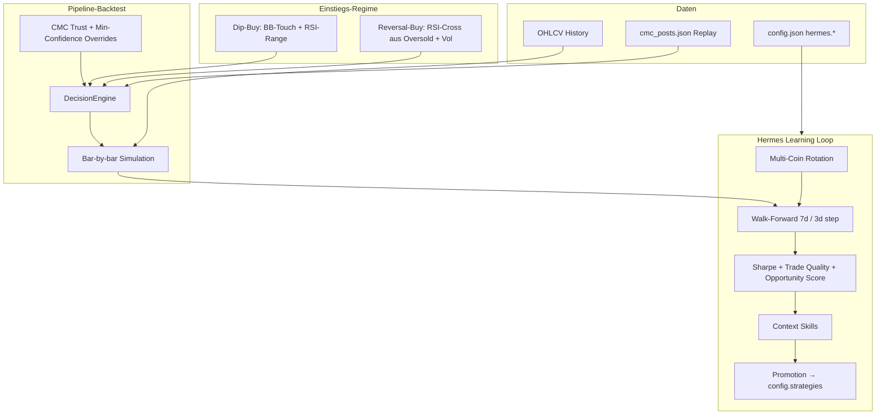

# Hermes 2.0 — Design Document

Stand: 15. Juni 2026

> **Implementierungsstand (Juni 2026):** Pipeline-Backtest, Walk-Forward, Hybrid-Pool, Live-Evidenz (Dual/Guardrail) und **Hermes Memory als Live-Fallback** (`strategies/registry.py`) sind umgesetzt. **Volatile-Altcoin-Profil** (`volatile_altcoin` + `market_structure.py`) ist ein separates Live-Layer — siehe [DOCUMENTATION.md §6.5](DOCUMENTATION.md#65-strategie-auswahl--wer-bekommt-welche-regeln). Nutzer-Doku: [HERMES_DOKUMENTATION.md](HERMES_DOKUMENTATION.md).

## Ziel

Mehr **gute Trades** (positiver Erwartungswert), bessere **Trendwenden-Erkennung**, und Lernen über die **gesamte Signal-Pipeline** — nicht nur isolierte TA-Parameter auf einem Coin.

Auslöser: Nacht-Auswertung 12./13.06. — 38 CMC-BUYs, 0 Trades. Ursache: Trust-Discount + Mean-Reversion-TA vs. Trend-CMC, nicht fehlende RSI-Feinjustierung.

---

## Architektur



---

## Komponenten

### 1. Reversal-Regime (`strategies/technical_rsi_bb.py`)

| Parameter | Default | Bedeutung |
|-----------|---------|-----------|
| `buy_regime` | `dip` (global), `both` (Hermes) | `dip`, `reversal`, oder `both` |
| `reversal_rsi_cross_low` | 32 | RSI war darunter (oversold) |
| `reversal_rsi_cross_high` | 38 | RSI kreuzt nach oben |
| `reversal_volume_multiplier` | 1.3 | Mindest-Volumen-Spike |

**Reversal-BUY:** `last_rsi < low` UND `current_rsi >= high` UND `vol >= threshold` — ohne BB-Touch.

### 2. Pipeline-Backtest (`hermes/pipeline_backtest.py`)

Simuliert pro Bar:

1. `MarketContext` aus OHLCV
2. CMC-Signale aus `cmc_posts.json` (TTL 4h)
3. `DecisionEngine.evaluate_with_market()` — volle Fusion-Logik
4. Ausführung wie klassischer Backtester

**Tunable Fusion-Parameter** (in `strategy_params`):

| Parameter | Default | Wirkung |
|-----------|---------|---------|
| `cmc_trust_score` | 65 | Effective = raw × trust/100 |
| `cmc_min_confidence` | 60 (55 enhanced) | Ausführungs-Schwelle |

### 3. Metriken (`hermes/metrics.py`)

```
avg_win / avg_loss aus abgeschlossenen Trades
trade_quality = (win_rate × avg_win) - (loss_rate × avg_loss)
opportunity_score = (trades_per_week) × max(0, trade_quality)
```

Promotion wenn **Sharpe + Folds** ODER **opportunity_score** klar besser (konfigurierbar).

### 4. Multi-Coin (`hermes/agent.py`)

- `hermes.symbols`: Liste der Coins
- `hermes.rotation`: `round_robin` | `signal_activity`
- Profile in `baseline.json` v2: `profiles["SYMBOL|tf"]`

### 5. Abgrenzung zu `strategy_backtest` (v1.6)

| System | Aufgabe |
|--------|---------|
| `strategy_backtest` | Schnelles per-Coin RSI/Volume-Tuning mit Guardrails |
| **Hermes 2.0** | Regime-Wahl, Fusion-Schwellen, Pipeline-Replay, Skills, Walk-Forward |

---

## Config-Beispiel

```json
"hermes": {
  "enabled": true,
  "backtest_mode": "pipeline",
  "symbols": ["ARIA/USDT", "H/USDT", "XPL/USDT"],
  "rotation": "signal_activity",
  "validation": {
    "mode": "walk_forward",
    "min_folds_won_ratio": 0.6,
    "min_opportunity_score": 0.5
  },
  "success_criteria": {
    "min_sharpe": 0.5,
    "min_trades": 3,
    "min_opportunity_score": 0.3
  }
}
```

---

## Counterfactual Replay

`hermes/counterfactual.py` — Replay eines Zeitraums (z. B. Nacht 12./13.06.) mit Varianten:

```bash
python3 -m hermes.counterfactual --from 2026-06-12T23:00 --to 2026-06-13T12:00
```

Output: Trades pro Variante (baseline vs. reversal vs. fusion-tuned).

---

## Migrationspfad

1. Bestehende `baseline.json` v1 → automatisch v2-Profile
2. Default `buy_regime: dip` für Nicht-Hermes-Strategien (kein Breaking Change)
3. Hermes setzt `buy_regime: both` bei Promotion

---

## Erfolgskriterien

- [ ] Reversal-BUY löst Einstieg bei RSI-Aufwärtskreuz aus
- [ ] Pipeline-Backtest nutzt CMC-Replay + DecisionEngine
- [ ] Multi-Coin-Rotation funktioniert
- [ ] Opportunity-Score in Promotion-Bewertung
- [ ] Unit-Tests grün
- [ ] Demo-Zyklus läuft durch