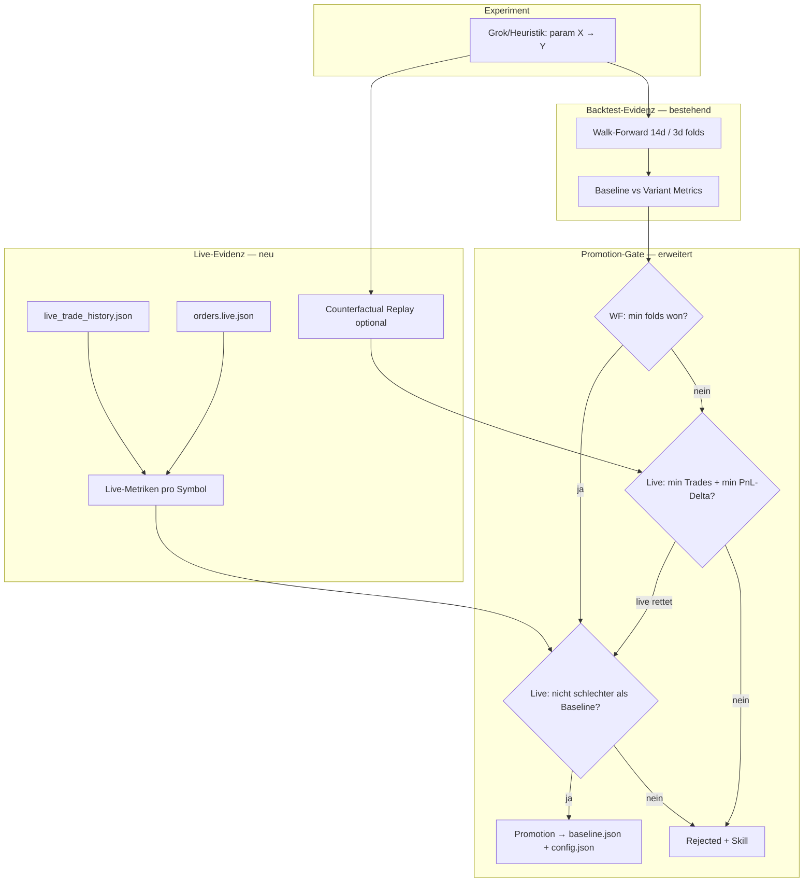

# Plan: Hermes Live-Trade-Evidenz

Stand: 15. Juni 2026  
Status: **Umgesetzt** (Live-Evidenz, Dual/Guardrail, Counterfactual-API)  
Bezug: Tages-Auswertung 14.06., Hermes 2.0 Design, `live_trade_history.json`

> **Ergänzung Juni 2026:** Neben diesem Plan gilt **Hermes Memory als Live-Fallback** — `baseline.json`-Parameter werden im Bot genutzt, auch ohne Promotion in `config.strategies[]`. Siehe [HERMES_DOKUMENTATION.md §1b](HERMES_DOKUMENTATION.md#1b-hermes-vs-live-bot-vs-volatile-profil--drei-rollen).

---

## Ziel

Hermes soll **tatsächliche Dry-Run-/Live-Trades** (`live_trade_history.json` + `orders.live.json`) als **zusätzliche Evidenz** in Promotion-Entscheidungen einbeziehen — damit Backtests mit „0 Trades, Sharpe 0" nicht allein über gute oder schlechte Live-Ergebnisse hinwegentscheiden.

**Nicht-Ziel:** Echtgeld-Live aktivieren (`dry_run: false`). Das bleibt ein separater, manueller Schritt.

---

## Problem (Ist-Zustand)

| Ebene | Verhalten heute |
|-------|-----------------|
| Live-Bot | Handelt (Dry-Run), schreibt `live_trade_history.json` |
| Hermes | Liest nur OHLCV + `cmc_posts.json` Replay im Pipeline-Backtest |
| Promotion | Nur Walk-Forward-Folds; typisch **0/4 gewonnen** → 35/35 rejected |
| Live-PnL | H +42,70 (auto), ARIA −16 (cmc) — fließt seit v1.7 in **Live-Evidenz** ein |

**Historisch (vor Live-Evidenz):** Hermes war ein reiner Backtest-Beobachter. **Heute:** Memory in `baseline.json` steuert den Live-Bot; Promotion in `config.strategies[]` ist optional.

---

## Lösungsprinzip

**Dual-Evidenz-Gate:** Eine Parameter-Variante wird nur promoted, wenn sie **Backtest-Walk-Forward** und **Live-Evidenz** nicht widerspricht — und mindestens eine Seite eine Verbesserung zeigt.



---

## Live-Evidenz: Definitionen

### Datenquellen

| Datei | Nutzen |
|-------|--------|
| `live_trade_history.json` | Filled trades, PnL, source, timestamp |
| `orders.live.json` | Rejected orders, signal, risk codes (Cooldown) |
| `positions.live.json` | Offene Positionen, sold_percent (Kontext) |

### Live-Metriken (pro Symbol, rollierendes Fenster)

Fenster: `hermes.live_evidence.lookback_days` (Default **7**).

| Metrik | Berechnung |
|--------|------------|
| `live_trades` | Anzahl filled BUY+SELL im Fenster |
| `live_sell_pnl` | Summe `pnl` aller SELLs |
| `live_win_rate` | Anteil SELLs mit `pnl > 0` |
| `live_pnl_by_source` | Aufschlüsselung `auto` / `cmc` / `manual` |
| `live_reject_rate` | rejected / (filled + rejected) für Symbol |

### Counterfactual (Phase 2)

Für das Live-Fenster `[start, end]`: Pipeline-Backtest mit **Baseline-Params** vs **Variant-Params** auf demselben OHLCV+CMC-Replay — analog `hermes/counterfactual.py`, aber als Library-Funktion im Agent-Loop.

Output: `counterfactual_pnl_delta`, `counterfactual_trades_delta`.

---

## Promotion-Logik (neu)

Erweiterung von `hermes/goals.py` → `evaluate_walk_forward_with_live()`.

### Modus A — `live_evidence.mode: "guardrail"` (Default, Phase 1)

Walk-Forward bleibt Primary. Live blockiert nur **klare Widersprüche**:

| Bedingung | Aktion |
|-----------|--------|
| WF promoted (heutige Logik) **UND** `live_sell_pnl >= 0` mit `live_trades >= min_live_trades` | **Promote** |
| WF promoted **ABER** `live_sell_pnl < -live_max_loss_usdt` (Default 10) | **Reject** — „Live widerspricht Backtest" |
| WF rejected **ABER** `live_trades >= 3` **UND** `live_sell_pnl > 0` **UND** Variable betrifft nur Sell/CMC | **Defer** — kein Promote, Skill „needs more backtest data" |
| Sonst | Unverändert reject |

### Modus B — `live_evidence.mode: "dual"` (Phase 2)

Promotion wenn **eine** der Bedingungen erfüllt:

1. Walk-Forward: `folds_won / folds_total >= 0.55` (bestehend)
2. **ODER** Live+Counterfactual: `live_trades >= 3`, `counterfactual_pnl_delta > 0`, `live_sell_pnl >= 0`, Variable nicht in `live_blocklist`

Zusätzlich: Aggregate muss `meets_success_criteria` erfüllen **oder** Live-PnL-Delta über `min_live_pnl_delta_usdt` (Default 5).

### Variablen-Blocklist (Live-sensitive)

Diese Parameter dürfen in Modus B **nur** mit WF promoted werden, nicht allein via Live:

- `stop_loss_pct`
- `max_usdt_per_trade` (falls später tunable)

---

## Config-Erweiterung (`config.json` → `hermes`)

```json
"live_evidence": {
  "enabled": true,
  "mode": "guardrail",
  "lookback_days": 7,
  "min_live_trades": 3,
  "min_live_sell_trades": 2,
  "live_max_loss_usdt": 10,
  "min_live_pnl_delta_usdt": 5,
  "include_manual_trades": true,
  "counterfactual_enabled": false,
  "notify_on_live_veto": true
}
```

---

## PR-Plan (DAG)

Linearer Stack — von unten nach oben mergen.

### PR-1: `live-evidence-metrics` (Foundation)

**Branch:** `feature/hermes-live-evidence-metrics`  
**Abhängigkeiten:** keine

**Dateien:**
- `hermes/live_evidence.py` (neu) — Laden, Filtern, Metriken
- `hermes/live_evidence.py` — `compute_live_metrics(symbol, lookback_days) -> LiveMetrics`
- `tests/test_live_evidence.py` (neu)

**Acceptance:**
- Aus bestehendem `live_trade_history.json` korrekte Metriken für H/USDT (+45), ARIA/USDT (−16), STG
- Manual trades optional exkludierbar
- Orders rejected werden gezählt, nicht als Trades

---

### PR-2: `live-evidence-goals` (Guardrail-Gate)

**Branch:** `feature/hermes-live-evidence-guardrail`  
**Abhängigkeiten:** PR-1

**Dateien:**
- `hermes/goals.py` — `evaluate_walk_forward_with_live()`
- `hermes/agent.py` — Live-Metriken laden, an Goals übergeben, `verdict_reason` erweitern
- `hermes/experiment.py` — Felder `live_metrics`, `live_veto` im Experiment-Record
- `core/config.py` — `hermes.live_evidence` defaults

**Acceptance:**
- Experiment mit gutem WF aber `live_sell_pnl < -10` → rejected mit Reason „Live veto"
- Experiment ohne WF-Sieg aber positivem Live → weiter rejected (Guardrail), Reason enthält Live-Kontext
- Bestehende 35 Experimente replaybar ohne Crash (live_evidence disabled)

---

### PR-3: `live-evidence-telegram` (Observability)

**Branch:** `feature/hermes-live-evidence-notify`  
**Abhängigkeiten:** PR-2

**Dateien:**
- `hermes/agent.py` — `/hermes` Status um Live-Metriken ergänzen
- `telegram_notifier.py` oder `hermes_agent.py` — Kurzzeile Live-PnL pro Symbol
- `scripts/daily_auswertung.py` — Hermes-Abschnitt: Live-Evidenz + letzter Veto-Grund

**Acceptance:**
- `/hermes` zeigt: `H/USDT live 7d: +45 USDT (3 sells)`
- Bei Live-Veto: Telegram-Warning wenn `notify_on_live_veto`

---

### PR-4: `live-evidence-counterfactual` (Dual-Modus, optional)

**Branch:** `feature/hermes-live-evidence-dual`  
**Abhängigkeiten:** PR-2

**Dateien:**
- `hermes/counterfactual.py` — Refactor: `replay_window()` als importierbare API
- `hermes/live_evidence.py` — `counterfactual_delta(symbol, params, window)`
- `hermes/goals.py` — Modus `dual`
- `config.json` — `counterfactual_enabled: true` nur nach Review

**Acceptance:**
- H/USDT Fenster 13.–14.06.: Baseline vs Variante `rsi_sell_30 70→68` liefert nachvollziehbaren Delta
- Dual-Modus promote nur mit `counterfactual_pnl_delta > 0` UND positivem Live-PnL
- Unit-Test mit fixture OHLCV + fixture trades

---

### PR-5: `live-evidence-docs` (Dokumentation)

**Branch:** `feature/hermes-live-evidence-docs`  
**Abhängigkeiten:** PR-3

**Dateien:**
- `HERMES_DOKUMENTATION.md` — Abschnitt Live-Evidenz
- `HERMES_2_DESIGN.md` — Verweis auf diesen Plan
- `auswertungen/README.md` — bereits vorhanden, ggf. Live-Evidenz-Zeile

**Acceptance:**
- Klare Erklärung Guardrail vs Dual
- Beispiel ARIA-Veto dokumentiert

---

## Rollout

| Schritt | Aktion |
|---------|--------|
| 1 | PR-1+2 mergen, `live_evidence.enabled: true`, `mode: guardrail` |
| 2 | 3–5 Tage beobachten: `experiments.json` enthält `live_metrics` |
| 3 | Auswertung: wie viele WF-Promotions wurden per Live vetoed? |
| 4 | Optional PR-4: `mode: dual` nur für H/USDT testen |
| 5 | Erst danach: Diskussion echter Live-Orders (`dry_run: false`) |

---

## Risiken & Mitigationen

| Risiko | Mitigation |
|--------|------------|
| Wenige Live-Trades → noisy | `min_live_trades >= 3`, sonst Live ignorieren |
| Manual trades verfälschen | `include_manual_trades: false` Option |
| Overfitting auf 7 Tage | Nur Guardrail in Phase 1; Dual erst mit Counterfactual |
| Promotion ändert Live-Verhalten sofort | `notify_on_promotion` + Audit-Felder in Experiment |
| Backtest weiterhin 0 Trades | Dual-Modus explizit opt-in, nicht Default |

---

## Erfolgskriterien (nach 7 Tagen)

1. Jedes Hermes-Experiment hat `live_metrics` im Record (wenn `enabled`)
2. Mindestens 1 dokumentierter Fall: „WF hätte promoted, Live veto" **oder** „Live-Kontext in verdict_reason"
3. Keine Regression: Bot-Zyklus + Dry-Run-Trades unverändert stabil
4. Tages-Auswertung zeigt Live-Evidenz-Zeile
5. **Kein** automatisches `dry_run: false`

---

## Referenz: Was bei erfolgreichem Lernzyklus passiert

1. `hermes/memory/baseline.json` → neue `params` (**Live-Bot nutzt sie sofort**)
2. Optional bei Promotion: `sync_hermes_baseline_to_config()` → `config.strategies[]` gepatcht
3. Telegram: „🧠 Hermes promoted" (nur bei Promotion)
4. Nächster Bot-Zyklus nutzt neue Schwellen — auch über Sell/Rebuy hinweg

Live-Evidenz ändert **nur die Hürde für Promotion**, nicht die Memory-Nutzung im Live-Bot.

---

## Ausführung

```bash
# Plan umsetzen (wenn gewünscht):
/execute-plan HERMES_LIVE_EVIDENCE_PLAN.md

# Oder einzeln:
/implement PR-1 aus HERMES_LIVE_EVIDENCE_PLAN.md
```

**Geschätzter Aufwand:** PR-1–3 ≈ 1 Session, PR-4 ≈ 1 zusätzliche Session.