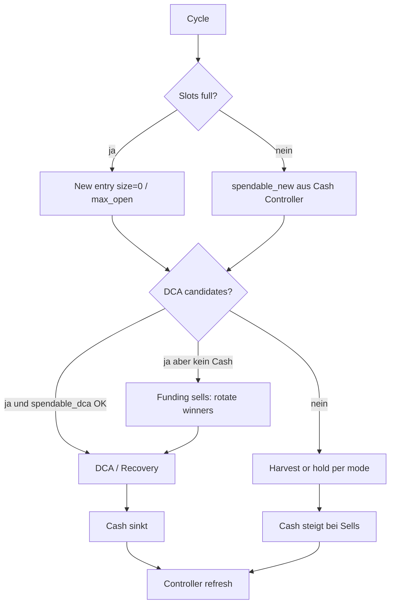

# Master-Plan: Adaptive Cash + Extreme Position Rotation

> **Status:** Phase 0–1 **implemented** (2026-07-19) · Phases 2–4 open · **koordiniert** mit Next Wave  
> **GitHub epic:** [#89](https://github.com/jholze/xagent-trading-bot/issues/89) Adaptive Cash + Extreme Position Rotation  
> **Anlass:** User-Ziel — starker Markt Cash **freigeben**, schwacher Markt **auffüllen**; viele kleine Gewinne, schnelle Rotation, immer DCA-fähig; starrer Floor (#67) blockiert Test  
> **Supersedes / merged with:** Teile von `dca-recovery-rotation.md` (Rotation-Cash-Seite), ergänzt #67  
> **Koordination:** [`next-wave-dca-decision-cash.md`](next-wave-dca-decision-cash.md) · DCA Policy [`epic-dca-agent.md`](epic-dca-agent.md) (#79)  
> **#72:** Fusion live lesen; RAG optional Evidence — Cash Policy ist **nicht** #72-Scope  
> **Nicht ersetzen:** Venue/Sensor-Guard, Exit-Ladder-Details — die bleiben; hier steuern wir **Cash + Tempo**  
> **Branch-Vorschlag:** `feature/adaptive-cash-rotation` von `staging`

### Ticket map

| Phase | Issue | Status |
|-------|-------|--------|
| P0–P1 Cash controller | [#90](https://github.com/jholze/xagent-trading-bot/issues/90) | **closed** shipped |
| Staging soak + close #67 | [#91](https://github.com/jholze/xagent-trading-bot/issues/91) | open |
| P2 Rotation tempo | [#92](https://github.com/jholze/xagent-trading-bot/issues/92) | open |
| P3 Funding portfolio | [#93](https://github.com/jholze/xagent-trading-bot/issues/93) | open |
| P4 Urgency + HARVEST | [#94](https://github.com/jholze/xagent-trading-bot/issues/94) | open |
| Ops floor free $0 | [#67](https://github.com/jholze/xagent-trading-bot/issues/67) | **closed** (via #90 + staging) |
| Memory urgency docs | [#71](https://github.com/jholze/xagent-trading-bot/issues/71) | open (feeds #94) |

---

## 0. North Star (deine Ziele, verbindlich)

| Priorität | Ziel | Messbar |
|-----------|------|---------|
| **1** | **Extreme Positions-Rotation** — wenig „Zombie“-Tage im Ledger | Median hold-time ↓; % Positionen >7d offen ↓ |
| **2** | **Viele kleine Wins** ($20–40) vor wenigen großen | Median win $; count wins/week; optional $100+ wenn Markt hergibt |
| **3** | **Immer DCA-fähig**, auch bei vollen Slots | `spendable_dca > min_dca` sobald Recovery/DCA-Score passt |
| **4** | **Cash folgt Markt** — freigeben / einsammeln via vorhandener Regime-Logik | Floor/spendable trackt Fusion `size_mult` + coin tier, nicht nur starre 18 % |

**Leitprinzip:**

```text
Rotation freigibt Cash  →  Cash finanziert neue Entries + DCA
Markt risk-off         →  Cash einsammeln (höherer Floor, kleinere Entries)
Markt risk-on          →  Cash freigeben (niedrigerer Floor, mehr Rotation-Sells)
Coin schwach           →  früher raus / kein DCA
Coin stark             →  Trail mitfahren, aber Rest nicht ewig als Slot-Zombie
```

Cash ist **kein toter 18 %-Parkplatz**, sondern ein **dynamischer Puffer** im Dienst von Rotation.

---

## 1. Ist-Zustand (warum es hakt)

### 1.1 Was schon existiert (nutzen, nicht neu erfinden)

| Baustein | Rolle heute | Lücke vs. Ziel |
|----------|-------------|----------------|
| `risk.cash_floor_pct` (18 %, basis `initial`) | Harte Reserve | **Starr**; blockt auch DCA; bei cash≈floor → **0 Entries** (#67) |
| `get_global_market_bias()` / Fusion | `size_mult`, `block_buys`, sensor_policy | Beeinflusst **Order-Size**, **nicht** Floor/Spendable-Ziel |
| `sell_policy.rotation` (mode active) | Trail-exclusive, tail idle, no loss-evict | `arm_gain_pct` 12–15 % → **zu spät** für $20–40-Rotation auf großen Lots |
| Exit-Ladder + dust-sweep | Partials + Rest-Cleanup | Reste können Slots belegen; Recovery-Plan teils offen |
| `dca_portfolio.py` | DCA + Funding-Sells aus Gewinnern | `portfolio.enabled` oft shadow/off; Cash-Buffer fest |
| Per-Coin: `volatility_tier`, `coin_class`, Memory `size_bias` / entry_bias | Size & Soft-Block | Kein **Cash-Release-Score** pro Coin |
| Oracle / Santiment | Regime NEUTRAL/RISK_OFF | Nicht an Floor gekoppelt |
| `plans/dca-recovery-rotation.md` | Recovery + Slot-Accounting | Noch nicht voll live; **Cash-Policy fehlt** |

### 1.2 Kernkonflikt

```text
Du willst:  schnell rotieren + DCA-Cash + kleine Wins
Heute:      Floor friert Cash · hohe arm_gain · Partials lassen Tails ·
            Market size_mult schrumpft Entries, sammelt aber kein Cash ein
```

**#67** ist nur das Symptom: Floor = Cash → Rotation und DCA sterben.

---

## 2. Zielarchitektur

```text
┌─────────────────────────────────────────────────────────────────┐
│  Portfolio Cash Controller  (NEU — dünne Schicht)               │
│  Input:  fusion bias, equity, free USDT, open slots,            │
│          rotation backlog (stale winners / tails)                 │
│  Output: target_cash_buffer_usdt, cash_floor_pct_eff,           │
│          spendable_new_entry, spendable_dca,                    │
│          urgency: free_cash | hold | harvest                     │
└────────────┬───────────────────────────┬────────────────────────┘
             │                           │
     ┌───────▼────────┐          ┌───────▼────────┐
     │ Risk Guardian  │          │ Sell / Rotate  │
     │ floor + size   │          │ + DCA portfolio│
     │ entry vs dca   │          │ funding sells  │
     └───────┬────────┘          └───────┬────────┘
             │                           │
             └───────────┬───────────────┘
                         ▼
              Execute (unverändert Ledger)
```

**Drei Cash-Modi (pro Cycle / bei Bias-Change):**

| Mode | Wann | Floor / Spendable | Rotation-Druck |
|------|------|-------------------|----------------|
| **HARVEST** | RISK_OFF / size_mult niedrig / DD | Floor **hoch**, neue Entries klein/block | Gewinner **stärker** abschließen (Cash einsammeln) |
| **STEADY** | NEUTRAL | Floor mittel, DCA-Puffer fest | Normal trail + tail idle |
| **DEPLOY** | RISK_ON / size_mult hoch / viele freie Slots | Floor **niedrig**, Entries aktiv | Nur Zombies räumen, nicht aggressiv take-profit |

DCA bekommt **eigenes Spendable-Band** (`dca_reserve_usdt` oder `% of equity`), das der Floor **nicht** auffrisst — sonst widerspricht „immer DCA-fähig“.

---

## 3. Adaptive Cash-Policy (Detail)

### 3.1 Effektiver Floor (ersetzt starres 18 % als einzige Wahrheit)

```text
floor_pct_eff = clamp(
  floor_pct_base
  + regime_delta          # RISK_OFF +4..+8, RISK_ON -4..-8, CRASH → max
  + drawdown_delta        # bestehendes drawdown_throttle spiegeln
  - rotation_pressure     # viele stale winners → Floor senken (Cash freigeben für DCA/new)
, floor_pct_min, floor_pct_max)
```

| Signal (bestehend) | Mapping (Vorschlag Defaults) |
|--------------------|------------------------------|
| Fusion `size_mult` ≥ 1.0 | `regime_delta = -4` (DEPLOY) |
| `size_mult` 0.7–0.99 | 0 (STEADY) |
| `size_mult` < 0.7 oder `block_buys` | `+6` (HARVEST) |
| Equity drawdown ≥ throttle | `+4` zusätzlich |
| `spendable_dca` < target und Recovery-Queue > 0 | Floor temporär −3 (nur DCA freigeben) |

**Config-Skizze:**

```json
"risk": {
  "cash_policy": {
    "enabled": true,
    "mode": "adaptive",
    "floor_pct_base": 12,
    "floor_pct_min": 5,
    "floor_pct_max": 25,
    "floor_basis": "nav",
    "dca_buffer_usdt": 800,
    "dca_buffer_pct_equity": 1.5,
    "new_entry_requires_free_slots": true,
    "link_fusion_size_mult": true,
    "refresh_sec": 300
  },
  "cash_floor_pct": 18,
  "cash_floor_basis": "initial"
}
```

Migration: wenn `cash_policy.enabled`, überschreibt `floor_pct_eff` den festen `cash_floor_pct` (Legacy bleibt Fallback).

### 3.2 Getrenntes Spendable: New-Entry vs DCA

| Bucket | Darf Floor anfassen? | Zweck |
|--------|----------------------|--------|
| **New entry** | Ja — muss `free ≥ min_trade` nach Floor | Frische Coins / Sensor |
| **DCA / Recovery** | Nein — eigener `dca_buffer` **oberhalb** des Floors oder **ausgenommen** | Nachkauf Verlierer / Winner-add nur wenn Score |

```text
cash_total = available_USDT
floor_abs  = floor_pct_eff × basis
dca_budget = min(dca_buffer_target, max(0, cash_total - floor_abs * dca_floor_haircut))
           // haircut 0 = DCA darf bis Floor; 1 = DCA nur oberhalb Floor

spendable_new = max(0, cash_total - floor_abs - dca_budget_reserved)
spendable_dca = dca_budget
```

**User-Ziel „DCA wenn voll mit Positionen“:**  
`dca_budget` bleibt ≥ `fixed_usdt` solange nicht HARVEST-extrem; New Entries dürfen 0 sein, DCA nicht.

### 3.3 Cash freigeben = Rotation erzwingen (nicht nur Floor senken)

Wenn `spendable_dca + spendable_new < target` **und** es profitable Tails / stale winners gibt:

1. `dca_portfolio` Funding-Sells (bereits: `FundingSell` aus rotation-eligible)
2. Senke temporär `arm_gain` / aktiviere `profit_exit_full_close` für Top-N stale winners
3. Dust-sweep nur gain≥0 (bestehend)

Cash freigeben ist **Sell-Policy-Druck**, nicht nur Prozent-Schieberegler.

---

## 4. Rotation-Tempo für „viele kleine Gewinne“

### 4.1 Zielmetriken (nicht nur %)

| Metrik | Heute (typisch) | Ziel |
|--------|-----------------|------|
| Median unrealized hold | Tage–Wochen | **Stunden–2 Tage** (volatile) |
| Typischer realisierter Win | oft groß oder Partial-Rest | **$20–60** Cluster |
| Full closes / Woche | niedrig | **↑** (Rotation KPI) |
| Open tails (sold≥50%, notional klein) | hoch | **↓** |

### 4.2 Parameter-Hebel (bestehende Config, schärfen)

| Hebel | Richtung für mehr Rotation | Vorsicht |
|-------|----------------------------|----------|
| `sell_policy.rotation.arm_gain_pct` | 12 → **6–8** volatile, 15 → **10** stable | Zu früh = verpasste Runner |
| `pre_arm_min/max_gain_pct` | Band enger, frühere TA-Partials erlauben | Fakeouts — Entry-Guard bleibt |
| `profit_exit_full_close` | **true** (schon) + bei gain≥X% und notional small → full | OK |
| Ladder tiers | mehr Rest in letzter Stufe schließen (Plan Teil 4.1) | Recovery-Konflikte |
| `tail_idle_hours` | 24 → **8–12** bei gain≥0 | Nie bei Loss |
| `min_sell_notional_usdt` / dust | Reste unter $150–300 schneller full | Fees |
| **Neu:** `target_win_usdt` band | Optional: partial/full wenn `unrealized_usdt ∈ [20, 80]` und structure ok | Braucht Decision-Hook |

### 4.3 Per-Coin (schon da) → Rotation-Score

Kombiniere zu einem **rotation_urgency** (0–1):

| Input | Hoch urgency (früher raus) | Niedrig (halten/trail) |
|-------|----------------------------|-------------------------|
| `volatility_tier` | meme / volatile | stable / large_cap |
| Memory `entry_bias` | soft_block / negative | positive |
| Venue thin @entry | ja | nein |
| Fusion RISK_OFF | ja | nein |
| Unrealized $ in target band | ja + structure fade | starker Trend + arm trail |

Urgency steuert: niedrigere arm_gain, kürzeres tail_idle, priorisierte Funding-Sells.

---

## 5. Zusammenspiel mit DCA & vollen Slots



**Portfolio-DCA** (`strategies/dca_portfolio.py`) wird **First-Class** (mode live):

- Ranked Recovery + Accumulation
- Funding sells aus `can_rotation_evict` winners
- `cash_buffer_usdt` kommt aus Cash Controller, nicht hardcode 300

---

## 6. Observability (damit du steuern kannst)

Pro Cycle / Telegram digest:

| Feld | Bedeutung |
|------|-----------|
| `cash_mode` | HARVEST / STEADY / DEPLOY |
| `floor_pct_eff` / `floor_abs` | Aktive Reserve |
| `spendable_new` / `spendable_dca` | Getrennte Budgets |
| `rotation_kpi` | full_closes_24h, median_hold_h, tails_count |
| `funding_sells_pending` | Cash freigeben Queue |
| `fusion.size_mult` | Link sichtbar |

Health/ops: kein stiller `cash_floor free $0` ohne Mode-Erklärung.

---

## 7. Phasen (implementierbar, kill-switchbar)

### Phase 0 — Ops Unblock (#67) ⏱ kurz — **done (code path)**

- Dual spendable: bei `cash_policy.enabled` und cash≈floor → `spendable_dca` aus Buffer, New Entry 0  
- Legacy path unverändert wenn `enabled: false`  
- Staging: set `risk.cash_policy.enabled: true` (oder Env-Override) um #67 zu entsperren  

### Phase 1 — Cash Controller v1 (adaptive floor + dual spendable) — **done**

- `risk/cash_policy.py` pure functions + Unit-Tests (`tests/unit/test_cash_policy.py`)  
- Risk-Manager: `_cash_floor_abs` / `_cash_floor_blocked` / `_spendable_usdt` + status_summary fields  
- Config `risk.cash_policy` default **`enabled: false`** (Prod-safe)  
- **Acceptance:** Floor steigt bei niedrigem size_mult (HARVEST); DCA-Budget bei New=0  

### Phase 2 — Rotation-Tempo (kleine Wins)

- Config-Tune + optional `target_win_usdt` partial path  
- Tail idle / dust / ladder terminal (aus `dca-recovery-rotation` Teil 4, was fehlt)  
- **Acceptance:** Replay/Forward: median hold ↓, win-count ↑, max drawdown nicht explodiert  

### Phase 3 — Portfolio funding loop live

- `dca.portfolio.mode: live`  
- Controller urgency → max_funding_sells_per_cycle  
- **Acceptance:** Bei full slots + DCA-Score: Funding-Sell → DCA innerhalb N Zyklen  

### Phase 4 — Coin-Urgency + HARVEST sells

- Rotation urgency aus tier/memory/fusion  
- HARVEST: aggressivere full closes auf green tails  
- **Acceptance:** RISK_OFF erhöht free cash über 24h; DEPLOY erhöht entry rate  

---

## 8. Was wir bewusst **nicht** tun

- Sensor/Venue-Guard abschwächen (BDX-Klasse)  
- Verlierer-Rotation (Loss-Evict) — bleibt verboten  
- Cash-Floor komplett abschaffen  
- Alles in einen Riesen-PR  

---

## 9. Erfolgskriterien (nach 7–14 Tagen Soak auf test)

| KPI | Baseline messen | Zielrichtung |
|-----|-----------------|--------------|
| Median hold open positions | T0 | −30–50 % |
| Realized wins $20–60 / Woche | T0 | + deutlich |
| % Zeit spendable_dca < min | T0 | &lt; 10 % der Cycles |
| cash_floor rejects / day | high on test | near 0 when mode DEPLOY/STEADY with cash |
| Gross loss blowups (sensor) | Guard bleibt | nicht schlechter |

---

## 10. Mapping Tickets / Pläne

| Item | Beziehung |
|------|-----------|
| **#67** Cash floor free $0 | Phase 0 dieses Plans |
| **#79** DCA Agent | konsumiert `spendable_dca` + `cash_mode`; Policy mult/skip |
| **#72** RAG/Bus (closed) | advisory + Memory; Cash liest Fusion **live** |
| **Next wave** | [`next-wave-dca-decision-cash.md`](next-wave-dca-decision-cash.md) — Reihenfolge Cash→DCA |
| **#68** Funding geo spam | orthogonal Ops |
| **#69** Santiment windows | verbessert Fusion-Input für Cash-Mode |
| **#70** Hermes XAI | optional Memory-Qualität |
| `plans/dca-recovery-rotation.md` | Phase 2–3 bauen auf Teil 1–4 auf |
| `plans/epic-dca-agent.md` | Intelligent DCA auf diesem Cash-Layer |
| `plans/sensor-entry-guard-master.md` | Entry-Qualität bleibt; Cash steuert **wie viel** |
| `plans/memory-cash-rotation-integration.md` | **Memory-Ist + Urgency-Soll** (soft_block/size ≠ Cash) |

---

## 11. Empfohlene nächste Entscheidung (1x von dir)

Bevor Code:

1. **Floor-Basis:** `initial` ($100k×%) vs **`nav`** (echtes Portfolio) — Empfehlung: **nav** für adaptive Policy, initial nur Floor-Max-Cap.  
2. **DCA vs Floor:** DCA **immer** ausgenommen bis `dca_buffer`, oder nur in STEADY/DEPLOY? — Empfehlung: **immer dca_buffer**, HARVEST kürzt Buffer auf 50 %.  
3. **Win-Ziel:** harte `$20–40` partials vs. nur schnellere %/Zeit — Empfehlung: **Zeit + arm_gain zuerst**, `$` band als Phase-2 optional.

Nach Bestätigung → Phase 0 PR + Spec-Freeze Phase 1.

---

## 12. Ein-Satz-Zusammenfassung

**Cash und Rotation werden eine Regel:** der Markt (Fusion + Coin-Qualität) steuert, wie viel Reserve wir halten; Gewinner rotieren früh und oft in kleinen Wins; der freigewordene Cash speist DCA und neue Entries — nie wieder starrer 18 %-Parkplatz der den Bot lahmlegt.
