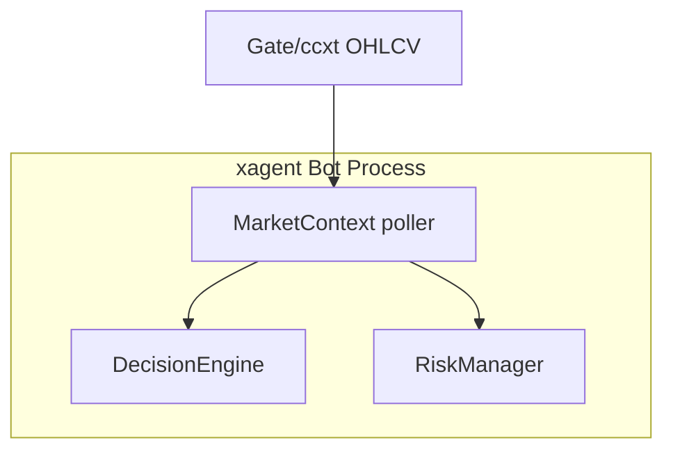
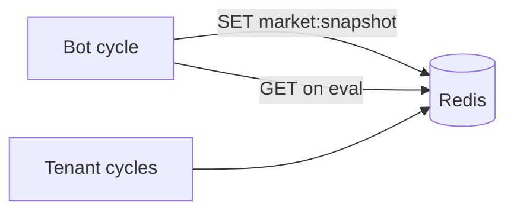
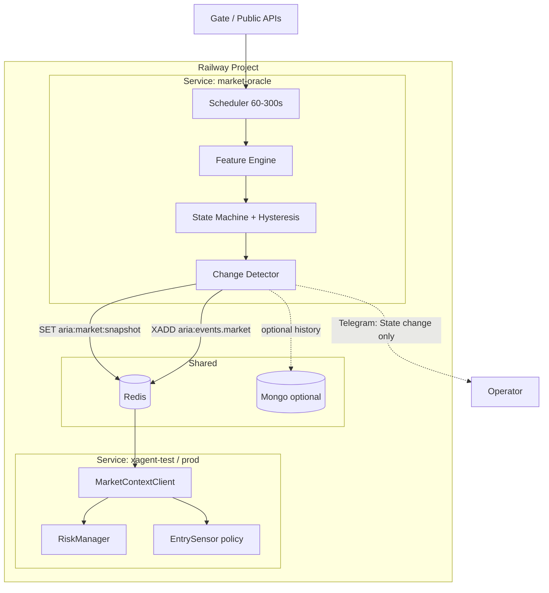

# Arena Review: Crypto-Marktanalyse & Market-Oracle-Service

> **Modus:** Full-Arena (3 Kandidaten + Domain-Tiefgang)  
> **Ziel:** Wie man Crypto-Märkte **systematisch** einschätzt und den Bot **umgebungsbewusst** steuert — inkl. separatem Railway-Service, der den Bot nur bei Änderungen informiert  
> **Branch:** `staging`  
> **Verwandt:** [`market-context-entry-throttle.md`](market-context-entry-throttle.md) · [`arena-signal-optimizations.md`](arena-signal-optimizations.md) · [`ARCHITECTURE_PLAN.md`](../archive/superseded/ARCHITECTURE_PLAN.md)  
> **Erstellt:** 2026-07-17  
> **Status:** Analyse / Architektur-Ticket (noch nicht implementiert)

---

## 0. Operator-Intent (deine Idee)

> Separater Service auf Railway, **getrennt vom Trading-Bot**, der Märkte analysiert und den Bot **nur informiert, wenn sich etwas ändert**.

Das ist ein klassisches **Market Oracle / Regime Service**-Muster:

| Rolle | Verantwortung | Darf **nicht** |
|-------|----------------|----------------|
| **Oracle** | Daten holen, Features bauen, State ableiten, Diffs publizieren | Orders platzieren, Ledger anfassen, Cash ausgeben |
| **Bot** | Oracle-State lesen, Risk/Entries drosseln, handeln | Schweren Market-Scan im Hot-Path |

**Warum das passt:** Restart-Burst und „rote Morgen“-Käufe kommen daher, dass der Bot **pro Coin** optimiert und **kein stabiles globales Weltbild** hat. Ein getrennter Service liefert genau dieses Weltbild — und überlebt Bot-Redeploys.

---

## 1. Domain: Wie man Crypto-Märkte *wirklich* einschätzt

### 1.1 Kernprinzipien (nicht verhandelbar)

1. **Top-down vor Bottom-up**  
   BTC/ETH-Regime und Liquidität **vor** einzelnen Meme-Spikes. Ein 15m-Vol-Spike auf Coin X in einem RISK_OFF-Markt ist oft **Bounce-Falle**, kein Edge.

2. **Mehrere Zeitebenen**  
   | Horizon | Frage | Bot-Wirkung |
   |---------|-------|-------------|
   | **Makro** (Tage–Wochen) | Risk-on/off, Liquidität, Dominanz | Bias: max Exposure, Sensor shadow |
   | **Swing** (4h–1d) | Trend / Range / Breakdown | Mode: MOMENTUM vs GRID vs DEFENSIVE |
   | **Intraday** (15m–1h) | Spike, Fakeout, Session | Entry-Sensor, warm-up |
   | **Mikro** (Tick/1m) | Slippage, Spread | Live-only; Demo egal |

3. **Breadth schlägt Single-Name**  
   Wenn 80 % der Watchlist −5 % ist und *ein* Coin +8 % spikt, ist das selten „der Markt dreht“ — eher Rotation/Short-Cover.

4. **Regime ist sticky**  
   Nicht jede 5-Minuten-Kerze flippt RISK_ON↔OFF. **Hysterese + Min-Dauer** (z. B. 2–6 Bars / 30–60 min), sonst thrash und overtrade.

5. **Signals ≠ Permission**  
   Oracle sagt: *Umgebung*. Bot sagt: *darf ich mit *dieser* Size *diesen* Coin handeln?*  
   Trennung verhindert, dass Sentiment den Ledger überschreibt.

6. **Change-driven, nicht Poll-Spam**  
   Bot braucht keinen Ticker jede Sekunde. Er braucht: *State wechselte RISK_OFF → NEUTRAL um 09:12, size_mult 0.35→0.8*.

### 1.2 Analyse-Schichten (Oracle Feature Stack)

```text
L0  Raw Market Data
    BTC/ETH OHLCV (1h, 4h, 1d), Funding (opt), Open Interest (opt)
    Total Crypto MCap / BTC.D (opt)
    Exchange volume / liquid pairs breadth

L1  Technical Market Structure
    Trend: EMA stack, ADX, HH/HL vs LH/LL
    Momentum: RSI multi-TF, return 24h/7d
    Volatility: ATR%, BB width, realized vol regime
    Structure breaks: 4h close under key MA / prior swing

L2  Cross-Asset & Breadth
    BTC vs ETH beta / relative strength
    Watchlist breadth: % green, median 24h, winners/losers ratio
    Correlation spike (Alles fällt mit BTC)

L3  Sentiment & Positioning (optional, later)
    Fear & Greed, funding extremes, LC aggregate, CMC digests
    (Vorsicht: laggy, gamed, nicht allein entrysperren)

L4  Session / Calendar
    Asia / EU / US overlap, weekend liquidity
    Optional: major event windows (FOMC, ETF flow days) — manuell oder feed

L5  Composite State Machine
    RISK_ON | NEUTRAL | RISK_OFF | CRASH | (optional RECOVERY)
    + size_mult, sensor_policy, max_new_entries_per_hour
    + confidence, as_of, sources[], version
```

### 1.3 State-Definition (Vorschlag für Bot-Steuerung)

| State | Typische Bedingungen (Beispiel, kalibrierbar) | Bot-Policy |
|-------|-----------------------------------------------|------------|
| **RISK_ON** | BTC 24h ≥ 0, 4h trend up, breadth ≥ 55 % grün | Full size, Sensor active, normale Limits |
| **NEUTRAL** | Gemischt / Range | Size 0.7–1.0, Sensor normal oder etwas strenger |
| **RISK_OFF** | BTC 24h ≤ −3 %, oder 4h down + breadth &lt; 35 % grün | Size 0.25–0.4, Sensor **shadow/block**, max 1–2 new buys/h |
| **CRASH** | BTC 24h ≤ −6 % **oder** 1h cascade + high corr | **Keine** neuen Entries; Sells/Stops frei |
| **RECOVERY** | Nach RISK_OFF: BTC rebound + breadth heilt, min 2–4h sticky | Size 0.5, Sensor nur mit EMA-Breakout |

**Wichtig:** Schwellen sind **nicht heilig** — erst paper kalibrieren (siehe §6).

### 1.4 Was *gute* Marktanalyse **nicht** ist

| Anti-Pattern | Warum schlecht |
|--------------|----------------|
| Nur Coin-RSI &lt; 30 → „günstig“ | Ohne Trend = fallendes Messer |
| Nur CMC Votes / X-Hype | Social laggt und amplifying dumps |
| Jede 20s State flippen | Noise → thrash |
| Oracle platziert Orders | Single-Writer Ledger-Bruch, Race mit Bot |
| 20 Datenquellen Tag-1 | Ops-Hölle, silent failures |

### 1.5 Mapping auf *euren* Bot (Ist)

| Heute im Bot | Schicht | Lücke |
|--------------|---------|-------|
| `RegimeDetector` pro Coin | L1 coin-level | Kein **globaler** Market State |
| `StrategyAllocator` exposure_mult | L5 partial | **Risk sized nicht** |
| Entry-Sensor 15m | L3 micro | Kein Market-Gate |
| `btc_underperformance` (DCA) | L2 partial | Nur DCA-Score, kein Entry-Kill-Switch |
| Cash-Floor / max_open | Risk capacity | Timing/Regime fehlt |
| Redis price/OHLCV cache | L0 infra | Gut für Oracle-Input |

**Fazit Domain:** Ihr habt Bausteine für *Coin-Regime*. Es fehlt ein **kanonisches MarketSnapshot-Dokument** + **Policy-Enforcement** im Bot.

---

## 2. Bewertungskriterien (Arena)

| # | Kriterium | Gewicht | Messung |
|---|-----------|---------|---------|
| K1 | **Steuerungswirkung** | 25 % | RISK_OFF stoppt Restart-Burst / rote-Morgen-Käufe spürbar |
| K2 | **Entkopplung & Restart-Robustheit** | 20 % | State überlebt Bot-Redeploy; Oracle unabhängig skalierbar |
| K3 | **Korrektheit / Safety** | 20 % | Keine Order-Schreibrechte im Oracle; Sells nie blocken; Fail-safe |
| K4 | **Ops (Solo + Railway)** | 15 % | Wenig Services, klare Logs, billig, einfach rollback |
| K5 | **Latenz & Change-Effizienz** | 10 % | Bot wird nur bei State-Change „wach“; Poll ≤ 1–5 min ok |
| K6 | **Umsetzbarkeit / Diff-Größe** | 10 % | Phasen, Feature-Flags, Tests |

---

## 3. Kandidaten

### Kandidat A — „In-Process Market Context“

**These:** Alles im bestehenden Bot-Prozess: Modul `intelligence/market_context.py`, Cache im RAM, alle 5 min im Cycle refreshen, Risk liest State.



| Pro | Contra |
|-----|--------|
| Minimaler Ops-Footprint (1 Service) | State stirbt bei jedem Redeploy → Warm-up **muss** im Bot bleiben |
| Schnellste Iteration | Bot-CPU/IO wächst (BTC + breadth + Fear) |
| Kein Netzwerk-Contract | Market-Analyse blockiert/teilt GIL mit Trading |
| Passt zu P1 aus `market-context-entry-throttle` | Deine „separater Service“-Vision nicht erfüllt |

**Score: 7.2 / 10** — Richtiger *erster* Code-Schritt, falsches *Endbild* für Entkopplung.

---

### Kandidat B — „Hybrid: Bot berechnet, Redis ist Source of Truth“

**These:** Berechnung bleibt im Bot (oder Side-Thread), Snapshot wird nach Redis/Mongo geschrieben; alle Instanzen/Tenants lesen; optional Webhook-intern.



| Pro | Contra |
|-----|--------|
| Multi-Worker / Multi-Tenant teilen State | Immer noch Bot rechnet (Last im Trading-Prozess) |
| Restart: Redis kann State halten (TTL) | Kein echter „Analyst-Service“ |
| Baut auf vorhandenem `bus/` auf | Zwei Writer-Gefahr wenn später 2nd service kommt |

**Score: 7.6 / 10** — Gute Zwischenstufe (Persistenz), noch kein getrennter Analyst.

---

### Kandidat C — „Market Oracle Service (Railway)“ ✅ WINNER (Zielarchitektur)

**These:** Eigener Railway-Service `xagent-market-oracle` (oder `market-context`):

1. Holt periodisch L0–L2 Daten (BTC, optional ETH, Watchlist-Breadth aus shared Config/Mongo).
2. Berechnet `MarketSnapshot` + State-Machine mit Hysterese.
3. Schreibt **kanonischen Snapshot** (Redis key + optional Mongo history).
4. **Nur bei State- oder Policy-Änderung:** Event publishen (Redis Stream / PubSub) + optional Telegram an Operator.
5. Bot **subscribed / pollt** leichtgewichtig und setzt Policy (size, sensor, block entries).



| Pro | Contra |
|-----|--------|
| Entspricht deiner Idee 1:1 | Zweiter Service = Deploy/Env/Logs |
| Bot bleibt schlank; Analyse skaliert separat | Contract-Versionierung nötig |
| State überlebt Bot-Restart | Fail-open vs fail-closed Policy |
| Change-only Alerts (kein Spam) | Watchlist-Breadth braucht Shared Config |
| Klare Security: Oracle hat **keine** Trading-Keys | Etwas mehr Latenz (ok: 1–5 min) |

**Score: 8.8 / 10** — Winner als **Zielbild**; mit **Phased Admission** (A→B→C).

---

## 4. Arena-Fazit

| Kandidat | Score | Rolle |
|----------|-------|-------|
| A In-Process | 7.2 | **Phase 0/1** Schnellgewinn (Warm-up + BTC-Gate im Bot) |
| B Hybrid Redis | 7.6 | **Phase 1.5** Persistenz + Multi-Tenant Share |
| **C Oracle Service** | **8.8** | **Zielarchitektur** (dein Railway-Service) |

### Winner-Strategie: **C mit A als Bootstrapping**

Nicht C am Tag 1 bauen und riskieren, dass Enforcement im Bot fehlt.

```text
Phase 0  Config knobs (sensor shadow an roten Tagen)     — sofort
Phase 1  In-Process MarketContext + Risk enforcement     — P1 Ticket
Phase 1.5 Snapshot nach Redis (gleiches Schema)          — B
Phase 2  Oracle Service schreibt dasselbe Schema         — C
Phase 3  Bot nur noch Client; Bot-Poll-Compute optional aus
Phase 4  /market + Telegram change-only + History
```

**Admission Gate vor Phase 2:** Schema stabil, Risk-Enforcement grün auf Staging, 7 Tage Metrics.

---

## 5. Ziel-Contract: `MarketSnapshot` (v1)

Kanonisches JSON — **eine** Wahrheit für Bot + Oracle + Telegram:

```json
{
  "schema_version": 1,
  "as_of": "2026-07-17T07:42:00Z",
  "state": "RISK_OFF",
  "previous_state": "NEUTRAL",
  "state_changed_at": "2026-07-17T07:40:12Z",
  "confidence": 0.72,
  "hysteresis": {
    "bars_in_state": 4,
    "min_bars_to_flip": 3
  },
  "policy": {
    "size_mult": 0.35,
    "block_new_entries": false,
    "block_sensor_entries": true,
    "sensor_mode": "shadow",
    "max_new_buys_per_hour": 2,
    "allow_dca": true,
    "dca_size_mult": 0.5
  },
  "features": {
    "btc": {
      "symbol": "BTC/USDT",
      "ret_1h_pct": -0.8,
      "ret_24h_pct": -3.6,
      "ret_7d_pct": -5.1,
      "rsi_4h": 38.2,
      "trend_4h": "down",
      "atr_pct_1d": 2.4
    },
    "breadth": {
      "universe": "union_watchlist",
      "n": 40,
      "pct_green_24h": 28.0,
      "median_ret_24h_pct": -4.2,
      "pct_below_neg5": 55.0
    }
  },
  "rationale": [
    "BTC 24h -3.6% ≤ risk_off threshold -3.0%",
    "breadth 28% green < 35%"
  ],
  "sources": ["gate_ohlcv", "watchlist_quotes"],
  "producer": "market-oracle",
  "producer_build": "git:abc1234"
}
```

### Redis Keys (Vorschlag)

| Key / Stream | Inhalt | TTL |
|--------------|--------|-----|
| `aria:market:snapshot` | aktuelles JSON | 15–30 min (refresh earlier) |
| `aria:market:snapshot:prev` | vorheriger State (Diff) | 24 h |
| `aria:events.market` | Stream: nur Changes | trim ~1000 |
| optional Mongo `market_snapshots` | History für Research | 90 d |

### Change-Detection (wann Bot/Telegram „klingeln“)

Publish Event **nur wenn** eines gilt:

- `state` geändert  
- `policy.block_*` geändert  
- `policy.size_mult` Δ ≥ 0.15  
- `confidence` Drop unter 0.4 (Datenfaulheit)

Heartbeat optional alle 15 min ohne Spam an Telegram.

---

## 6. Oracle Service — Design Details

### 6.1 Runtime

| Item | Empfehlung |
|------|------------|
| Host | Railway **zweiter Service** im gleichen Project (shared Redis/Mongo env) |
| Language | Python 3.12+ (same monorepo package `services/market_oracle/` oder kleines Image) |
| Process | Long-running loop **oder** Railway Cron alle 2–5 min (Cron einfacher, Loop besser für Streams) |
| Secrets | **Nur** public market data keys wenn nötig; **keine** Gate Trading API keys |
| CPU | low; 1 Replica reicht |
| Health | `/health` + last `as_of` age |

### 6.2 Datenquellen (Priorität)

| Prio | Quelle | Nutzen | Risiko |
|------|--------|--------|--------|
| P0 | Gate/ccxt BTC(+ETH) OHLCV | Trend/Returns | Rate limits — cache |
| P0 | Watchlist Preise (Batch) | Breadth | Braucht Symbol-Liste |
| P1 | Redis price cache (vom Bot) | Weniger API | Kann stale sein |
| P2 | Fear & Greed API | Sentiment | Single point, lag |
| P3 | Funding / OI | Leverage stress | Complex |
| P3 | On-chain | Smart money | Teuer, langsam |

**Tag-1 Scope:** P0 only. P2+ nur wenn P0 stabil.

### 6.3 Watchlist-Breadth ohne Bot-Kopplung

Optionen:

1. **Shared Mongo/Config** `watchlists` collection / `config.json` mirror  
2. Redis `aria:watchlist:union` den Bot periodisch schreibt (Bot bleibt Writer der Liste, Oracle nur Reader)  
3. Feste Core-Universe: Top-30 Gate USDT by volume (Oracle-autark, weicht von Bot-Watchlist ab)

**Empfehlung:** (2) Union-Watchlist Key vom Bot + (3) Fallback Core-Universe wenn Key fehlt.

### 6.4 Fail-Safe (kritisch)

| Situation | Bot-Verhalten (empfohlen) |
|-----------|---------------------------|
| Snapshot älter als 20 min | Treat as **NEUTRAL**, `size_mult=0.5`, log WARNING — oder fail-closed entries if config |
| Redis down | In-Process fallback (Phase 1 Modul) oder last-known + degrade |
| Oracle crashed | Bot warm-up + conservative defaults; **Sells immer erlaubt** |
| Conflicting producers | `producer` field + single writer lock / only Oracle writes after Phase 2 |

**Niemals:** Oracle schreibt Orders. **Niemals:** Oracle blockiert Sells.

### 6.5 Security / Isolation

```text
Oracle  → Redis, public market APIs, optional Mongo read/write snapshots
Oracle  ✗ Gate API trading keys
Oracle  ✗ Telegram bot token (optional read-only notify bot OK)
Bot     → Redis read snapshot, full trading stack
```

### 6.6 Observability

- Log: `[MarketOracle] state=RISK_OFF→CRASH size_mult=0.35 conf=0.8`
- Metric: state duration histogram, refresh latency, API errors
- Telegram: **nur** State-Change (max 1–2/h rate limit)
- Bot `/market`: liest Snapshot, zeigt Ampel + rationale

---

## 7. Bot-Integration (was der Bot *machen* muss)

Auch mit Oracle bleibt Enforcement **im Bot** (Single Writer für Risk/Trades):

| Hook | Aktion |
|------|--------|
| `RiskManager` vor BUY | `size *= policy.size_mult`; reject if `block_new_entries` |
| Entry-Sensor | if `block_sensor_entries` or `sensor_mode=shadow` → no live BUY |
| Eval-Queue seed | optional: skip stale fan-out under CRASH |
| Startup | Warm-up lokal (Prozesszeit) **plus** Oracle-State (überlebt Restart besser) |
| Telegram `/market` | Snapshot pretty-print |
| Morning briefing | State + BTC 24h + breadth |

Warm-up bleibt **lokal sinnvoll** (RAM-Cooldowns leer), Oracle deckt **Markt** ab — beides ergänzt sich.

---

## 8. Wie man die Analyse *kalibriert* (damit sie nicht Esoterik bleibt)

### 8.1 Offline Research Loop

1. 90–180 Tage BTC 1h/4h + eure Demo-Order-History  
2. Label retrospektiv: wann war RISK_OFF sinnvoll?  
3. Sweep Schwellen (`btc_risk_off_24h_pct`, breadth)  
4. Metriken:
   - **Entry-Rate** unter RISK_OFF (soll sinken)
   - **Max drawdown** der neu geöffneten Lots in 24h nach Entry
   - **False CRASH** (zu oft flat → verpasste Rallies)
   - **Flip-Rate** States/Tag (soll &lt; 6–10)

### 8.2 Paper Admission (7 Tage Staging)

| Gate | Ziel |
|------|------|
| State flips / day | ≤ 10 |
| Oracle lag (as_of age) | p95 &lt; 6 min |
| New buys during CRASH | 0 |
| New sensor buys during RISK_OFF | 0 (wenn block_sensor) |
| Sell path regression | keine |
| Operator Telegram spam | ≤ 5 state msgs/day typical |

### 8.3 Was du manuell weiter tust (Oracle ersetzt dich nicht)

- News-Schocks (Exchange hack, ETF rejection) → manuell CRASH override  
- Wochenende / dünne Liquidität → size down  
- „Ich will heute aggressiv testen“ → Feature-Flag `market_context.force_state`

---

## 9. Vergleich: „Mega-Analyse im Bot“ vs „Oracle Service“

| Dimension | Alles im Bot | Separater Oracle |
|-----------|--------------|------------------|
| Redeploy Bot | Markt-State verloren | State bleibt |
| Komplexität Analyse | belastet Trading-Prozess | isoliert |
| Team/Ops Solo | einfacher | +1 Service |
| Change-only Notify | möglich, aber gemischt | sauber |
| Zukunft (mehr Bots, Henry-only rules) | schwer | ein Snapshot, viele Consumer |
| Deine Vision | nein | **ja** |

**Urteil:** Domain-Analyse und Policy gehören konzeptionell **raus** aus dem Hot-Path; Enforcement **rein** in den Bot. Oracle = Analyst, Bot = Trader.

---

## 10. Empfohlene Roadmap (konkret)

### Sprint 0 — Ops / Config (0–1 Tag)

- [ ] Rote-Tage-Runbook (Sensor shadow, Spike 2.5+, daily buys)  
- [ ] Ticket verlinken: `market-context-entry-throttle.md`

### Sprint 1 — Enforcement first (Bot)

- [ ] `MarketSnapshot` Schema + In-Process Producer (BTC + optional breadth)  
- [ ] Risk + Sensor policy hooks  
- [ ] Warm-up  
- [ ] Unit tests + Staging verify  
- [ ] Redis write optional (prepare for Oracle)

### Sprint 2 — Oracle Service (Railway)

- [ ] Neuer Service `market-oracle` im Monorepo (`services/market_oracle/` + Dockerfile/Procfile)  
- [ ] Shared Redis; write snapshot + stream on change  
- [ ] Bot: `MarketContextClient` prefer Redis, fallback local  
- [ ] Health endpoint + change Telegram  
- [ ] **Keine** Trading keys im Service

### Sprint 3 — UX + History

- [ ] `/market`  
- [ ] Morning briefing line  
- [ ] Mongo history for post-mortems  
- [ ] Optional Fear&Greed as soft feature

### Sprint 4 — Research

- [ ] Backtest threshold sweep  
- [ ] RECOVERY state  
- [ ] Per-tenant policy overlays (Henry vs default) nur wenn nötig

---

## 11. Nicht im Scope (bewusst)

- Oracle entscheidet einzelne Coins (bleibt DecisionEngine)  
- ML-Preisprognose Tag-1  
- On-chain heavy stack  
- Multi-exchange arb  
- Oracle mit Gate trading API  

---

## 12. Risiken & Gegenmaßnahmen

| Risiko | Gegenmaßnahme |
|--------|----------------|
| Zweiter Service down | Bot fallback + conservative policy |
| Schema drift Bot/Oracle | `schema_version`, shared pydantic model package |
| Breadth teuer/API limit | Batch prices, cache, 5 min refresh |
| Over-blocking (verpasste Rallies) | RECOVERY state, size not full block in RISK_OFF |
| Operator ignore | `/market` + change alerts |
| Doppelte Producer | Phase 2: only Oracle writes; Bot read-only |

---

## 13. Arena-Scorecard (final)

| Kriterium | A | B | C |
|-----------|---|---|---|
| Steuerungswirkung | 8 | 8 | 9 |
| Entkopplung/Restart | 4 | 7 | 10 |
| Safety | 8 | 8 | 9 |
| Ops Solo | 9 | 7 | 6 |
| Change-Effizienz | 6 | 7 | 9 |
| Umsetzbarkeit | 9 | 7 | 6 |
| **Gewichteter** | **7.2** | **7.6** | **8.8** |

### Winner: **Kandidat C (Market Oracle Service)** als Ziel  
### Start: **Kandidat A/B** als Enforcement-Bootstrapping  

**Ein-Satz-Fazit:**  
Analysiere den Markt **top-down** (BTC → Breadth → Sentiment), fasse ihn in einen **versionierten Snapshot mit Policy** und **Hysterese**, publiziere **nur Änderungen** aus einem **eigenen Railway-Oracle**, und lass den Bot **nur enforcen** — nie den Oracle handeln.

---

## 14. Nächster konkreter Schritt

1. Dieses Dokument reviewen (du).  
2. Sprint 1 aus `market-context-entry-throttle.md` + Schema aus §5 implementieren.  
3. Parallel Railway Service Skeleton (health + BTC-only snapshot) hinter Feature-Flag.  
4. Erst wenn Policy greift: Bot-Compute abschalten, Oracle sole producer.

---

## Ticket-Metadaten

| Feld | Wert |
|------|------|
| Titel | Arena: Market Oracle Service + Crypto Market Analysis Framework |
| Typ | architecture / feature |
| Priorität | P1 Zielbild; P0/P1 Bot-Enforcement zuerst |
| Abhängigkeit | `plans/market-context-entry-throttle.md` |
| Erstellt | 2026-07-17 |
