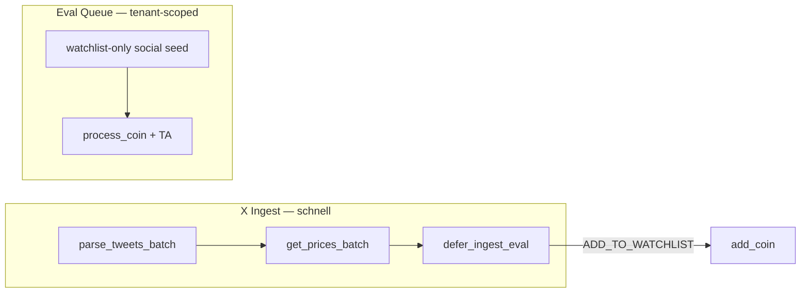

# Arena Review: Signal-Pipeline Optimierungen (Phase 5)

> **Modus:** Light-Arena (3 Kandidaten)  
> **Ziel:** X/CMC/LC-Signale schneller und tenant-sauber verarbeiten, ohne Qualitäts-Regression  
> **Branch:** `staging`  
> **Basis:** Signal-Analyse 2026-07-14 (shared fetch, snapshot, eval-queue)  
> **Erstellt:** 2026-07-14

---

## Bewertungskriterien (gewichtet)

| Kriterium | Gewicht | Messung |
|-----------|---------|---------|
| Ingest-Latenz (X-Zyklus) | 30% | Preis-Calls, OHLCV bei neuen Posts |
| Worker-Effizienz (Eval-Queue) | 25% | Jobs nur für handelbare Coins |
| Multi-Tenant-Konsistenz | 20% | Union-Watchlist, Snapshot-Scope |
| Verhaltens-Stabilität | 15% | Keine doppelte TA, Telegram/Watchlist ok |
| Umsetzbarkeit | 10% | Kleiner Diff, config-driven |

---

## Kandidat A — „Batch Only“

**These:** Nur `get_prices_batch` in `process_new_posts` + Watchlist-Filter in `seed_meta_producers`.

| Pro | Contra |
|-----|--------|
| Minimaler Diff (~25 Zeilen) | `track_and_recommend` → volle `evaluate()` bleibt |
| Null Verhaltens-Risiko | Background-Loop Union-Watchlist offen |
| Schnell deploybar | LC JSON-Read bei Snapshot-Miss |

**Score: 7.0 / 10** — P1 erledigt, P2-Bottlenecks bleiben.

---

## Kandidat B — „Full Defer“

**These:** A + `evaluate()` komplett aus X-Ingest entfernen + Union überall + LC mtime-Cache.

| Pro | Contra |
|-----|--------|
| Maximaler Performance-Gewinn | Sofort-Telegram-Empfehlungen nur noch ADD_TO_WATCHLIST |
| Kein doppeltes OHLCV | Operator verliert synchrone X-BUY-Alerts bis Eval-Worker läuft |
| Saubere Trennung Ingest/Trade | Größerer Vertrauens-Sprung für Nutzer |

**Score: 7.8 / 10** — Zu aggressiv für Notification-Pfad.

---

## Kandidat C — „Hybrid Defer + Gate“ ✅ WINNER

**These:** Batch-Preise + Eval-Queue nur Watchlist-Coins + `defer_ingest_eval` (config, default `true`) + Union-Watchlist im Background bei Multi-Tenant + LC mtime-Cache.



| Pro | Contra |
|-----|--------|
| Eliminiert N+1 Preis-Calls | TA-Empfehlung verzögert (~eval_meta_interval) |
| Henry: keine Social-Jobs für Trending-Only | `defer_ingest_eval: false` für Legacy-Verhalten |
| Snapshot/Background konsistent (Union) | LC-Cache invalidiert bei externem File-Write |
| Eval-Queue = Single Source für TA-Trades | — |

**Score: 8.9 / 10**

---

## Arena-Fazit — Winner: Kandidat C

**Implementiert:**

1. `process_new_posts` → `get_prices_batch` (ein Call pro Zyklus)
2. `seed_meta_producers` → Social-Jobs nur wenn Symbol auf Tenant-Watchlist
3. `x_performance.defer_ingest_eval: true` → kein `evaluate()` im Ingest
4. `background_runtime._loop` → `union_tenant_watchlists()` wenn Multi-Tenant
5. `load_lc_signals` → mtime-Cache

**Verworfen:**

- Kandidat B ohne config-Toggle (Notification-Regression)
- Per-Tenant Signal-Slicing im Snapshot (Overhead > Nutzen bei `_signals_for_coin`)

**Admission Gate (Paper, 7 Tage):**

- Median X-Ingest < 2s bei 5+ neuen Posts
- Eval social-Jobs für Henry ≤ 4 Symbole/Zyklus
- Keine Regression: `ADD_TO_WATCHLIST` + eval_worker `social_x` weiter aktiv

---

## Config

```json
"x_performance": {
  "defer_ingest_eval": true
}
```

Setze `false` nur wenn synchrone Telegram-TA-Empfehlungen beim Post-Ingest benötigt werden.