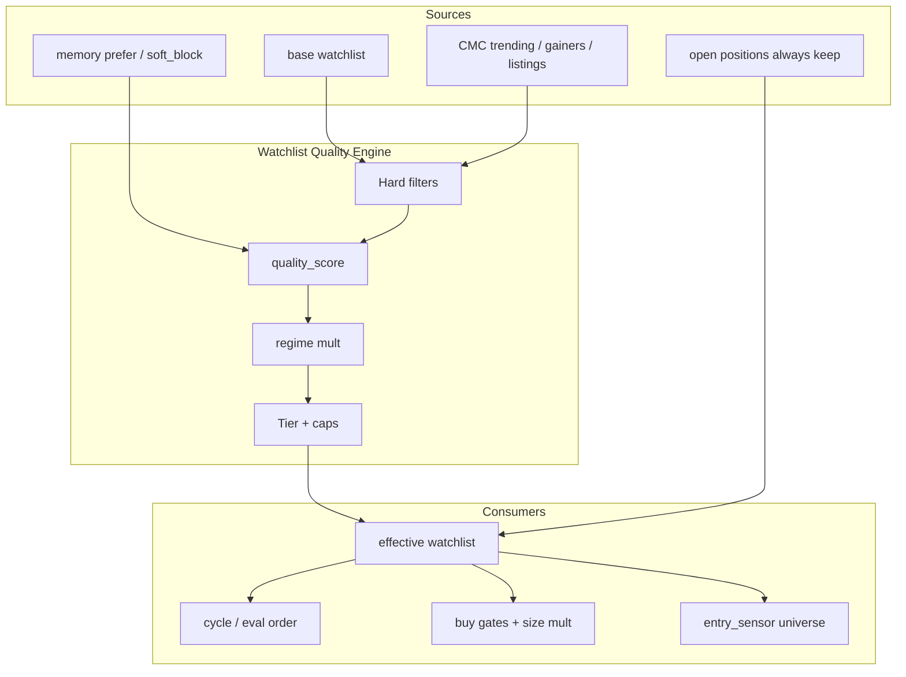

# Arena: Watchlist-Qualität für bessere Signale & Kaufentscheidungen

> **Modus:** Full-Arena (Research + 3 Kandidaten + Winner + PR-Plan)  
> **Datum:** 2026-07-25 · **Update:** Memory→WQE-Schnitt + Epic (2026-07-25)  
> **Branch-Basis:** `staging`  
> **Working branch:** [`epic/wqe-124-watchlist-quality-engine`](https://github.com/jholze/xagent-trading-bot/tree/epic/wqe-124-watchlist-quality-engine)  
> **Scope:** **Plan + Epic/Tickets** — Implementation erst nach Freigabe PR1  
> **Ziel:** Deutlich bessere **Universe-Selektion** → höhere Signal-Qualität → bessere **BUY**-Entscheidungen  
> **Nicht-Ziel:** Jarvis, Order-Ledger-v2, reines UI-Kosmetik, Hand-Picked Coins  
> **Epic:** [`epic-watchlist-quality-engine.md`](epic-watchlist-quality-engine.md) · GitHub **[#124](https://github.com/jholze/xagent-trading-bot/issues/124)** · Children #125–#130  
> **Verwandt:** `coin_eligibility.py`, `dry_run_watchlist.py`, `cmc_trending_provider.py`, `entry_sensor_15m`, `intelligence/memory/*`, `sensor-entry-guard-master.md`, `dca-cmc-trending-rollout.md`, `market-context-entry-throttle.md`, `arena-signal-optimizations.md`, `trading-memory-hermes.md`

---

## 0. Executive Summary

| Frage | Antwort |
|-------|---------|
| Problem | Die effektive Watchlist mischt **Base + Expansion + CMC-Trending-Overlay** mit schwachen Qualitätsfiltern → viel **Noise**, dünne Venue, Trending-Hype ohne Liquidität/Regime-Fit |
| Wirkung | Eval-Queue und Sensor scannen **falsche Coins** → schlechte/teure Signale, Kapazitätsverschwendung, schlechtere Buys |
| Industrie 2025/26 | **Tiered universe**, ruthlessly filter **real volume + depth**, **regime-aware** inclusion, multi-factor score, wash-trade awareness |
| Heute im Bot | Gate „Preis > 0“, MCap/ATR-Profile-Filter, CMC trending rank, exclude BTC/ETH/SOL, max 15–18 coins |
| Zielbild | **Quality-scored multi-tier watchlist** als Single Source für Scan-Order, Buy-Gates und Sensor-Universe |
| Heute liefern | Dieser Arena-Plan; Implementation erst nach Freigabe |

**Leitprinzip:**  
*Watchlist ist kein „was ist gerade heiß“, sondern „was ist **handelbar, liquid, regime-fit und signal-würdig**“.*

---

## 1. Intensive Recherche — Stand der Kunst (2024–2026)

### 1.1 Warum Watchlist = Signalqualität

Systematische Crypto-Strategien scheitern seltener an „falschem RSI“ als an **Universe-Bias**:

1. **Illiquidität** → Slippage, Fake-Breakouts, Sensor-Spikes ohne Follow-through (siehe BDX-Klasse).  
2. **Wash / inflated volume** → Trending-Listen lügen über echte Nachfrage.  
3. **Regime-Mismatch** → Momentum-Trending in Chop/Bear erzeugt Overtrading.  
4. **Capacity** → Zu viele Coins pro Zyklus → dünne TA-Qualität, Eval-Queue-Lags.  
5. **Narrative-Rotation** → Reine CMC-Hype-Listen ohne Quality-Score rotieren zu schnell (Churn).

Literatur & Praxis (komprimiert):

| Quelle / Praxis | Kernaussage |
|-----------------|-------------|
| Regime-adaptive TSMOM / Futures frameworks (2025–26 arXiv-Strang) | Universe monthly re-rank by mcap + momentum Sharpe; regime split verbessert Sharpe deutlich |
| Quant-Practitioner (Trality, systematic alts) | Start broad (top 100–300), filter ruthlessly on volume, spread, turnover |
| Memecoin / DEX research | Extra floors: pool liquidity, age, anomalous volume patterns |
| Institutional post-ETF context | Top-liquid assets korrelieren stärker mit Macro; Long-Tail bleibt manipulation-anfällig |
| HMM / GMM / WK-means regime papers | Regime detection ist table stakes; gleiche Signale in Bull vs Chop = Müll |

### 1.2 Best-Practice-Stack für eine „gute“ Crypto-Watchlist

```text
BROAD UNIVERSE (CEX listed + optional DEX leaders)
        │
        ▼
HARD FILTERS (must-pass)
  · Venue listed + tradeable
  · 24h real quote volume floor
  · Spread / depth proxy
  · Market cap band (strategy-dependent)
  · Age / blacklist / scam flags
        │
        ▼
SOFT SCORE (rank)
  · Liquidity score
  · Momentum / structure quality
  · Narrative / social quality (de-noised)
  · On-chain health (optional)
  · Memory lesson bias (soft_block / prefer)
  · Regime fit (bull/chop/bear weight)
        │
        ▼
TIER ASSIGNMENT + CAPS
  T0 Core always (optional BTC/ETH — heute oft excluded by design)
  T1 Liquid quality alts (scan every cycle)
  T2 Narrative / trending (capped, reduced size)
  T3 Speculative / sensor-only (strict gates or off)
        │
        ▼
SCAN ORDER + BUY GATES
  positions first → T1 by score → T2 capped → never raw CMC dump
```

### 1.3 Konkrete Filter-Schwellen (Orientierung, später kalibrieren)

| Filter | Orientierungsband (Spot Gate, Retail–Semi) | Zweck |
|--------|--------------------------------------------|--------|
| 24h quote volume | ≥ **$500k–2M** für normale Buys; Sensor strenger oder Venue-Gate | Blowups vermeiden |
| Bid-ask spread | < **0.5–1.5 %** (wenn Orderbook verfügbar) | Slippage |
| MCap | ≥ **$5–20M** (Profil-abhängig); Upper optional | Rug/thin |
| Turnover vol/mcap | 1–50 % Band (zu niedrig = tot, zu hoch = pump) | Qualität |
| Position vs vol | Position ≤ **5–10 %** des 24h-Vol | Capacity |
| Refresh | Trending **1–4 h**; Quality-Score **pro Zyklus/stündlich** | Churn vs Frische |

### 1.4 Regime-Layer (Must für 2026)

| Regime (BTC/Fusion-Proxy) | Watchlist-Politik |
|---------------------------|-------------------|
| **Bull / risk-on** | T2 Trending-Anteil höher; Volatile alts erlaubt |
| **Chop / neutral** | T1 betonen; Trending-Cap senken; Sensor drosseln |
| **Bear / risk-off** | Universe schrumpfen; nur deep liquidity; neue Trending-Buys hart drosseln |
| **Sensor warmup / fusion block** | Keine neuen T2/T3 Entries (existiert teils schon) |

Eure Fusion/Oracle/Santiment-Pipeline ist der **natürliche Regime-Input** — heute kaum an die Watchlist-Zusammensetzung gekoppelt.

### 1.5 Signal-Qualität ≠ mehr Quellen

Mehr CMC/LC/X auf schlechten Coins = **mehr schlechte Signale**.  
Besser: **weniger Coins, höhere Priorität, strengere Venue**, dann Signale (TA + CMC fusion + Sensor) auf einem sauberen Universe.

---

## 2. Ist-Zustand im xagent-Bot (Code-Audit)

### 2.1 Wie die Effective Watchlist entsteht

```text
load_watchlist (base / tenant)
  + dry_run_expansion (optional)
  + dry_run_overlay OR cmc_trending_overlay
  → gate_only prune (Preis > 0 via batch)
  → filter_watchlist_coins (coin_eligibility / profile filters)
  → order_watchlist_positions_first (Open Positions vorn)
```

**Quellen:** `data_manager.load_effective_watchlist`, `services/dry_run_watchlist.py`, `data/cmc_trending_provider.py`, `core/coin_eligibility.py`, `core/cycle_order.py`.

### 2.2 Was gut ist

| Stärke | Detail |
|--------|--------|
| Multi-Source | Base + Trending Overlay + Expansion |
| Gate-Only | Nicht-listbare Symbole fliegen raus |
| Profile filters | MCap, ATR, class, vol tier, source blocks |
| Positions first | Sell-Reaktionen priorisiert |
| CMC source_priority | trending → gainers → listings fallback |
| Listings fallback | mcap band + volume + pct change clamps |
| Trending fusion | RSI cap, size pct, volatile tier require |
| Sensor entry guard | Venue/memory path (nach BDX) — **downstream** |

### 2.3 Lücken (Root Causes für schlechte Buys)

| Lücke | Heute | Wirkung |
|-------|-------|---------|
| **Liquidity = Preis > 0** | Gate-Prune | Dünne Bücher bleiben drin |
| **Kein Quality-Score** | Rank ≈ CMC trending rank | Hype > Handelbarkeit |
| **Kein Regime-Cap** | max_coins fix 15–18 | Bull/Chop gleiche Listengröße |
| **Trending mischt sich mit Base** | Dedupe, aber gleiche Scan-Rechte | Noise verdrängt Quality |
| **Kein Tiering** | Flat list | Sensor/Eval behandelt alles gleich |
| **Social/LC oft aus** | lc_weight 0, lunarcrush disabled | Score-Dimension brach |
| **Memory soft_block spät** | n≥3 | Watchlist-Inclusion lernt langsam |
| **Churn** | refresh 1h + prune base optional | Watchlist-Jitter, Strategie-Inkonsistenz |
| **BTC/ETH/SOL excluded** | Design | Kein „anchor“ für relative strength (optional bewusste Wahl) |
| **Scan-Order** | nur positions-first | Kein Score-Sort für neue Entries |
| **Buy-Path vs Watchlist-Path** | getrennte Filter-Kontexte | Coin auf WL, aber Buy-Filter anders (gut) — aber WL zu weit |

### 2.4 Gemessene/bekannte Symptome (Staging-Erfahrung)

- Viele Open-Slots / max_open-Druck mit Trending-Coins.  
- Sensor- und CMC-only-Buys auf schwachen Venues (historisch BDX-Klasse).  
- Portfolio fühlt sich „beschäftigt“ an, ohne dass Edge klar ist.  
- Eval-Queue und Cycle-Zeit skalieren mit **Universe-Größe × OHLCV**.

---

## 3. Arena-Kandidaten

### Bewertungskriterien

| Kriterium | Gewicht |
|-----------|---------|
| Erwartete Verbesserung Buy-Qualität / weniger Blowups | 30 % |
| Signal-SNR (weniger Noise-Jobs) | 20 % |
| Fit zu bestehendem Stack (CMC, Gate, Sensor, Memory, Fusion) | 20 % |
| Umsetzbarkeit (PRs, Risiko, Rollback) | 15 % |
| Messbarkeit (Metriken, Shadow-Mode) | 15 % |

---

### Kandidat A — „Hard Floors Only“

**These:** Nur Venue-Liquiditäts-Gates verschärfen (24h vol, optional spread), max_coins senken, CMC-Trending-Cap.

| Pro | Contra |
|-----|--------|
| Kleiner Diff, schneller Wins | Kein Ranking → immer noch „zufällige“ Top-N |
| Direkt gegen BDX-Klasse | Regime ignoriert |
| Rollback trivial | Keine Memory/Narrative-Integration |

**Score: 6.8 / 10**

---

### Kandidat B — „Scored Multi-Tier Watchlist“ ✅ **WINNER**

**These:** Neuer **Watchlist Quality Engine (WQE)**:

1. Hard filters (vol, mcap, gate, blacklist).  
2. Composite **quality_score** ∈ [0,1].  
3. **Tiers T1/T2/T3** mit Caps und Buy-Rechten.  
4. **Regime-Multiplikatoren** aus Fusion/Oracle.  
5. Scan-Order = positions → T1 score → T2 score.  
6. Shadow-Mode: Score loggen, Verhalten 48 h nur beobachten.



| Pro | Contra |
|-----|--------|
| Adressiert Noise + Liquidity + Regime | Mehr Design/Code als A |
| Nutzt vorhandene CMC/Memory/Fusion | Score-Tuning nötig |
| Messbar (score distribution, hit-rate) | Shadow-Phase vor Enforce |
| Passt zu Sensor-Guard (Venue-Floors shared) | — |

**Score: 9.1 / 10**

---

### Kandidat C — „LLM Universe Curator“

**These:** LLM kuratiert wöchentlich Narrative-Coins aus CMC+News.

| Pro | Contra |
|-----|--------|
| Narrative-Edge | Latency, Cost, Non-Determinismus |
| Modern 2026 Story | Schlecht als **primärer** Liquidity-Gate |
| | Hard filters trotzdem nötig |

**Score: 5.5 / 10** als Primary; **optional Phase-3 Soft-Feature** auf T2.

---

## 4. Winner-Design: Watchlist Quality Engine (WQE)

### 4.1 Datenmodell (Vorschlag)

Pro Coin im Overlay / effective list:

```json
{
  "symbol": "ARIA/USDT",
  "tier": "T1",
  "quality_score": 0.72,
  "scores": {
    "liquidity": 0.8,
    "momentum": 0.6,
    "narrative": 0.5,
    "memory": 0.7,
    "regime_fit": 0.75
  },
  "metrics": {
    "quote_vol_24h": 1200000,
    "mcap_usd": 45000000,
    "spread_pct": 0.4,
    "atr_pct": 4.2,
    "cmc_rank": 8,
    "source": "cmc_trending"
  },
  "flags": ["gate_ok", "vol_ok"],
  "updated_at": "ISO-8601"
}
```

Persistenz: erweitertes `watchlist.cmc_trending_overlay.json` / Mongo doc **oder** neue Collection `watchlist_scores` (tenant-scoped). Base-Watchlist unverändert als Input.

### 4.2 Hard Filters (must-pass für T1/T2 Buys)

| Gate | Default-Vorschlag | Config-Key |
|------|-------------------|------------|
| Gate listed + price > 0 | keep | existing |
| `quote_vol_24h_min_usd` | 750_000 (T1), 1_500_000 (Sensor-Buy) | `watchlist_quality.vol_floors` |
| `spread_pct_max` | 1.2 (wenn book verfügbar) | `watchlist_quality.spread_max` |
| mcap | profile filters | existing + tighten |
| blacklist / phantom | existing | keep |
| memory soft_block | block **new** trending adds | `watchlist_quality.honor_memory_soft_block` |

### 4.3 Quality Score (initial, transparent)

```text
quality = w_L * liquidity
        + w_M * momentum_structure
        + w_N * narrative_cmc
        + w_Mem * memory_bias
        + w_R * regime_fit
```

| Component | Input (vorhanden / leicht) | w start |
|-----------|----------------------------|---------|
| liquidity | log(vol_24h), optional spread | 0.35 |
| momentum_structure | 24h/7d change clamps, nicht nur rank | 0.20 |
| narrative_cmc | inverse trending rank, source weight | 0.15 |
| memory_bias | prefer +0.15, soft_block −0.4 | 0.15 |
| regime_fit | fusion size_mult / sensor_policy map | 0.15 |

**Keine Black-Box-ML in V1** — erklärbare Weights, config-driven.

### 4.4 Tiers & Caps

| Tier | Bedeutung | Cap (Beispiel) | Buy-Rechte |
|------|-----------|----------------|------------|
| **POS** | Open positions | unlimited keep | Sells/DCA only path |
| **T1** | Quality liquid | 8–12 | Full TA + CMC fusion + Sensor |
| **T2** | Trending / narrative | 4–8 | Reduced size (`trending_trade_size_pct`), strengere RSI |
| **T3** | Speculative | 0–3 or off | Default **off** for buys; observe-only |

Regime-Beispiel:

| Fusion/Sensor | T1 max | T2 max | T3 |
|---------------|--------|--------|-----|
| risk-on | 12 | 8 | 2 |
| neutral | 10 | 4 | 0 |
| risk-off / block | 8 | 0–2 | 0 |

### 4.5 Scan-Order (ersetzt reines CMC-Dump)

```text
1. Open positions (any tier)
2. T1 by quality_score desc
3. T2 by quality_score desc
4. Never scan dropped/hard-fail coins
```

### 4.6 Buy-Entscheidung — Kopplung

| Path | Änderung |
|------|----------|
| `signal_orchestrator` / TA buy | Require `tier in {T1,T2}` + score ≥ `min_buy_score` |
| CMC-only buy top N | Nur T2 mit score floor; top N nach **score** nicht raw rank |
| `entry_sensor_15m` | Universe = T1 ∪ (T2 if score≥x); Venue floors shared mit WQE |
| DCA | Open position path unberührt (POS) |
| Manual buy | Unverändert oder soft warn |

### 4.7 Observability (ohne UI-Ballast)

Log pro Sync-Zyklus:

- `watchlist_quality_sync`: n_in, n_hard_fail, n_T1/T2, score p50/p90  
- `buy_block_watchlist_quality`: symbol, score, tier, reason  
- Optional Telegram `/watchlist` um Score/Tier zu zeigen (später)

### 4.8 Shadow → Enforce

| Phase | Dauer | Verhalten |
|-------|-------|-----------|
| **S0** Shadow | 24–48 h | Score+Tier berechnen & loggen; effective list **unverändert** |
| **S1** Soft | 24–48 h | Hard vol floor only; score nur Sortierung |
| **S2** Enforce | ongoing | Tier caps + min_buy_score aktiv |
| Rollback | flag | `watchlist_quality.mode = off \| shadow \| soft \| enforce` |

### 4.9 Memory → WQE Schnitt (kanonisch)

Trading Memory greift heute **spät** (Risk / Sensor / DCA / Slots). WQE holt denselben Bias **früh** in Universe-Ranking — **ohne** Orders zu schreiben und **ohne** Hermes-Parameter zu ersetzen.

#### 4.9.1 Rollen-Trennung

```text
Universe / Gate catalog     → WAS existieren darf (listed, lane, hard floors)
WQE                         → WER gescannt / gekauft werden darf (score + tier)
Trading Memory              → WIE VORSICHTIG (soft_block / prefer / size_bias)
Hermes baseline             → WIE traden (RSI/SL params) — orthogonal zu WQE
RiskManager                 → DARF der konkrete Order (enforce soft_block, size)
```

| Layer | Memory-Nutzung | Darf hard-blocken? |
|-------|----------------|--------------------|
| **WQE Score** | `memory_bias` ∈ [0,1] + optional hard-exclude neuer T2/T3-Adds | nur wenn `honor_memory_soft_block` und Scope greift |
| **WQE Tier** | soft_block → max T3/observe oder drop aus T1/T2-Adds | ja (config) |
| **Risk / Sensor** | unverändert `get_entry_bias` / `get_size_bias` | ja (heute schon) |
| **Social alone** | nie soft_block, nie sole BUY | nein |

#### 4.9.2 Adapter-API (Vorschlag)

Neues Modul (Name final in Ticket W1): z. B. `services/watchlist_quality/memory_bias.py`  
**Nur lesen** über `intelligence.memory.cache` — kein Rebuild, kein Reflect, kein Weaviate-Hotpath.

```python
@dataclass(frozen=True)
class MemoryWqeInput:
    symbol: str
    entry_bias: str          # neutral | soft_block | prefer
    size_bias: float         # 0.5..1.2
    memory_score: float      # 0..1 component for quality_score
    hard_exclude_new_add: bool  # True → nicht neu in T1/T2 aus Trending
    ttl_active: bool         # soft_block_until still in future (if set)
    scope: str               # sensor_only | all_new | ""
    rationale: str
    source: str              # profile | default | disabled | error
```

```text
get_memory_wqe_input(symbol, *, config, ledger_scope, tenant_id) → MemoryWqeInput
```

**Mapping (V1, config-driven):**

| `entry_bias` | `memory_score` | `hard_exclude_new_add` (wenn honor=true) |
|--------------|----------------|------------------------------------------|
| `prefer` | `0.5 + prefer_boost` (default **0.65**, cap 1.0) | false |
| `neutral` / missing | **0.5** (fail-open Mitte) | false |
| `soft_block` + TTL abgelaufen | **0.5** (treat neutral) | false |
| `soft_block` + aktiv, scope `sensor_only` | **0.5 − soft_penalty** (default **0.15** → 0.35) | **false** für Base-Keep; **true** nur für *neue* CMC/Trending-Adds optional |
| `soft_block` + aktiv, scope `all_new` / leer (legacy) | **0.5 − soft_penalty** (default **0.40** → 0.10) | **true** für neue T1/T2-Adds |

Zusätzlich optional: `size_bias` skaliert Score leicht  
`memory_score *= clamp(size_bias, 0.5, 1.2)` mit Cap, damit extreme size downs sichtbar bleiben.

**TTL:** `features.soft_block_until` (ISO) — wenn gesetzt und `now > until` → bias effektiv `neutral`.  
**Cache:** bestehende 60s TTL in `get_coin_profile` reicht; Batch-Score darf Profile einmal pro Symbol pro Sync cachen.

#### 4.9.3 Einbindung in quality_score

```text
quality = w_L * liquidity
        + w_M * momentum_structure
        + w_N * narrative_cmc
        + w_Mem * memory_score      # ← MemoryWqeInput.memory_score
        + w_R * regime_fit
```

Defaults (aus §4.3): `w_Mem = 0.15`.  
Shadow-Logs pro Coin: `memory_score`, `entry_bias`, `hard_exclude_new_add`, `source`.

#### 4.9.4 Hard vs Soft an der Watchlist-Grenze

| Situation | Shadow | Soft | Enforce |
|-----------|--------|------|---------|
| soft_block, neuer Trending-Add | log only | score↓ + optional exclude | exclude aus T1/T2-Adds |
| soft_block, schon Base/Open | log only | score↓, **Position/Base keep** | score↓; Open = POS tier always |
| prefer | log boost | score↑ Sort | score↑ Sort + prefer T1 if liquid ok |
| Memory Mongo down | score 0.5, source=error | fail-open, kein exclude | fail-open |

**Invarianten:**

1. Open positions **immer** in effective list (POS) — Memory droppt sie nie.  
2. Sells nie blockiert.  
3. Social/News **allein** setzen keinen WQE-soft_block (nur Trade-History-Profile).  
4. WQE-soft_block ist **zusätzlich** zu Risk/Sensor — doppelte Linie, nicht Ersatz.  
5. Kein Hand-Pick: Memory rankt/filtert maschinell aus Profilen, keine Operator-Listen.

#### 4.9.5 Datenfluss (Sync-Zyklus)

```text
candidates = base ∪ cmc_overlay ∪ expansion
        │
        ▼
for each symbol:
  hard_metrics  = vol / spread / mcap / gate
  mem           = get_memory_wqe_input(symbol)   # fail-open
  scores.*      = ...
  scores.memory = mem.memory_score
  if hard_fail or (enforce and mem.hard_exclude_new_add and source_is_new_add):
      drop or demote
        │
        ▼
tier + caps + regime → effective watchlist + scan order
        │
        ▼
downstream Risk/Sensor still call get_entry_bias / get_size_bias
```

#### 4.9.6 Config-Keys (Vorschlag)

```json
"watchlist_quality": {
  "mode": "off",
  "honor_memory_soft_block": true,
  "memory": {
    "enabled": true,
    "weight": 0.15,
    "prefer_boost": 0.15,
    "soft_penalty": 0.40,
    "soft_penalty_sensor_only": 0.15,
    "exclude_new_adds_on_soft_block": true,
    "apply_size_bias_to_score": true
  }
}
```

Kill-switches: `MEMORY_ENABLED=0` oder `watchlist_quality.memory.enabled=false` → score 0.5, kein exclude.

#### 4.9.7 Tests (Adapter)

| Case | Erwartung |
|------|-----------|
| no profile / memory off | neutral, score 0.5, no exclude |
| prefer | score ≥ 0.65, no exclude |
| soft_block + until future + all_new | score low, hard_exclude true |
| soft_block + until past | neutral |
| open position symbol soft_block | WQE may demote score; effective keep via POS path |
| exception in store | source=error, fail-open |

---

## 5. Abgrenzung zu bestehenden Plänen

| Plan | Beziehung |
|------|-----------|
| `epic-watchlist-quality-engine.md` | **Parent-Epic** + Ticket-Map für diesen Arena-Winner |
| `sensor-entry-guard-master.md` | **Downstream** Venue/Memory an Entry; WQE ist **Upstream** Universe |
| `trading-memory-hermes.md` / `intelligence/memory` | Profile-Quelle für §4.9; Hermes-Service schreibt `memory_*` |
| `dca-cmc-trending-rollout.md` | Trending bleibt Source; WQE **re-ranked** |
| `market-context-entry-throttle.md` | Regime → WQE caps |
| `arena-signal-optimizations.md` | Eval nur watchlist; WQE macht watchlist **kleiner/besser** |
| `intelligent-position-capacity.md` | Weniger schlechte Opens → weniger Slot-Druck |
| Order-ledger-v2 | Orthogonal (Perf Reads) |
| Jarvis | **Verworfen** — nicht Teil dieses Plans |

---

## 6. PR-Plan / Ticket-Map (nach Freigabe)

Canonical tickets: siehe **Epic** [`epic-watchlist-quality-engine.md`](epic-watchlist-quality-engine.md).

| PR | Phase | Inhalt | Ticket |
|----|-------|--------|--------|
| — | **W0** | Spec freeze (dieses Doc §4 + §4.9) | [#124](https://github.com/jholze/xagent-trading-bot/issues/124) |
| **PR0** | **W1** | `MemoryWqeInput` adapter + unit tests (fail-open) | [#125](https://github.com/jholze/xagent-trading-bot/issues/125) |
| **PR1** | **W2** | Metrics + Shadow Score (inkl. memory component logs) | [#126](https://github.com/jholze/xagent-trading-bot/issues/126) |
| **PR2** | **W3** | Soft: hard vol floors + scan sort by score | [#127](https://github.com/jholze/xagent-trading-bot/issues/127) |
| **PR3** | **W4** | Tiers + caps + regime + buy gates + memory hard-exclude | [#128](https://github.com/jholze/xagent-trading-bot/issues/128) |
| **PR4** | **W5** | Sensor + CMC-only universe = WQE tiers | [#129](https://github.com/jholze/xagent-trading-bot/issues/129) |
| **PR5** | **W6** | Staging soak metrics + optional `/watchlist` scores | [#130](https://github.com/jholze/xagent-trading-bot/issues/130) |

### PR0 / W1 — Memory adapter (kein Verhaltensbruch)

- `get_memory_wqe_input()` laut §4.9.  
- Nur `intelligence.memory.cache`; fail-open.  
- Unit tests Tabelle §4.9.7.  
- Noch **nicht** in effective watchlist verdrahtet (oder nur hinter dead code path / pure function).

### PR1 / W2 — Metrics + Shadow Score

- Quote-vol / mcap helpers zentralisieren (reuse sensor venue metrics wo möglich).  
- `WatchlistQualityEngine.score_coin()` inkl. `w_Mem * memory_score`.  
- Sync schreibt scores in overlay; `mode=shadow`.  
- Logs only — effective list unverändert.

### PR2 / W3 — Hard vol floors + scan sort

- `mode=soft`: drop unter vol floor; sort by score.  
- Config defaults konservativ.  
- Memory: score sort only (noch kein hard-exclude außer optional flag off).

### PR3 / W4 — Tiers + caps + regime + memory exclude

- Fusion/oracle → cap table.  
- Effective watchlist tiered ordered list.  
- Buy gate `min_buy_score` / tier allowlist.  
- `honor_memory_soft_block` + `exclude_new_adds_on_soft_block` in enforce.  
- `mode=enforce` hinter Flag.

### PR4 / W5 — Sensor + CMC-fusion alignment

- Sensor universe = WQE T1/(T2).  
- CMC-only buys only scored T2.  
- Staging soak.

### PR5 / W6 — Observability (optional UI)

- Operator visibility (Telegram `/watchlist` scores optional).  
- LLM narrative **nur** als T2 soft bonus (nie hard include) — Phase-3, optional.

---

## 7. Erfolgsmetriken (Staging, 7 Tage)

| Metrik | Baseline (schätzen/loggen) | Ziel |
|--------|---------------------------|------|
| Avg quote_vol der Buy-Universums-Coins | loggen | **+50 %+** |
| Buys mit score &lt; 0.4 | loggen | **→ 0** (enforce) |
| Sensor/CMC buys auf vol &lt; floor | &gt;0 historisch | **0** |
| Winrate / avg PnL neuer Entries (7d) | baseline | nicht schlechter; ideal **besser** |
| Eval jobs / cycle | baseline | **−20–40 %** bei gleicher Hardware |
| max_open stress / capacity rejects | baseline | **↓** |

---

## 8. Risiken & Mitigation

| Risiko | Mitigation |
|--------|------------|
| Zu strenge Floors → leere Watchlist | Caps + fallback base list; shadow first |
| CMC API budget | Score aus bereits geholten trending payloads; vol via Gate batch |
| Regime false positive | konservative mult; neutral default |
| Overfit weights | fixed transparent weights V1; später walk-forward |
| Tenant isolation | score per tenant_id + scope |

---

## 9. Offene Entscheidungen (für dich)

1. **BTC/ETH/SOL** weiterhin global exclude oder als T0 Anchor für relative strength?  
2. **Min 24h vol** aggressiv ($2M) vs. permissiv ($500k)?  
3. **T3 speculative** ganz aus oder observe-only?  
4. Shadow-Dauer 24 h vs 48 h vor Soft?

**Empfehlung des Plans:**  
Exclude T0 beibehalten (euer Style = alts), vol floor **$750k T1 / $1.5M Sensor**, T3 **off**, Shadow **48 h**.

---

## 10. Todo-Checkliste

- [x] Intensive Research (Industrie + Code-Audit)  
- [x] Arena-Kandidaten A/B/C  
- [x] Winner WQE spezifiziert  
- [x] PR-Phasen + Metriken  
- [x] Memory → WQE Schnitt (§4.9)  
- [x] Epic + Subtickets  
- [x] Plan: **`plans/arena-watchlist-quality-signals.md`** + **`plans/epic-watchlist-quality-engine.md`**  
- [ ] **Nächster Schritt:** W1 Memory-Adapter implementieren (nach Freigabe)

---

## 11. Einzeiler fürs Board

> **Bessere Buys kommen nicht von mehr Signalen, sondern von einer Watchlist, die nur noch liquide, regime-fit, memory-bewusste und score-würdige Coins in den Scanner lässt — WQE Shadow → Soft → Enforce.**
