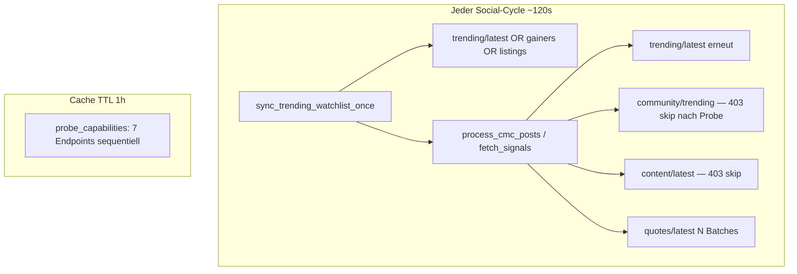
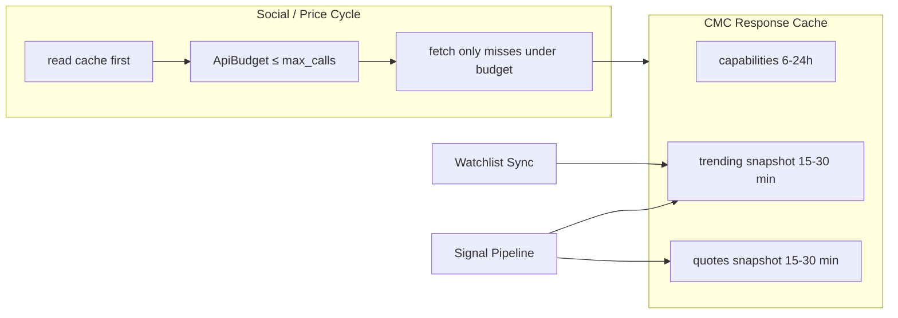

# CMC API Query Optimization — Plan

> **Status:** open (plan)  
> **Branch (geplant):** `feature/cmc-api-budget` von `staging`  
> **Epic:** #6 Improve trading signals (Follow-up nach Startup-Upgrade)  
> **Kontext:** Startup-Plan (~450k Credits/mo, 600/min). Market-Trending läuft; Community/Dex weiter 403. Abfragen sind redundant und teilweise unbudgetiert.

---

## Ziel

**Weniger CMC-Credits pro Stunde, gleiche oder bessere Signalqualität.**

Messbar:

| Metrik | Heute (Schätzung) | Ziel |
|--------|-------------------|------|
| CMC HTTP-Calls / Social-Cycle | oft 3–12+ | ≤ **2–3** (Startup) |
| Doppel-Fetch Trending | 2× pro Cycle | **1×** (shared cache) |
| Capability-Probe | 7 Calls / h | **1–3** Calls / 6–24 h |
| Credits / Tag (Staging) | hoch bei 120s Social | **−50–70 %** ohne Qualitätsverlust |
| Config `max_api_calls_per_cycle` | tot | **enforced** |

---

## Ist-Zustand (Code-Audit)

### Call-Pfade pro Social-Cycle



### Verschwendung (priorisiert)

| # | Problem | Ort | Impact |
|---|---------|-----|--------|
| **0** | **P0: Market-Cap Cache-Miss-Sturm** | `data/cmc_market_cap.py` — nur cache bei `mcap > 0`; Entry-Sensor-Loop ruft pro Coin pro Tick | Live-Log 2026-07-17: **~1×/s `quotes/latest?symbol=XAUT`** (IP Railway) — Dutzende Calls/Minute, Credit 0–1, **kein** Social-Batch |
| 1 | **Doppeltes Trending** | Watchlist-Sync + `CMCVolatileSignalAggregator._fetch_market_trending_posts` rufen beide `fetch_trending_symbols` | 2× Credits für gleiche Daten im gleichen Cycle |
| 2 | **Kein CMC-Fetch-Interval** | `process_cmc_posts` läuft mit jedem Social-Cycle; LC hat `fetch_interval_sec` | Trending ändert sich nicht alle 2 min |
| 3 | **Quotes mit Trending-Movers** | `quotes_include_trending_movers: true` → viele Symbole × Batch 8 | N Calls/Cycle auch wenn Market-Trending schon reicht |
| 4 | **`max_api_calls_per_cycle` ungenutzt** | Config 5, kein Enforcement (`dca-cmc-trending-rollout.md`) | Budget-Illusion |
| 5 | **Capability-Probe teuer** | 7 GET/POST pro Cache-Miss, sequentiell | Unnötige 403s auf Community/Content/Dex |
| 6 | **Listings-Scan 500** | Fallback `listings_scan_limit: 500` | Ein Call mit hohem Limit, teuer wenn Fallback greift |
| 7 | **`/cmc` Force-Fetch** | Immer Live-`process_cmc_posts` | Operator-Spam auf API |
| 8 | **Gate-Filter nach CMC** | Signale holen, dann Gate-Preis rausfiltern | Credits für Coins die nie tradable sind |

### Live-Beispiel (CMC Dashboard, 17.07.2026 ~19:30)

| Pattern | Quelle im Log | Interpretation |
|---------|---------------|----------------|
| `quotes/latest?symbol=XAUT` × ~90 in 2 min | IP `152.55…` (Bot) | **Entry-Sensor / mcap-Resolve** ohne Negative-Cache |
| `quotes/latest?symbol=XRP,DOGE,…` (8er Batch) | gleiche/andere IP | Social-Pipeline Signal-Quotes (ok, selten) |
| `listings/latest?limit=500` | Bot | Trending-Fallback (teuer, selten) |
| `trending/latest?limit=18` | Bot | Watchlist/Signale (ok) |
| `cryptocurrency/info?symbol=T` | Bot | Slug-Resolve (`coin_links`) einmalig ok |
| `key/info` | lokal/Script | Probe |

**Root cause XAUT:** `fetch_market_cap_usd` cachte nur `if mcap > 0`. XAUT liefert oft Preis, aber `market_cap=0` → jeder Sensor-Tick = neuer HTTP-Call.

### Was schon gut ist

- Endpoint-Skip nach Capability-Cache (kein Spam-Retry auf 403 im Hot-Path)
- Quote-`post_id` stabil pro Tag (Churn-Fix)
- Trending-Watchlist `refresh_hours: 1` (nicht jede Minute neu, wenn Overlay frisch)
- Parallel X/CMC/LC in `run_cycle_fetches`

### Credit-Rechnung (Startup, grob)

Annahme: Social alle **120 s** → **720 Cycles/Tag**.

| Szenario | Calls/Cycle | Calls/Tag |
|----------|-------------|-----------|
| Worst (Probe cold + double trending + 4 quote batches) | ~12 | ~8 600 |
| Typisch heute (kein Probe, double trend + 2 quotes) | ~4 | ~2 900 |
| Ziel Startup | ≤3 | ≤2 200 |
| Ziel + Interval 10 min | ≤3 / 10 min | ≤**430** |

Bei 450k Credits/mo ist Staging nicht kritisch, aber **Prod + Multi-Tenant + Probe** skaliert schlecht; LC hat bereits Rate-Limit-Schmerz — CMC sollte nicht dasselbe werden.

---

## Architektur-Ziel



**Prinzipien:**

1. **Single Source of Truth** für Trending-Liste pro Zeitfenster  
2. **Fetch interval** analog LunarCrush  
3. **Budget hard cap** pro Cycle  
4. **Plan-Profile** steuert welche Endpoints überhaupt probiert werden  
5. **Quotes nur wenn nötig** (kein Market-Trending, oder gezielte Watchlist-Subset)

---

## Phasen

### Phase A — Quick Wins (1–2 PRs, niedriges Risiko)

**A0. P0 Market-Cap Cache (XAUT-Sturm) — SOFORT**

- [x] Bei HTTP 200 **immer** cachen (auch `market_cap=0`)
- [x] Fail-Cache bei non-200 / Exception (`_FAIL_TTL_SEC` ~15 min)
- [x] Multi-Match-Listen in `data` (erstes Element)
- [x] Unit-Test: zweiter `fetch_market_cap_usd("XAUT")` = 0 HTTP
- Datei: `data/cmc_market_cap.py`

**A1. Shared Trending Snapshot**

- Neues Modul oder Erweiterung: `data/cmc_response_cache.py`  
  - Key: `trending_symbols` → `{symbols, source, fetched_at, ttl_sec}`  
  - Default TTL: **900–1800 s** (Config `cmc.cache.trending_ttl_sec`)
- `CMCTrendingProvider.fetch_trending_symbols` schreibt/liest Cache  
- Watchlist-Sync **und** Signal-Aggregator nutzen denselben Cache  
- Invalidierung: TTL abgelaufen oder `force=True` (`/cmc` optional)

**A2. CMC Fetch-Interval (wie LC)**

- Config: `cmc.fetch_interval_sec: 600` (10 min, Staging)  
- `SocialPipeline._should_skip_cmc_fetch` + letzter Fetch-Timestamp  
- Bei Skip: nur `refresh_cmc_signals()` aus Log/TTL (keine API)  
- Background-Social kann häufiger laufen; CMC nicht

**A3. Quotes drosseln auf Startup**

- Wenn `trade_path_mode == market_trending`:  
  - Default `quotes_include_trending_movers: false`  
  - `budget_quotes` nur für **Core-Watchlist** (nicht Trending-Overlay), Cap z. B. 8 Symbole  
- Optional: Quotes nur alle 2. CMC-Fetch (Counter)

**A4. Plan-Profile Probe**

- `plan_profile: "startup"` → Probe-Liste ohne Community/Content/Dex (oder 1× negativ cachen für 24h)  
- Config: `cmc.probe_endpoints: ["trending/latest", "trending/gainers-losers", "listings/latest", "quotes/latest"]`  
- TTL Probe: **6–24 h** statt 1 h

**A5. Config-Truth**

- `max_api_calls_per_cycle` **enforcement** in Aggregator (Zähler pro `fetch_signals`)  
- Reihenfolge: market_trending → (optional community) → quotes → content  
- Stop wenn Budget leer; Log: `CMC budget exhausted after N calls`

**Acceptance A**

- [ ] Unit: zwei Consumer, ein HTTP-Mock-Call für Trending  
- [ ] Unit: Skip innerhalb `fetch_interval_sec`  
- [ ] Unit: Budget 2 blockiert dritten Call  
- [ ] Staging-Log: CMC calls/cycle ≤ 3, oft 0 (Interval)

---

### Phase B — Struktur (mittel)

**B1. Unified CMC Client**

- `data/cmc_client.py`: `get(path, params)`, `post(...)`, shared Session, Retry-Once, Credit-Logging  
- Alle Provider (`trending`, `volatile`, `community`, `dex`) über Client  
- Metriken: `cmc_http_calls_total`, `cmc_cache_hits`, last_error (für #9 Observability)

**B2. Signal-Fetch entkoppelt von Watchlist-Fetch**

- Cycle-Order:  
  1. Trending Snapshot (cached)  
  2. Watchlist Overlay aus Snapshot (kein zweiter API)  
  3. Signal-Build: Posts aus Snapshot + optional Quotes-Subset  

**B3. Gate-first Filter**

- Optional: nur Symbole quoten/signalisieren, die schon Gate-Pair haben (aus lokalem Market-Map-Cache), statt nachträglich zu verwerfen  
- Spart Quotes-Batches

**B4. `/cmc` lesend**

- Default: Cache + `load_cmc_posts`  
- `force=1` oder `/cmc refresh` für Live-Fetch (Operator)

**Acceptance B**

- [ ] Ein Client, alle Pfade  
- [ ] `/cmc` ohne Force: 0 CMC HTTP  
- [ ] Metrics in Log oder `/gate`-Zeile

---

### Phase C — Optional / später

- Listings-Fallback: `scan_limit` 500 → **100–150** wenn nur Fallback  
- Redis-shared Cache Multi-Tenant (ein Fetch für default+henry)  
- Adaptive Interval bei hohem Credit-Verbrauch (`key/info` usage)  
- Webhook-Ingest statt Polling (nur wenn CMC/Alerts das hergeben)

---

## Empfohlene Config (nach Phase A)

```json
"cmc": {
  "plan_profile": "startup",
  "fetch_interval_sec": 600,
  "max_api_calls_per_cycle": 3,
  "quotes_include_trending_movers": false,
  "budget_market_trending": 18,
  "budget_quotes": 8,
  "budget_community_trending": 0,
  "budget_content": 0,
  "cache": {
    "trending_ttl_sec": 1200,
    "quotes_ttl_sec": 900,
    "capabilities_ttl_sec": 21600
  },
  "probe_endpoints": [
    "trending/latest",
    "trending/gainers-losers",
    "listings/latest",
    "quotes/latest"
  ],
  "listings_scan_limit": 150
}
```

Community/Content-Budgets 0 solange Endpoint 403 (weniger Code-Pfade, klarer Intent).

---

## Dateien (Touch-Map)

| Datei | Phase | Rolle |
|-------|-------|--------|
| `data/cmc_response_cache.py` | A | Neu: TTL-Cache |
| `data/cmc_capabilities.py` | A | Probe-Subset + längere TTL |
| `data/cmc_trending_provider.py` | A | Cache read/write |
| `data/cmc_volatile_signals.py` | A | Shared trending, Budget-Zähler |
| `services/social_pipeline.py` | A | `fetch_interval_sec` Skip |
| `services/dry_run_watchlist.py` | A/B | Snapshot statt Eigen-Fetch |
| `config.json` | A | Interval, Cache, Budgets |
| `notifications/telegram_commands/cmc_commands.py` | B | Cache-first `/cmc` |
| `data/cmc_client.py` | B | Unified HTTP |
| `tests/unit/test_cmc_cache.py` | A | Neu |
| `tests/unit/test_cmc_budget.py` | A | Neu |

---

## Task-Breakdown (Implementierung)

### Task 1: Response-Cache + Shared Trending

- [ ] Cache-Modul mit get/set/ttl  
- [ ] `fetch_trending_symbols` cached  
- [ ] Tests: zweiter Call = 0 HTTP  
- [ ] Commit

### Task 2: Fetch-Interval CMC

- [ ] Config + Skip in `process_cmc_posts`  
- [ ] Tests analog `test_social_pipeline_lc_interval`  
- [ ] Commit

### Task 3: Budget Enforcement + Quote-Drossel

- [ ] Zähler in Aggregator  
- [ ] Startup-Defaults: keine Quote-Trending-Movers  
- [ ] Tests Budget-Cutoff  
- [ ] Commit

### Task 4: Slim Capability Probe

- [ ] `probe_endpoints` / plan_profile  
- [ ] TTL 6h+  
- [ ] Tests  
- [ ] Commit

### Task 5: Staging-Verify

- [ ] Deploy  
- [ ] 1h Logs: Calls/Cycle, Cache-Hits  
- [ ] `/cmc` + Trending-Watchlist unverändert sinnvoll  
- [ ] Optional: Issue-Kommentar Epic #6 / #7

### Task 6 (optional B): Client + `/cmc` cache-first

- [ ] Nach A stabil  
- [ ] Separater PR

---

## Risiken & Mitigation

| Risiko | Mitigation |
|--------|------------|
| Stale Trending (TTL zu lang) | TTL 15–20 min; Force bei `/cmc refresh` |
| Weniger Quotes → weniger Sell-Hints | Sell weiter TA/Grid; Quotes nur Core-WL |
| Budget schneidet Community ab | Community sowieso 403; Budgets 0 |
| Cache Memory Multi-Process | Process-local OK; Railway 1 Worker; später Redis |

---

## Nicht-Ziele

- CMC-Plan-Upgrade / Community freischalten  
- Change von Trade-Guards (`sell_requires_ta`, Churn)  
- Neues Signal-Modell  
- Live-Gate-Orders

---

## Reihenfolge vs. Epic

1. **Dieser Plan (A)** — Credits & Stabilität  
2. **#9 Observability** — CMC health line nutzt Cache-Metriken  
3. **#8 LC** — gleiches Interval/Budget-Muster  
4. **#12 Market context** — unabhängig

---

## Done-Kriterien

- [ ] Kein doppelter Trending-HTTP im gleichen Cycle  
- [ ] CMC-Fetches standardmäßig ≤ alle 10 min  
- [ ] `max_api_calls_per_cycle` greift (Unit + Log)  
- [ ] Startup-Probe ohne Community/Dex-403-Spam  
- [ ] Signalqualität: Watchlist + Market-Trending weiterhin befüllt  
- [ ] Plan + Tests auf `staging` grün  

---

## Nächster Schritt

**Implementierung Phase A (Tasks 1–4)** auf Branch `feature/cmc-api-budget`, dann Staging-Verify.  
Kein Code in diesem Dokument — nur Plan. Go zum Implementieren = explizit „Phase A umsetzen“.
