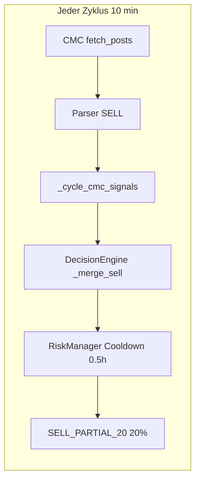

# CMC-Churn: Änderungsvorschläge für Altcoins

> Status: **merged auf `main`** (2026-06-15)  
> Branch `feature/cmc-churn-fixes` geschlossen.  
> Kontext: STG/SIREN-Churn — viele kleine CMC-Teilverkäufe bei Trending-Altcoins.

## Diagnose (Ist-Zustand vor Fix)

| Befund | Daten |
|--------|-------|
| STG/SIREN-Sells | 48/52 Orders mit `source: cmc` |
| Sell-Intervall | ~32 min Ø (passt zu `min_hours_between_sells: 0.5`) |
| CMC-Posts STG+SIREN | 290 Einträge, 268× SELL, **157/133 unique post_ids** |
| post_id-Muster | `cmc_quote_SIREN_-74.3` — ändert sich bei jeder gerundeten 24h-% |

**Kernursache:** Quotes-Fallback erzeugte bei kleinen Kursbewegungen neue `post_id`s → neuer Sell-Kandidat pro Zyklus. Kombiniert mit niedriger Sell-Schwelle und kurzem Cooldown.

## Umgesetzte Maßnahmen

Siehe [DOCUMENTATION.md §10](../DOCUMENTATION.md#10-cmc-coinmarketcap) für die Live-Config.

**Betriebsentscheidung nach Merge:** `cmc.quotes_fallback_as_signal: true` — Quotes dürfen wieder handeln, aber mit allen Guards (TA-Pflicht für Sells, +10 Sell-Bonus, Cooldowns, Mindestgrößen).

## Umsetzungs-Checkliste

- [x] Stabile CMC quote post_id + Log-Dedup (`cmc_community_provider.py`, `data_manager.py`)
- [x] Live CMC-Signal-TTL in `social_pipeline` (Reuse `cmc_replay.signals_at_timestamp`)
- [x] Separate `cmc_sell_min_confidence` + `cmc_sell_requires_ta` (`decision_engine.py`)
- [x] `min_position_usdt_for_social_sell` + `min_sell_notional` (`risk_manager.py`)
- [x] `cmc_min_hours_between_sells` pro Position (`risk_manager`, `positions`)
- [x] `altcoin_social` in config + registry
- [x] Phase-1-Config: Cooldowns, Parser-Schwellen
- [x] Unit-Tests (`tests/unit/test_cmc_churn.py`) + Build-Info (`core/build_info.py`)

## Referenz

- Replay-Validierung (Nacht 14.–15.06.): 34 CMC-Sells → 0 mit neuen Guards (Counterfactual)
- Redis-Plan (Evaluations-Pipeline): Branch `plan/redis-process-architecture`