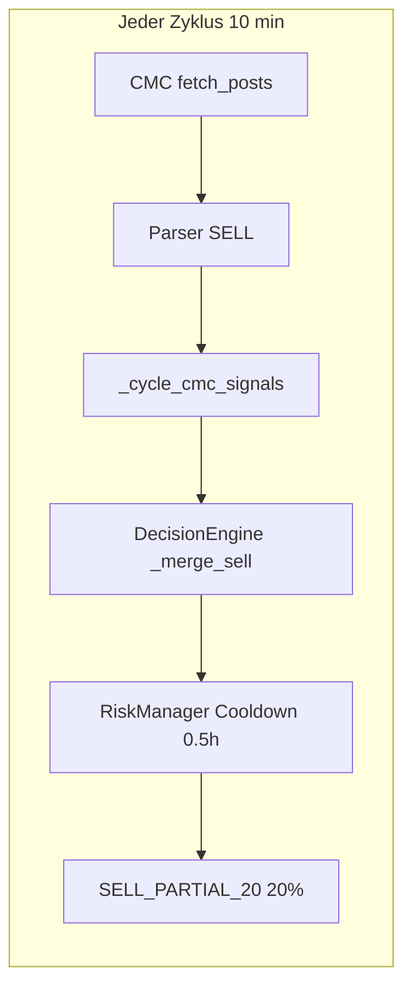

# CMC-Churn: Änderungsvorschläge für Altcoins

> Status: **umgesetzt** auf `feature/cmc-churn-fixes` (2026-06-15)  
> Kontext: STG/SIREN-Churn — viele kleine CMC-Teilverkäufe bei Trending-Altcoins.

## Diagnose (Ist-Zustand)



| Befund | Daten |
|--------|-------|
| STG/SIREN-Sells | 48/52 Orders mit `source: cmc` |
| Sell-Intervall | ~32 min Ø (passt zu `min_hours_between_sells: 0.5`) |
| CMC-Posts STG+SIREN | 290 Einträge, 268× SELL, **157/133 unique post_ids** |
| post_id-Muster | `cmc_quote_SIREN_-74.3` — ändert sich bei jeder gerundeten 24h-% |

**Kernursache:** In `data/cmc_community_provider.py` erzeugt der Quotes-Fallback (`_fetch_quotes_sentiment`) bei `pct <= -5%` ein neues SELL-Signal mit `post_id=f"cmc_quote_{symbol}_{round(pct, 1)}"`. Kleine Kursbewegungen = neuer Post = neuer Sell-Kandidat im Zyklus. Kombiniert mit:

- Sell-Schwelle = Buy-Schwelle (`_cmc_buy_threshold` in `strategies/decision_engine.py`)
- Nur **0,5 h** Sell-Cooldown (`dry_run_defaults.min_hours_between_sells` in `config.json`)
- Immer **20 %** Teilverkauf (`SELL_PARTIAL_20`)
- **Kein** Mindest-Positionswert vor Social-Sell (`risk/risk_manager.py` prüft nur `amount > 0`)
- **Kein** CMC-spezifisches Tier/Dedup (im Gegensatz zu `rsi_sell_tiers_done` in `strategies/positions.py`)

Hermes nutzt bereits **CMC-TTL (4 h)** via `hermes/cmc_replay.py` — Live-Pipeline nicht.

---

## Phase 1 — Schnelle Config-Änderungen (sofort testbar)

Ziel: Churn um ~70 % reduzieren ohne Code-Deploy.

In `config.json` unter `dry_run_defaults` und `cmc`:

| Parameter | Aktuell | Vorschlag | Wirkung |
|-----------|---------|-----------|---------|
| `min_hours_between_sells` | `0.5` | **`3.0`** (Altcoins) / `6.0` (Meme-Trending) | max. 8 vs. 48 Sells/Nacht |
| `cmc_min_confidence` | `55` | **`65`** (nur als Buy-Schwelle behalten) | weniger schwache Signale |
| `cmc.trust_score` (neu) | implizit 65 | **`55`** für Trending-Altcoins oder global 60 | eff = conf × trust/100 |

**Wichtig:** Sell-Schwelle ≠ Buy-Schwelle — das geht erst sauber in Phase 2. Phase 1 allein reicht nicht vollständig, weil `_merge_sell` dieselbe Schwelle nutzt.

Optional: Trending-Overlay-Coins in `watchlist.dry_run_overlay.json` (STG, SIREN, …) mit eigenem `strategy_params`-Block:

```json
"strategy_params": {
  "cmc_min_confidence": 70,
  "min_hours_between_sells": 6,
  "cmc_social_sells_enabled": false
}
```

(Erfordert Phase-2-Code für `cmc_social_sells_enabled`; bis dahin nur Cooldown/Confidence über bestehende Keys.)

---

## Phase 2 — Code: CMC-Sell-Guards (generisch für alle Altcoins)

### 2a) Separate Sell-Schwelle + schwächerer Sell-Anteil

Datei: `strategies/decision_engine.py`

- Neue Methode `_cmc_sell_threshold()` — Default **65** (Dry Run) / **70** (Live), höher als Buy.
- In `_merge_sell` (Zeile 208–213):
  - Sell nur wenn `eff >= _cmc_sell_threshold()`
  - Optional: `SELL_PARTIAL_10` (neuer Action-Typ) statt `SELL_PARTIAL_20` für reine CMC-Sells ohne TA-Bestätigung
- Neue Config-Keys in `core/config.py` + `config.json`:
  - `cmc_sell_min_confidence` (default 65)
  - `cmc_sell_min_effective_confidence` (optional, nach trust)
  - `cmc_sell_requires_ta` (bool, default `true` für Altcoins — TA muss ebenfalls SELL-Kandidat sein)

**Empfehlung Default für Altcoins:** CMC allein darf **nicht** verkaufen; nur verstärken, wenn TA auch bearish ist (RSI-Tier oder Ampel rot).

### 2b) CMC-Signal-TTL im Live-Zyklus (wie Hermes)

Dateien: `services/social_pipeline.py`, Reuse `hermes/cmc_replay.py`

- `refresh_cmc_signals()` liefert nicht nur Posts des aktuellen Zyklus, sondern **aktive Signale der letzten N Stunden** (`cmc.signal_ttl_hours`, default **4**, analog `hermes.cmc_replay_ttl_hours`).
- Pro Symbol nur **das stärkste aktive Signal** (höchste confidence), nicht jeden neuen Quote-Post.

Effekt: Ein bearishes Quote-Signal wirkt 4 h, aber **löst nicht bei jedem Zyklus einen neuen Log-Eintrag + Sell aus**.

### 2c) Stabile post_id für Quotes-Fallback

Datei: `data/cmc_community_provider.py` Zeile 260–261

**Problem:** `cmc_quote_{symbol}_{round(pct, 1)}` erzeugt 157 Posts für STG.

**Fix:** post_id auf **Tages-Bucket** oder **Sentiment-Bucket** umstellen:

```python
bucket = "bear" if pct <= -5 else "bull" if pct >= 5 else "neutral"
post_id = f"cmc_quote_{symbol}_{bucket}_{date}"
```

Zusätzlich in `fetch_posts`: **nicht erneut loggen**, wenn für Symbol+Bucket innerhalb TTL schon ein Post existiert (`log_cmc_post` Dedup in `data_manager.py`).

### 2d) Mindest-Positionswert + Dust-Guard

Datei: `risk/risk_manager.py` — `evaluate()` für SELL

Neue Config unter `cmc` oder `risk`:

- `min_position_usdt_for_social_sell` (default **50** USDT)
- `min_sell_notional_usdt` (default **5** USDT) — blockiert Micro-Sells wie `-$0.26`
- `block_social_sell_if_sold_percent_above` (default **0.8**) — Restdust nicht weiter fraktionieren

Gilt für `source in ("cmc", "x")`, nicht für manuelle/Stop-Loss-Sells.

### 2e) CMC-Sell-Cooldown pro Position (zusätzlich zum globalen)

Datei: `strategies/positions.py`

Analog `rsi_sell_tiers_done`:

- Neues Feld `cmc_sell_state: { last_at, count }` oder einfacher: `last_cmc_sell_at`
- In `RiskManager._trade_cooldown_blocked`: wenn `source == "cmc"`, separater Mindestabstand **`cmc_min_hours_between_sells`** (default **6 h**), unabhängig von `min_hours_between_sells`

---

## Phase 3 — Parser-Härtung (weniger False SELLs)

Datei: `data/cmc_community_provider.py` — `CMCCommunityParser.parse()`

| Änderung | Aktuell | Vorschlag |
|----------|---------|-----------|
| Bearish Vote-Ratio | `<= 0.35` → SELL | **`<= 0.25`** für SELL, 0.25–0.35 → HOLD |
| Quotes-Fallback | `-5%` → SELL | **`-8%`** für Altcoins, oder nur HOLD/INFO loggen |
| Author-Markierung | `CMC Market` | Risk-Layer: `quotes_fallback` als schwache Quelle behandeln (höhere Sell-Schwelle +10 Punkte) |

Optional: `cmc.quotes_fallback_as_signal` (bool, default **`false`**) — Fallback nur für Watchlist-Anreicherung, **nicht** für Trades.

---

## Phase 4 — Profil für Altcoins / Trending-Coins

Neues Konzept in `core/config.py` + `strategies/registry.py`:

**`altcoin_social_profile`** (automatisch für Coins aus `cmc_trending` / `dry_run_overlay`):

```json
"altcoin_social": {
  "cmc_sell_min_confidence": 70,
  "cmc_min_hours_between_sells": 6,
  "cmc_sell_requires_ta": true,
  "cmc_sell_fraction": 0.1,
  "min_position_usdt_for_social_sell": 50
}
```

Zuweisung: Coins mit `source: cmc_trending` in Watchlist oder `market_cap_tier: micro` erben dieses Profil, sofern keine expliziten `strategy_params` gesetzt sind.

---

## Erwartete Wirkung (STG/SIREN als Referenz)

| Maßnahme | Geschätzte Reduktion Sells/Nacht |
|----------|--------------------------------|
| Sell-Cooldown 0.5h → 6h | ~80 % |
| Stabile post_id + TTL | ~90 % neue CMC-Posts |
| `cmc_sell_requires_ta` | ~95 % reine CMC-Sells |
| min_position_usdt 50 | 100 % Dust-Sells |

Kombiniert: von **~20 Sells/Nacht** auf **0–2** sinnvolle Sells.

---

## Validierung vor Rollout

1. **Replay-Test:** STG/SIREN der letzten 48 h mit `hermes/pipeline_backtest.py` + geänderten Parametern — Ziel: Trades ↓, PnL nicht schlechter.
2. **Unit-Tests:** neue Tests in `tests/unit/` für:
   - `_cmc_sell_threshold` vs buy threshold
   - quote post_id Dedup
   - risk min_notional block
   - CMC TTL in `refresh_cmc_signals`
3. **Dry Run 24 h** mit `notify_on_cycle` und Vergleich Order-Count.

---

## Empfohlene Umsetzungsreihenfolge

1. **2c + 2b** (Quote-Churn stoppen) — größter Hebel
2. **2a + 2d** (Sell-Schwelle, TA-Pflicht, Mindestgröße)
3. **2e + Phase 1 Config** (Cooldowns)
4. **Phase 3 + 4** (Parser + Altcoin-Profil)

Phase 1 Config allein ist ein temporärer Pflaster; ohne 2c bleibt `cmc_posts.json` weiter wachsen und das Muster wiederholt sich bei jedem neuen Trending-Altcoin.

---

## Umsetzungs-Checkliste

- [ ] Stabile CMC quote post_id + Log-Dedup (`cmc_community_provider.py`, `data_manager.py`)
- [ ] Live CMC-Signal-TTL in `social_pipeline` (Reuse `cmc_replay.signals_at_timestamp`)
- [ ] Separate `cmc_sell_min_confidence` + `cmc_sell_requires_ta` (`decision_engine.py`)
- [ ] `min_position_usdt_for_social_sell` + `min_sell_notional` (`risk_manager.py`)
- [ ] `cmc_min_hours_between_sells` pro Position (`risk_manager`, `positions`)
- [ ] `altcoin_social_profile` in config + registry
- [ ] Phase-1-Config: `min_hours_between_sells` 3–6, Parser-Schwellen
- [ ] Unit-Tests + STG/SIREN 48h Replay