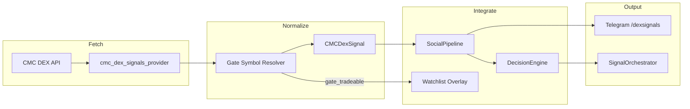
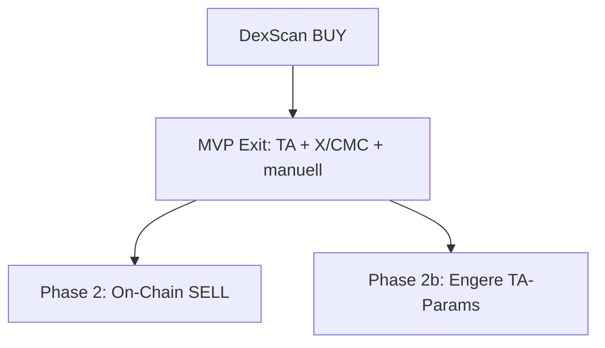

# CMC DexScan Signals Connector

## Überblick

Neuer Connector für [DexScan Smart Money Signals](https://dex.coinmarketcap.com/signals/all/) als eigenständige Social-Quelle (`cmc_dex`), analog zum bestehenden CMC-Community-Connector — mit Gate-Spot-Auflösung, Integration in SocialPipeline/DecisionEngine und Telegram-Observability.

**User-Entscheidungen:**
- Integration: Full Social (kann allein BUY auslösen, wie CMC Community)
- Chains: Alle (ETH, Solana, BSC, Base), Filter per Config
- Exit: Phase 2 (On-Chain-SELL) + Phase 2b (engere TA-Parameter für `cmc_dex`-Positionen)

---

## Architektur



---

## API-Strategie

Kein dedizierter `/signals`-Endpoint in der öffentlichen Doku. Nutzung mit bestehendem `CMC_API_KEY`:

| Endpoint | Zweck |
|----------|-------|
| `POST /v1/dex/tokens/trending/list` | Leaderboard mit `sig: {mtp, psc}` |
| `POST /v1/dex/new/list` | Fresh-Launches |
| `GET /v1/dex/platform/list` | Platform-IDs ETH/Sol/BSC/Base |
| `POST /v1/dex/tokens/batch-query` | Enrichment: `cexs`, `liqUsd`, `rl`, `cid` |
| `GET /v1/dex/security/detail` | Rug/Honeypot-Filter |
| `POST /v1/dex/holders/list` (`tag_smart_money`) | Smart-Money-Bestätigung + Phase-2-SELL |

**Phase-0-Spike:** `sig.mtp` / `sig.psc` gegen UI (Fresh/Revived) mappen.

---

## Kernkomponenten

### Provider — `data/cmc_dex_signals_provider.py`

- `RawDexSignal`, `CMCDexSignal` (`source = "cmc_dex"`, `trust_score` default 72)
- `CMCDexSignalsProvider` + `MockCMCDexProvider` + `get_cmc_dex_provider()`
- Dedup via stabile `signal_id`: `dex_{platform}_{addr}_{mtp}_{ts_bucket}`

### Gate-Resolver — `data/dex_gate_resolver.py`

- `sym` → `{SYM}/USDT`, Gate-Preis via `get_prices_batch`
- Optional `cexs.slug == gate-io` aus batch-query
- Kein Gate-Match: loggen + Telegram-Alert, kein Trade

### Persistenz — `cmc_dex_signals.json`

Parallel zu `cmc_posts.json`, getrennt von Community-Churn.

### Pipeline — `services/social_pipeline.py`

- `process_dex_signals()` / `refresh_dex_signals()` / `should_send_dex_digest()`
- Auto-Watchlist bei `gate_tradeable` BUY (`source: "cmc_dex"`)
- Integration in `aria_bot.py` Cycle

### DecisionEngine — `strategies/decision_engine.py`

- Dritte Social-Quelle `cmc_dex` (nicht in `cmc` mischen)
- `cmc_dex_weight` (default 0.25)
- Consensus-Bonus mit `x` / `cmc`

### Config — `config.json`

```json
"cmc_dex": {
  "enabled": true,
  "use_mock": false,
  "api_key_env": "CMC_API_KEY",
  "min_confidence": 65,
  "trust_score": 72,
  "signal_types": ["fresh", "revived"],
  "platforms": ["ethereum", "solana", "bsc", "base"],
  "min_liquidity_usd": 50000,
  "min_hours_between_signals": 6,
  "gate_only": true,
  "max_signals_per_cycle": 10,
  "security_check": true,
  "auto_add_watchlist": true
},
"cmc_dex_weight": 0.25
```

### Telegram

- `/dexsignals`, `/dex` in `notifications/telegram_commands/dex_commands.py`
- Eigener Digest (getrennt von Community `/cmc`)

---

## Exit-Strategie (Buy/Exit entkoppelt)

**Grundprinzip:** DexScan triggert den Einstieg; der Ausstieg folgt einer gestaffelten Strategie. `source: "cmc_dex"` wird beim BUY in Trade-History und Watchlist-Eintrag gespeichert.



### MVP (Phase 1) — Verkauf ohne DexScan

Für offene Positionen (egal ob via `cmc_dex` gekauft):

| Quelle | Mechanismus |
|--------|-------------|
| **TA** (Hauptweg) | Stop-Loss, Take-Profit, RSI 70/80 in `technical_rsi_bb.py` |
| **X / CMC Community** | `_merge_sell` — SELL-Signale, Stop/Target |
| **Manuell** | `/sell` |

DexScan liefert im MVP **keine** SELL-Signale → kein zusätzliches Verkaufs-Churn-Risiko.

### Phase 2 — DexScan On-Chain-SELL

Neue SELL-Logik in `CMCDexSignalsProvider` + `_merge_sell`:

**Trigger (konfigurierbar, alle müssen erfüllt sein):**

1. Token hat offene Position mit `entry_source: cmc_dex` (oder letzter BUY aus `live_trade_history` mit `source: cmc_dex`)
2. Smart-Money-Distribution erkannt via:
   - `POST /v1/dex/holders/list` (`tag_smart_money`): `sellUsd > buyUsd` über Lookback-Fenster
   - Optional: `GET /v1/dex/holders/trend/list` — `holdingRatioOfTop10` sinkt > X%
   - Optional: `GET /v1/dex/tokens/transactions` — Netto-Verkäufe Smart-Money-Wallets
3. `signal_type: distribution` (neuer interner Typ, nicht Fresh/Revived)
4. Confidence aus Aggregat-Score (analog BUY-Heuristik, invertiert)

**DecisionEngine:**

```python
if dex_signal and dex_signal.action == "SELL":
    eff = dex_signal.effective_confidence * consensus
    if eff >= _dex_sell_threshold():  # default höher als BUY (z.B. 70)
        candidates.append((SELL_PARTIAL_30, 3, "cmc_dex"))
```

Config-Ergänzung:

```json
"cmc_dex": {
  "sell_enabled": true,
  "min_sell_confidence": 70,
  "sell_lookback_hours": 24,
  "sell_min_smart_money_wallets": 3
}
```

**Priorität:** Dex-SELL (Priority 3) unter X-Stop-Loss (6) und TA-Stop-Full (5), über normalem Community-SELL (2) — Smart-Money-Exit ist stärker als Sentiment, schwächer als harter Stop.

### Phase 2b — Engere TA-Parameter für `cmc_dex`-Entries

Beim Auto-Add zur Watchlist (oder nach erstem BUY) `strategy_params` setzen — analog `cmc_trending`-Profil in `strategies/registry.py`:

```json
"cmc_dex_exit_profile": {
  "take_profit_pct": 8,
  "stop_loss_pct": 25,
  "rsi_sell_30": 65,
  "rsi_sell_20": 75,
  "partial_stop_ratio": 0.5
}
```

**Anwendung:**

- `resolve_coin_config()` / Watchlist-Overlay: wenn `source == "cmc_dex"` → Profil mergen
- Nur für Coins, die **via DexScan** in die Watchlist kamen (nicht rückwirkend auf manuelle Entries)
- Hermes darf diese Params später optimieren (`hermes` search space erweitern)

**Rationale:** Meme-Alpha bewegt sich schneller — engerer TP/SL als Default (TP 10–12 %, SL 50 %).

---

## Abgrenzung Community vs. DexScan

| | Community (`cmc`) | DexScan (`cmc_dex`) |
|--|-------------------|---------------------|
| Datenquelle | Sentiment/Votes | On-Chain Smart Money |
| BUY (MVP) | Ja | Ja |
| SELL (MVP) | Ja (Votes) | Nein |
| SELL (Phase 2) | Ja | Ja (On-Chain Distribution) |
| Exit-Profil | Default TA | Phase 2b: engeres Profil |
| Persist | `cmc_posts.json` | `cmc_dex_signals.json` |

---

## Implementierungsreihenfolge

### PR1 — Provider + Resolver + Persistenz
- API-Spike, Provider, Gate-Resolver, `data_manager`, Unit-Tests

### PR2 — Pipeline + Bot-Cycle
- SocialPipeline, aria_bot, Watchlist-Auto-Add mit `source: cmc_dex`

### PR3 — Decision + Execution (MVP BUY)
- DecisionEngine BUY-Pfad, SignalOrchestrator `source: cmc_dex`, Config

### PR4 — Telegram + Observability
- `/dexsignals`, Digest, daily_auswertung

### PR5 — Phase 2: On-Chain-SELL
- Distribution-Detection, `_merge_sell`, `sell_enabled` Config, Tests

### PR6 — Phase 2b: Exit-Profil
- `cmc_dex_exit_profile` in registry, Watchlist-Merge, Tests gegen engeren TP/SL

---

## Risiken

| Risiko | Mitigation |
|--------|------------|
| Token nicht auf Gate | `gate_only`, Alert-only |
| API-Limits | `max_signals_per_cycle`, 10–15 Min Cache |
| Fehlalarm SELL Phase 2 | Höhere `min_sell_confidence`, Multi-Wallet-Minimum |
| Zu enger TP Phase 2b | Profil nur für `cmc_dex`-source, Hermes-validierbar |

---

## Todos

- [ ] API-Spike: sig.mtp/psc + Platform-IDs
- [ ] `data/cmc_dex_signals_provider.py` + Mock
- [ ] `data/dex_gate_resolver.py`
- [ ] `data_manager`: cmc_dex_signals.json
- [ ] SocialPipeline + aria_bot
- [ ] DecisionEngine BUY + SignalOrchestrator
- [ ] Config + Telegram
- [ ] Unit/Integration Tests (MVP)
- [ ] Phase 2: On-Chain-SELL + Tests
- [ ] Phase 2b: `cmc_dex_exit_profile` + registry merge