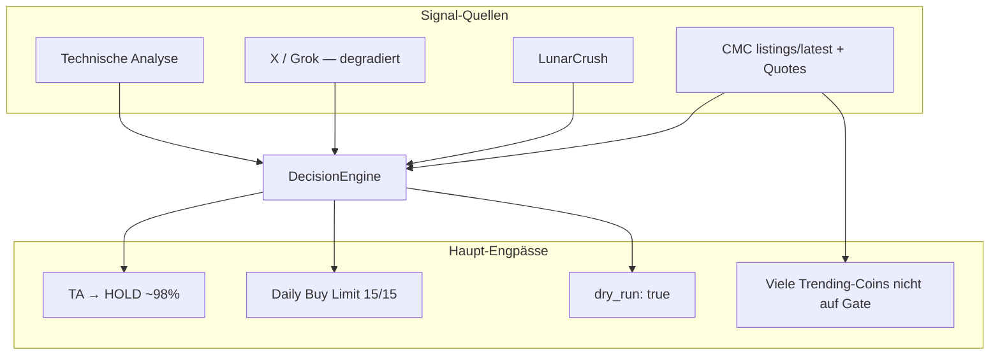

# Rollout-Plan: DCA + CMC Trending (`feature/dca-accumulation`)

> **Status:** In Betrieb auf Branch `feature/dca-accumulation` @ `b6745ea`  
> **Bot:** PID live, 47 Coins/Zyklus, Tests 485/485 grün  
> **Erstellt:** 2026-06-23

---

## Ausgangslage

| Bereich | Ist-Zustand |
|---------|-------------|
| Branch | `feature/dca-accumulation` — **10 Commits** vor `main` |
| Trading | `trading_mode: live`, aber `live.dry_run: true` → **simulierte** Orders |
| DCA | Live aktiv — 24h: **126× BUY_DCA**, funktioniert |
| CMC Trending | Overlay 15 Coins via `listings/latest` (Plan blockiert `trending/latest`) |
| Watchlist | `gate_only: false` → 47 Coins, Zyklus ~373s |
| Engpass | 24h: **5067× HOLD**, **5× BUY** — TA blockiert, nicht fehlende Signale |
| Limits | Daily buys **15/15** voll |
| Grok | 403 Credit-Limit — X-Parsing auf Fallback/Heuristik |
| Bewusst offen | `max_api_calls_per_cycle` — **nicht** enforced (nur Config-Wert `3`) |



---

## Phasen-Übersicht

| Phase | Ziel | Zeitraum |
|-------|------|----------|
| **0** | Beobachten & KPIs | 1–2 Tage |
| **1** | Betrieb stabilisieren (Merge) | nach Phase 0 |
| **2** | Trade-Volumen & Performance | 1 Woche |
| **3** | Echte Live-Orders (optional) | bewusste Entscheidung |
| **4** | Mittelfristige Erweiterungen | Backlog |

---

## Phase 0 — Beobachten (1–2 Tage)

**Ziel:** Evidenz sammeln, bevor `main`-Merge oder Config-Änderungen.

### KPIs messen

| Metrik | Quelle | Zielwert / Frage |
|--------|--------|------------------|
| Trending-Watchlist-Größe | `/trending`, `watchlist.cmc_trending_overlay.json` | Stabil 10–15 Coins? |
| CMC-BUY-Signale | `logs/aria_log.txt`, `cmc_posts.json` | Wie viele pro Tag? |
| CMC → EXECUTED | `decisions.jsonl` | Conversion-Rate? |
| DCA-Runden | `decisions.jsonl` (`BUY_DCA`) | Churn / Überexposure? |
| Zyklus-Dauer | `Cycle completed` im Log | < 300s wünschenswert |
| Sell-Churn Trending | Orders mit `source: cmc` + Trending-Coins | Kein neuer Churn? |

### Telegram-Checks

- [ ] `/trending` — 15 Movers, Quelle `listings/latest`
- [ ] `/cmc` — aktive Signale + Tier-Badges
- [ ] `/positions` — Trending-Positions unter Cap (`max_open_from_trending: 8`)
- [ ] `/dexsignals` — Alerts ohne falsche Trade-Erwartung

### Log-Checks

```bash
grep -E "trending watchlist sync|CMC signal|Risk rejected|EXECUTED|BUY_DCA" logs/aria_log.txt | tail -50
```

### Exit-Kriterium Phase 0

- [ ] Kein unerwarteter Sell-Churn auf Trending-Coins
- [ ] DCA verhält sich erwartbar (Runden, Stop-Rebuy-Guard)
- [ ] Keine wiederholten API-/Crash-Fehler im Zyklus

---

## Phase 1 — Merge zu `main`

**Ziel:** Feature-Branch produktiv verankern.

### Commits auf dem Branch

1. `5470243` — DCA accumulation + stop-loss rebuy guard
2. `37fa445` — DCA `mode: live`
3. `846e665` — CMC trending volatile signals (full stack)
4. `0e320b9` — listings/latest Fallback
5. `0bdb9f2` — Buy-Limit 15, `gate_only: false`
6. `6a5d068` / `27df3a7` / `b6745ea` — Tests + Background-Trending-Sync

### Merge-Ablauf

```bash
git checkout main
git pull
git merge feature/dca-accumulation
# Konflikte: config.json, ggf. watchlist-Overlays
python3 -m pytest tests/ -q
bash scripts/stop_bot.sh
python3 aria_bot.py >> logs/aria_log.txt 2>&1 &
```

### Checkliste

- [ ] `config.json`-Diff gegen `main` reviewen (CMC-Block, DCA, risk, architecture)
- [ ] Runtime-Dateien **nicht** committen: `run/`, `watchlist.cmc_trending_overlay.json`, `x_accounts.json`
- [ ] Nach Merge: Bot auf `main` neu starten
- [ ] Telegram-Webhook / ngrok prüfen falls Stack-Script genutzt

---

## Phase 2 — Trade-Volumen & Performance

**Ziel:** Mehr sinnvolle Trades ohne Qualitätsverlust.

### 2a — Watchlist & Zyklus (empfohlen zuerst)

| Option | Config | Effekt |
|--------|--------|--------|
| **A: Gate-Filter zurück** | `cmc.trending_watchlist.gate_only: true` | Weniger Coins, schnellere Zyklen, nur handelbare Trending-Mover |
| **B: Beobachtung breit** | `gate_only: false` (aktuell) | Mehr Signale, aber ~47 Coins/Zyklus |

**Empfehlung:** Option A testweise 48h — weniger Noise, JUP & Co. bleiben wenn auf Gate.

### 2b — TA-Engpass (größter Hebel)

24h-Daten: **98%+ HOLD** trotz Social-Signalen.

| Hebel | Config-Pfad | Richtung |
|-------|-------------|----------|
| Volumen-Schwelle | `dry_run_defaults.volume_multiplier` / Profile | 0.85 → 0.8 testen |
| RSI-Band | `rsi_buy_high` volatile Profile | ggf. 55 → 58 |
| Buy-Regime | `buy_regime: both` | falls noch nicht überall aktiv |
| LC-Schwellen | `lunarcrush.thresholds` | LC liefert mehr BUYs als CMC |

**Vorsicht:** Nicht alles gleichzeitig ändern — ein Hebel pro Experiment, 24h beobachten.

### 2c — Daily Buy Limit

Aktuell **15/15** blockiert neue BUYs (z. B. ZEC).

| Option | Wert | Risiko |
|--------|------|--------|
| Behalten | 15 | Kontrolliertes Volumen |
| Erhöhen | 20–25 | Mehr Exposure |
| Entkoppeln | Trending-Cap bleibt 8 | Positions-Limit schützt |

### 2d — CMC-Trending-Fusion feintunen

Nur nach KPIs aus Phase 0:

```json
"cmc_trending_fusion": {
  "min_confidence_trending": 50,
  "cmc_only_buy_min_confidence": 58,
  "allow_cmc_only_buy_top_n": 8,
  "trending_trade_size_pct": 50
}
```

- Conversion niedrig → Schwellen **senken** (vorsichtig)
- Zu viele Fehlkäufe → Schwellen **anheben** oder `block_buy_if_rsi_above` strenger

### Exit-Kriterium Phase 2

- [ ] HOLD-Rate sinkt messbar ODER BUY/DCA-Conversion steigt
- [ ] Zyklus < 5 min bei aktiver Watchlist-Größe
- [ ] Kein Anstieg CMC-Sell-Churn

---

## Phase 3 — Echte Live-Orders (bewusste Entscheidung)

**Ziel:** Von Simulation zu Gate-Spot-Orders.

### Voraussetzungen

- [ ] Phase 0 + 1 abgeschlossen
- [ ] DCA + Trending-Fusion stabil auf `main`
- [ ] Grok-Credits geklärt oder X-Gewicht reduziert
- [ ] Risiko-Limits reviewiert (`max_usdt_per_trade`, `max_open_positions`, Trending-Cap)

### Config-Änderung

```json
"live": {
  "dry_run": false
}
```

### Rollout-Stufen

1. **Stufe 1:** `dry_run: false` + `max_usdt_per_trade: 50` (klein)
2. **Stufe 2:** Nach 48h ohne Incident → `max_usdt_per_trade: 100–200`
3. **Stufe 3:** Trending-Trades weiterhin 50% Size (`trending_trade_size_pct`)

### Rollback

```json
"live": { "dry_run": true }
```
→ sofortiger Stop neuer echter Orders, Positionen bleiben auf Gate.

---

## Phase 4 — Backlog (mittelfristig)

| Thema | Beschreibung | Priorität |
|-------|--------------|-----------|
| **Grok Credits** | X-Parsing + Hermes — 403 beheben oder `use_grok_x_search: false` dauerhaft | Hoch |
| **CMC API Upgrade** | `trending/latest`, `community/trending` freischalten | Mittel (Plan-abhängig) |
| **DexScan → Gate** | Listing-Check: DEX-Pump nur alerten wenn Gate-Spot existiert | Mittel |
| **API-Budget soft** | Tier-Priorität statt hartem `max_api_calls_per_cycle` | Niedrig (bewusst gestoppt) |
| **Hermes Live-Evidence** | Siehe `HERMES_LIVE_EVIDENCE_PLAN.md` | Parallel |

---

## Bekannte Einschränkungen (kein Bug)

1. **CMC Basic Plan** — nur `listings/latest` + `quotes/latest` zuverlässig
2. **Trending ≠ Trending-API** — Movers nach 24h-%, nicht CMC „Trending“-Section
3. **`gate_only: false`** — viele Overlay-Coins nicht handelbar (reine Beobachtung)
4. **`max_api_calls_per_cycle`** — Config vorhanden, **kein Code-Enforcement** (Absicht)

---

## Entscheidungsmatrix (User)

| Frage | Option A | Option B |
|-------|----------|----------|
| Nächster Schritt? | 48h KPIs (Phase 0) | Direkt Merge (Phase 1) |
| Watchlist | `gate_only: true` | `gate_only: false` (aktuell) |
| Live-Trades | `dry_run` bleibt true | Phase 3 vorbereiten |
| Buy-Limit | 15 beibehalten | 20–25 erhöhen |
| API-Budget | So lassen | Soft-Priorität (Phase 4) |

---

## Nächster konkreter Schritt

**Empfohlen:** Phase 0 starten — 48h KPIs sammeln, dann:

1. `gate_only: true` testen (1 Config-Zeile)
2. Merge zu `main`
3. TA-Hebel einzeln tunen (Phase 2b)

---

## Referenzen

- CMC Full-Stack: Commit `846e665`
- Listings-Fallback: Commit `0e320b9`
- Architecture Rebuy/DCA: `config.json` → `architecture.rebuy_after_stop_loss_hours`
- DexScan-Plan: `plans/cmc-dexscan-connector.md`
- CMC-Churn-Historie: `plans/cmc-churn-fixes.md`