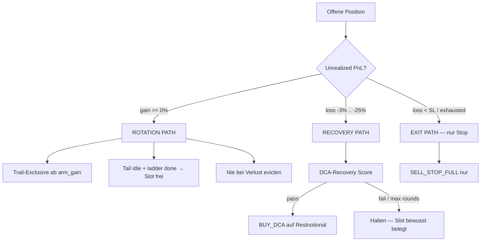
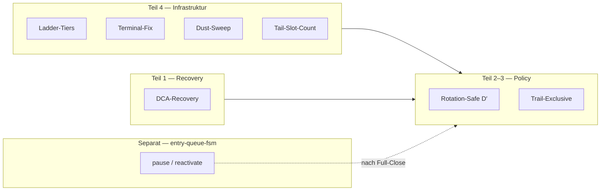

# Plan: Rotation + DCA-Recovery (Masterplan)

> **Status:** Entwurf — nur Plan, noch nicht implementiert  
> **Kontext:** Portfolio-Verstopfung, schnelle Rotation bei Plus, Verlierer via Recovery — nicht evicten  
> **Branch-Vorschlag:** `feature/dca-recovery` (nach `feature/entry-guard-15m`)  
> **Erstellt:** 2026-07-07 · **Aktualisiert:** 2026-07-07 (Teil 4 Rotation-Infrastruktur)  
> **Verwandt:** [`plans/entry-queue-fsm.md`](entry-queue-fsm.md) · [`plans/15m-entry-sell-guard.md`](15m-entry-sell-guard.md)

---

## Problemstellung

Zwei konkurrierende Ziele:

| Ziel | Beobachtung (Demo-Ledger) |
|------|---------------------------|
| **Schnelle Rotation** | 40/40 Slots, 16 Zombie-Tails, 78–91% Sell-Volumen = Partials |
| **Verlierer retten** | Policy D (`idle_close`) würde 11 Positionen schließen — teils im Minus |
| **Trailing mitfahren** | `trailing_take_profit`: 8 Treffer vs. `bb_upper`: 198 in `decisions.jsonl` |

**Kernkonflikt:** Rotation-Policy evicted Reste für Slots; DCA greift heute **nur vor dem ersten Teilverkauf**.

```61:64:strategies/dca.py
def _in_accumulation_phase(position: dict) -> bool:
    step = int(position.get("exit_ladder_step", 0) or 0)
    sold = float(position.get("sold_percent", 0) or 0)
    return step == 0 and sold < 0.01
```

Alle 16 offenen Tails haben `dca_accum_phase=False` → kein Nachkauf möglich.

---

## Zielbild: Zwei-Wege-Modell



**Leitprinzip:** Slots opfert man bei Verlierern nur, wenn Recovery erschöpft ist — nicht für Rotation.

---

## Teil 1 — DCA-Recovery (Post-Partial)

### Wann aktiv?

Position ist in **Recovery-Phase**, wenn:

- `sold_percent > 0` **oder** `exit_ladder_step > 0`
- `sold_percent < max_sold_percent` (Default **0.85** — kein Recovery auf Dust-Zombie)
- `remainder_notional >= min_remainder_usdt` (Default **$150**)
- `unrealized_loss` in Band `[loss_pct_min, loss_pct_max]`

### Unabhängige Zähler (neu im Ledger)

| Feld | Zweck |
|------|--------|
| `dca_recovery_rounds` | Recovery-Nachkäufe (getrennt von `dca_rounds`) |
| `dca_recovery_max_rounds` | Beim ersten Recovery-Check eingefroren |
| `last_dca_recovery_at` | Intervall-Gate |
| `last_recovery_ref_price` | Kaskaden-Erkennung (Kursrutsch seit letztem Event) |

`peak_amount`, `sold_percent`, `exit_ladder_step` bleiben bei Recovery-DCA **unverändert** (wie heute bei `BUY_DCA`).

### Scoring (Multi-Factor, erbt von `dca.scoring`)

Gleiche Kernkriterien wie Accumulation-DCA:

- ATR-Distanz (wie weit der Dip vs. Volatilität)
- RSI (oversold)
- Funding (negativ = Short-Squeeze-Potenzial)
- BTC-Underperformance (Coin fällt stärker als BTC)
- BB-Support (optional +1)

**Volatile Märkte — Kaskaden-Modus** (neu):

Wenn Kurs seit `last_sell` oder `last_dca_recovery_at` um ≥ `cascade_min_drop_pct` (Default **4%**) gefallen:

- `min_score` um **1** senken, oder
- `min_core_criteria_met` um **1** senken

Damit kann der Bot bei **aufeinanderfolgenden Rutschern** gestaffelt nachkaufen, ohne blind jeden Tick zu kaufen.

### Hard Gates

| Gate | Volatile (Default) | Stable (Default) |
|------|-------------------|------------------|
| `loss_pct_min` | **-25%** | **-15%** |
| `loss_pct_max` | **-2%** | **-2%** |
| `max_rounds` | **2** | **1** |
| `interval_hours` | **8h** | **18h** |
| `fixed_usdt` | `dca.fixed_usdt × 0.35` | `× 0.30` |
| `near_stop_loss` | blockiert | blockiert |
| `sl_proximity_pct` | **12%** | **10%** |

### Stop-Loss-Integration

- `effective_stop_loss_thresholds()` zählt `dca_rounds + dca_recovery_rounds` für Stop-Weitung
- `pause_partial_stop_during_dca` gilt auch bei `dca_recovery_rounds > 0`
- Grace-Period nach Recovery-DCA wie bei normalem DCA

### Decision-Flow

```
has_position + HOLD (kein Sell-Kandidat)
  → evaluate_dca_addon()           # Accumulation, sold ≈ 0
  → else evaluate_dca_recovery()   # Post-Partial, Verlust-Band
       → BUY_DCA, source=dca_recovery
```

Priorität: Sell-Kandidaten > Accumulation-DCA > Recovery-DCA (kein DCA während aktivem Sell-Signal).

---

## Teil 2 — Rotation-Safe (kein Abstossen von Verlierern)

Erweiterung der simulierten Policy D → **Policy D′**:

| Regel | Wert |
|-------|------|
| `rotation_evict_min_gain_pct` | **0%** — nie Rest bei Verlust schließen |
| `rotation_evict_requires` | `gain >= 0` **oder** `realized_pnl > 0` auf Lot |
| `idle_close` | nur wenn `gain >= 0` |
| `ladder_terminal_full_close` | nur wenn `gain >= 0` |
| Verlust + Recovery eligible | **kein** idle_close, stattdessen Recovery-Path |

**Erwartung (Forward-Analyse, Demo):**

- Policy D (roh): 11 sofort-Closes, 14 freie Slots
- Policy D′: nur profitable Tails rotieren; Verlierer (WLD, LTC, U, …) bleiben in Recovery

---

## Teil 3 — Trail-Exclusive (Plus-Positionen)

Nur im **Rotation-Path** (`gain >= 0`):

1. Unter `arm_gain_pct`: keine `bb_upper` / RSI-Partials
2. Ab `arm_gain_pct`: nur `trailing_take_profit` + `profit_max_lifetime`
3. Trail-Exit → bevorzugt **SELL_FULL** (Rotation first)

Volatile Defaults: `arm_gain_pct: 12`, Stable: `15`.

---

## Config-Skizze (`config.json`)

```json
"dca": {
  "enabled": true,
  "mode": "live",
  "fixed_usdt": 400,
  "recovery": {
    "enabled": true,
    "mode": "live",
    "interval_hours": 8,
    "max_rounds": 2,
    "loss_pct_min": -25,
    "loss_pct_max": -2,
    "max_sold_percent": 0.85,
    "min_remainder_usdt": 150,
    "remainder_size_ratio": 0.35,
    "sl_proximity_pct": 12,
    "cascade_min_drop_pct": 4.0,
    "cascade_score_discount": 1,
    "scoring_inherit": true
  }
},
"sell_policy": {
  "rotation": {
    "trail_exclusive": true,
    "evict_min_gain_pct": 0,
    "tail_idle_hours": 24,
    "tail_exempt_sold_pct": 0.50
  }
}
```

Stable-Profil: `interval_hours: 18`, `max_rounds: 1`, `loss_pct_min: -15`, `remainder_size_ratio: 0.30`.

---

## Teil 4 — Rotation-Infrastruktur (Verstopfung von vornherein vermeiden)

Analyse-Tool (bereits implementiert): `scripts/analyze_sell_rotation.py` + `hermes/sell_rotation_replay.py`.  
Demo-Befund: 40/40 Slots, 16 Zombie-Tails, TrailTP 8× vs. `bb_upper` 198× in `decisions.jsonl`.

### 4.1 Exit-Ladder-Tiers anpassen

Heute erzeugen die Leitern viele große erste Schnitte und kleine Reste:

| Profil | Heute | Vorschlag (Rotation-First) | Effekt |
|--------|-------|---------------------------|--------|
| `volatile_altcoin` | `60 / 30 / 10` | `35 / 35 / 30` | weniger 60%-Zombie-Slots |
| `stable_altcoin` | `30 / 30 / 20 / 20` | `30 / 30 / 40` (3 Stufen) | letzte Stufe schließt Rest |

Letzte Stufe soll **immer** den verbleibenden Rest schließen (`resolve_sell_amount` → full close wenn `step >= len(tiers)-1`).

Config-Pfad: `volatile_altcoin.exit_ladder.tiers`, `stable_altcoin.exit_ladder.tiers`.

### 4.2 Ladder-Terminal-Bug fixen

Wenn `exit_ladder_step >= len(tiers)`, liefert `trailing_take_profit._resolve_action()` **`None`** — Verkaufsmotor stoppt, Rest bleibt offen (CAT/BNB/PEPE @ 80–100% sold).

**Fix:**

- Neuer Kandidat `tail_cleanup` / `ladder_terminal` in Decision-Engine: `SELL_FULL` wenn Ladder fertig und `amount > 0`
- Nur im **Rotation-Path** (`gain >= 0`) oder als Dust-Sweep
- Verlierer: **kein** Terminal-Close → Recovery-Path (Teil 1)

Betroffene Dateien: `strategies/trailing_take_profit.py`, `strategies/decision_engine.py`, optional `risk/risk_manager.py` (`_resolve_sell_order`).

### 4.3 Dust-Sweep & `min_remainder` lockern

Aktuell (`config.json` → `risk`):

| Parameter | Heute | Vorschlag |
|-----------|-------|-----------|
| `dust_sweep_min_remainder_usdt` | 200 | **100** wenn `sold_percent >= 0.50` |
| `dust_sweep_max_position_usdt` | 300 | **500** bei `sold >= 0.70` |
| `exit_ladder.min_remainder_usdt_floor` | 200 | **100** (volatile), **150** (stable) |

Ziel: Reste von $500–1.250 nach 60–80% Teilverkauf werden als Dust behandelt und voll geschlossen — **nur bei Plus**.

### 4.4 Tail-Slot-Accounting

Problem: `is_open_position()` zählt jeden Rest ≥ $1 als voller Slot (`strategies/positions.py`).

**Vorschlag — zwei Zähler:**

```python
def is_tail_position(pos) -> bool:
    sold >= tail_exempt_sold_pct (0.50) OR notional < tail_exempt_notional_usdt (800)

def count_open_positions_for_limit():
    return sum(1 for p in open if is_open_position(p) and not is_tail_position(p))
```

| Zähler | Verwendung |
|--------|------------|
| `open_full_slots` | `max_open_positions`-Gate für **neue Buys** |
| `open_tail_slots` | Reporting / Rotation-Metriken |
| `open_total` | Portfolio-Anzeige (unverändert) |

Risk-Manager: `max_open_positions`-Check nutzt `count_open_full_slots()`.

Erwartung Demo: ~26 volle + ~15 Tails → effektiv **~14 freie Buy-Slots** statt 0.

### 4.5 Volatile vs. Stable — Verkaufsprofile (Referenz)

Bereits aktiv via `sell_profile.py` + `registry.apply_position_sell_overlay`. Rotation-Plan ändert **nicht** die Profil-Auswahl, nur Exit-Verhalten:

| | Volatile | Stable |
|---|----------|--------|
| Ladder (neu) | 35/35/30 | 30/30/40 |
| Struktur-Exits | BB, Vol-Exhaustion, Vol-Dump | keine |
| Trail `arm_gain` | 12% | 15% |
| RSI-Sell `min_gain` | 15% unter Trail-Arm | 18% |
| DCA-Recovery `loss_min` | -25% | -15% |

Signalnamen (`SELL_PARTIAL_30`) bleiben Legacy — **Menge** kommt aus der Ladder.

### 4.6 Shadow-Rollout

Neue Config-Root `sell_policy`:

```json
"sell_policy": {
  "mode": "shadow",
  "shadow_log_decisions": true,
  "rotation": { "...": "..." },
  "recovery": { "inherit": "dca.recovery" }
}
```

| `mode` | Verhalten |
|--------|-----------|
| `shadow` | `would_sell` / `would_dca_recovery` in `decisions.jsonl`, keine Orders |
| `active` | Live nach 7 Tagen Shadow + Replay D′ besser/gleich |

Shadow-Felder in Audit: `rotation_blocked`, `recovery_candidate`, `tail_exempt`, `ladder_terminal_would_close`.

### 4.7 Entry-Queue-FSM (separates Thema)

15m-Watchlist vs. Position-Slots sind **getrennte Engpässe**. Details: [`plans/entry-queue-fsm.md`](entry-queue-fsm.md).

Kurz: `clear_watch` bei offener Position → kein Re-Entry; FSM-Kandidat **C** (`active`/`paused`/`cooldown`) löst Semantik, **nicht** Slot-Verstopfung.  
Kopplung zu Rotation: `reactivate` nur bei **Full-Close**; Recovery hält Position offen → Watch bleibt `paused`.

Implementierung **nach** PR4–PR7 (eigener Branch `feature/entry-queue-fsm`).

---

## Gesamtübersicht — was wohin gehört



| Thema | Teil | Status |
|-------|------|--------|
| Portfolio-Verstopfung Diagnose | Einleitung | ✅ Replay-Tool live |
| DCA-Recovery Post-Partial | 1 | 📋 Plan |
| Rotation ohne Verlierer-Eviction | 2 | 📋 Plan |
| Trail-Exclusive | 3 | 📋 Plan |
| Ladder / Dust / Slots / Shadow | 4 | 📋 Plan (neu) |
| Entry-Queue FSM | entry-queue-fsm.md | 📋 Separat |
| Entry-Guard 15m | 15m-entry-sell-guard.md | ✅ Branch existiert |

---

## PR-Plan (Reihenfolge)

| PR | Inhalt | Risiko | Abhängigkeit |
|----|--------|--------|--------------|
| **PR1** | `dca_recovery` Modul + Position-Felder + Tests | Niedrig | — |
| **PR2** | Decision-Engine + `signal_orchestrator` (`source=dca_recovery`) | Mittel | PR1 |
| **PR3** | Risk-Manager (Interval, Sizing, DCA-Limits für Recovery) | Mittel | PR2 |
| **PR4** | `sell_policy.rotation` — Eviction nur bei `gain >= 0` (D′) | Mittel | — |
| **PR5** | Trail-Exclusive für Plus-Positionen | Höher | PR4 |
| **PR6** | Ladder-Terminal-Fix + `tail_cleanup` Kandidat | Mittel | PR4 |
| **PR7** | Tail-Slot-Accounting (`count_open_full_slots`) | Mittel | — |
| **PR8** | Ladder-Tiers + Dust-Sweep Config | Niedrig | PR6 |
| **PR9** | `sell_policy.mode: shadow` + Decision-Audit-Felder | Niedrig | PR4–PR6 |
| **PR10** | `analyze_sell_rotation.py` — Policy D′ + Recovery + Slot-Metriken | Niedrig | PR1, PR4, PR7 |
| **PR11** | Entry-Queue-FSM (separater Branch) | Mittel | nach PR7 |

**Empfohlene Reihenfolge:**

1. **PR1–PR3** — Verlierer-Recovery (dein Backlog-Priorität)
2. **PR4 + PR7** — Rotation safe + Slots (parallel möglich)
3. **PR6 + PR8** — Terminal/Dust/Ladder
4. **PR5 + PR9** — Trail-Exclusive + Shadow
5. **PR10** — Replay validieren
6. **PR11** — Entry-FSM separat

---

## Tests (Pflicht vor Live)

| Test | Erwartung |
|------|-----------|
| Recovery bei `sold=30%`, loss=-8%, Score≥6 | `BUY_DCA`, Ladder unverändert |
| Recovery blockiert bei `sold=0` | Accumulation-DCA übernimmt |
| Recovery blockiert bei `gain > 0` | Rotation-Path, kein DCA |
| Recovery blockiert bei `sold=90%` | Zu wenig Rest |
| Kaskade: -5% seit letztem Sell, Score 5+discount | Recovery erlaubt |
| `BUY_DCA` Recovery erhöht `dca_recovery_rounds`, nicht `dca_rounds` | Ledger korrekt |
| Policy D′: Verlierer-Tail | kein `idle_close` |
| Stop-Loss: Recovery-Rounds weiten SL | wie Accumulation-DCA |
| Ladder terminal @ 80% sold, gain>0 | `SELL_FULL` Kandidat |
| Tail @ 60% sold, notional<$800 | zählt nicht gegen `max_open_positions` |
| Shadow mode | Order bleibt HOLD, Audit hat `would_*` |

---

## Metriken (Erfolg nach 7 Tagen Shadow)

| Metrik | Ziel |
|--------|------|
| Recovery-Triggers / Tag | messbar, nicht > `max_daily_dca_buys` |
| Ø `average_entry` nach Recovery | sinkt bei erfolgreichen Dips |
| Zombie-Tails im Minus | ↓ (weniger stuck ohne Exit) |
| Rotation-Slots (nur Plus) | ↑ ohne Verlierer-Eviction |
| `open_full_slots` vs. `open_total` | Gap ≥ 10 bei 40/40 Portfolio |
| Ladder-Terminal stuck (80%+ sold) | → 0 nach PR6 |
| Realized PnL Recovery-Lots | ≥ Baseline (kein Schlechteres) |

Replay-Tool: `scripts/analyze_sell_rotation.py --json` — nach PR10 mit Policy **D′**, Recovery-Counter und Tail-Slot-Modell.

---

## Bewusst nicht in Scope (v1)

- OHLCV-Forward-Simulation für Recovery-PnL (bestehend: `scripts/backtest_exit_rules_30d.py` erweiterbar)
- Hermes-Optimierung von Recovery-/Rotation-Parametern
- Recovery auf 100%-sold Zombies (PEPE) — nur manuell / Dust-Sweep bei Plus
- Neukäufe auf demselben Symbol nach Full-Close (bleibt Rebuy-Cooldown)
- Entry-Queue-FSM Implementierung (eigenes Doc, PR11)
- Slot-Eviction nach X Tagen **nur** um Slots freizumachen (ohne Gain/Recovery-Check)

---

## Offene Frage

Deine Nachricht endete bei „der Bot muss perspektivisch mit …“ — für die Feinjustierung:

- **Drawdown-Throttle:** Recovery-Size bei Portfolio-DD > X% halbieren?
- **Max Recovery-USDT/Tag:** separates Cap neben `max_daily_dca_usdt`?

Diese Punkte können in PR3 als Config-Flags ergänzt werden, sobald geklärt.