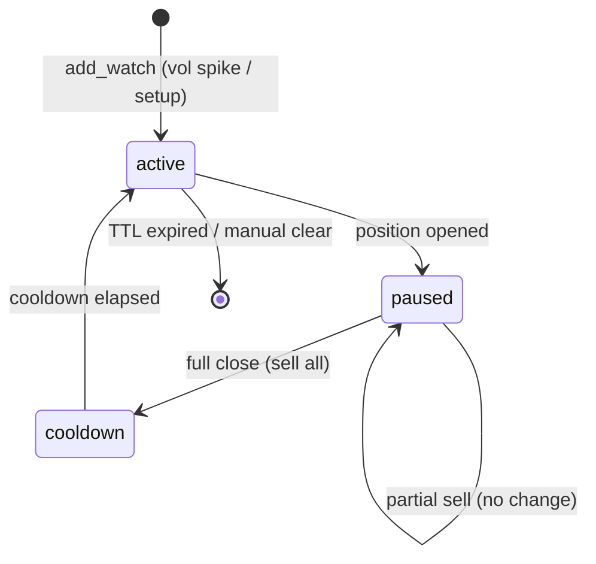

# Plan: 15m Entry-Queue FSM (`pause` / `reactivate`)

> **Status:** Entwurf — separat von Rotation/Recovery  
> **Branch:** `feature/entry-queue-fsm` (nach `feature/dca-recovery` oder parallel)  
> **Erstellt:** 2026-07-07  
> **Parent:** [`plans/dca-recovery-rotation.md`](dca-recovery-rotation.md) §4.7

---

## Problem

Drei getrennte Ebenen werden oft verwechselt:

| Ebene | Speicher | Limit | Heute |
|-------|----------|-------|-------|
| Master-Watchlist | `watchlist.json` | — | 4h, Social, Trending |
| 15m Entry-Queue | `watch_15m_state.json` | `max_watched_coins: 40` | Vol-Spike Polling |
| Positionen | Mongo Ledger | `max_open_positions: 40` | echte Slots |

`clear_watch(symbol)` bei `has_position` (in `entry_sensor_loop.py` + `decision_engine._sync_watch_15m_state`) entfernt Coins aus der **15m-Queue**, nicht aus der Master-Watchlist — Semantik fühlt sich trotzdem falsch an.

**Rotation-Verstopfung** ist ein **Positions-Slot**-Problem (Teil 4 im Masterplan), kein Watchlist-Problem.

---

## Light-Arena Ergebnis (Kurz)

| Kandidat | Idee | Score |
|----------|------|-------|
| A | Status quo `clear_watch` | 7.5 |
| B | Skip buy, keep watch | 5.3 |
| **C** | **FSM `active`/`paused`/`cooldown`** | **8.1** |

Empfehlung: **Kandidat C**

---

## Ziel-FSM



| State | Zählt gegen `max_watched_coins`? | Pollt 15m-Sensor? |
|-------|----------------------------------|-------------------|
| `active` | ja | ja |
| `paused` | nein (oder halbes Gewicht — Config) | nein |
| `cooldown` | ja | ja (nach Ablauf → `active`) |

---

## Events & Hooks

| Event | Aktion | Dateien |
|-------|--------|---------|
| Vol-Spike / Setup | `add_watch` → `active` | `watch_15m_state.py`, `entry_sensor_loop.py` |
| Buy filled | `pause(symbol)` | `entry_sensor_loop.py`, `decision_engine.py` |
| Partial sell | **kein** State-Wechsel | — |
| Full close | `reactivate(symbol)` oder `cooldown` | Sell-Hook in `portfolio_service` / `positions.py` |
| DCA-Recovery buy | bleibt `paused` | — |
| Reject (risk) | `cooldown` + `last_reject_at` | bestehend |

---

## Config-Skizze

```json
"entry_sensor_15m": {
  "watch_state_machine": {
    "on_position_open": "pause",
    "on_position_close": "reactivate",
    "cooldown_after_close_hours": 2,
    "max_active_entry_slots": 25,
    "paused_does_not_count": true
  }
}
```

Default `on_position_open: pause` — bei PR1 FSM kann `clear` als Fallback bleiben (kein Verhaltenswechsel bis PR2).

---

## PR-Skizze (PR11 im Masterplan)

| Step | Inhalt |
|------|--------|
| PR11a | FSM in `watch_15m_state.py`: `pause`, `reactivate`, `is_active_for_poll()` |
| PR11b | `entry_sensor_loop` + `decision_engine` auf `pause` statt `clear_watch` |
| PR11c | Sell-Hook: Full-Close → `reactivate` |
| PR11d | Integrationstests + `max_active_entry_slots` |

---

## Abgrenzung zu Rotation-Plan

- **Kein** `reactivate` bei Partial-Sell — Position noch offen
- **Kein** `reactivate` bei DCA-Recovery — Recovery hält Slot bewusst
- Entry-FSM verbessert **Re-Entry nach Full-Close**, nicht Tail-Rotation

---

## Nicht in Scope

- Master-Watchlist (`watchlist.json`) anfassen
- `clear_watch` für Large-Caps entfernen (bleibt)
- Entry-Guard-15m ändern (siehe `15m-entry-sell-guard.md`)