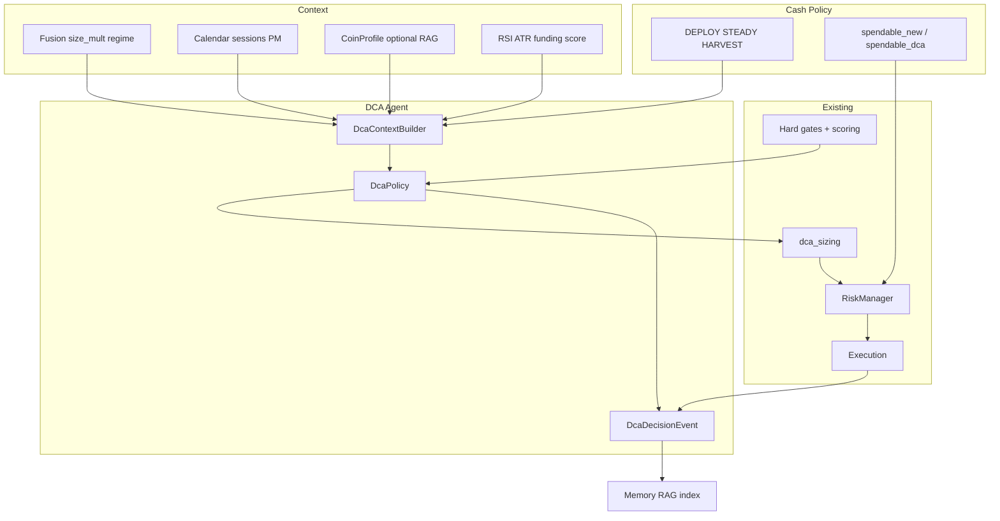

# Epic: DCA Agent (policy-first) + intelligent sizing

> **GitHub:** [#79](https://github.com/jholze/xagent-trading-bot/issues/79)  
> **Status:** Open · ready (after #72 closed)  
> **Updated:** 2026-07-18  
> **Related:** #72 (infra done) · #67 · #71 · #65 · Cash plan  
> **Coordination:** [`next-wave-dca-decision-cash.md`](next-wave-dca-decision-cash.md)

---

## Vision

Kontextbewusster **DCA-Agent**: nicht blind nach Zeitplan oder Score allein, sondern **deterministische Policy** aus Markt-/Memory-/Cash-Kontext (`size_mult`, `skip`, `reason_codes`).

**User-Ziel (Cash + DCA gemeinsam):**

- **Starker Markt** → mehr Cash freigeben, DCA/Entries dynamischer (DEPLOY)  
- **Schwacher Markt** → Cash auffüllen, DCA drosseln/skip (HARVEST)  
- Grok/RAG erklären und lernen — **nie** Live-Kauf im Hot-Path  

Passt zu:

- Agent/Bus-Zielbild · Infra **#72 CLOSED** (konsumieren, nicht neu bauen)
- Memory soft_block auf **New Entry** (DCA absichtlich freier; Policy nur mult↓)
- Bestehendes Dip-DCA (`strategies/dca.py`, `dca_sizing.py`, `dca_portfolio.py`)
- Adaptive Cash: `spendable_dca` ([`adaptive-cash-rotation-master.md`](adaptive-cash-rotation-master.md))

**Nicht** dasselbe wie #72: #72 = RAG/Bus-**Infra** + advisory `/ask`; dieses Epic = **Live-DCA-Produktlogik** auf dieser Infra + Cash Policy.

---

## #72 Integration (verbindlich)

| #72 | Status | Rolle für #79 |
|-----|--------|----------------|
| C1 RagRetriever | shipped | D2 optional Context; D4 index |
| C2 Index + Hermes RAG | shipped | D4/D5 Outcomes → Lessons |
| C3 Bus Rag* | shipped, **default off** | optional later; nicht D3-Blocker |
| C4 `/ask` dca_advice_rag | shipped | D4b: Policy-Snapshot im Prompt |
| C5 Weaviate RAG | shipped | gleiche retrieve API |
| C7 LLM client | shipped | nur Reflect / ask — **kein** evaluate |
| C8 Fusion→RAG | shipped, **default off** | Hot-Path: **Fusion live** lesen |

### Gap (Audit)

```text
Heute Live:  hard gates + score → Risk(starrer floor) → Exec
Heute Ask:   Memory + RAG → Grok advice
Fehlt:       Policy(regime, cash_mode, profile) · spendable_dca · DecisionEvents
```

---

## Design principles (verbindlich)

1. **Policy-first** — pure functions; Tabelle Regime/Cash-Mode/Event → mult/skip  
2. **Grok/RAG offline** — Reflect, Lessons, Telegram; **kein** `ask_grok` pro DCA-Cycle  
3. **Dip-DCA first** — open losers + recovery; scheduled = D7 später  
4. **Execution path** — Policy → Intent → Risk (`spendable_dca`) → Exec; Agent schreibt **keine** Orders  
5. **Fail-open context** — fehlende Macro/RAG → mult 1.0, kein Crash  
6. **Paper-safe** — DEMO / `ledger_scope` in Logs  
7. **Cash koppelt** — Policy respektiert `cash_mode` / `spendable_dca` (Cash Policy v1)  
8. **Skip beats size** — immer  

```text
Cash Policy (DEPLOY|STEADY|HARVEST) + Fusion live
       ↓
DcaContextBuilder  →  fusion + cash_mode + calendar + profile + tech + optional RAG
       ↓
Hard gates + scoring (bestehend, behalten)
       ↓
DcaPolicy (pure)   →  size_mult | skip | reason_codes
       ↓
dca_sizing × mult, cap spendable_dca
       ↓
Risk → Exec
       ↓
DcaDecisionEvent → Memory/RAG (#72 C1–C2)
       ↓
/ask + Reflect (Grok advisory)
```



---

## Ist vs. Ziel

| Heute | Ziel |
|-------|------|
| Multi-factor **score** + loss band + interval | + **Policy-Layer** (regime / cash_mode / calendar / profile) |
| fixed_usdt / score sizing | size × **policy_mult**, cap `spendable_dca` |
| Starrer cash floor (blockt DCA mit) | dual spendable; HARVEST darf DCA-Puffer halten |
| soft_block nur New Entry | behalten; Policy kann mult↓ bei schwachem Profil |
| Fusion steuert Entry-Size, nicht DCA | Fusion + cash_mode steuern DCA mult/skip |
| Kein Decision-Log | reason_codes + DcaDecisionEvent → RAG |
| `/ask` und Live entkoppelt | D4b: gemeinsamer Context / Policy-Snapshot |

**Nicht im Scope v1:** Kalender-DCA Montags (D7), Loss-Evict, LangChain, Grok live.

---

## Child issues

| ID | Title | Depends |
|----|--------|---------|
| **D1** | Spec: `DcaContext` + factor table + reason_codes + cash_mode mapping | — |
| **D2** | `DcaContextBuilder` (fusion live, cash, calendar, profile; RAG optional fail-open) | D1, #72 C1 |
| **D3** | Wire policy mult/skip into evaluate path + unit tests + shadow flag | D2, Cash P0/P1 empfohlen |
| **D4** | `DcaDecisionEvent` persist + index memory/RAG | D3 |
| **D4b** | `/ask` optional Live-Policy-Snapshot (Alignment) | D3, #72 C4 |
| **D5** | Reflection pass (rules first; Grok via Hermes optional) | D4 |
| **D6** | Observability: logs/Telegram reason_codes + mult | D3 |
| **D7** | *(optional)* Mode `scheduled` weekly DCA | D3 stable |

---

## Policy sketch v1 (freeze in D1)

| Signal | Effect |
|--------|--------|
| Cash **DEPLOY** / Fusion size_mult ≥ 1.0 | mult 1.2–1.5 |
| Cash **STEADY** / neutral | mult 1.0 |
| Cash **HARVEST** / size_mult &lt; 0.7 / block_buys | mult 0.3–0.5 **or skip** |
| High-impact calendar &lt; 7d | mult ≤ 0.5 or skip |
| RSI oversold + score high (not HARVEST) | mult 1.3–1.8 (cap) |
| Extreme funding / risk flags | skip or mult 0 |
| CoinProfile schwach / size_bias low | mult 0.5–0.7 |
| Equity drawdown ≥ threshold | mult 0.5 or skip |
| Missing fusion / memory | mult 1.0 fail-open |
| Normal | mult 1.0 |

Caps: `policy_mult ∈ [0, max_policy_mult]` (default max **2.0**). **Skip beats size.**

---

## Non-goals

- Grok entscheidet Live-DCA  
- Chroma/SQLite neu  
- Verlierer-Rotation (Loss-Evict)  
- Cash-Controller **ersetzen** — **koppeln** (Cash plan + #67)  
- soft_block hard-kill auf DCA ohne Config  
- LangChain  

---

## Acceptance (Epic done when)

- [ ] D1–D3: Policy ändert size/skip in unit tests + optional shadow staging  
- [ ] D3 respektiert `spendable_dca` wenn Cash Policy aktiv  
- [ ] D4: DCA-Versuch mit reason_codes im Memory/Log  
- [ ] D4b optional: `/ask` kann Policy-Stand erklären  
- [ ] D5/D6: Reflect und/oder operator-sichtbare Reasons  
- [ ] Kein Grok im evaluate hot-path  
- [ ] #72 degrade path: RAG leer → Policy weiter (fail-open)  
- [ ] Paper/demo path documented  

---

## Related

| Item | Beziehung |
|------|-----------|
| **#72** | Infra CLOSED — Context/Index/Ask |
| **#67** | Staging cash unblock |
| **Cash plan** | DEPLOY/STEADY/HARVEST + dual spendable |
| **#71** | Memory × rotation docs |
| **#65 / #82** | DecisionPacket mappt `agent=dca` später |
| Code | `strategies/dca.py`, `dca_sizing.py`, `dca_portfolio.py`, Risk |

## Order recommendation

1. Cash: #67 Phase 0 → Cash Policy Phase 1 (User-Vision freigeben/auffüllen)  
2. Dieses Epic **D1 → D2 → D3**  
3. **D4 / D4b / D5 / D6**  
4. Optional D7, #65 A1  

## One-liner

**DCA = Dip-Averaging mit Policy aus Fusion+Cash+Memory; RAG/Grok lernt und erklärt — der Hot-Path kauft ohne LLM; starker Markt gibt Cash und Size frei, schwacher Markt puffert.**
