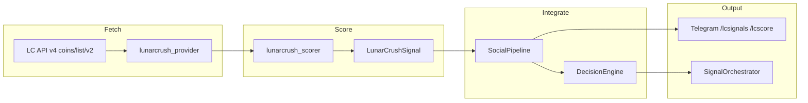

# LunarCrush Signals Connector

## Überblick

LunarCrush als **dritte Social-Quelle** (`source = "lc"`), parallel zu X und CMC Community. Scoring aus Galaxy Score, AltRank-Delta und Sentiment — kein CMC-Community-Klon (keine Forum-Votes).

**Design-Entscheidungen:**
- Integration: Full Social (kann allein BUY auslösen, analog CMC)
- Default: `lunarcrush.use_mock: true` bis `LUNARCRUSH_API_KEY` gesetzt
- Sell-Pfad: `sell_requires_ta: true` (Churn-Guard wie CMC)
- Gewichte: `x_weight` 0.40, `onchain_weight` 0.15, `lc_weight` 0.18, `technical_weight` 0.27 (Summe 1.0)

---

## Architektur

---

## API-Strategie

| Endpoint | Zweck |
|----------|-------|
| `GET /api4/public/coins/list/v2` | Batch-Metriken (Builder+ only) |
| `GET /api4/public/coins/{symbol}/v1` | Snapshot (Individual) |
| `GET /api4/public/coins/{symbol}/time-series/v2` | Galaxy/AltRank/Sentiment-Deltas (Individual) |

**Individual plan:** `use_list_endpoint: false` — per-coin + time-series statt List-API.

Auth: `Authorization: Bearer $LUNARCRUSH_API_KEY`

---

## Scoring

| Metrik | BUY | SELL |
|--------|-----|------|
| Galaxy Score | ≥ 58, Delta ≥ 4 | ≤ 42 |
| AltRank | Verbesserung ≥ 8% | Verschlechterung ≥ 12% |
| Sentiment | ≥ 68% | ≤ 40% |

Raw-Confidence: 50% Galaxy + 35% AltRank-Impuls + 15% Sentiment.

---

## Dateien

| Datei | Rolle |
|-------|-------|
| `data/lunarcrush_provider.py` | Mock + API Provider |
| `data/lunarcrush_scorer.py` | `LunarCrushSignal`, `score_lc_metrics()` |
| `services/social_pipeline.py` | `process_lc_signals`, `refresh_lc_signals` |
| `strategies/decision_engine.py` | Buy/Sell-Merge, Consensus, `lc_weight` |
| `data/lc_signals.json` | Persistenz (via `data_manager`) |
| `notifications/telegram_commands/lc_commands.py` | `/lcsignals`, `/lcscore` |

---

## Aktivierung (Live)

1. `LUNARCRUSH_API_KEY` in `.env` setzen
2. `config.json`: `lunarcrush.use_mock: false`
3. Optional: Schwellen in `lunarcrush.thresholds` und `min_confidence` tunen

Mock-Modus liefert starke BUY-Signale für **SOL** und **ARIA** (Dev/Tests).

---

## Telegram

- `/lcsignals` — aktuelle LC-Signale
- `/lcscore` — Galaxy/AltRank/Sentiment-Übersicht
- Zyklus-Digest: `notify_lc_digest` in `observability.telegram_explanations`