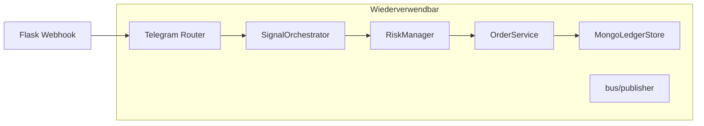
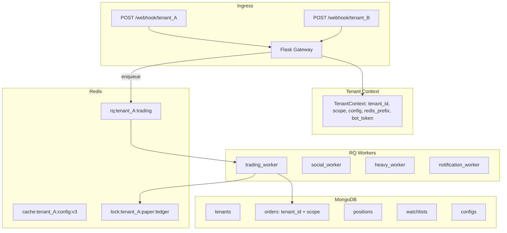

# Multi-Tenant Migration & Architekturplan

**Stand:** Juli 2026 — Branch `feature/multi-tenant`  
**Zielgruppe:** SaaS für Freunde / kleine geschlossene Community  
**Fokus:** Hohe Performance (niedrige Latenz bei Trading-Entscheidungen) + hohe Flexibilität (einfaches Onboarding, unterschiedliche Pläne, einfache Erweiterbarkeit)

## Ziel

Den Trading-Bot von einem **Single-User-Monolithen** zu einem **professionellen Multi-Tenant-SaaS-System** umbauen. Mehrere unabhängige Nutzer (Freunde) sollen ihren eigenen voll-isolierten Bot betreiben können — mit eigenen Einstellungen, Watchlists, Strategien, Kapital, Exchange-Keys und Telegram-Bot.

**Kernanforderungen für SaaS-Verkauf:**
- **Performance**: Schnelle Zyklen, effiziente Datenversorgung, faire Ressourcennutzung auch bei mehreren aktiven Tenants.
- **Flexibilität**: Einfaches Onboarding neuer Nutzer, Plan-Tiers mit Limits, pro-Tenant Konfiguration, später einfache Erweiterung (neue Exchanges, neue Module).
- **Isolation & Vertrauen**: Keine Datenlecks, eigene Keys, eigene Historie.
- **Betriebssicherheit**: Gute Observability, Quotas, Audit.

**Getroffene Architektur-Entscheidungen (SaaS-optimiert):**

| Thema              | Empfehlung (für Performance + Flexibilität) |
|--------------------|---------------------------------------------|
| Deployment         | **Hybrid** (gemeinsame Worker + DB + Redis) mit strikter `tenant_id`-Isolation. Bester Kompromiss aus Kosten, Performance und Betriebsaufwand für 5–50 Tenants. |
| Telegram           | **Bring-Your-Own-Bot (BYOB)**: Jeder Tenant stellt seinen eigenen Bot-Token bereit. Sehr flexibel, saubere Isolation, keine geteilten Rate-Limits. |
| Worker / Scheduling| **RQ + Redis** als Einstieg. Pro-Tenant-Jobs + fairer Scheduler. Schwere Jobs (Backtests, Hermes) in dedizierten Queues. Später asyncio-lastige Worker. |
| Datenbank          | **MongoDB** mit Compound-Keys `{tenant_id, ledger_scope}` + separater `tenants`-Collection. |
| Kontext-Propagation| `TenantContext` (ContextVar) + frühe Setzung im Gateway. Alles tenant-aware. |
| Konfiguration      | Pro Tenant in Mongo (`tenant_configs` + Versionierung). |
| Markt-Daten        | Geteilter effizienter Price-Feed (über Redis), tenant-spezifische Signal-Berechnung. |

---

## 1. Analyse der aktuellen Struktur

### 1.1 Was gut ist (wiederverwendbar)

| Baustein | Datei(en) | Warum wiederverwendbar |
|----------|-----------|------------------------|
| Ledger-Scope-Konzept | `storage/mongo_ledger.py`, `data_manager.py` | `demo`/`paper`/`live` als zweiter Partition-Key neben `tenant_id` |
| Mongo-Ledger | `storage/mongo_ledger.py` | Orders/Positions/Trade-History bereits in Mongo |
| Command-Router | `notifications/telegram_commands/router.py` | Modulare Handler-Kette |
| Per-Chat State | `notifications/telegram_commands/command_context.py` | `contexts[chat_id]` — Muster skaliert auf Multi-User |
| Redis-Bus (optional) | `bus/` (locks, dedup, publisher, heartbeats) | Prefix erweiterbar auf `aria:{tenant_id}:` |
| Single-Writer Trading | `services/trading_service.py`, `bus/locks.py` | Korrekt für Geld-Pfade — nur tenant-scoped machen |
| Signal-Pipeline | `services/signal_orchestrator.py` | Trading-Logik tenant-agnostisch, wenn Config/Ledger injiziert |
| Architektur-Roadmap | `ARCHITECTURE_PLAN.md` | Redis-Entkopplung als Vorarbeit |



### 1.2 Was problematisch für Multi-User ist

| Problem | Ort | Risiko |
|---------|-----|--------|
| Kein `tenant_id` | Mongo `_id = scope` nur | Cross-Tenant Ledger-Zugriff |
| Globale `positions` Dict | `strategies/positions.py` L28–29 | Race + Datenvermischung |
| Eine `config.json` | `core/config.py`, `data_manager.py` | Alle teilen Strategien/Risk |
| Globale Watchlist | `data_manager.load_effective_watchlist()` | Kein per-User Coin-Set |
| `TELEGRAM_CHAT_ID` env | `telegram_notifier.py` | Outbound nur an einen Chat |
| Webhook ohne Auth | `aria_bot.py` L129–150 | Jeder Sender kann Commands auslösen |
| Ein globaler `price_loop` | `aria_bot.py` | Nicht skalierbar für N Nutzer |
| Global Heavy-Job-Session | `bus/sessions.py`, `bus/jobs.py` | Tenant B blockiert Tenant A |
| Redis ohne Tenant | `aria:lock:ledger:{scope}` | Lock-Kollision |
| Hermes/Social/Logs global | `hermes/memory/`, `logs/decisions.jsonl` | Keine Trennung |
| Eine Gate-Credential-Set | `config.live` + `.env` | Live nur für einen Exchange-Account |

### 1.3 Heutige Daten-Partitionierung

**Einziger Partition-Key:** `ledger_scope` (`demo` | `paper` | `live`) via `resolve_ledger_scope()` in `data_manager.py`.

- **Mongo:** max. 3 Dokumente pro Collection (`_id: "paper"`)
- **JSON:** `orders.{scope}.json`, `positions.{scope}.json`
- **Watchlist:** global, nicht scoped
- **Redis:** `aria:` Prefix, deployment-weit

**Fazit:** Scope = Trading-Modus, nicht User. Multi-Tenancy fehlt vollständig.

---

## Aktueller Stand auf `feature/multi-tenant` (Juli 2026)

Phase 0 (Ledger-Foundation) ist größtenteils umgesetzt:

- `core/tenant_context.py` mit `TenantContext`, `tenant_context()` Context Manager, `resolve_tenant_id()`, `resolve_tenant_scope()`, `multi_tenant_enabled()`.
- `storage/tenant_keys.py` mit Compound-Keys (`{tenant}:{scope}`).
- `storage/mongo_ledger.py` unterstützt `tenant_id` + Scope + kontrollierten Legacy-Fallback.
- `storage/ledger_router.py` + `data_manager.py` leiten tenant-aware Load/Save weiter.
- `strategies/positions.py` nutzt `_position_stores[(tenant_id, scope)]` (Hybrid mit globalem Fallback).
- Migration-Skript, Verifizierungs-Skripte und Isolation-Tests vorhanden.

**Noch nicht aktiviert (wichtig für SaaS):**
- Der Context Manager wird nur in Tests gesetzt. Kein Routing `/webhook/<tenant_id>`, keine Middleware im Gateway.
- Keine pro-Tenant Config/Watchlist in Mongo.
- Kein vollständiges `TenantRegistry` / Onboarding.
- Keine Quotas/Limits, keine Secrets-Verschlüsselung, kein Redis-Prefix überall.

**Nächster Fokus für SaaS:** Context-Aktivierung + Tenant Onboarding + Config Isolation + Limits.

---

## 2. Empfohlene Ziel-Architektur (Hybrid)



**Hybrid bedeutet (SaaS-optimiert):**

- Ein schlankes **Gateway**, das früh `TenantContext` setzt und Jobs in tenant-spezifische Queues schiebt.
- Geteilte **Worker-Pools** (RQ), aber alle Jobs sind strikt tenant-scoped.
- Eine **MongoDB** mit `tenant_id` als erstem Partitionsschlüssel.
- Pro Tenant: eigene (verschlüsselte) Credentials, eigene Config, eigene Watchlist, eigene Limits.
- Trading-Cycles + Sensoren als **geplante pro-Tenant-Jobs** (kein globaler Monolith-Loop mehr).
- **Geteilte Markt-Daten** (Preise) für Performance + tenant-spezifische Verarbeitung.

**Performance-Design-Prinzipien (wichtig für SaaS):**
- Geteilter Price-Feed über Redis (vermeidet N-fache API-Calls).
- Heiße Daten (Config, Watchlist, Preise) im Redis mit tenant-Prefix + kurzer TTL + Invalidation per Pub/Sub.
- Schwere Arbeit (Backtests, Hermes, Social-Analyse) in dedizierte Queues mit niedriger Priorität.
- Async I/O wo möglich (Sozialdaten, Preis-Fetching).
- Faire Verteilung + pro-Tenant-Quotas, damit ein Tenant das System nicht ausbremst.

**Flexibilitäts-Design-Prinzipien:**
- Bring-Your-Own-Bot + eigenes Gate-Konto pro Tenant.
- Plan-Modell (`free` / `pro` / `vip`) mit dynamischen Limits im Tenant-Dokument.
- Versionierte Config pro Tenant (Rollback möglich).
- Einfaches Onboarding-Skript + später Admin-CLI.
- Core-Trading-Logik bleibt weitgehend tenant-agnostisch (wird über Context injiziert).

**Warum nicht „eine VM pro User“?** Für ein Freunde-SaaS zu teuer und betriebsaufwändig. Hybrid ist günstiger und performanter durch geteilte Caches.

**Warum nicht reiner Monolith ohne tenant_id?** Führt sofort zu Datenvermischung und Sicherheitsproblemen — nicht verkaufbar.

---

## 3. Datenmodell MongoDB (SaaS-optimiert)

### 3.1 `tenants` Collection (zentral für Flexibilität)

```python
{
    "tenant_id": "t_01JABC123...",          # z.B. ULID oder "t_" + short-id
    "status": "active | trial | suspended | deleted",
    "plan": "free | pro | vip",
    
    "limits": {
        "max_open_positions": 12,
        "max_daily_trades": 30,
        "max_daily_usdt": 5000,
        "max_watchlist_size": 25,
        "allow_live": false
    },
    
    "features": ["hermes", "entry_15m", "x_signals", "trail_tp"],

    "telegram": {
        "bot_token_enc": "...",             # Fernet / KMS verschlüsselt
        "bot_username": "MyPersonalBot",
        "owner_chat_id": "123456789",
        "webhook_secret": "random-secret",
        "last_webhook_set_at": ISODate
    },
    
    "exchange": {
        "gate": {
            "api_key_enc": "...",
            "api_secret_enc": "...",
            "testnet": false
        }
    },
    
    "defaults": {
        "trading_mode": "paper",
        "ledger_scope": "paper",
        "timezone": "Europe/Berlin"
    },
    
    "metadata": {
        "display_name": "Max' Meme Bot",
        "notes": "Freund von Juli 2026"
    },
    
    "created_at": ISODate,
    "updated_at": ISODate,
    "last_active_at": ISODate
}
```

**Wichtige Indexes (Performance + Isolation):**
```javascript
db.tenants.createIndex({ "tenant_id": 1 }, { unique: true })
db.tenants.createIndex({ "status": 1, "plan": 1 })
```

**Vorteile für SaaS:**
- Limits und Features direkt im Tenant → einfache Enforcement.
- Verschlüsselte Credentials → vertrauenswürdig beim Verkauf.
- `features` Array → sehr flexibel (kannst neue Module pro Plan freischalten).
- `last_active_at` → nützlich für Cleanup / Billing-ähnliche Logik.

### 3.2 `tenant_configs` (Versionierte Konfiguration)

Statt einer `config.json`:
- Ein Dokument pro Tenant.
- Version + History (oder separate `config_revisions` Collection).
- Ermöglicht Rollback und Audit.

### 3.3 Ledger-Collections (Breaking Change)

### 3.4 Ledger-Collections (Compound Key)

**Ziel:** Compound Key `{tenant_id, ledger_scope}`

```python
{
    "_id": "t_01JABC:paper",
    "tenant_id": "t_01JABC",
    "ledger_scope": "paper",
    "orders": [...],
    "updated_at": ISODate
}
```

**Wichtige Indexes (schnelle tenant-isolierte Queries):**

```javascript
db.orders.createIndex({ "tenant_id": 1, "ledger_scope": 1 }, { unique: true })
db.orders.createIndex({ "tenant_id": 1, "orders.symbol": 1, "orders.status": 1 })
db.positions.createIndex({ "tenant_id": 1, "ledger_scope": 1 }, { unique: true })
db.trade_history.createIndex({ "tenant_id": 1, "ledger_scope": 1 }, { unique: true })
```

### 3.5 Weitere Collections (für Flexibilität)

| Collection              | Key                          | Zweck                              |
|-------------------------|------------------------------|------------------------------------|
| `tenants`               | `tenant_id`                  | Kern-Metadaten + Limits + Secrets  |
| `tenant_configs`        | `tenant_id`                  | Versionierte Bot-Konfiguration     |
| `watchlists`            | `tenant_id`                  | Persönliche Watchlist              |
| `hermes_profiles`       | `tenant_id + symbol`         | Pro-Tenant Hermes Memory           |
| `command_contexts`      | `tenant_id + chat_id`        | Conversation State                 |
| `audit_events`          | `tenant_id + ts`             | Pro-Tenant Audit Trail             |
| `social_snapshots`      | `tenant_id + source + ts`    | X/CMC/LC Snapshots (cached)        |

### 3.4 Normalisierte Orders (Phase 3+, optional)

Langfristig: ein Order = ein Mongo-Doc statt Array im Blob. Bessere Pagination, Queries. Erst nach Compound-Key-Stabilisierung.

---

## 4. User-Isolation & Context (Performance + Korrektheit)

### 4.1 TenantContext – das Herzstück (bereits teilweise implementiert)

`core/tenant_context.py` (auf dem Branch bereits vorhanden und gut):

- Verwendet `ContextVar` (thread-safe + async-kompatibel).
- `resolve_tenant_id()` mit Fallback auf `DEFAULT_TENANT` ("default") für Übergangszeit.
- `tenant_context(tenant_id, scope=...)` Context Manager zum Setzen.
- `redis_prefix` wird automatisch auf `aria:{tenant_id}:` gesetzt.

**Best Practice für SaaS (empfohlen):**

```python
# Frühe Aktivierung im Gateway (aria_bot.py oder FastAPI middleware)
with tenant_context(tenant_id, scope=scope, bot_token=decrypted_token):
    # Hier läuft der gesamte Request / Job
    handle_telegram_update(...)
    # Alle nachfolgenden Aufrufe (data_manager, positions, risk, order_service)
    # bekommen automatisch den richtigen Tenant
```

**Wichtige Regel für Performance & Korrektheit:**
- So früh wie möglich im Request/Job `tenant_context(...)` setzen.
- `require_tenant()` nur an kritischen Stellen (wo ein fehlender Tenant ein Bug wäre).
- Die meisten Stellen nutzen `resolve_tenant_id()` (robust während Migration).

### 4.2 Aktueller Stand der Isolation (Branch `feature/multi-tenant`)

- Ledger (Orders, Positions, TradeHistory) → vollständig tenant-aware via Mongo + Router.
- Positions-In-Memory → `_position_stores[(tid, scope)]` + aktiver Key (guter Kompromiss).
- data_manager → alle wichtigen Load/Save-Funktionen akzeptieren `tenant_id`.
- `multi_tenant_enabled()` steuert den Legacy-Fallback (sehr nützlich während Migration).

### 4.3 Redis-Key-Schema (Performance-Critical)

Empfohlenes Prefix-Schema (bereits im `TenantContext` vorbereitet):

```
aria:{tenant_id}:lock:ledger:{scope}
aria:{tenant_id}:cache:config
aria:{tenant_id}:cache:watchlist
aria:{tenant_id}:prices:{symbol}          # geteilt oder tenant-spezifisch
aria:{tenant_id}:signals:snapshot
aria:{tenant_id}:jobs:...
aria:{tenant_id}:limits:...
```

**Performance-Tipp:** 
- Preise können **shared** gecached werden (nicht pro Tenant), um API-Calls zu sparen.
- Alles andere strikt pro Tenant.

### 4.4 Config- & Watchlist-Isolation (nächster großer Schritt)

- Configs in Mongo (`tenant_configs`).
- Watchlists + Overlays pro Tenant.
- `BotConfig` und `load_effective_watchlist()` müssen tenant-aware werden (ähnlich wie Ledger bereits).

### 4.5 Positions-Handling (bereits gut auf dem Branch)

Das aktuelle Design mit `_position_stores[(tid, scope)]` + `_active_key` ist ein guter, pragmatischer Mittelweg zwischen Performance (In-Memory) und Isolation. Es passt gut zu einem Trading-Bot.

---

## 5. Telegram: BYOB-Modell (empfohlen für SaaS)

**Bring-Your-Own-Bot** ist die beste Wahl für Performance, Flexibilität und Vertrauen:

- Jeder Tenant bringt seinen eigenen Bot-Token mit.
- Webhook-Route: `POST /webhook/<tenant_id>`
- Validierung von `X-Telegram-Bot-Api-Secret-Token` + autorisiertem Chat.
- Sofort `tenant_context(...)` setzen.
- Outbound immer über den Context.

Dies vermeidet Rate-Limit-Probleme und gibt jedem Nutzer echtes Ownership.

Legacy-Route `/` nur temporär für Migration.

---

## 6. SaaS-spezifische Themen (Performance + Flexibilität)

### 6.1 Tenant Onboarding (sehr wichtig für Verkauf an Freunde)

Empfohlener Flow:

1. Freund erstellt eigenen Telegram Bot → gibt Token + Chat-ID + Gate Keys.
2. Du (oder ein kleines Script) rufst `onboard_tenant(...)` auf.
3. System:
   - Erzeugt `tenant_id`
   - Verschlüsselt Secrets
   - Seedet Default-Config + leere Ledger
   - Registriert Webhook (`/webhook/{tenant_id}`)
   - Startet erste Jobs (Trading-Cycle Scheduler)
4. Freund bekommt eine kurze Bestätigung + seinen persönlichen Webhook-Pfad.

Skript-Idee: `scripts/onboard_tenant.py --bot-token=... --gate-key=...`

### 6.2 Quotas & Limits Enforcement (Vertrauen + Fairness)

Limits aus dem `tenants.limits` Dokument müssen an mehreren Stellen durchgesetzt werden:

- `risk/risk_manager.py`
- `services/order_service.py` (vor jedem Buy)
- Entry-Sensor / Daily Stats
- Watchlist-Größe

Beispiel: `enforce_tenant_limits(tenant_id, action="buy")`

Das schützt das System davor, dass ein einzelner Tenant zu viele Ressourcen verbraucht.

### 6.3 Performance-Optimierungen (Trading-spezifisch)

**Hochpriorisiert für gutes SaaS-Erlebnis:**

1. **Geteilter Price Feed** (empfohlen)
   - Ein Prozess/Service holt Preise effizient (WebSocket wo möglich, sonst smart polling).
   - Publiziert in Redis: `prices:BTC/USDT`, `prices:PEPE/USDT` (shared).
   - Worker lesen daraus tenant-spezifisch für ihre Watchlist.

2. **Config & Watchlist Caching**
   - Redis mit kurzer TTL (30–120s) + Invalidation bei Änderung.

3. **Async für I/O**
   - Social Pipeline (X, CMC, LunarCrush) → asyncio.
   - Preis-Fetching in Workern → async.

4. **Faire Scheduling**
   - RQ mit Priorität oder Round-Robin über aktive Tenants.
   - Schwere Jobs (Hermes, große Backtests) in separate Queue mit niedriger Priorität.

5. **In-Memory + Persistenz**
   - Positions bleiben in-memory pro Tenant (schnell).
   - Wichtige State-Änderungen sofort oder debounced nach Mongo.

### 6.4 Security & Secrets (besonders wichtig beim Verkauf)

- **Nie** Plaintext Secrets in DB oder Logs.
- Verwende `cryptography.fernet` (oder Vault später).
- Schlüssel aus Env-Variable (`TENANT_SECRET_KEY`).
- Webhook Secret-Token von Telegram immer prüfen.
- Rate Limiting pro `tenant_id` + `chat_id` (Redis).
- `status != active` → sofort ablehnen (keine Jobs, keine Webhooks).

### 6.5 Observability pro Tenant

- Jeder Log-Eintrag sollte idealerweise `tenant_id` enthalten.
- Metriken (Prometheus o.ä.) mit Label `tenant_id`.
- Pro-Tenant tägliche/ wöchentliche Reports (bereits teilweise vorhanden).

---

## 7. Worker-Struktur: Threading → RQ + Asyncio (angepasst)

### 6.1 Ist-Zustand

| Komponente | Datei | Modell |
|------------|-------|--------|
| `price_loop` | `aria_bot.py` | Daemon-Thread, global |
| `entry_sensor_loop` | `services/entry_sensor_loop.py` | Daemon-Thread, global |
| Heavy Jobs | `bus/jobs.py` | In-Process Queue, 1 global |
| Notifications | `bus/notifications.py` | In-Process Worker |
| Social | `services/background_runtime.py` | ThreadPoolExecutor(3) |

Kein Celery/RQ. Redis optional für Streams/Locks.

### 6.2 Ziel-Prozess-Split

| Prozess | Verantwortung | Technologie |
|---------|---------------|-------------|
| `gateway` | Webhooks, schnelle Commands, enqueue | Flask + ContextVar |
| `trading-worker` | Trading-Cycle pro Tenant | RQ |
| `sensor-worker` | 15m Entry-Sensor | RQ periodic |
| `social-worker` | X/CMC/LC Fetch | asyncio + aiohttp |
| `heavy-worker` | Backtest, Hermes, Replay | RQ (parallel pro Tenant) |
| `notify-worker` | Telegram async send | RQ + Rate limit |

### 6.3 Trading-Cycle als Job

```python
# workers/trading_cycle.py
def run_trading_cycle(tenant_id: str):
    tenant = tenant_registry.load(tenant_id)
    with tenant_context(tenant):
        orchestrator = build_orchestrator()
        watchlist = load_effective_watchlist()
        for coin in watchlist:
            orchestrator.process_coin(coin)
```

**Scheduler (RQ Scheduler):**

```python
scheduler.schedule(
    scheduled_time=datetime.utcnow(),
    func=run_trading_cycle,
    args=[tenant_id],
    interval=tenant.config["update_interval"],
)
```

### 6.4 Asyncio für I/O

```python
# services/social_pipeline_async.py
async def fetch_all_sources(tenant_id: str) -> SignalSnapshot:
    async with aiohttp.ClientSession() as session:
        x, cmc, lc = await asyncio.gather(
            fetch_x(session, tenant_id),
            fetch_cmc(session, tenant_id),
            fetch_lc(session, tenant_id),
        )
    return merge(x, cmc, lc)
```

Übergang: `asyncio.run()` im RQ-Worker.

### 6.5 Was serialisiert bleibt

- **Order-Execution** pro `(tenant_id, scope)` — `_execute_lock` / Redis Lock
- **Coin-Analyse** pro Tenant sequentiell — Parallelität nur für I/O (Preise, Social)

---

## 7. Performance & Caching (Zusammenfassung der besten Praktiken)

- **Geteilte Preise** über Redis (nicht pro Tenant).
- Redis Caching für Config, Watchlist, Signale mit Invalidation.
- Async I/O in Social- und Preis-Pipelines.
- Per-Tenant fair Scheduling + Quotas.
- Diese Themen sind bereits in Abschnitt 6 detailliert beschrieben.

---

## 8. Sicherheit & Skalierung (SaaS)

### Sicherheit (P0 für Verkauf)

- Secrets immer verschlüsselt (Fernet).
- Webhook Secret + Chat-Auth pro Tenant.
- Rate Limits + Quotas pro Tenant.
- `status != active` → harte Ablehnung.

### Skalierung (für 5–50 Tenants)

- Hybrid-Modell reicht zunächst aus.
- Später mehrere Worker-Replicas.
- `tenant_id` als Label in Logs und Metriken.
- Mongo-Indexes auf `tenant_id` sind entscheidend.

---

## 8. Migrations-Roadmap für SaaS (priorisiert & realistisch)

### Phase 0 — Ledger & Context Foundation (größtenteils erledigt auf diesem Branch)

| # | Task | Status | Dateien |
|---|------|--------|---------|
| 0.1 | TenantContext + resolve Helpers | ✅ | `core/tenant_context.py` |
| 0.2 | Compound Keys + MongoLedger | ✅ | `storage/tenant_keys.py`, `mongo_ledger.py` |
| 0.3 | Ledger Router + data_manager tenant-aware | ✅ | `ledger_router.py`, `data_manager.py` |
| 0.4 | Positions scoped | ✅ (Hybrid) | `strategies/positions.py` |
| 0.5 | Migration + Isolation Tests | ✅ | `migrate_single_to_tenant.py`, `test_tenant_isolation.py` |
| 0.6 | Minimal TenantRegistry | 🟡 | `storage/tenant_registry.py` |

### Phase 1 — Aktivierung & SaaS-Basics (nächster Fokus)

| # | Task | Priorität | Wichtige Dateien |
|---|------|-----------|------------------|
| 1.1 | Webhook-Routing `/webhook/<tenant_id>` + Middleware | P0 | `aria_bot.py` |
| 1.2 | Tenant Onboarding Script + Secrets Encryption | P0 | `scripts/onboard_tenant.py`, erweitere `tenant_registry` |
| 1.3 | Config + Watchlist in Mongo pro Tenant | P0 | `data_manager.py`, `core/config.py` |
| 1.4 | Telegram Notifier + Command Router tenant-aware | P0 | `telegram_notifier.py`, Router |
| 1.5 | Limits / Quotas Enforcement | P0 | `risk/`, `services/order_service.py` |
| 1.6 | Context in Trading Cycles & Sensor Loops | P1 | Services + Workers |
| 1.7 | Redis Prefix überall + Caching Layer | P1 | `bus/`, neue Cache-Helpers |

**Ziel nach Phase 1:** Du kannst mehreren Freunden einen eigenen Bot geben.

### Phase 2 — Performance & Entkopplung

| # | Task | Nutzen |
|---|------|--------|
| 2.1 | Trading-Cycle als RQ Job pro Tenant | Skalierbar, keine globalen Loops |
| 2.2 | Geteilter Price-Feed + Redis Pub/Sub | Deutlich weniger API-Calls |
| 2.3 | Schwere Jobs (Hermes, Backtest) in eigene Queue | Ein Tenant blockiert niemanden |
| 2.4 | Async Social Pipeline | Schnellere Signale |
| 2.5 | Per-Tenant Scheduling + Fairness | Gutes Multi-User-Erlebnis |

### Phase 3 — Flexibilität & Produktionsreife

| # | Task | Nutzen für SaaS |
|---|------|-----------------|
| 3.1 | Versionierte Configs + Rollback | Vertrauen |
| 3.2 | Admin CLI / kleines Dashboard für Tenants | Einfache Verwaltung |
| 3.3 | Pro-Tenant Observability + Reports | Du siehst, wer aktiv ist |
| 3.4 | Price WebSocket Feed (wo möglich) | Noch performanter |
| 3.5 | Erweiterte Plan-Tiers + Feature-Flags | Monetarisierung / unterschiedliche Angebote |

---

## 9. Migrations- & Onboarding-Skripte (SaaS)

### 9.1 Legacy → Default Tenant (bereits vorhanden)

`scripts/migrate_single_to_tenant.py` — migriert alte Scope-Docs zu `tenant_id=default`.

### 9.2 Neues Tenant Onboarding (SaaS-kritisch)

Erstelle / erweitere `scripts/onboard_tenant.py`:

```python
# Beispiel
def onboard_tenant(
    owner_chat_id: str,
    bot_token: str,
    gate_api_key: str,
    gate_secret: str,
    plan: str = "pro"
) -> str:
    tenant_id = generate_tenant_id()
    encrypt_and_save_secrets(tenant_id, bot_token, gate_api_key, gate_secret)
    create_tenant_document(tenant_id, plan=plan, owner_chat_id=owner_chat_id)
    seed_default_config_and_watchlist(tenant_id)
    seed_empty_ledgers(tenant_id)
    register_telegram_webhook(tenant_id)   # /webhook/{tenant_id}
    schedule_trading_jobs(tenant_id)
    return tenant_id
```

Das ist der wichtigste Einstiegspunkt, wenn du das Projekt an Freunde verkaufst.

---

## 10. Test-Strategie (SaaS)

- Isolation-Tests mit mehreren Tenants (bereits `test_tenant_isolation.py`).
- Quota-Tests (Limits werden eingehalten).
- Onboarding + Migration Tests.
- End-to-End: Zwei Tenants gleichzeitig aktiv mit unterschiedlichen Strategien.
- Performance-Tests: Wie verhält sich der Bot bei 10+ aktiven Tenants?

## 11. Zusammenfassung – Beste Lösung für SaaS an Freunde

**Empfohlene Architektur:**
- **Hybrid-Modell** (shared Infrastructure) mit starker tenant_id Isolation.
- **Bring-Your-Own-Bot** für Telegram (flexibel + vertrauenswürdig).
- **TenantContext** früh setzen + durchgängig nutzen.
- **MongoDB** als Source of Truth mit Compound Keys.
- **Redis** für Caching, Queues, Locks und geteilte Preise.
- **RQ** für entkoppelte, tenant-spezifische Jobs.
- Reiche `tenants` Dokumente mit `plan`, `limits`, `features`, verschlüsselten Credentials.

**Warum diese Lösung performant & flexibel ist:**
- Geteilte Markt-Daten + Caches → niedrige Latenz und geringe API-Kosten auch bei mehreren Nutzern.
- Per-Tenant Jobs + Quotas → fair und stabil.
- BYOB + pro-Tenant Config → sehr einfach neue Freunde hinzuzufügen und individuelle Wünsche zu erfüllen.
- Aufbauend auf dem bereits implementierten Phase-0-Fundament auf diesem Branch.

**Nächste konkrete Schritte (empfohlen für SaaS-Readiness):**
1. Webhook-Routing `/webhook/<tenant_id>` + frühe `tenant_context` Aktivierung.
2. `scripts/onboard_tenant.py` mit Encryption + Defaults.
3. Config + Watchlist Isolation in Mongo.
4. Limits/Quotas Enforcement in Risk + OrderService.
5. Erste echte Tests mit 2–3 Freunden (BYOB).

Der bestehende Monolith wird schrittweise zum schlanken, tenant-aware Gateway + Job-Koordinator. Kein Big-Bang nötig — wir bauen auf dem guten Phase-0-Fundament auf dem Branch auf.

---

## Referenzen & Wichtige Dateien (aktuell)

- `core/tenant_context.py`
- `storage/{mongo_ledger.py, ledger_router.py, tenant_keys.py, tenant_registry.py}`
- `data_manager.py` (tenant-aware Teile)
- `strategies/positions.py`
- `scripts/migrate_single_to_tenant.py` + `verify_tenant_phase0.py`
- `tests/unit/test_tenant_isolation.py`
- `plans/multi-tenant-migration.md` (dieses Dokument)
- `ARCHITECTURE_PLAN.md` (Redis / Bus Architektur)