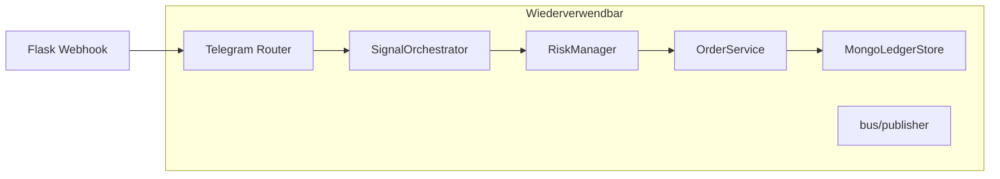
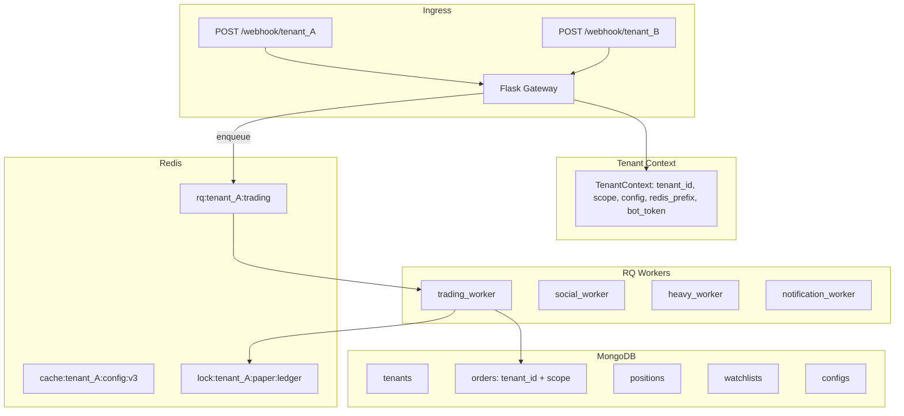

# Multi-Tenant Migration & Architekturplan

Stand: Juli 2026 · Basis: `main` @ v1.8.0 (Monolith + Mongo-Ledger + Redis optional)

## Ziel

Den Trading-Bot von einem **Single-User-Monolithen** zu einem **Multi-Tenant-System** umbauen, sodass mehrere Nutzer unabhängig voneinander ihren eigenen Bot mit eigenen Einstellungen, Watchlists, Strategien und Kapital betreiben können.

**Getroffene Architektur-Entscheidungen:**

| Thema | Entscheidung |
|-------|--------------|
| Deployment | **Hybrid** (empfohlen): gemeinsame Worker-/Daten-Infrastruktur, strikte `tenant_id`-Isolation |
| Telegram | **Bot pro Tenant**: eigenes Token + Webhook pro Nutzer |
| Worker-Ziel | **RQ zuerst** (Redis), asyncio für I/O; Celery optional später |
| Datenbank | **MongoDB** mit Compound-Keys `{tenant_id, ledger_scope}` |

---

## 1. Analyse der aktuellen Struktur

### 1.1 Was gut ist (wiederverwendbar)

| Baustein | Datei(en) | Warum wiederverwendbar |
|----------|-----------|------------------------|
| Ledger-Scope-Konzept | `storage/mongo_ledger.py`, `data_manager.py` | `demo`/`paper`/`live` als zweiter Partition-Key neben `tenant_id` |
| Mongo-Ledger | `storage/mongo_ledger.py` | Orders/Positions/Trade-History bereits in Mongo |
| Command-Router | `notifications/telegram_commands/router.py` | Modulare Handler-Kette |
| Per-Chat State | `notifications/telegram_commands/command_context.py` | `contexts[chat_id]` — Muster skaliert auf Multi-User |
| Redis-Bus (optional) | `bus/` (locks, dedup, publisher, heartbeats) | Prefix erweiterbar auf `aria:{tenant_id}:` |
| Single-Writer Trading | `services/trading_service.py`, `bus/locks.py` | Korrekt für Geld-Pfade — nur tenant-scoped machen |
| Signal-Pipeline | `services/signal_orchestrator.py` | Trading-Logik tenant-agnostisch, wenn Config/Ledger injiziert |
| Architektur-Roadmap | `ARCHITECTURE_PLAN.md` | Redis-Entkopplung als Vorarbeit |



### 1.2 Was problematisch für Multi-User ist

| Problem | Ort | Risiko |
|---------|-----|--------|
| Kein `tenant_id` | Mongo `_id = scope` nur | Cross-Tenant Ledger-Zugriff |
| Globale `positions` Dict | `strategies/positions.py` L28–29 | Race + Datenvermischung |
| Eine `config.json` | `core/config.py`, `data_manager.py` | Alle teilen Strategien/Risk |
| Globale Watchlist | `data_manager.load_effective_watchlist()` | Kein per-User Coin-Set |
| `TELEGRAM_CHAT_ID` env | `telegram_notifier.py` | Outbound nur an einen Chat |
| Webhook ohne Auth | `aria_bot.py` L129–150 | Jeder Sender kann Commands auslösen |
| Ein globaler `price_loop` | `aria_bot.py` | Nicht skalierbar für N Nutzer |
| Global Heavy-Job-Session | `bus/sessions.py`, `bus/jobs.py` | Tenant B blockiert Tenant A |
| Redis ohne Tenant | `aria:lock:ledger:{scope}` | Lock-Kollision |
| Hermes/Social/Logs global | `hermes/memory/`, `logs/decisions.jsonl` | Keine Trennung |
| Eine Gate-Credential-Set | `config.live` + `.env` | Live nur für einen Exchange-Account |

### 1.3 Heutige Daten-Partitionierung

**Einziger Partition-Key:** `ledger_scope` (`demo` | `paper` | `live`) via `resolve_ledger_scope()` in `data_manager.py`.

- **Mongo:** max. 3 Dokumente pro Collection (`_id: "paper"`)
- **JSON:** `orders.{scope}.json`, `positions.{scope}.json`
- **Watchlist:** global, nicht scoped
- **Redis:** `aria:` Prefix, deployment-weit

**Fazit:** Scope = Trading-Modus, nicht User. Multi-Tenancy fehlt vollständig.

---

## 2. Empfohlene Ziel-Architektur (Hybrid)



**Hybrid bedeutet:**

- Ein **Gateway** + **Worker-Pool** (später separate Prozesse)
- Eine **MongoDB** mit `tenant_id` auf allen Dokumenten
- Pro Tenant: **eigenes Bot-Token**, **eigene Gate-Keys**, **eigene Watchlist/Config**
- Trading-Cycles als **per-Tenant-Jobs** (nicht ein globaler `price_loop`)

**Warum nicht „eine VM pro User“?** Schnell, aber N× Ops-Kosten, kein zentraler Fair-Scheduler.

**Warum nicht „ein Prozess, kein tenant_id“?** Heutiger Code bricht sofort (globale `positions`, eine Config).

---

## 3. Datenmodell MongoDB

### 3.1 Neue Collection: `tenants`

```python
# storage/schemas/tenant.py (neu)
{
    "tenant_id": "usr_01JABC...",       # stabil, URL-safe, unique
    "status": "active|suspended|trial",
    "plan": "free|pro",
    "telegram": {
        "bot_token_enc": "...",         # AES/KMS — nie Plaintext
        "bot_username": "MyTradingBot",
        "owner_chat_id": "123456789",
        "webhook_secret": "random",     # Telegram secret_token
    },
    "exchange": {
        "gate": {
            "api_key_enc": "...",
            "api_secret_enc": "...",
        }
    },
    "defaults": {
        "trading_mode": "paper",
        "ledger_scope": "paper",
    },
    "created_at": ISODate,
    "updated_at": ISODate,
}
```

**Indexes:**

```javascript
db.tenants.createIndex({ "tenant_id": 1 }, { unique: true })
db.tenants.createIndex({ "telegram.bot_username": 1 })
```

### 3.2 Ledger-Collections (Breaking Change)

**Heute:** `_id: "paper"` (max. 3 Docs)

**Ziel:** Compound Key `{tenant_id, ledger_scope}`

```python
# storage/mongo_ledger.py — neues Schema
{
    "_id": "usr_01JABC:paper",          # oder ObjectId + compound unique index
    "tenant_id": "usr_01JABC",
    "ledger_scope": "paper",
    "orders": [...],
    "migrated_from_trades": false,
    "updated_at": ISODate,
}
```

**Indexes (orders, positions, trade_history):**

```javascript
db.orders.createIndex({ "tenant_id": 1, "ledger_scope": 1 }, { unique: true })
db.orders.createIndex({ "tenant_id": 1, "orders.display_seq": 1 })
db.orders.createIndex({ "tenant_id": 1, "orders.symbol": 1, "orders.status": 1 })

db.positions.createIndex({ "tenant_id": 1, "ledger_scope": 1 }, { unique: true })
db.trade_history.createIndex({ "tenant_id": 1, "ledger_scope": 1 }, { unique: true })
```

### 3.3 Weitere Collections

| Collection | Key | Ersetzt |
|------------|-----|---------|
| `configs` | `{tenant_id}` | `config.json` |
| `config_revisions` | `{tenant_id, version}` | — (Audit/Rollback) |
| `watchlists` | `{tenant_id}` | `watchlist.json` |
| `watchlist_overlays` | `{tenant_id, overlay_type}` | `watchlist.*.overlay.json` |
| `hermes_profiles` | `{tenant_id, symbol, timeframe}` | `hermes/memory/*.json` |
| `command_contexts` | `{tenant_id, chat_id}` | `data/telegram_command_context.json` |
| `audit_events` | `{tenant_id, ts}` | `logs/decisions.jsonl` (optional TTL) |
| `social_snapshots` | `{tenant_id, source, ts}` | `x_posts.json`, `cmc_posts.json` |

### 3.4 Normalisierte Orders (Phase 3+, optional)

Langfristig: ein Order = ein Mongo-Doc statt Array im Blob. Bessere Pagination, Queries. Erst nach Compound-Key-Stabilisierung.

---

## 4. User-Isolation (Datenbank + Code)

### 4.1 TenantContext (zentrales Pattern)

Neues Modul `core/tenant_context.py`:

```python
from contextvars import ContextVar
from dataclasses import dataclass

@dataclass(frozen=True)
class TenantContext:
    tenant_id: str
    scope: str                    # demo|paper|live
    config: dict
    redis_prefix: str             # f"aria:{tenant_id}:"
    owner_chat_id: str
    bot_token: str                # decrypted, nur Request-Lifetime

_ctx: ContextVar[TenantContext | None] = ContextVar("tenant_ctx", default=None)

def require_tenant() -> TenantContext:
    ctx = _ctx.get()
    if not ctx:
        raise RuntimeError("No tenant context — bug in call chain")
    return ctx

def tenant_scope() -> tuple[str, str]:
    c = require_tenant()
    return c.tenant_id, c.scope
```

**Regel:** Jeder DB-/Redis-Zugriff liest `tenant_id` aus `require_tenant()`. Kein impliziter Default-Tenant in Produktion.

### 4.2 MongoLedgerStore

```python
# storage/mongo_ledger.py
class MongoLedgerStore:
    def load_orders(self, tenant_id: str, scope: str) -> dict:
        doc = self._collection(ORDERS_COLLECTION).find_one({
            "tenant_id": tenant_id,
            "ledger_scope": scope,
        })
        if not doc:
            return _empty_orders(scope)
        ...
```

Alle Aufrufer (`OrderService`, `data_manager`, `positions.py`) bekommen `tenant_id` durchgereicht oder lesen aus Context.

### 4.3 Positions-In-Memory (kritisch)

`strategies/positions.py` — globales `positions = {}` ersetzen:

```python
_position_stores: dict[tuple[str, str], dict] = {}

def _store() -> dict:
    tid, scope = tenant_scope()
    key = (tid, scope)
    if key not in _position_stores:
        _position_stores[key] = {}
    return _position_stores[key]
```

**Worker-sichere Alternative:** Kein Shared Memory — Position aus Mongo, kurzer Redis-Cache (TTL 2s).

### 4.4 Config-Isolation

```python
# core/config.py
class BotConfig:
    def __init__(self, raw: dict | None = None, *, tenant_id: str | None = None):
        if raw is None:
            raw = load_tenant_config(tenant_id or require_tenant().tenant_id)
        self._tenant_id = tenant_id
        self._raw = raw
```

### 4.5 Redis-Key-Schema

```
aria:{tenant_id}:lock:ledger:{scope}
aria:{tenant_id}:cache:config:{version}
aria:{tenant_id}:cache:watchlist
aria:{tenant_id}:dedup:x:{post_id}
aria:{tenant_id}:signals:snapshot
aria:{tenant_id}:jobs:heavy
aria:{tenant_id}:notifications
```

Anpassung in `bus/locks.py`, `bus/dedup.py`, `bus/publisher.py`:

```python
def redis_prefix(tenant_id: str) -> str:
    return f"aria:{tenant_id}:"
```

---

## 5. Telegram: Bot pro Tenant

### 5.1 Webhook-Routing

`aria_bot.py` erweitern:

```python
@app.route("/webhook/<tenant_id>", methods=["POST"])
def webhook_tenant(tenant_id: str):
    tenant = tenant_registry.get_active(tenant_id)
    if not tenant:
        return "Not found", 404

    secret = request.headers.get("X-Telegram-Bot-Api-Secret-Token", "")
    if secret != tenant.telegram.webhook_secret:
        return "Forbidden", 403

    update = request.get_json()
    chat_id = _extract_chat_id(update)

    if not tenant.is_authorized_chat(chat_id):
        return "Forbidden", 403

    with tenant_context(tenant, chat_id=chat_id):
        return _dispatch_telegram_update(update)
```

Legacy-Route `POST /` bleibt für `tenant_id=default` während Migration.

### 5.2 Webhook-Registrierung

```python
# scripts/register_tenant_webhook.py
def register(tenant_id: str):
    tenant = registry.load(tenant_id)
    token = decrypt(tenant.telegram.bot_token_enc)
    set_webhook(
        token=token,
        url=f"{BASE_URL}/webhook/{tenant_id}",
        secret_token=tenant.telegram.webhook_secret,
    )
```

### 5.3 Outbound-Nachrichten

`telegram_notifier.py`:

```python
def _send_telegram_direct(text, chat_id=None, *, tenant: TenantContext | None = None):
    ctx = tenant or require_tenant()
    token = ctx.bot_token
    chat_id = chat_id or ctx.owner_chat_id
    # POST https://api.telegram.org/bot{token}/sendMessage
```

`TELEGRAM_BOT_TOKEN` / `TELEGRAM_CHAT_ID` nur noch als **Legacy-Fallback** für Single-Tenant.

### 5.4 Conversation State

`command_context.py` — Key `(tenant_id, chat_id)`:

```python
def _context_key(tenant_id: str, chat_id: str) -> str:
    return f"{tenant_id}:{chat_id}"
```

Persistenz: Mongo `command_contexts` statt `data/telegram_command_context.json`.

### 5.5 Heavy Jobs pro Tenant

`bus/sessions.py`:

```python
class CommandSessionManager:
    def is_busy(self, tenant_id: str) -> bool:
        return self._active.get(tenant_id) is not None
```

Tenant A: `/backtest` läuft. Tenant B: Trading unbeeinträchtigt.

### 5.6 Auth-Lücke schließen

Heute: nur `telegram_ask_bridge._authorized_chat()` prüft `TELEGRAM_CHAT_ID`.

**Ziel:** Jeder Webhook-Handler prüft `tenant.is_authorized_chat(chat_id)` bevor Commands ausgeführt werden.

---

## 6. Worker-Struktur: Threading → RQ + Asyncio

### 6.1 Ist-Zustand

| Komponente | Datei | Modell |
|------------|-------|--------|
| `price_loop` | `aria_bot.py` | Daemon-Thread, global |
| `entry_sensor_loop` | `services/entry_sensor_loop.py` | Daemon-Thread, global |
| Heavy Jobs | `bus/jobs.py` | In-Process Queue, 1 global |
| Notifications | `bus/notifications.py` | In-Process Worker |
| Social | `services/background_runtime.py` | ThreadPoolExecutor(3) |

Kein Celery/RQ. Redis optional für Streams/Locks.

### 6.2 Ziel-Prozess-Split

| Prozess | Verantwortung | Technologie |
|---------|---------------|-------------|
| `gateway` | Webhooks, schnelle Commands, enqueue | Flask + ContextVar |
| `trading-worker` | Trading-Cycle pro Tenant | RQ |
| `sensor-worker` | 15m Entry-Sensor | RQ periodic |
| `social-worker` | X/CMC/LC Fetch | asyncio + aiohttp |
| `heavy-worker` | Backtest, Hermes, Replay | RQ (parallel pro Tenant) |
| `notify-worker` | Telegram async send | RQ + Rate limit |

### 6.3 Trading-Cycle als Job

```python
# workers/trading_cycle.py
def run_trading_cycle(tenant_id: str):
    tenant = tenant_registry.load(tenant_id)
    with tenant_context(tenant):
        orchestrator = build_orchestrator()
        watchlist = load_effective_watchlist()
        for coin in watchlist:
            orchestrator.process_coin(coin)
```

**Scheduler (RQ Scheduler):**

```python
scheduler.schedule(
    scheduled_time=datetime.utcnow(),
    func=run_trading_cycle,
    args=[tenant_id],
    interval=tenant.config["update_interval"],
)
```

### 6.4 Asyncio für I/O

```python
# services/social_pipeline_async.py
async def fetch_all_sources(tenant_id: str) -> SignalSnapshot:
    async with aiohttp.ClientSession() as session:
        x, cmc, lc = await asyncio.gather(
            fetch_x(session, tenant_id),
            fetch_cmc(session, tenant_id),
            fetch_lc(session, tenant_id),
        )
    return merge(x, cmc, lc)
```

Übergang: `asyncio.run()` im RQ-Worker.

### 6.5 Was serialisiert bleibt

- **Order-Execution** pro `(tenant_id, scope)` — `_execute_lock` / Redis Lock
- **Coin-Analyse** pro Tenant sequentiell — Parallelität nur für I/O (Preise, Social)

---

## 7. Push-basierte Datenversorgung

| Daten | Heute (Pull) | Ziel |
|-------|--------------|------|
| Telegram Commands | Webhook (Push) | Unverändert |
| Preise | REST Poll jeden Cycle | WebSocket → Redis `prices:{tenant}:{symbol}` |
| 15m Sensor | 20s OHLCV Pull | Preis-Stream + Candle-Close Event |
| Social X/CMC/LC | Cycle Pull | Webhooks wo möglich; sonst Pull + Dedup |
| Config-Änderung | File reload | Redis Pub/Sub `config_invalidate:{tenant_id}` |
| Notifications | Direct send | Stream `notifications:{tenant_id}` (bereits in `bus/publisher.py`) |

**Pragmatischer Start:** Preis-Push als separater `price-feed` Service (Phase 3).

```python
# price_feed/subscriber.py
async def on_price_update(tenant_id: str, symbol: str, price: float):
    redis.hset(f"aria:{tenant_id}:prices", symbol, price)
```

---

## 8. Redis-Caching & Invalidierung

### 8.1 Cache-Layer

| Key | TTL | Inhalt |
|-----|-----|--------|
| `cache:config:{v}` | 5 min | Deserialisierte Config |
| `cache:watchlist` | 2 min | Effective Watchlist |
| `cache:tenant_meta` | 10 min | Plan, Status, Token-Refs |
| `prices` | 30s | Letzter Preis pro Symbol |
| `signals:snapshot` | 60s | Social-Snapshot |

### 8.2 Version-basierte Invalidierung

```python
# Bei Config-Save:
new_version = current_version + 1
db.configs.update_one(
    {"tenant_id": tid},
    {"$set": {"body": cfg, "version": new_version}},
)
redis.publish(f"aria:{tid}:config_invalidate", str(new_version))
```

Worker subscribed:

```python
def on_config_invalidate(tenant_id: str, version: str):
    _config_cache.pop(tenant_id, None)
```

Gleiches Muster für Watchlist bei `/watchlist add`.

---

## 9. Sicherheit & Skalierung

### Sicherheit (P0)

- **Secrets:** Bot-Token + Gate-Keys encrypted at rest (Fernet/KMS)
- **Webhook:** `secret_token` pro Tenant (Telegram Header-Check)
- **Chat-Auth:** Alle Commands, nicht nur `/ask`
- **Tenant-Suspension:** `status != active` → 403 + Worker skip
- **Mongo:** Jeder Query filtert `tenant_id` — Integrationstests mit 2 Tenants
- **Rate Limits:** Pro `tenant_id` + `chat_id` (Redis sliding window)
- **Live-Trading:** `live_confirmed` pro Tenant in Mongo

### Skalierung

- **Horizontal:** Mehrere `trading-worker` Replicas; Idempotenz via Redis `SET NX`
- **Fair Scheduling:** Round-robin Tenant-Queue
- **Mongo Sharding:** Später auf `tenant_id` (bei >1000 Tenants)
- **Observability:** `tenant_id` in jedem Log + Metrics-Label

---

## 10. Migrations-Roadmap (priorisiert)

### Phase 0 — Foundation (Woche 1–2) — P0

| # | Task | Dateien |
|---|------|---------|
| 0.1 | `tenants` Collection + `TenantRegistry` | `storage/tenant_registry.py` (neu) |
| 0.2 | `TenantContext` + Webhook-Middleware | `core/tenant_context.py` (neu) |
| 0.3 | MongoLedgerStore `{tenant_id, scope}` | `storage/mongo_ledger.py` |
| 0.4 | Migration Single-User → `tenant_id=default` | `scripts/migrate_single_to_tenant.py` |
| 0.5 | Cross-Tenant-Leak-Tests | `tests/unit/test_tenant_isolation.py` |

**Risiko:** Breaking Mongo `_id`. **Mitigation:** Dual-Read (alt+neu) 2 Wochen.

### Phase 1 — Isolation (Woche 3–5) — P0/P1

| # | Task | Dateien |
|---|------|---------|
| 1.1 | Positions tenant-scoped | `strategies/positions.py` |
| 1.2 | Config + Watchlist → Mongo | `data_manager.py`, `core/config.py` |
| 1.3 | Command context → Mongo | `command_context.py` |
| 1.4 | `/webhook/<tenant_id>` + Bot-Registrierung | `aria_bot.py`, `scripts/register_tenant_webhook.py` |
| 1.5 | `telegram_notifier` tenant-aware | `telegram_notifier.py` |
| 1.6 | Auth auf allen Commands | `aria_bot.py`, Router |

**Feature-Flag:** `MULTI_TENANT_ENABLED=true`

### Phase 2 — Worker-Entkopplung (Woche 6–8) — P1

| # | Task |
|---|------|
| 2.1 | RQ Setup + `trading_cycle` Job |
| 2.2 | `price_loop` → RQ Scheduler |
| 2.3 | Heavy Jobs tenant-scoped in RQ |
| 2.4 | Redis-Prefix überall |
| 2.5 | Gateway bleibt dünn (Webhook + enqueue) |

**Risiko:** Job-Duplikate. **Mitigation:** Redis Job-Dedup-Key.

### Phase 3 — Optimierung (Woche 9+) — P2

| # | Task |
|---|------|
| 3.1 | Async Social Pipeline |
| 3.2 | Price WebSocket Feed |
| 3.3 | Normalisierte Order-Docs |
| 3.4 | Admin-API / CLI für Tenant-Onboarding |

---

## 11. Migrations-Skripte

### 11.1 Single-User → Default Tenant

```python
# scripts/migrate_single_to_tenant.py
DEFAULT_TENANT = "default"

def migrate():
    registry.create_tenant(
        tenant_id=DEFAULT_TENANT,
        telegram_token=os.environ["TELEGRAM_BOT_TOKEN"],
        owner_chat_id=os.environ["TELEGRAM_CHAT_ID"],
    )
    for scope in ("demo", "paper", "live"):
        old = mongo.orders.find_one({"_id": scope})
        if old:
            payload = {k: v for k, v in old.items() if k != "_id"}
            payload["tenant_id"] = DEFAULT_TENANT
            payload["ledger_scope"] = scope
            mongo.orders.replace_one(
                {"tenant_id": DEFAULT_TENANT, "ledger_scope": scope},
                payload,
                upsert=True,
            )
    # config.json → configs Collection
    # watchlist.json → watchlists Collection
```

### 11.2 Neuer Tenant Onboarding

```python
# services/tenant_onboarding.py
def onboard_tenant(bot_token: str, owner_chat_id: str, gate_keys: dict | None = None):
    tenant_id = generate_tenant_id()
    encrypt_and_store_secrets(tenant_id, bot_token, gate_keys)
    seed_default_config(tenant_id)
    seed_empty_ledgers(tenant_id)
    register_webhook(tenant_id)
    enqueue_trading_cycle(tenant_id)
    return tenant_id
```

---

## 12. Test-Strategie

- **Contract Tests:** Store-Adapter mit 2 `tenant_id`s — kein Cross-Read
- **Integration:** Zwei Bots, zwei Webhooks, parallele `/buy` — getrennte Ledgers
- **Migration:** Snapshot vor/nach `migrate_single_to_tenant.py`
- Erweitern: `tests/unit/test_mongo_backend.py`, `tests/unit/test_order_isolation.py`

---

## 13. Bewusst NICHT in Phase 1

- Vollständiger Celery-Beat-Cluster
- Order-Normalisierung (zu großer Big-Bang)
- Self-Service-UI/Portal
- Multi-Exchange pro Tenant

---

## 14. Zusammenfassung

| Entscheidung | Wahl |
|--------------|------|
| Deployment | Hybrid — shared Workers + Mongo, `tenant_id` überall |
| Telegram | Bot pro Tenant — `/webhook/{tenant_id}` |
| Worker | RQ zuerst, asyncio für I/O |
| Mongo | Compound `{tenant_id, ledger_scope}` + `tenants` Collection |
| Erster Schritt | `TenantContext` + Mongo-Ledger-Migration |

Der Monolith in `aria_bot.py` bleibt als **Gateway + Legacy-Fallback** bis Phase 2 — kein Big-Bang-Rewrite.

---

## Referenzen im Repo

- `ARCHITECTURE_PLAN.md` — Redis-Prozess-Architektur (Vorarbeit)
- `docs/RAILWAY_PLAN.md` — Deployment, Mongo-Guard
- `storage/mongo_ledger.py` — aktuelles Ledger-Schema
- `storage/ledger_router.py` — Backend-Routing (JSON/Mongo/Dual-Write)
- `bus/` — Redis Streams, Locks, Jobs