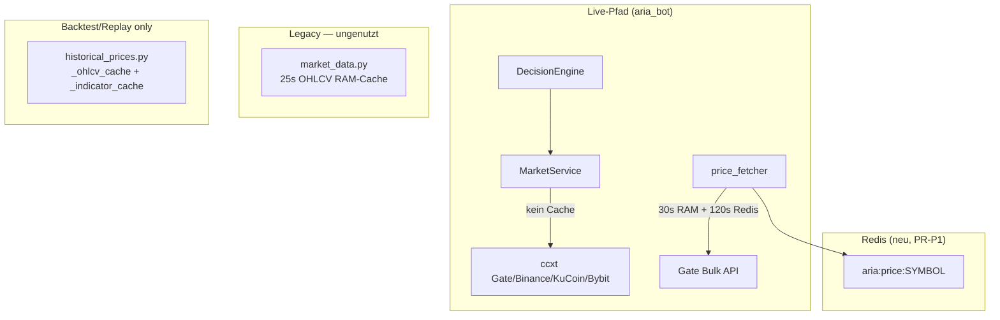
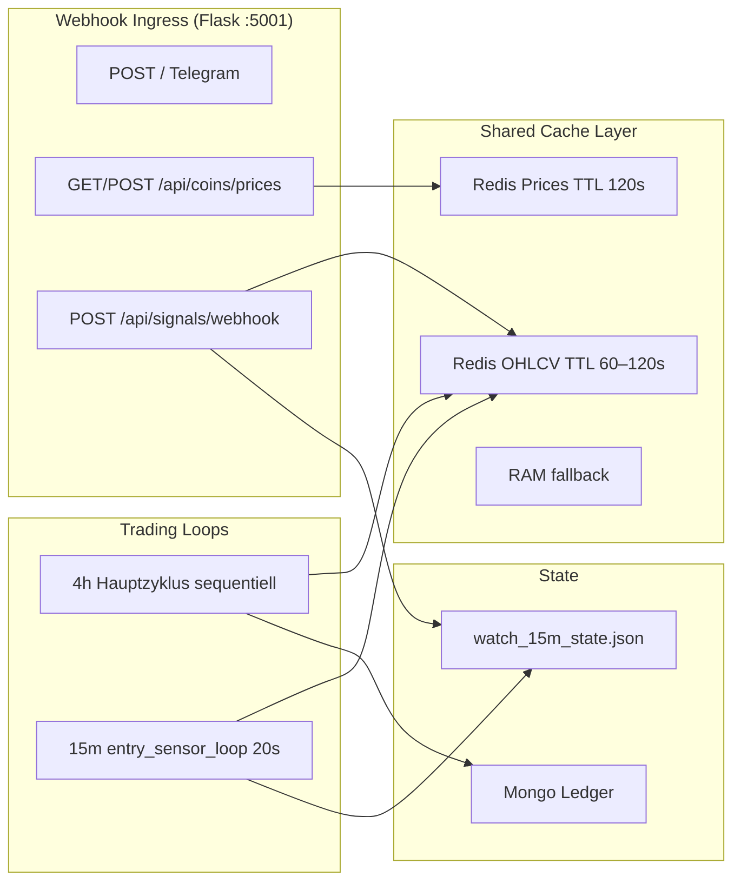
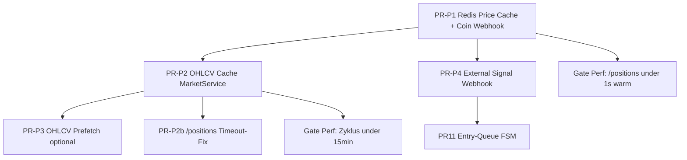

# Plan: Performance, Caching & Webhook-Architektur

> **Status:** PR-P1 + PR-P2 + PR-P4 done · **nächster Hebel: PR-P2c** (Audit 2026-07-18)  
> **Kontext:** Bot fühlt sich langsam an; Preis-/OHLCV-Fetches dominieren; externe Alerts fehlen  
> **Branch:** `staging` (live) · Historie: `feature/entry-guard-15m` / perf-webhooks  
> **Erstellt:** 2026-07-08 · **Audit-Update:** 2026-07-18  
> **Verwandt:** [`plans/entry-queue-fsm.md`](entry-queue-fsm.md) · [`ARCHITECTURE_PLAN.md`](../ARCHITECTURE_PLAN.md) § Monolith-Härtung  
> **Nicht in diesem Plan:** Epic #65 Decision Agents · Social P1 (#7/#8)

---

## 1. Problemstellung

### 1.1 Beobachtete Latenzen (Demo, Juli 2026)

| Pfad | Gemessen | Ziel |
|------|----------|------|
| Trading-Zyklus (66 Coins) | **28–43 min** | < 10 min |
| `/positions` (40 Coins, kalt) | **~8,4 s** | < 1 s warm |
| `/positions` (Redis warm) | **~164 ms** | ✓ erreicht |
| Coin-Webhook 2. Aufruf | **~164 ms** | ✓ erreicht |
| `update_interval` Config | **120 s** | Zyklus >> Interval → Bot schläft nie |

Log-Belege:
```
Cycle completed in 1697s (66 coins, 40 positions first)
Cycle completed in 2580s (68 coins, 34 positions first)
```

### 1.2 Nutzer-Symptome

- Telegram `/positions` wirkt träge (Preis-API, nicht Mongo/Redis)
- Bot „hängt“ — permanent im Zyklus, kaum Pause zwischen Runden
- Externe Alerts (TradingView, CMC) können nicht schneller reagieren als 20s-Poll

### 1.3 Nicht-Ziele

- Parallele `process_coin` ohne Ledger-Lock (Churn-Risiko, siehe ARCHITECTURE_PLAN P0)
- Direkt-Trading aus Webhooks (Risk-Bypass)
- Separater FastAPI/Uvicorn-Prozess (Flask reicht)
- Redis als Pflicht für Ledger (nur Cache/Events)

---

## 2. Ist-Analyse: Drei Welten im Repo



| Modul | Cache | Live genutzt? |
|-------|-------|---------------|
| `market_data.py` | 25s RAM `(symbol, tf)` | ❌ nirgends importiert |
| `historical_prices.py` | Range-Cache für Replay | ❌ nur Backtest/Hermes |
| `price_fetcher.py` | 30s RAM + Redis 120s | ✅ Zyklus, `/positions`, Webhook |
| `MarketService._fetch_ohlcv` | **keiner** | ✅ jeder Coin, jeder Call frisch |
| `bus/price_cache.py` | Redis TTL 120s | ✅ seit PR-P1 |

**Kernursache Zyklus-Langsamkeit:** `MarketService` erstellt pro Aufruf neuen `ccxt`-Client, kein OHLCV-Cache, bis zu **4–7 Netzwerk-Runden pro Coin mit Position** (Indicators, Funding, BTC-Underperf, 15m-Sensor).

---

## 3. Zielarchitektur



**Prinzipien:**

1. **Ein Prozess, ein Flask** — alle Webhooks auf Port 5001 (Ngrok)
2. **Redis = shared I/O cache** — Preise + OHLCV + externe Signal-Events
3. **Trading bleibt Single-Writer** — Webhooks schreiben nur Watch/Queue, nie Orders
4. **Fail-open** — Redis down → RAM/In-Memory + Exchange (wie heute)

---

## 4. Webhook-Landschaft (klare Trennung)

| Route | Zweck | Status | Redis |
|-------|--------|--------|-------|
| `POST /` | Telegram Commands | ✅ live | — |
| `GET/POST /api/coins/prices` | Preisabfragen (extern/Scripts) | ✅ PR-P1 | `aria:price:*` |
| `GET /health/detail` | Bot + Redis Status | ✅ PR-P1 | ping |
| `POST /api/signals/webhook` | Externe Trading-Alerts | ✅ PR-P4 | `aria:events.external_signals` |

### 4.1 Coin-Price-Webhook (implementiert — PR-P1)

**Zweck:** Schnelle Preisabfragen, **kein** Trading-Signal.

```bash
curl "http://127.0.0.1:5001/api/coins/prices?symbols=BTC,ETH,SOL"
```

Flow: Redis-first → `get_prices_batch` → Gate Bulk → Redis write.

Config (`architecture`):
```json
{
  "price_cache_enabled": true,
  "price_cache_ttl_sec": 120,
  "coin_query_webhook_enabled": true
}
```

Auth (optional): `COIN_WEBHOOK_TOKEN` / Header `X-Coin-Token`.

**Wichtig:** `/positions` nutzt **nicht** den HTTP-Webhook — geht direkt `price_fetcher` → Redis. Der Webhook ist ein öffentliches API-Fenster auf denselben Cache.

### 4.2 External-Signal-Webhook (geplant — PR-P4)

**Zweck:** TradingView, CMC Alerts, CryptocurrencyAlerting, eigene Hooks → 15m-Priorität.

**Nicht** den Coin-Price-Webhook missbrauchen.

#### Normalisiertes Schema

```json
{
  "source": "tradingview",
  "symbol": "VELVET/USDT",
  "event_type": "volume_spike",
  "strength": 0.8,
  "timestamp": "2026-07-08T12:00:00Z",
  "raw": { }
}
```

`event_type` Enum (erweiterbar):
- `volume_spike`
- `price_breakout`
- `news_alert`
- `generic`

#### Verarbeitung (kein Direkt-Trade)

```mermaid
sequenceDiagram
    participant Ext as TradingView/CMC
    participant WH as POST /api/signals/webhook
    participant Redis as Redis Event Stream
    participant W15 as watch_15m_state
    participant Loop as entry_sensor_loop
    participant DE as DecisionEngine

    Ext->>WH: Alert JSON + Token
    WH->>WH: validate + normalize
    WH->>Redis: XADD aria:events.signals
    WH->>W15: set_watch(reason=webhook:tradingview)
    WH-->>Ext: 200 ok
    Loop->>W15: priority poll (gap bypass 1x)
    Loop->>DE: 15m metrics + 4h RSI
    DE->>DE: Risk Manager (unchanged)
```

#### Integrationspunkte (bestehend)

| Hook | Datei | Aktion |
|------|-------|--------|
| Watch setzen | `strategies/watch_15m_state.py` | `set_watch(symbol, reason="webhook:{source}")` |
| Sofort-Poll | `services/entry_sensor_loop.py` | `_should_poll_symbol` bypass für webhook-Watches |
| Buy-Pfad | `strategies/decision_engine.py` | `_apply_entry_sensor_buy` (unverändert) |
| Audit | `logs/signal_webhooks.jsonl` | append-only |

#### Sicherheit

```bash
SIGNAL_WEBHOOK_TOKEN=...
# Header: X-Signal-Token  oder  ?token=
```

Config:
```json
{
  "signal_webhook_enabled": true,
  "signal_webhook_token": "",
  "signal_event_ttl_sec": 3600
}
```

#### Adapter-Modul

```
webhooks/
  __init__.py
  auth.py
  schemas.py          # ExternalSignal dataclass
  router.py           # register_routes(app)
  store.py            # Redis stream + JSONL audit
  adapters/
    generic.py
    tradingview.py
    cmc_alert.py
```

---

## 5. Performance: OHLCV-Cache (PR-P2 — höchster Hebel)

### 5.1 Problem pro Coin (mit Position)

| Aufruf in `build_market_context` | Requests |
|----------------------------------|----------|
| `fetch_indicators` (4h peek + evtl. 2. TF) | 1–2 OHLCV |
| `fetch_funding_rate` | 0–3 Exchanges |
| `btc_underperformance_ratio` | 2 OHLCV (Coin + BTC) |
| `fetch_15m_sensor_metrics` | +1 OHLCV |

× 40 Positionen × `enableRateLimit` ≈ **25–40 s/Coin** → 28–43 min/Zyklus.

Zusätzlich: **neuer ccxt-Exchange pro `_fetch_ohlcv`-Call** (`market_service.py:215`).

### 5.2 Design: `OhlcvCache` (RAM + optional Redis)

Port des 25s-Musters aus `market_data.py` nach `MarketService`:

```python
# bus/ohlcv_cache.py (neu)
@dataclass
class CachedOhlcv:
    df: pd.DataFrame  # oder serialisierte bars
    fetched_at: float
    exchange: str

class OhlcvCache:
    def get(symbol, timeframe, limit) -> CachedOhlcv | None
    def set(symbol, timeframe, limit, df, exchange)
    def available() -> bool  # Redis ping
```

**Cache-Key:** `(symbol, timeframe, limit)` — nicht Zeitfenster wie `historical_prices` (Replay).

**TTL nach Timeframe:**

| TF | TTL |
|----|-----|
| 15m | 60 s |
| 1h | 90 s |
| 4h | 120 s |

**BTC/USDT:** einmal pro Zyklus cachen, in `btc_underperformance_ratio` wiederverwenden.

**Exchange-Client:** Singleton pro Exchange-Name (nicht pro Fetch neu instanziieren).

### 5.3 Funding-Rate-Cache

Separater TTL **300 s** pro Symbol — Funding ändert sich langsam.

Gate-only first (wie heute), Binance/Bybit nur bei Miss.

### 5.3 Erwarteter Effekt

| Metrik | Vorher | Nachher (geschätzt) |
|--------|--------|---------------------|
| Zyklus 66 Coins | 28–43 min | **8–15 min** |
| OHLCV-Calls/Zyklus | ~200–400 | ~50–80 |
| Redis Keys | price only | price + ohlcv |

### 5.4 Was bewusst nicht parallelisiert wird

ARCHITECTURE_PLAN **P0**: `process_coin` sequentiell — Ledger-Races vermeiden.

Parallel erlaubt nur für **read-only I/O**:
- Preis-Batch (bereits)
- OHLCV prefetch Batch am Zyklusstart (PR-P3, optional)
- Social-Fetch (bereits Background)

---

## 5.5 Audit 2026-07-18: Stack-Impacts & PR-P2c (nächster einzelner Hebel)

### 5.5.1 Was die „Gate × 48 sequential“-These falsch annimmt

| Annahme | Realität im Repo (staging) |
|---------|----------------------------|
| 48× Gate-Ticker serial | ❌ `get_prices_batch` → `_fetch_gate_bulk` (1 HTTP) + 30s RAM + optional Redis |
| Heartbeat alle 30s | ❌ `eval_position_heartbeat_sec: **300**`, `eval_meta_interval_sec: **300**` |
| eval_worker blockiert POST | ❌ eigener Daemon-Thread; HTTP-Webhook ≠ Coin-Eval |
| Kein OHLCV-Cache | ❌ **PR-P2 done**: `bus/ohlcv_cache.py`, `ohlcv_cache_enabled: true`, TTL 15m/1h/4h |
| Regime uncached teuer | ⚠️ Detector selbst ist CPU-leicht; **teuer ist der 2. OHLCV-Fetch** |

Gate-Parallelisierung als „die eine Sache“ liefert **kaum** Gewinn.  
**Die eine Sache** = OHLCV-Limit-Split + Doppel-Fetch im Decision-Path beheben (**PR-P2c**).

### 5.5.2 Root cause (nach PR-P2)

Cache-Key ist `(symbol, timeframe, **limit**)`:

| Aufrufer | limit | Cache-Key |
|----------|-------|-----------|
| `fetch_indicators` (TA / RSI / BB) | **100** (default) | `…:4h:100` |
| `RegimeDetector` via `evaluate` | **300** | `…:4h:300` |
| Entry/Exit 15m Sensor | ~50 | `…:15m:50` |
| `btc_underperformance` / funding paths | periods+5 | eigene Keys |

→ Selbst bei warmem Cache: **2 Netzwerk-Hits pro Coin+TF** (100er + 300er), plus ggf. 4h-Peek vor TF-Refinement.

```text
evaluate(coin)
  └─ build_market_context
       ├─ fetch_indicators(4h, limit=100)     # Miss → Gate OHLCV
       └─ fetch_indicators(tf, limit=100)     # ggf. 2. Miss
  └─ if regime_detector.enabled:
       └─ fetch_ohlcv(tf, limit=300)          # IMMER anderer Key → 3. Miss
```

`RegimeDetector.detect` braucht nur **≥30 Bars** für Tech-Score; 300 ist „nice to have“, kein harter API-Vertrag.

### 5.5.3 Stack-Landkarte: wer OHLCV/Regime berührt

```text
┌─────────────────────────────────────────────────────────────────┐
│ xagent-test (Railway, Flask + Threads)                          │
│                                                                 │
│  Meta-Cycle (aria_bot)                                          │
│    get_prices_batch ──► price_cache (OK)                        │
│    seed_meta_producers ──► Redis eval_queue                     │
│    portfolio DCA ──► fetch_indicators (limit 100)               │
│                                                                 │
│  eval_worker (serial jobs)                                      │
│    process_eval_job ──► process_coin / entry_15m                │
│         │                                                       │
│         ▼                                                       │
│  DecisionEngine.evaluate                                        │
│    MarketService._fetch_ohlcv ◄── bus.ohlcv_cache (RAM+Redis)   │
│    RegimeDetector (enabled=true) + StrategyAllocator            │
│    RiskManager (execute) ──► frischer Order-Preis, nicht OHLCV  │
│                                                                 │
│  entry_sensor_loop (15m) ──► fetch_ohlcv 15m                    │
│  risk_manager sizing ──► fetch_indicators (ATR)                 │
│  grid / structure / exit sensors ──► diverse limits             │
└─────────────────────────────────────────────────────────────────┘
         │ snapshots (read-only)
         ▼
┌──────────────┐  ┌─────────────┐  ┌────────────┐  ┌──────────┐
│ Market Oracle│  │ Santiment   │  │ Hermes     │  │ Weaviate │
│ (kein Coin-  │  │ (kein Bot-  │  │ eigenes    │  │ Memory   │
│  OHLCV-Path) │  │  OHLCV)     │  │ backtester │  │ (kein    │
└──────────────┘  └─────────────┘  │ OHLCV)     │  │ OHLCV)   │
                                   └────────────┘  └──────────┘
```

| Komponente | Impact von PR-P2c | Risiko |
|------------|-------------------|--------|
| **DecisionEngine / process_coin** | Primär: 1 OHLCV statt 2–3 | Niedrig wenn limit-unified / slice-from-larger |
| **eval_worker** | Schnellere Jobs, weniger Queue-Stau | Niedrig |
| **Meta-Cycle** | Kürzer wenn Queue off oder DCA/indicators | Niedrig |
| **entry_sensor 15m** | Profitiert nur wenn 15m-Keys collapsen; **nicht** primäres Ziel | Mid: webhook-priority soll frisch bleiben → TTL 15m ≤ 60s belassen |
| **RiskManager / Orders** | Nutzt Indicators nur für ATR-Sizing; Order-Preis = live | **Keine** Stale-Preise auf Fills |
| **Grid / market structure** | Selber MarketService-Cache | Regime-Hysterese bleibt pro Symbol in Detector-State |
| **Multi-Tenant (default/henry)** | OHLCV ist **marktdaten-global** (kein Tenant-Key) — korrekt shared | Kein Isolation-Leak; Regime-Hysterese in `RegimeDetector` ist pro Orchestrator-Instanz (ein Bot-Prozess = OK) |
| **Mongo ledger** | Unberührt | — |
| **Memory / Weaviate / Hermes** | Unberührt (eigene Fetch-Pfade) | Nicht anfassen |
| **Oracle / Santiment / Macro** | Global bias snapshots, kein Coin-OHLCV | Unberührt |
| **price_fetcher / Gate bulk** | Out of scope für P2c | Optional später Timeout 2s |
| **Telegram POST /** | Nur indirekt (weniger Worker-CPU) | 500–797ms eher Webhook-Handler, nicht 48 Coins |

### 5.5.4 Sekundäre Latenzfallen (nicht „die eine Sache“, aber im Stack sichtbar)

1. **Exchange-Fallback-Cascade** (`MarketService.EXCHANGES = gate, binance, kucoin, bybit`):  
   Railway oft geo-blocked für Binance/Bybit → Timeout-Kette **nach** Gate-Fail.  
   → Optional **PR-P2d**: primary exchange only (`config.exchange` / Gate first, short timeout, no cascade on Railway).

2. **`process_eval_job`**: `get_prices_batch([single])` → bei Miss Full-Ticker-Bulk (großes JSON).  
   → Optional: single-pair Gate endpoint wenn batch size 1.

3. **`process_coin`**: `load_trade_history` pro Coin für Logzeile → Mongo N-Reads.  
   → Optional: einmal pro Tenant-Cycle cachen (nur Display).

4. **Doppel-Import / Doppel-RegimeDetector-Konstruktor** in `decision_engine` (Code-Hygiene, kein Perf-Hebel).

### 5.5.5 PR-P2c — Design (eine Sache, präzise)

**Ziel:** Pro `(symbol, timeframe)` höchstens **ein** Network-OHLCV pro TTL-Fenster für Decision+Regime.

**Bevorzugte Implementierung (minimal, logic-preserving):**

1. **Limit-Unification im Hot Path**  
   - `build_market_context` / `fetch_indicators` für Decision: `limit=max(100, regime_limit)` wenn Regime an, sonst 100.  
   - Regime: **kein** zweiter `fetch_ohlcv` — DataFrame aus Context wiederverwenden (in `MarketContext` oder Thread-local cycle bag).

2. **Cache-Serve-from-larger (optional hardening in `OhlcvCache.get`)**  
   - Request `limit=L`: wenn RAM/Redis Entry mit gleichem `(symbol, tf)` und `stored_limit >= L` und fresh → `bars[-L:]` return.  
   - Verhindert Misses durch unterschiedliche Limits (15m sensor 50 vs 100, funding ratios, …).

3. **TTL:** bestehende Map behalten (`15m:60`, `1h:90`, `4h:120`). **Nicht** global auf 30s senken (mehr Misses). **Nicht** Regime-Ergebnis separat 60s cachen (Hysterese + Allocator hängen an frischem Social-Context pro Eval — OHLCV cachen reicht).

4. **Kill-switch:** `architecture.ohlcv_cache_enabled` bleibt Master; optional `architecture.ohlcv_serve_from_larger: true`.

**Explizit out of scope P2c:**
- Trading-Algorithmus / Thresholds / Allocator-Gewichte  
- Parallel `process_coin`  
- Ledger / Multi-Tenant-Schreiben  
- Hermes Backtest OHLCV  
- Gate-Preis-Rewrite  
- Prefetch batch (bleibt PR-P3)

### 5.5.6 Erwarteter Effekt PR-P2c

| Situation | Vorher (typisch) | Nachher (Schätzung) |
|-----------|------------------|---------------------|
| 1× `evaluate` cold, Regime on | 2–3 OHLCV HTTP | **1** OHLCV HTTP |
| 2. Job gleicher Coin+TF innerhalb TTL | 1–2 Miss (limit-split) | **0** (serve-from-larger oder unified key) |
| Warm Hit-Rate Log | oft &lt;60% trotz Cache | **>70%** erreichbar |
| Memory | ~2 Keys × bars | 1 Key mit 300 Bars (~klein) |

### 5.5.7 Test- & Verify-Plan P2c

- Unit: `OhlcvCache` serve-from-larger (get 100 hits after set 300).  
- Unit: `DecisionEngine.evaluate` mit mock MarketService → **ein** `_fetch_ohlcv` Call wenn Regime on.  
- Unit: Multi-limit consumers (entry 15m limit≠100) regress-safe.  
- Staging: `ohlcv_cache: hits/misses` in Cycle-Log / `/health/detail`; Gate G-Perf-2 erneut messen.  
- Regression: bestehende `test_ohlcv_cache`, `test_market_service_*`, Decision/Risk unit suite.

### 5.5.8 Reihenfolge nach P2c (nur wenn nötig)

```text
PR-P2c  limit-unify + reuse DF (+ serve-from-larger)
   │
   ├─► messen Hit-Rate + Cycle/eval_worker latency
   │
   ├─► PR-P2d  exchange cascade short-circuit (Railway)
   ├─► PR-P2e  single-symbol price path (eval job)
   └─► PR-P3   prefetch batch (nur wenn Hit-Rate ok, Zyklus noch > Ziel)
```

---

## 6. Performance: Zyklus-Prefetch (PR-P3, optional)

Am Zyklusstart **einmal** für alle Watchlist-Symbole:

```python
symbols = [c["symbol"] for c in scan_coins]
prefetch_ohlcv_batch(symbols, timeframes=["4h", "15m"], limit=100)
```

- ThreadPool `max_workers=4` (nur Fetch, keine Trades)
- Ergebnis in `OhlcvCache` / Redis
- Hauptloop liest nur aus Cache

**Gate:** Nur aktivieren wenn PR-P2 allein < 15 min Zyklus nicht reicht.

---

## 7. Performance: `/positions` (PR-P1 done + PR-P2)

| Schicht | Latenz | Status |
|---------|--------|--------|
| Mongo Ledger | ~30 ms | ✅ |
| Preise kalt | ~8 s | ⚠️ Gate Bulk + CAT-Timeout |
| Preise Redis warm | ~164 ms | ✅ PR-P1 |
| Format HTML | ~50 ms | ✅ |

**Weitere Optimierungen (PR-P2b):**

- Illiquide Coins (CAT): sofort Entry-Fallback statt 6s Single-Fetch-Timeout
- `fast_daily_nav=True` beibehalten (bereits in `send_positions_snapshot`)
- Preis-Cache TTL auf 120s im RAM angleichen an Redis

---

## 8. Redis-Infrastruktur (PR-P1 done)

### 8.1 Ops

```bash
bash scripts/ensure_redis.sh   # brew services / redis-server
brew services start redis      # persistent
```

Eingebunden in:
- `scripts/restart_demo_scheduled.sh`
- `scripts/start_demo_with_ngrok.sh`

### 8.2 Key-Schema

| Key | Inhalt | TTL |
|-----|--------|-----|
| `aria:price:BTC_USDT` | `{price, source, updated_at}` | 120s |
| `aria:ohlcv:BTC_USDT:4h:100` | serialized bars (PR-P2) | 60–120s |
| `aria:signal:events` | Redis Stream (PR-P4) | maxlen 1000 |
| `aria:price:meta:last_refresh` | Batch-Metadaten | 120s |

### 8.3 Health

```
GET /health          → OK (plain, Restart-Scripts)
GET /health/detail   → {"redis": true, "price_cache_last_refresh": {...}}
```

### 8.4 Python-Dependency

`requirements.txt`: `redis>=5.0.0` ✅

---

## 9. 15m Entry-Sensor + Webhooks (PR-P4 + PR11)

Bestehend (`entry_sensor_15m`, `mode: active`, Poll 20s):

- Interne Vol-Spike-Erkennung → `watch_15m_state`
- Externe Webhooks = **zusätzliche Trigger-Quelle**, gleicher Buy-Pfad

Geplant [`entry-queue-fsm.md`](entry-queue-fsm.md) PR11:
- `pause` bei Position open (statt `clear_watch`)
- Webhook-Watch bleibt in Queue als `paused` → Re-Entry nach Full-Close

**Webhook-Boost (kein Size-Bypass):**

| Boost-Typ | Erlaubt | Verboten |
|-----------|---------|----------|
| Sofort-Poll (gap bypass 1×) | ✅ | — |
| `confidence +5..15` im Sensor | ✅ | — |
| `BUY_STRONG` wenn Setup passt | ✅ | — |
| Order-Size ohne RiskManager | — | ❌ |
| 4h-RSI-Filter überspringen | — | ❌ |

---

## 10. Config-Übersicht (Ziel)

```json
{
  "update_interval": 120,
  "architecture": {
    "redis_url": "redis://127.0.0.1:6379/0",
    "price_cache_enabled": true,
    "price_cache_ttl_sec": 120,
    "coin_query_webhook_enabled": true,
    "ohlcv_cache_enabled": true,
    "ohlcv_cache_ttl_sec": { "15m": 60, "1h": 90, "4h": 120 },
    "funding_cache_ttl_sec": 300,
    "signal_webhook_enabled": true,
    "signal_event_ttl_sec": 3600,
    "ohlcv_prefetch_enabled": false
  },
  "entry_sensor_15m": {
    "enabled": true,
    "mode": "active",
    "poll_interval_sec": 20,
    "webhook_priority_poll": true
  }
}
```

Env-Overrides:
- `COIN_WEBHOOK_TOKEN`
- `SIGNAL_WEBHOOK_TOKEN`
- `REDIS_URL`

---

## 11. PR-Plan (DAG)



| PR | Inhalt | Status | Tests |
|----|--------|--------|-------|
| **PR-P1** | `bus/price_cache.py`, `/api/coins/prices`, `ensure_redis.sh`, `price_fetcher` Redis layer | ✅ done | `test_price_cache_redis`, `test_coin_prices_webhook` |
| **PR-P2** | `bus/ohlcv_cache.py`, `MarketService` singleton exchange + cache, BTC-once-per-cycle, funding cache | ✅ done | `test_ohlcv_cache`, `test_market_service_*` |
| **PR-P2b** | `price_fetcher` illiquid timeout → entry fallback | 📋 | `test_price_fetcher` |
| **PR-P2c** | **Limit-unify Decision+Regime; reuse OHLCV DF; optional serve-from-larger** (§5.5) | 📋 **next** | `test_ohlcv_serve_larger`, DecisionEngine single-fetch |
| **PR-P2d** | Exchange-Fallback short-circuit (Gate-only / fail-fast on Railway) | 📋 after measure | market_service timeout tests |
| **PR-P2e** | Single-symbol price path (kein Full-Ticker-Bulk im eval_job) | 📋 optional | price_fetcher unit |
| **PR-P3** | `prefetch_ohlcv_batch` am Zyklusstart | 📋 optional | integration timing |
| **PR-P4** | `webhooks/` module, `/api/signals/webhook`, adapter generic+tradingview, `signal_webhooks.jsonl` | ✅ done | `test_signal_webhook` |
| **PR-P5** | Docs + `health/detail` OHLCV stats + Grafana-style log grep helper | 📋 | — |
| **PR11** | Entry FSM (separater Plan) | 📋 | siehe entry-queue-fsm.md |

---

## 12. Erfolgskriterien (Gates)

### Gate G-Perf-1 (nach PR-P1) ✅

- [x] Redis `PONG` bei Bot-Start
- [x] `/api/coins/prices` 2. Aufruf < 500 ms
- [x] `sell_policy_shadow` = 0 in active mode

### Gate G-Perf-2 (nach PR-P2 / **P2c**)

- [ ] Zyklus 66 Coins **< 15 min** (3 aufeinanderfolgende Logs) — oder mit Eval-Queue: meta-cycle + queue depth stabil
- [ ] OHLCV cache hit rate **> 70%** im Log-Sample (nach P2c; vorher oft limit-split)
- [ ] Pro `evaluate` mit Regime: **≤1** Network-OHLCV pro Symbol+TF innerhalb TTL (Unit-Beweis)
- [ ] Keine Regression: relevante Unit-Tests grün (`ohlcv`, `market_service`, decision/risk)

### Gate G-Perf-3 (nach PR-P4)

- [ ] TradingView-Test-Alert → `watch_15m_state` Eintrag < 1 s
- [ ] 15m-Poll innerhalb 5 s nach Webhook
- [ ] Kein Trade ohne Risk-Manager-Pass
- [ ] `logs/signal_webhooks.jsonl` auditierbar

---

## 13. Monitoring & Debugging

### Log-Zeilen (neu)

```
[INFO] Cycle completed in 840s (66 coins, 40 positions first)
[INFO] ohlcv_cache: hits=142 misses=38 hit_rate=78.9%
[INFO] signal_webhook: accepted tradingview VELVET/USDT volume_spike
[WARNING] Redis not reachable — price cache disabled
```

### Nützliche Commands

```bash
# Redis Preise
redis-cli KEYS 'aria:price:*' | head
redis-cli GET aria:price:BTC_USDT

# Health
curl http://127.0.0.1:5001/health/detail

# Zyklus-Timing
grep 'Cycle completed' logs/bot_restart.log | tail -5

# Webhook-Audit (nach PR-P4)
tail -20 logs/signal_webhooks.jsonl
```

---

## 14. Risiken & Mitigations

| Risiko | Mitigation |
|--------|------------|
| Stale OHLCV → falscher RSI | TTL kurz (60–120s); 15m-Sensor eigener frischer Fetch bei webhook-priority |
| Redis down | RAM-Fallback; Bot läuft weiter (wie PR-P1) |
| Webhook-Spam | Token + Rate-Limit pro Source (10/min) |
| TradingView Payload-Varianten | Adapter-Pattern; `generic` fallback |
| Zyklus immer noch > 15 min | PR-P3 Prefetch; Watchlist auf 45 Coins reduzieren (Config) |

---

## 15. Nicht in Scope

- FastAPI/Uvicorn separater Prozess
- Parallele `process_coin` ohne Lock
- OHLCV-Cache aus `historical_prices` direkt in Live-Pfad (falsches Key-Modell)
- Webhook → direkte Order-Execution
- Railway Redis (lokal erst; Deploy später)
- Telegram-Webhook umbauen

---

## 16. Zusammenfassung für Plan-Modus

**Bereits gelöst (PR-P1):** Redis-Preis-Cache, Coin-Query-Webhook, `/positions` warm < 200 ms, `ensure_redis.sh`.

**Nächster großer Hebel (PR-P2):** OHLCV-Cache in `MarketService` — portiert `market_data.py`-Muster, Redis optional, BTC dedupliziert.

**Reaktivität (PR-P4):** External-Signal-Webhook → `watch_15m_state` + priority 15m-Poll — **ohne** Direkt-Trade, **ohne** FastAPI.

**Architektur-Grenze:** Trading bleibt sequentiell + Single-Writer; Performance kommt von **I/O-Caching**, nicht von parallelen Trades.